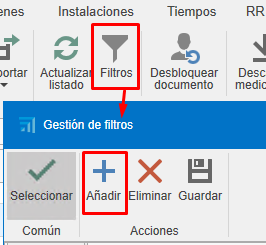
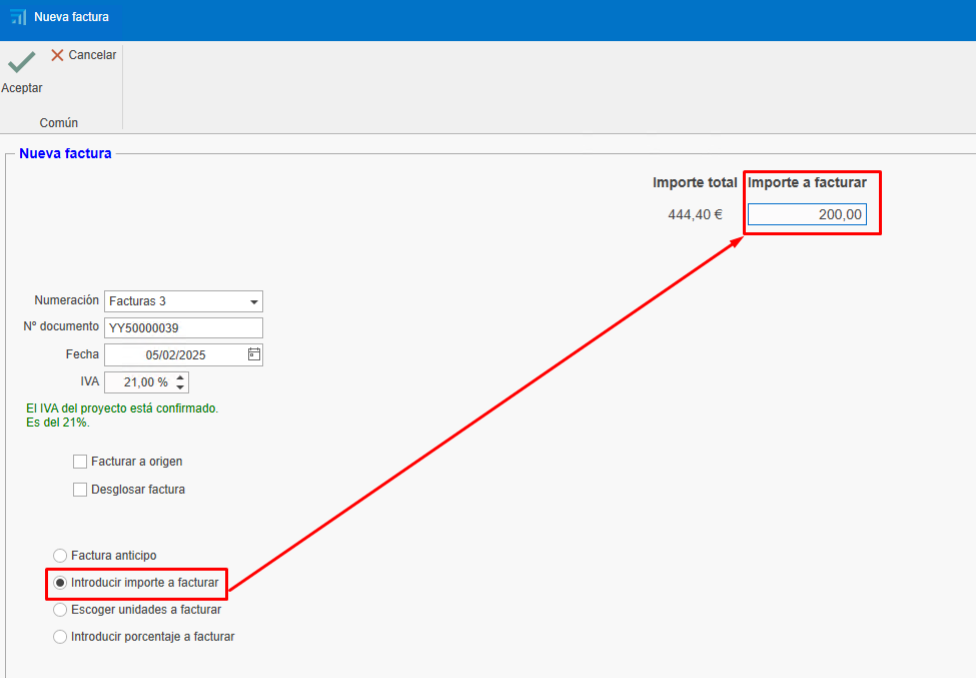
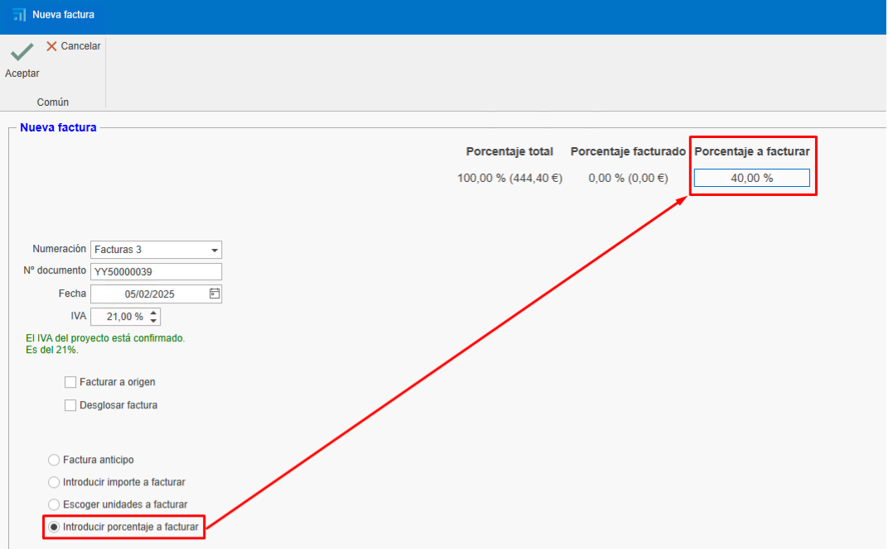
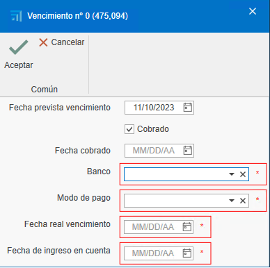
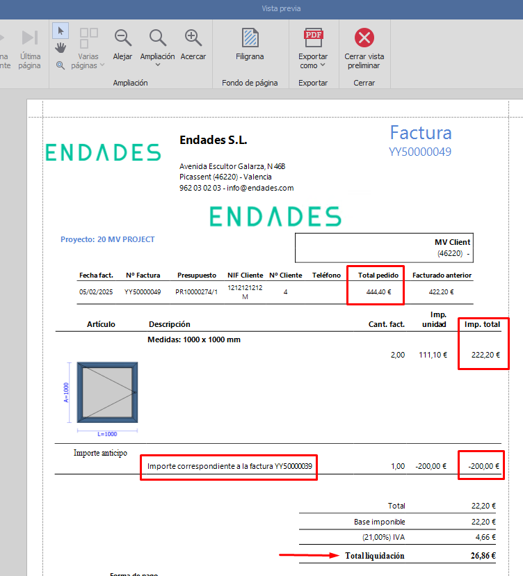

# Crear Facturas

1. [Introducción](#1-introducción)

## 1. Introducción
Este manual explica el proceso de creación, edición y gestión para factur. Aprenderás a utilizar filtros, crear facturas desde presupuestos, gestionar cobros y realizar ajustes necesarios.

---

## 2. Uso de Filtros en Listados
Los filtros permiten personalizar la visualización de los documentos en los listados. Sigue estos pasos:

## 2.1. Acceder a los filtros  
- En la cabecera de los listados, utiliza los filtros para definir qué columnas y datos deseas ver.

    

- Por ejemplo, puedes crear un filtro llamado "Facturas" que muestre solo las columnas necesarias (empresa, proyecto, fecha de factura, número, estado del documento, etc.).

    

## 2.2. Guardar filtros personalizados  

- Organiza las columnas según tus necesidades. Puedes eliminar, añadir y cambiar las columnas de posicion con el boton derecho sobre cualquier cabecera.

    

- Otra opcion para cambiar de posicion y elimimnar las columnas seria arrastar las columnas.

    
    
- Desde filtros acceda a Gestion de filtros añadir nuevo filtro.

    

- Guarda el filtro con un nombre específico (ej. "Facturas 2").

    

>**Nota:** Cada usuario puede tener sus propios filtros guardados.

---

## 3. Creación de Facturas desde Presupuestos
Para crear facturas a partir de presupuestos, sigue estos pasos:

### 3.1. Crear un presupuesto:

- Añade líneas con los productos o servicios (ej. ventanas, chapas).
- Define cantidades y precios.

    

### 3.2. Generar la factura:

- Accede al apartado de facturación.
- Selecciona "Crear factura" desde el presupuesto.

     

- Elige el tipo de factura:

    - **Factura de anticipo**: Permite cobrar un importe parcial y facturar el resto más adelante.

        

    - **Factura por unidades**: Factura solo las unidades indicadas que quieras facturar. Pero, luego obliga a continuar facturando en el mismo modo. (esta marcada por defecto)

        

    - **Introducir importe a facturar**: Permite cobrar un importe especifico del total de la factura. Pero, luego obliga a continuar facturando en el mismo modo.

        

    - **Introducir porcentage a facturar**: Permite cobrar un porcentage especifico del total de la factura. Pero,luego obliga a continuar facturando en el mismo modo.

    

### 3.3. Enviar la factura al cliente:

- Una vez creada, puedes ver la facutra en vista previa antes de enviarla o imprimirla.

    

    

     

- Envía la factura al cliente por correo electrónico o imprímela.

    

> **Nota:** La factura se puede generar desde el presupuesto, pedido o alabaran. Es recomendable generar las facturas siempre de un mismo documento, es decir, si haces desde el pedido (el pedido normalmente es el que se acuerda con el cliente) seguir generando las facturas siempre desde ahi para una mejor gestion y trazabilidad.

---

## 4. Gestión de Cobros

Para gestionar los cobros de las facturas:

### 4.1. Marcar facturas como cobradas:

- Desde el proprio documento de la factura se puede marcar que la factura esta cobrada.

    

- El otro modo seria acceder al listado de vencimientos desde documetnos de ventas.

    

- Filtra las facturas pendientes de cobro.

    

- Selecciona las facturas y marca como cobradas. Para selecionar mas de una factura usar la tecla **ctrl+click** o **ctrl+a** para selecionar todas las facturas.

    

- Indica el modo de pago (transferencia, pagaré, etc.), la fecha de cobro y la fecha de ingreso en cuenta. Los campos marcados en rojo es obligatorio rellenar. Estos campos se puede configurar previamente para que sea o no obligatorio en el apartado formas de pago.

    

    > **Nota:** En ese apartado como otros listados de documentos se puede utilizar los filtros como se ha explicado previamente segun sea necesario.

- En el listado de documentos de ventas aparecera en trazabilidad del presupuesto el estado de la factura como cobrado.

    

### 4.2. Informes de cobros:  

- Accepta el presupuesto para que genere un pedido en (el caso que hayas facturado desde el presupuesto).

    

- Utiliza el informe "Estado de facturación y cobros" para ver el estado de las facturas (cobradas, pendientes, porcentaje de facturación, etc.). Filtra por el presupuesto que quieras que se muestre.

    

    

- Utiliza el informe de listado de factura para ver la informacion de la factura (fecha, cliente, base imponible, IVA, total de la factura, etc.. ). A ese informe lo puedes listar desde desde un rango de fecha o marcando un check donde indicas que se aplique solo las facturas que este en el filtrado del listado.

    

    

    
---

## 5. Facturación desde Pedidos

Para facturar desde pedido, sigue estos pasos:

### 5.1. Facturacion desde pedido

- Se puede Facturar directamente desde "Pedido" seguindo los mismos pasos que en el presupuesto. 

- Otro manera de facturar seria crear una produccion desde un pedido y indicar la cantidad de ventana que quieres que este en esta fase de produccion. 

    

    

    

- Una vez confirmes que se ha fabricado las ventanas indicadas en la fase de "Produccion 1" por ejemplo, puedes ir a pedido y crear una factura indicando la cantidad a facturar.

    [Factura pedido](Imagenes/03_Facturas/fase_produccion.png)

> **Nota:** Se recomienda siempre facturar desde el pedido ya que lo que se acuerdo con el cliente para acceptar el presupuesto.

- En el caso de que descuente el total de la factura (unidad) y haya emitido y cobrado de una factura de anticipo al intentar confirmar la factura te aparecera un mensaje para confirmar o não que descuentes el anticipo.

    

- Al confirmar te descontara de restara el anticipo de la factura.

    

- Al sacar la factura para enviar al cliente veras en detalle lo que se ha cobrado y descontado.

    

## 6. Facturación desde Albaranes

Si trabajas con albaranes, sigue estos pasos:

### 6.1. Crear albaranes desde pedidos:

- Genera albaranes para las producciones realizadas.

    

>**Nota:** Asegúrate de que los precios y descripciones sean correctos.

### 6.2. Facturar desde albaranes:

- Accede al pedido correspondiente.
- Selecciona "Crear factura" desde el albarán. Y seguir los mismos pasos anteriores.

    

> **Nota:** Verifica que los precios y las unidades coincidan con lo acordado con el cliente, ya que puede variar dependiendo si hay alguna modificacion en produccion (ej. cambiar la medida de la ventana) y que puede afectar el precio y facturar con un precio distinto del pedido.

---

## 7. Formas y Modos de Pago

Configura las formas y modos de pago según tus necesidades:

### 7.1. Formas de pago:

- Define cómo se pagará (ej. 30 días, 60 días, 90 días). Se puede crear cuantas formas se necesites con diferentes configuraciones. 

    

-  Configura si es necesario exigir modo de pago, fecha real de vencimiento, fecha de ingreso y banco. Esa configuracion se reflejara en el apartado de listado de vencimentos cuando se marca la factura como cobrado y aparece los campos en rojo como obligatorio a rellenar. 

    

- Establece el número de vencimientos y los porcentajes de pago.

    

### 7.2. Modos de pago:

- Indica cómo se realizará el pago (transferencia, pagaré, contado).

    

- Configura si es necesario exigir la fecha de cobro, el banco o la fecha de ingreso en cuenta.

    

---

## 8. Rectificativas y Anulaciones

Si necesitas corregir o anular una factura:

### 8.1. Facturas recién creadas: 

- Si la factura no ha sido enviada, elimínala y vuelve a crearla con la misma numeración. Hay diferentes modos de eliminar la factrura:

    - Dede el listado de ventas, buscar la factura click boton derecho sobre la linea y eliminar.

         

    - Desde la factura, abrir la factura y eliminarla desde la pestaña factura click boton derecho y eliminar.

        

    - Desde la factura, arriba a la izquierda sobre clicar sobre el logo de ENBLAU y eliminar.

        

### 8.1. Facturas ya enviadas:

- En el caso de que la factura ya haya sido enviada emite una factura rectificativa.

    

- Asegúrate de que cumpla con los requisitos de Hacienda.

---

## 9. Consideraciones Finales
- **Mantén los pedidos actualizados**:  
  Todos los documentos deben estar vinculados a un pedido para facilitar el control de costes y facturación.

- **Exportación contable**:  
  Al finalizar el mes, exporta los datos para contabilidad desde el listado de ventas o compras.

- **Dudas y soporte**:  
  Si surge alguna duda, envía un correo al equipo de soporte para resolverla rápidamente.

---

Este manual te permitirá gestionar la facturación de manera eficiente y evitar errores comunes. ¡Buena suerte!