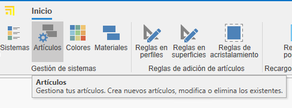
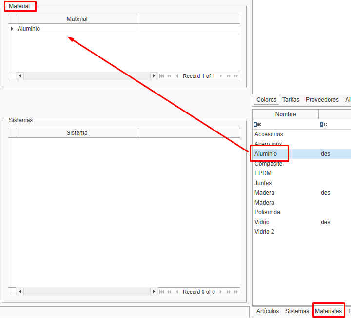
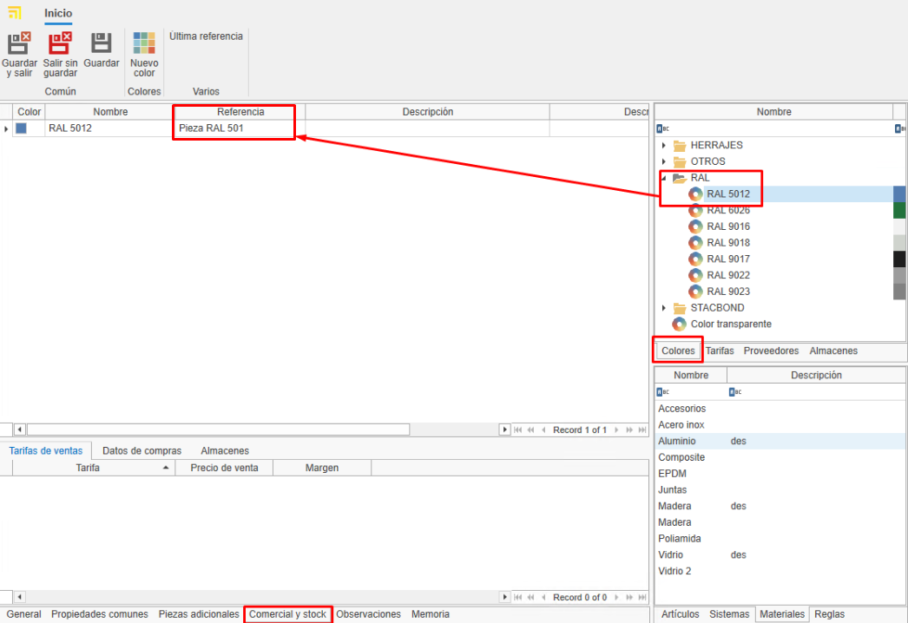

# Manual de Usuario

## Índice
1. [Introducción](#1-introducción)
2. [Definición de Materiales](#2-definición-de-materiales)
   - [2.1. Tipos de Materiales](#21-tipos-de-materiales)
   - [2.2. Artículos y Colores](#22-artículos-y-colores)
3. [Creación de Materiales](#3-creación-de-materiales)
   - [3.1. Definir un Material](#31-definir-un-material)
   - [3.2. Asignación de Colores](#32-asignación-de-colores)
4. [Gestión de Proveedores](#4-gestión-de-proveedores)
5. [Comercial y Stock](#5-comercial-y-stock)
   - [5.1. Datos de Compra y Proveedores](#51-datos-de-compra-y-proveedores)
   - [5.2 Asignación de Referencias](#52-asignación-de-referencias)
6. [Creación de un Nuevo Material](#6-creación-de-un-nuevo-material)
   - [6.1. Pasos para Crear un Material](#61-pasos-para-crear-un-material)
   - [6.2. Definición de Descripciones](#62-definición-de-descripciones)
7. [Estándares a Seguir](#7-estándares-a-seguir)
8. [Creación de Documentos de Compra](#8-creación-de-documentos-de-compra)
9. [Tipología de Materiales](#9-tipología-de-materiales)
   - [9.1. Piezas](#91-piezas)
   - [9.2. Chapas y Superficies](#92-chapas-y-superficies)
   - [9.3. Barras y Perfiles](#93-barras-y-perfiles)
10. [Conclusión](#10-conclusión)

---

## 1. Introducción
Este manual tiene como objetivo explicar el proceso de alta de materiales dentro del sistema, asegurando la correcta definición y gestión de los mismos.

---

## 2. Definición de Materiales
Los materiales pueden ser de diferentes tipos: pieza, barra, junta o superficie. Dependiendo del tipo, tendrán distintas propiedades.

### 2.1 Tipos de Materiales
- **Piezas**: Son los materiales más comunes y sencillos de definir.
- **Barras**: Requieren información adicional como longitud y medidas de seguridad.
- **Superficies**: Se valoran por metro cuadrado y pueden incluir características adicionales.
- **Juntas**: Tienen especificaciones especiales para su aplicación.

### 2.2 Artículos y Colores
Los materiales se definen dentro de "Artículos", mientras que los acabados se manejan en la sección de "Colores" y la materia prima en "Materiales".

---

## 3. Creación de Materiales
Para dar de alta un material, se deben seguir estos pasos:

### 3.1 Definir un Articulo

1. Acceder a la sección de "Artículos".

2. Para crear un nuevo artículo es necesario que se asigne una referencia, un tipo de calculo y un material.
 
 

3. Para asignar material a un artculo solo hay que arrastrar un material del arbol de materiales en la cinta derecha. 
 
 

 4. Para asignar un color (o un grupo de colores) se hace desde la pestaña **Comercial y stock**. Para eso hay que arrastrar uno o mas colores desde la pestaña de colores que se encuentra a la derecha de la ventana (para elegir mas de un color usar o ctrl+click derecho, tambien se puede asignar toda una familia/carta de color arrastrando la carpeta.)

  

### 3.2 Creacion y Asignación de colores

1. Acceder a la sección de "Colores".

2. Para crear un color nuevo desde "General" es necesario que se asigne una referencia, nombre y un color o textura.

   Tambien se puede asignar un proveedor a los colores. Desde la pestaña "Proveedor" arrastrar el proveedor que se encuentra en la ventana a la derecha.

   

> Por defecto la base de datos tendra la carta ral dada de alta.

2. Asignar un nombre y referencia al color.
3. Vincular el color al artículo correspondiente.

---

## 4. Gestión de Proveedores
Antes de dar de alta un material, se debe verificar si el proveedor ya está registrado. En caso contrario, se debe crear siguiendo los estándares definidos.

---

## 5. Comercial y Stock
Una vez definido el material, se debe proceder a completar su información en las secciones de comercial y stock.

### 5.1 Datos de Compra y Proveedores
Se asignan proveedores y precios de compra según cada color del material.

### 5.2 Asignación de Referencias
Cada color y material tendrá una referencia única que lo identificará en el sistema.

---

## 6. Creación de un Nuevo Material
### 6.1 Pasos para Crear un Material
1. Ingresar una nueva referencia.
2. Seleccionar un proveedor habitual.
3. Definir descripciones de compra y venta.
4. Asignar un material base.

### 6.2 Definición de Descripciones
Se debe completar la descripción de compra (para proveedores) y la de venta (para clientes).

---

## 7. Estándares a Seguir
Para asegurar una correcta gestión, se deben seguir estos estándares:
- Uso de mayúsculas en nombres y referencias.
- Verificación previa antes de dar de alta un proveedor o material.
- Formato uniforme en referencias de materiales y colores.

---

## 8. Creación de Documentos de Compra
1. Seleccionar el proveedor.
2. Buscar y agregar el material.
3. Validar el precio asignado al proveedor.

---

## 9. Tipología de Materiales
### 9.1 Piezas
Materiales individuales que se gestionan por unidad.

### 9.2 Chapas y Superficies
- Se valoran por metro cuadrado.
- Incluyen dimensiones de ancho y alto por defecto.

### 9.3 Barras y Perfiles
- Se definen por longitud y otros atributos técnicos.
- En algunos casos, incluyen descuentos y normativas especiales.

---

## 10. Conclusión
Siguiendo este manual, el usuario podrá dar de alta y gestionar materiales correctamente dentro del sistema, asegurando su correcta organización y compra-venta.