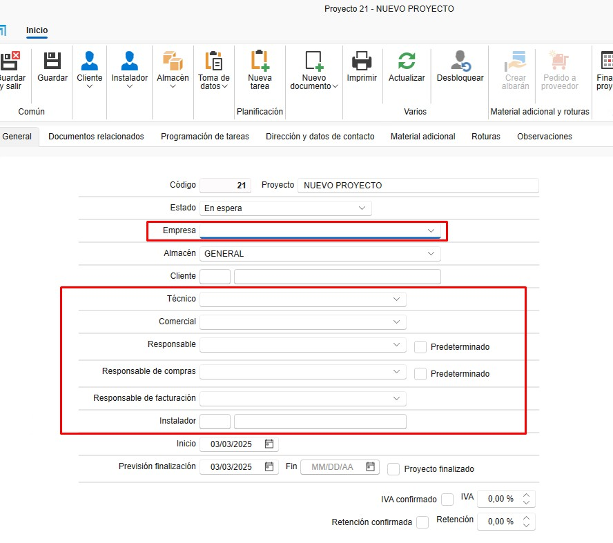

## 2. Proyectos
   - El proyecto seria como la "obra". Se asocia al proyecto cuantos documentos de ventas y compras sea necesario.

       

### 2.1. Creación de Proyectos

   1. **Nuevo Proyecto**:
      - Crea un proyecto desde el botón "Nuevo Proyecto".

               

      - Asigna un nombre y selecciona el cliente.

         

   2. **Detalles del Proyecto**:

      - Desde la pestaña **General**:
         - Empresa
         - Técnico de obra.
         - Comercial.
         - Responsable de compras.
         - Responsable de facturación.
         - Etc..

               

   3. **IVA/Retencion**:

      - Puedes confirmar el IVA y la retencion con el cliente para el proyecto y eso podria evitar errores en facturas.

         [IVA](Imagenes/PR_Ventas_Compras/iva.jpg)  

### 2.2. Documentos Relacionados

   1. **Documentos de ventas y compras**: 

      - Todos los documentos relacionados con el proyecto se agrupan aquí.

         [Documentos relacionados](Imagenes/PR_Ventas_Compras/documentos_relacionados.jpg)  

   2. **Programación de Tareas**: 
   
      - Gestiona las tareas asociadas al proyecto. Las tareas se puede asignar por documento.

         [Tarea](Imagenes/PR_Ventas_Compras/tarea.jpg)

         [Tarea](Imagenes/PR_Ventas_Compras/tarea2.jpg)

         [Tarea](Imagenes/PR_Ventas_Compras/tarea3.jpg)

---