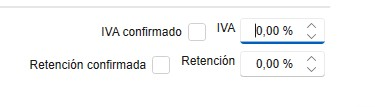
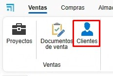

# Proyectos, clientes y Proveedores - ENBLAU

---

## Índice

---

## 1. Introducción
Este manual está diseñado para guiar a los usuarios de como crear Proyectos, Clientes y Proveedores en ENBLAU. Para que de esta manera se pueda asignar a los documentos de venta y compra.

## 2. Proyectos
   El proyecto seria como la "obra". Se asocia a un proyecto cuantos documentos de ventas y compras sea necesario.

### 2.1. Creación de Proyectos
   - Desde el apartado de Ventas puedes acceder al Proyecto.

       

   1. **Nuevo Proyecto**:
      - Crea un proyecto desde el botón "Nuevo".

               

      - Asigna un nombre y selecciona el cliente.

         

   2. **Detalles del Proyecto**:

      - Desde la pestaña **General**:
         - Empresa
         - Técnico de obra.
         - Comercial.
         - Responsable de compras.
         - Responsable de facturación.
         - Etc..

               

   3. **IVA/Retencion**:

      - Puedes confirmar el IVA y la retencion con el cliente para el proyecto y eso podria evitar errores en facturas.

           

### 2.2. Documentos Relacionados

   1. **Documentos de ventas y compras**: 

      - Todos los documentos relacionados con el proyecto se agrupan aquí.

           

   2. **Programación de Tareas**: 
   
      - Gestiona las tareas asociadas al proyecto. Las tareas se puede asignar por documento.

         

         

         

---

## 3. Clientes
   El cliente se asocia a uno o mas proyecto.

### 3.1. Creacion de Cliente
   - Desde el apartado de Ventas puedes acceder a Clientes.

      

   1. **Nuevo Cliente**:
      - Crea un cliente desde el botón "Nuevo".

               

   2. **Detalle Cliente** 
      - Asigna un nombre y rellena los campos necesarios del cliente.
         - Nombre.
         - Nombre Comercial.
         - Direccion.
         - NIF/CIF.
         - Etc..

         

   3. **Otros Datos**
      - Se puede rellenar otros datos del cliente accediendo a otras pestañas.
         - Datos de contacto.
         - Otros contactos.
         - Datos bancarios.
         - Informacion comercial.
         - Etc..

         

   

---