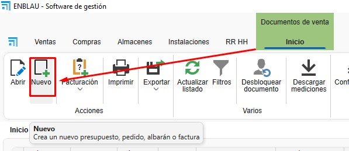
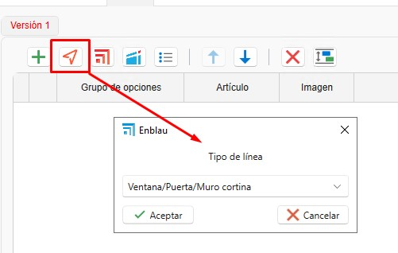
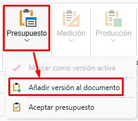
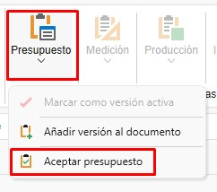
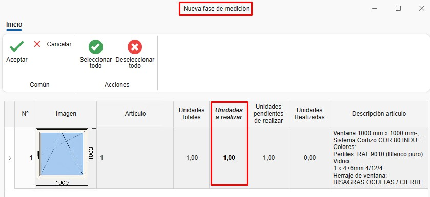
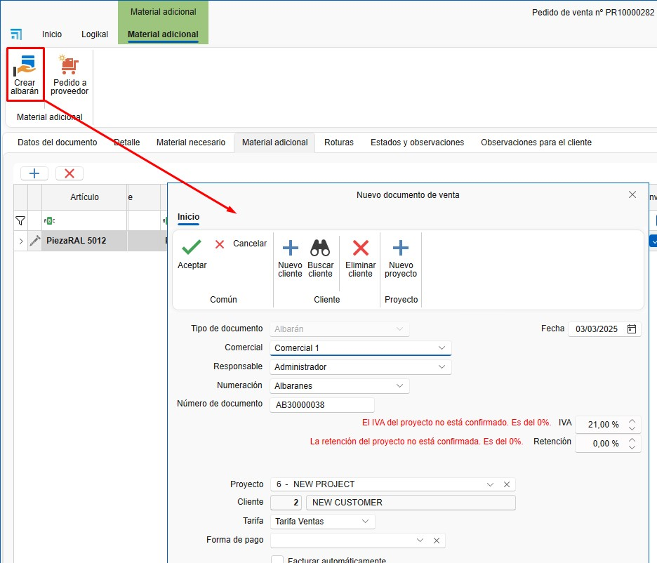

# Manual de Usuario: Formación en Ventas y Compras - ENBLAU

---

## Índice
1. [Acceso al Sistema](#acceso-al-sistema)
2. [Ventas](#ventas)
   - [Documentos de Venta](#documentos-de-venta)
   - [Trazabilidad](#trazabilidad)
   - [Configuración de Listados](#configuración-de-listados)
3. [Compras](#compras)
   - [Pedidos de Compra](#pedidos-de-compra)
   - [Recepción de Material](#recepción-de-material)
4. [Proyectos](#proyectos)
   - [Creación de Proyectos](#creación-de-proyectos)
   - [Documentos Relacionados](#documentos-relacionados)
5. [Material Adicional y Roturas](#material-adicional-y-roturas)
6. [Preguntas Frecuentes](#preguntas-frecuentes)
7. [Contacto](#contacto)

---

## 1. Introducción
Este manual está diseñado para guiar a los usuarios en el uso del sistema de ventas y compras de ENBLAU. Basado en la formación proporcionada, cubre los procesos clave, desde la creación de proyectos hasta la gestión de pedidos, compras y producción.

## 2. Processo
Una vez dentro, verás dos secciones principales:

   1. **Ventas**: Documentos de venta - Gestión y listado de presupuestos, pedidos, albaranes y facturas. Creacion de Proyectos y Clientes.

     

   2. **Compras**: Documentos de compra - Gestión y listado de pedidos de compra y recepción de materiales. Creacion de Proveedores.

      

 > **Nota:** Para crear documentos de venta y de compra es importante tener creados **proyectos, clientes y proveedores**. Para mas informacion seguir ese enlace [4. Proyecto, cliente y proveedores **(EN PROCESO)**](EN_PROCESO.md).

---

## 3. Ventas
   - En el apartado de Ventas tendras Proyectos, Documentos de venta y clientes.

   

### 3.1. Documentos de Venta
   - Una vez entres en **Documentos de venta** abrira un listado de todos los documentos relacionado a ventas.

  

   1. **Tipos de Documentos**
   - Para crear un documento nuevo en el apartado Documentos de venta desde la cinta de arriba clic sobre **Nuevo**:

     

   - Abrira una ventana **Nuevo documetno de venta**:

     

   - Desde ahi podras crear diferente **Tipo de documento** de venta como Presupuesto, Pedido, Albaran o Factura:

     

   - Una vez haya seleccionado el tipo de documento veras que algunos campos se rellenara por defecto como Comercial, Responsable, Numeracion, Nuemero de documento, etc... Algunos de estos campos se configurado previamente en configuraciones, pero, que son editables: 

        

   - Hay otros campos como Proyecto, cliente, etc.. Que dependiendo del proyecto se puede configurar previamente que se rellene por defecto algunos campos:

        
   
   - En la cinta de la parte superior de la ventana podras cambiar el cliente que tengas por defecto o añadir un nuevo cliente o proyecto:

        

### 3.2. Presupuesto
   - Al crear un nuevo presupuesto abrira una ventana con el numero del presupuesto de venta.

         

   1. **Datos del documentos**
      - En ese apartado se puede ver y cambiar algunos campos del presupuesto segun sea necesario.

         

   2. **Detalle** 
      - En ese apartado se añade posiciones para la Version del presupuesto.

         

         Desde de Detalle es donde añades la posicion del presupuesto. Hay diferentes maneras de añadir una posicion en el documento.

      - Añadir una nueva posicion vacia, donde puede añadir lineas de descripcion. 

         

      - Añadir una nueva posicion desde Logikal (asegurar que estas conectado a fabrica) te abrira la ventana de configuracion de Logikal **Tipo de linea**. Si el documento no esta asociado a ningun proyecto de Logikal te creara un proyecto nuevo (Aparecera algunas ventanas de preguntas para que confirmes).  

         

         - Una vez configurado la ventana en Logikal se añadira la posicion en ENBLAU.

            

   3. **Logikal** 
      - Desde el apartado de Logikal puedes crear un proyecto o vincular un proyecto ya creado en Logikal:

         

         Al vincular el proyecto te abrira una ventana con los proyectos desde Logikal:

         

      - Se puede crear diferentes versiones del presupuesto. Con el boton derecho sobre la pestaña de *Version 1* o desde la cinta superior en el desplegado de *Presupuesto*:

         
         

      - Abrira una ventana de Nueva version de presupuesto donde puedes indicar si quieres las lineas de la version activa (la version activa esta en ROJO) o crear una version en blanco:

         

      - Para editar una posicion en Logikal pulse **ctrl + doble clic** sobre la posicion que quieras editar.

      >**Nota:** En las pestañas de Versiones el nombre es editable. Para editarlo clic con boton derecho sobre la pestaña de version y *Cambiar el nombre de la version*

### 3.3. Pedido

   1. **Crear pedido**
   - Una ves creado la version del presupuesto el seguinte paso es acceptarlo y crear el pedido de cliente.

      

        

   2. **Editar posicion**
   - Desde el pedido se puede editar o añadir posiciones, listar materiales, crear mediciones, crear producciones, etc..

      

   3. **Albaran**

      - Desde la fase de Pedido se puede crear alabaran y indicar las unidades a albaranar.

         

>**Notas:** Los datos del documento de pedido tambien se pueden modificar asi como en los otros documentos de venta.

### 3.4. Medicion
   
   1. **Crear medicion** 
      - Desde el pedido se puede crear una medicion.

         

   2. **Seleccionar posiciones**
      - Al crear una medicion abre una ventana *Nueva fase de medicion* donde puedes seleccionar las posiciones para la fase de medicion.

         

   3. **Fase medicion**
      - Se crea una fase creacion donde puedes editar las mediciones sin afectar el pedido.

         

   3. **Albaran**

      - Desde la fase de Medicion se puede crear alabaran y indicar las unidades a albaranar de la misma forma que en pedido.

   >**Notas:** Los datos del documento de medicion tambien se pueden modificar asi como en los otros documentos de venta.

### 3.4. Produccion

   1. **Crear produccion**
      - La fase de produccion se puede crear desde el pedido o medicion.

             

   2. **Seleccionar posiciones**
      - Al crear una produccion abre una ventana *Nueva fase de preduccion* donde puedes seleccionar las posiciones para la fase de produccion.

         

      - Al acceptar aparecera una ventana preguntando si quieres enviar a produccion.

          

   3. **Fase produccion**
      - Se crea una fase creacion donde puedes editar las mediciones sin afectar el pedido.

         

   3. **Albaran**

      - Desde la fase de Produccion se puede crear alabaran y indicar las unidades a albaranar de la misma forma que en pedido.     

   >**Notas:** Los datos del documento de produccion tambien se pueden modificar asi como en los otros documentos de venta.

## 4. Compras

### 4.1. Pedidos de Compra

   1. **Desde un Presupuesto**:
      - Acepta un presupuesto para generar un pedido de cliente.

   2. **Material Necesario**:
      - Accede a la pestaña "Material Necesario" para listar los materiales requeridos.

         

      - Al listar materiales veras en las columnas de Articulos y Unidades a comprar en color verde y rojo. Verde indica que tiene ese material en stock para ese proyecto (obra) y Rojo que no hay suficiente materiales para ese proyecto.

         

      - Puedes elegir si quieres o no comprar los materiales, marcando o desmarcado la casilla de la columna *Comprar*:

         

   3. **Generar Pedido de Compra**:
      - Selecciona los materiales y genera el pedido de compra en **Pedir material** abrira una ventana **Nuevo documento de compra**, donde puedes cambiar algunos campos por defecto y elegir el proveedor.

         

      - Asigna un proveedor y envía el pedido.

         

   4. **Pedido de Compra**:
      Una vez creado el pedido de compra se puede revizar y modificar segun sea necesario (proveedor, proyecto, cantidad de los materiales, etc.. )

         

   5. **Documentos de compra**
      - Desde el apartado de compras puedes acceder al listado de comprar y a Proveedores.

          

         

### 4.2 Recepción de Material

   1. **Albarán de Recibido**:
      - Genera un albarán al recibir el material.

         

   2. **Unidades Recibidas**:
      - Indica las unidades recibidas en la columna Unidades a albaranar.

         

---
>**Nota General:** En todos los procesos se puede sacar y enviar por email documentaciones y informes. Para mas informacion seguir ese enlace [4. Imprimir informes **(EN PROCESO)**](EN_PROCESO.md)
---

## 5. Material Adicional y Roturas

### 5.1 Material Adicional
   - Los materiales adicionales se puede añadir al pedido, medicion o produccion. Son materiales proprios que se ha creado desde enMATERIAL. Para mas informacion de como crear materiales proprios seguir ese [2. Creación de materiales proprios en enMATERIALES](UT_Crear_Materiales_enMATERIAL.md).

      

   1. **Añadir Material**:
      - Arrastra material adicional desde el árbol Articulos.

         

      - Añadir lineas de textos.

         

      - Se puede generar un albarán de envío para material adicional.

         

   2. **Costes**:
      - El material adicional se contabiliza como coste del proyecto, pero no está presupuestado al cliente.

### 5.2 Roturas

   1. **Añadir a Roturas**:

   - Desde la sección "Material Necesario", boton derecho sobre el material seleccionar **Añadir a roturas**. 

      

   - El material se añade en el apartado de **Roturas**. En la columna Concepto puedes indicar motivo de la rotura, se desplegara una lista previamente definida en configuracion Conceptos de rotura ([1. Configuración Inicial de ENBLAU](CO_Configuracion_Inicial_ENBLAU.md)).

            

  - Gestiona la reposición de materiales.

---

## 6. Trazabilidad

   1. **Árbol de Trazabilidad**: 

      - Muestra la trazabilidad completa de un documento, desde el presupuesto hasta la producción. Ejemplo: Desde un presupuesto (ej. 483) hasta su envío a producción.

          

   2. **Visualización**: 
      
      - Haz clic en cualquier documento para ver su trazabilidad en el panel derecho.

         

## 7. Gestion Filtros en Listados
Los filtros permiten personalizar la visualización de los documentos en los listados. Sigue estos pasos:

### 7.1. Acceder a los filtros  
   - En la cabecera de los listados, utiliza los filtros para definir qué columnas y datos deseas ver.

      

   - Por ejemplo, puedes crear un filtro llamado "Presupuestos" que muestre solo las columnas necesarias (empresa, proyecto, fecha de solicitud, estado del documento, técnico del proyecto, tipo de documento etc..).

      

      

   - Usa `Ctrl + F` para buscar en el listado.

      

### 7.2. Guardar filtros personalizados  
   - Organiza las columnas según tus necesidades. Puedes eliminar, añadir y cambiar las columnas de posición con el botón derecho sobre cualquier cabecera.

    

   - Otra opción para cambiar de posición y eliminar las columnas es arrastrarlas.

      
      
   - Desde "Filtros", accede a "Gestión de filtros" y añade un nuevo filtro.

      

   - Guarda el filtro con un nombre específico (ej. "Facturas 2").

      

>**Nota:** Cada usuario puede tener sus propios filtros guardados.

**Listado de Documentos**: Todos los documentos se muestran en un listado configurable donde se puede usar filtros personalizados.

---

## 8. Preguntas Frecuentes

### 8.1. ¿Cómo gestionar incidencias postventa?
- **Opción 1**: Crea un nuevo presupuesto.
- **Opción 2**: Genera un pedido de cliente a importe cero y envíalo a producción.

### 8.2. ¿Cómo añadir material adicional?
- Arrastra el material adicional desde el árbol y genera un albarán de envío.

### 8.3. ¿Cómo recibir material parcialmente?
- Al generar un albarán, indica las unidades recibidas. Puedes crear múltiples albaranes para un mismo pedido.

---

Este manual está diseñado para ayudarte a navegar y utilizar el sistema de ventas y compras de ENBLAU de manera eficiente. Para más detalles, consulta el video de formación o contacta con el soporte técnico.