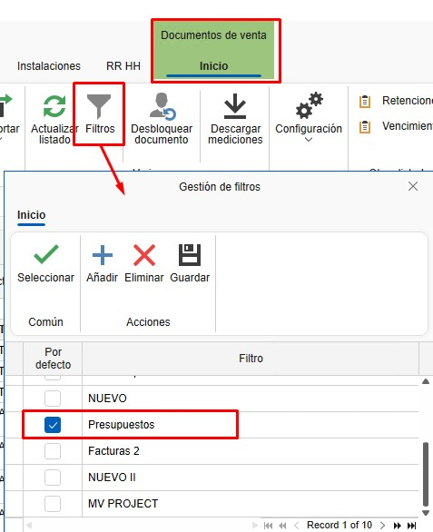
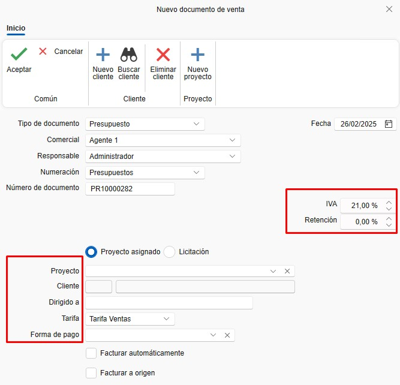

# Manual de Usuario: Formación en Ventas y Compras - ENBLAU

---

## Índice
1. [Acceso al Sistema](#acceso-al-sistema)
2. [Ventas](#ventas)
   - [Documentos de Venta](#documentos-de-venta)
   - [Trazabilidad](#trazabilidad)
   - [Configuración de Listados](#configuración-de-listados)
3. [Compras](#compras)
   - [Pedidos de Compra](#pedidos-de-compra)
   - [Recepción de Material](#recepción-de-material)
4. [Proyectos](#proyectos)
   - [Creación de Proyectos](#creación-de-proyectos)
   - [Documentos Relacionados](#documentos-relacionados)
5. [Material Adicional y Roturas](#material-adicional-y-roturas)
6. [Preguntas Frecuentes](#preguntas-frecuentes)
7. [Contacto](#contacto)

---

## 1. Introducción
Este manual está diseñado para guiar a los usuarios en el uso del sistema de ventas y compras de ENBLAU. Basado en la formación proporcionada, cubre los procesos clave, desde la creación de proyectos hasta la gestión de pedidos, compras y producción.

## 2. Processo
Una vez dentro, verás dos secciones principales:
   - **Ventas**: Documentos de venta - Gestión y listado de presupuestos, pedidos, albaranes y facturas. Creacion de Proyectos y Clientes.

     

   - **Compras**: Documentos de compra - Gestión y listado de pedidos de compra y recepción de materiales. Creacion de Proveedores.

      

---

## 3. Uso de Filtros en Listados
Los filtros permiten personalizar la visualización de los documentos en los listados. Sigue estos pasos:

### 3.1. Acceder a los filtros  
- En la cabecera de los listados, utiliza los filtros para definir qué columnas y datos deseas ver.

    

- Por ejemplo, puedes crear un filtro llamado "Presupuestos" que muestre solo las columnas necesarias (empresa, proyecto, fecha de solicitud, estado del documento, técnico del proyecto, tipo de documento etc..).

    

    

### 3.2. Guardar filtros personalizados  

- Organiza las columnas según tus necesidades. Puedes eliminar, añadir y cambiar las columnas de posición con el botón derecho sobre cualquier cabecera.

    

- Otra opción para cambiar de posición y eliminar las columnas es arrastrarlas.

    
    
- Desde "Filtros", accede a "Gestión de filtros" y añade un nuevo filtro.

    

- Guarda el filtro con un nombre específico (ej. "Facturas 2").

    

> **Nota:** Cada usuario puede tener sus propios filtros guardados.

## 3. Ventas

En el apartado de Ventas tendras Proyectos, Documentos de venta y clientes.

  

### 3.1. Documentos de Venta
Una vez entres en **Documentos de venta** abrira un listado de todos los documentos relacionado a ventas.

  

- **Tipos de Documentos**
   Para crear un documento nuevo en el apartado Documentos de venta desde la cinta de arriba clic sobre **Nuevo**:

     

   - Abrira una ventana **Nuevo documetno de venta**:

     

   - Desde ahi podras crear diferente **Tipo de documento** de venta como Presupuesto, Pedido, Albaran o Factura:

     

   - Una vez haya seleccionado el tipo de documento veras que algunos campos se rellenara por defecto como Comercial, Responsable, Numeracion, Nuemero de documento, etc... Algunos de estos campos se configurado previamente en configuraciones, pero, que son editables: 

        

   - Hay otros campos como Proyecto, cliente, etc.. Que dependiendo del proyecto se puede configurar previamente que se rellene por defecto algunos campos:

        
   
   - En la cinta de la parte superior de la ventana podras cambiar el cliente que tengas por defecto o añadir un nuevo cliente o proyecto:

        

### 3.2. Presupuesto
   Al crear un nuevo presupuesto abrira una ventana con el numero del presupuesto de venta.

      

   - **Datos del documentos**: en ese apartado se puede ver y cambiar algunos campos del presupuesto segun sea necesario.

      

   - **Detalle**: en ese apartado se añade posiciones para la Version del presupuesto.

      

      Desde de Detalle es donde añades la posicion del presupuesto. Hay diferentes maneras de añadir una posicion en el documento.

      - Añadir una nueva posicion vacia, donde puede añadir lineas de descripcion. 

         

      - Añadir una nueva posicion desde Logikal (asegurar que estas conectado a fabrica) te abrira la ventana de configuracion de Logikal **Tipo de linea**. Si el documento no esta asociado a ningun proyecto de Logikal te creara un proyecto nuevo (Aparecera algunas ventanas de preguntas para que confirmes).  

         

         Una vez configurado la ventana en Logikal se añadira la posicion en ENBLAU.

         

      - **Vincular proyecto**: Desde el apartado de Logikal puedes crear un proyecto o vincular un proyecto ya creado en Logikal:

         

         Al vincular el proyecto te abrira una ventana con los proyectos desde Logikal:

         

      - **Versiones**: Se puede crear diferentes versiones del presupuesto. Con el boton derecho sobre la pestaña de *Version 1* o desde la cinta superior en el desplegado de *Presupuesto*:

         
         

         Abrira una ventana de Nueva version de presupuesto donde puedes indicar si quieres las lineas de la version activa (la version activa esta en ROJO) o crear una version en blanco:

         

>**Nota:** En las pestañas de Versiones el nombre es editable.

### 3.3. Pedido
   Una ves creado la Version del presupuesto el seguinte paso es acceptarlo y crear el pedido.

   

     

>**Notas:** Los datos del documento tambien se puede hacer los cambios asi como en el documento del presupuesto.

   - 

**Listado de Documentos**: Todos los documentos se muestran en un listado configurable donde se puede usar filtros personalizados.

### Trazabilidad
- **Árbol de Trazabilidad**: Muestra la trazabilidad completa de un documento, desde el presupuesto hasta la producción.
  - Ejemplo: Desde un presupuesto (ej. 483) hasta su envío a producción.
- **Visualización**: Haz clic en cualquier documento para ver su trazabilidad en el panel derecho.

### Configuración de Listados
- **Personalización**:
  - Arrastra columnas para reorganizar el listado.
  - Elimina columnas no necesarias (los cambios no se guardan automáticamente).
- **Búsquedas**:
  - Usa `Ctrl + F` para buscar en el listado.
  - Filtra por campos específicos (ej. proyecto, cliente, etc.).
- **Guardar Filtros**:
  - Crea y guarda filtros personalizados para recuperarlos fácilmente.

---

## Compras

### Pedidos de Compra
1. **Desde un Presupuesto**:
   - Acepta un presupuesto para generar un pedido de cliente.
2. **Material Necesario**:
   - Accede a la pestaña "Material Necesario" para listar los materiales requeridos.
   - Marca los materiales a comprar.
3. **Generar Pedido de Compra**:
   - Selecciona los materiales y genera el pedido de compra.
   - Asigna un proveedor y envía el pedido.

### Recepción de Material
1. **Albarán de Recibido**:
   - Genera un albarán al recibir el material.
2. **Unidades Recibidas**:
   - Indica las unidades recibidas.
   - Gestiona las unidades pendientes.
3. **Escaneo de Documentos**:
   - Escanea y adjunta el albarán del proveedor en la sección de documentación.

---

## Proyectos

### Creación de Proyectos
1. **Nuevo Proyecto**:
   - Crea un proyecto desde el botón "Nuevo Proyecto".
   - Asigna un nombre y selecciona el cliente.
2. **Detalles del Proyecto**:
   - Técnico de obra.
   - Comercial.
   - Responsable de compras.
   - Responsable de facturación.
3. **IVA**:
   - Confirma el IVA con el cliente para evitar errores en facturas.

### Documentos Relacionados
- **Presupuestos y Facturas**: Todos los documentos relacionados con el proyecto se agrupan aquí.
- **Programación de Tareas**: Gestiona las tareas asociadas al proyecto.

---

## Material Adicional y Roturas

### Material Adicional
- **Añadir Material**:
  - Arrastra material adicional desde el árbol.
  - Genera un albarán de envío.
- **Costes**:
  - El material adicional se contabiliza como coste del proyecto, pero no está presupuestado al cliente.

### Roturas
- **Añadir a Roturas**:
  - Desde la sección "Material Necesario", añade materiales rotos.
  - Gestiona la reposición de materiales.

---

## Preguntas Frecuentes

### ¿Cómo gestionar incidencias postventa?
- **Opción 1**: Crea un nuevo presupuesto.
- **Opción 2**: Genera un pedido de cliente a importe cero y envíalo a producción.

### ¿Cómo añadir material adicional?
- Arrastra el material adicional desde el árbol y genera un albarán de envío.

### ¿Cómo recibir material parcialmente?
- Al generar un albarán, indica las unidades recibidas. Puedes crear múltiples albaranes para un mismo pedido.

---

## Contacto
- **Email**: Para consultas no urgentes.
- **Teléfono**: Para urgencias.
- **Soporte Técnico**: Consulta la firma del correo electrónico para obtener los datos de contacto.

---

Este manual está diseñado para ayudarte a navegar y utilizar el sistema de ventas y compras de ENBLAU de manera eficiente. Para más detalles, consulta el video de formación o contacta con el soporte técnico.