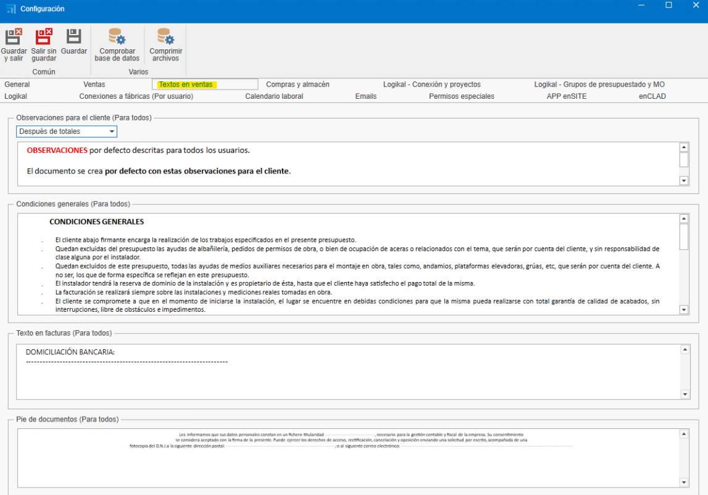
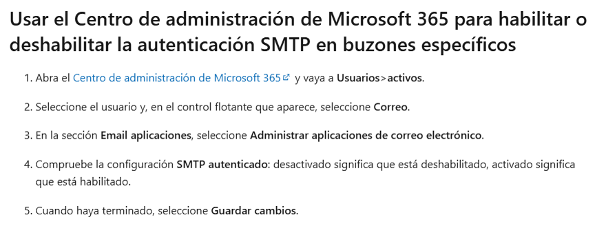
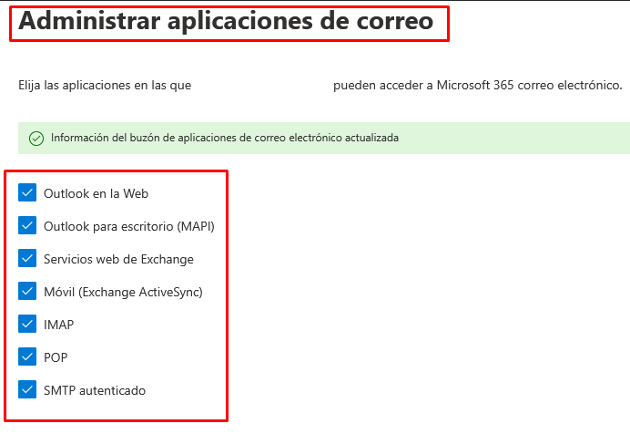
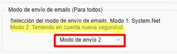

# 1. Configuración inicial de ENBLAU

---

## 1. Propósito

El presente manual está diseñado para guiar a los nuevos usuarios en la configuración inicial de ENBLAU. Esta configuración incluye todo lo necesario para que el cliente pueda realizar ventas, compras y la emisión de facturas.

---

## 2. Configuración general

  

### 2.1. Configuración de conexión con Logikal

- Para conectar con la fábrica y los proyectos de Logikal, es necesario indicar la ruta de instalación y la DLL de Logikal (unidad de red donde apunta Logikal).

- Desde **General**, ir a **Logikal - Conexión y Proyectos**.

  

- Para conectarse a la fábrica en Logikal, dirígete a la parte inferior de la ventana principal de **ENBLAU**, haz clic con el botón derecho sobre **Conexión fábrica** y selecciona **Conectar**.

  

---

### 2.2. General

- **Ruta de almacenamiento**: Indicar la ruta donde se guardarán los documentos de ENBLAU y Logikal (unidad de red). Ejemplo:

  

  > **Nota:** Es recomendable utilizar una unidad de red. Si no existe, créala.

- **Información de la empresa**: Rellenar los campos necesarios con la información de la empresa, como nombre, CIF, dirección, logos, etc.

  

---

### 2.3. Textos en ventas

- Añadir textos para documentos de ventas, como observaciones, condiciones, etc.

  

  Ejemplo informe pedido:

    

---

## 3. Gestión de usuarios

- Para dar de alta a nuevos usuarios, accede a **Usuarios**.

  

- En **Nuevo**, puedes crear nuevos usuarios.

  

- Se abrirá una ventana para configurar la información del usuario (nombre, dirección, email, teléfono, etc.), el tipo de usuario (Técnico, Comercial, Taller, etc. Se puede asignar más de un tipo) y los permisos. Los permisos solo pueden ser asignados por usuarios de tipo administrador.

  

- Una vez dado de alta, el usuario podrá ser editado en cualquier momento.

---

## 4. Configuración de cuentas de email

- Para configurar la cuenta de correo del usuario, accede a **Email usuario:** 

  

  

- Para configurar las cuentas de correos de cada usuario, accede a **Cuentas de email:** 

  

  

- Desde de cada apartado puedes configurar el correo, nombre de usuario, firma y Servidor de entrada y salida de IMAP y SMTP. La configuración del servidor de entrada/salida y los puertos tienen que estar bien definida según el proveedor que usáis. De esa manera se podrá mandar y recibir correos desde informes o desde notificación según como tengas configurado.

### 4.1. Configuración general de emails

- Desde el apartado de **General** - **Emails** tienes la opción de definir por defecto copias, asunto y modo de envío de emails.

  

    

### 4.2. Posibles errores de autenticación Microsoft

- Al intentar enviar un correo, podemos encontrarnos con este tipo de error.

  

  **LOG**
    Error: 535: 5.7.139 Authentication unsuccessful, SmtpClientAuthentication is disabled for the Tenant. Visit [Envío SMTP autenticado en Exchange Online](https://learn.microsoft.com/es-es/exchange/clients-and-mobile-in-exchange-online/authenticated-client-smtp-submission) for more information.

  El error es de autenticación con la cuenta de email. Eso puede pasar por un cambio de protocolo de seguridad de Microsoft 365.

  - **Solución:** Contactar con la persona encargada y que tenga permisos desde el centro de administración de Microsoft 365, hay que revisar siguiendo los pasos del enlace que aparece arriba de Microsoft Exchange Online para configurar la cuenta de Outlook para que puedas sincronizar los correos desde otra app.

    

    Asegurar que todas las casillas estén marcadas desde el apartado de usuarios Administrar aplicaciones del correo en Microsoft 365.

    

> **Nota:** Para correos de Microsoft Exchange se recomiendan que en **Modo de envío de emails** en el apartado de General que esté la opción **Modo de envío 2** seleccionada.

  

---

## 5. Gestión de empresas

- En caso de tener varias empresas, puedes crearlas en el apartado de **Empresas**, en **Añadir**. Luego, rellena la información en **General** y **Textos en Ventas** según sea necesario para cada empresa.

  

  

  > ⚠️ **¡Importante!** Si no se indica otra empresa, los proyectos tomarán por defecto la empresa añadida previamente en la configuración básica de **General**. En caso de que vayas a facturar con **facturae** es necesario que la información de la empresa este en el apartado de **Empresas**.

---

## 6. Configuración de proyectos

- Desde el apartado de **Ventas** selecionar **Proyectos**, accede a **Configuración**.

  

  

- Desde la configuración, accederás a un desplegable con un listado para configurar. Para una configuración inicial, es necesario configurar **Estados** y **Directorios por Defecto**.

  

### 6.1. Estados

- Al seleccionar **Estados**, se abrirá una ventana para definir los estados de los proyectos (obra).

  

### 6.2. Directorios por defecto

- Al seleccionar **Directorios por Defecto**, se abrirá una ventana para definir los directorios necesarios en la carpeta del proyecto (obra).

  

>**Nota:** Los directorios predeterminados son carpetas que pueden configurarse para que se generen automáticamente con cada proyecto.

---

## 7. Configuración de ventas

- Desde el apartado de **Ventas** selecionar **Documentos de Ventas**, accede a **Configuración**.

  

  

- Desde la configuración, accederás a un desplegable con un listado para configurar. Para una configuración inicial, es necesario configurar **Numeraciones**, **Formas de Pago**, **Bancos**, **Modos de Pago**, **Conceptos de Roturas**, **Clasificaciones**, **Sujetos Pasivos (IVA)** y **Directorios por Defecto**.

  

### 7.1. Numeraciones

- Al seleccionar **Numeraciones**, se abrirá una ventana para definir los tipos de numeraciones para documentos de ventas, asignando números correlativos a los documentos.

  

  - Ejemplo: Tipo de documento "Presupuesto", prefijo (Alpha) y número (siguiente número) - **PR1000272**.

  

### 7.2. Formas de pago

- Al seleccionar **Formas de Pago**, se abrirá una ventana para definir las formas de pago necesarias para generar vencimientos en las facturas.

  

  - Ejemplo: Indicar en cuántas veces y el porcentaje que el cliente debe pagar en cada vencimiento.

  

### 7.3. Bancos

- Al seleccionar **Bancos**, se abrirá una ventana para indicar la información del banco. El nombre y un código.

  

### 7.4. Modos de pago

- Al seleccionar **Modos de Pago**, se abrirá una ventana para definir los distintos modos en los que se puede realizar el cobro de un vencimiento.

  

### 7.5. Conceptos de roturas

- Al seleccionar **Conceptos de Roturas**, se abrirá una ventana donde podrás añadir los distintos conceptos que se utilizarán al registrar una rotura (por ejemplo: “defecto de fabricación”, “rotura en transporte”, etc.)

  

### 7.6. Clasificaciones

- Al seleccionar **Clasificaciones**, se abrirá una ventana para definir las clasificaciones de presupuestos.

  

  La clasificación tiene un propósito de agrupar y filtrar los documentos en el listado de Documentos de venta.

### 7.7. Sujetos pasivos (IVA)

- Al seleccionar **Sujetos Pasivos (IVA)**, se abrirá una ventana para definir los tipos de sujetos pasivos.

  

### 7.8. Directorios por defecto

- Al seleccionar **Directorios por Defecto**, se abrirá una ventana para definir los directorios necesarios en la carpeta de documentación.

  

> **Nota:** Los directorios predeterminados son carpetas que pueden configurarse para que se generen automáticamente con cada documentación.

---

## 8. Configuración de compras

- Desde el apartado de **Comparas** seleccionar **Documentos de Compras**, accede a **Configuración**.

  

  

- Desde la configuración, accederás a un desplegable con un listado para configurar. Para una configuración inicial, es necesario configurar **Numeraciones**, **Formas de Pago**, **Clasificaciones** y **Directorios por Defecto**.

  

### 8.1. Numeraciones

- Al seleccionar **Numeraciones**, se abrirá una ventana para definir los tipos de numeraciones para documentos de compra, asignando números correlativos a los documentos.

  

  - Ejemplo: Tipo de documento "Pedido", prefijo (Alpha) y número (siguiente número) - **PE70000082**.

  

### 8.2. Formas de pago

- Al seleccionar **Formas de Pago**, se abrirá una ventana para definir las formas de pago necesarias para generar vencimientos en las facturas. Verás que es la misma ventana que se ha configurado desde la configuración de Documentos de venta.

  

### 8.3. Clasificaciones

- Al seleccionar **Clasificaciones**, se abrirá una ventana para definir las clasificaciones de compras. Aquí puedes definir los tipos de clasificación:
  •	Roturas
  •	Materiales adicionales
  •	Pedido ordinario (por defecto, cuando un pedido no corresponde a los anteriores)

    
    
Esta configuración es importante para que los datos se reflejen correctamente al realizar un estudio de costes del proyecto.

### 8.4. Directorios por defecto

- Al seleccionar **Directorios por Defecto**, se abrirá una ventana para definir los directorios necesarios en la carpeta de documentación.

  

> **Nota:** Los directorios predeterminados son carpetas que pueden configurarse para que se generen automáticamente con cada documentación.

---

## 9. Gestión de notificaciones

ENBLAU permite configurar notificaciones automáticas asociadas a distintos procesos del sistema. Estas notificaciones pueden mejorar la trazabilidad y la comunicación interna.

---

### 9.1. ¿Cuándo se generan las notificaciones?

Las notificaciones pueden activarse en eventos como:

- Pago de la primera factura.
- Envío de una producción a cola de producción.
- Otros procesos definidos por el flujo de trabajo.

---

### 9.2. Configuración de notificaciones

Estas notificaciones son totalmente configurables desde el apartado Notificaciones y procesos:

- Se pueden dirigir a un **rol** específico (ej. Comercial, Técnico, Producción) o a una **persona concreta**.
- Pueden asociarse automáticamente a usuarios vinculados a **proyectos específicos**.

  
  

---

### 9.3. ¿Dónde se reciben las notificaciones?

Las notificaciones pueden recibirse en diferentes canales:

- **Ventana de inicio de ENBLAU**  
- **Aplicación móvil enSITE**  
- **Correo electrónico**, si está activada la opción correspondiente

> ⚠️ En algunos casos, puede que no sea conveniente que lleguen al correo electrónico, por lo que se puede optar por mostrarlas solo dentro de ENBLAU o en enSITE.

---

### 9.4. Envío por correo electrónico

Para que las notificaciones lleguen al correo del usuario, debe estar marcada la casilla correspondiente en su perfil:

---

> **Nota:**  
> Las notificaciones se generan en función de los procesos ejecutados por los usuarios dentro del sistema.

## 10. Conclusión

Siguiendo este manual, podrás hacer una configuración inicial de ENBLAU para el uso de creación de documentos de compras y ventas.