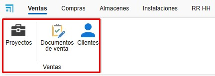
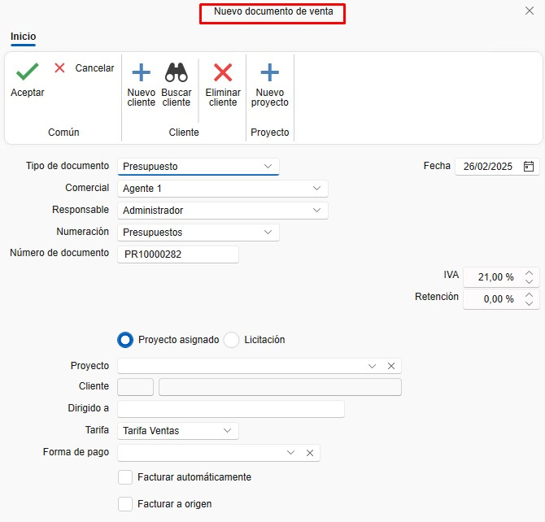
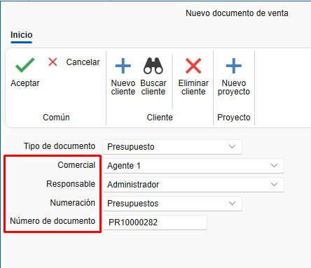
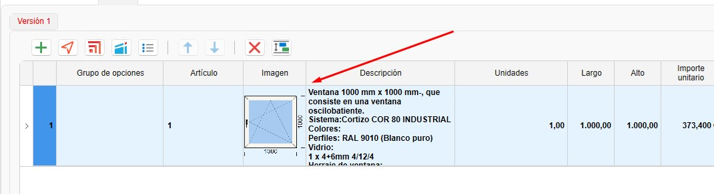
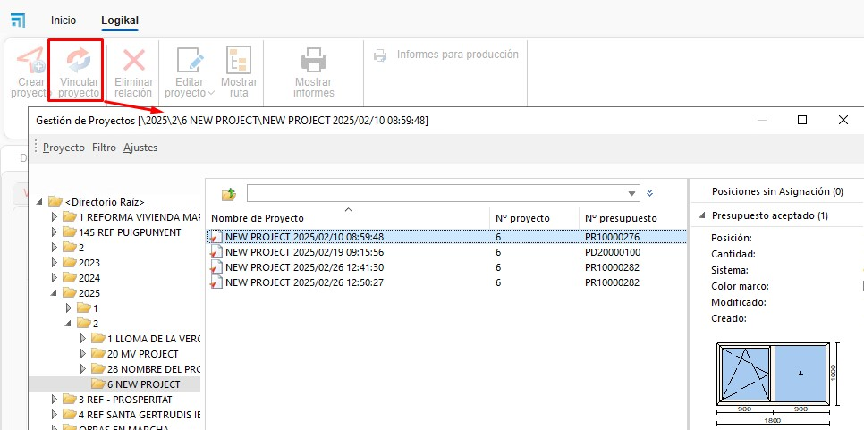
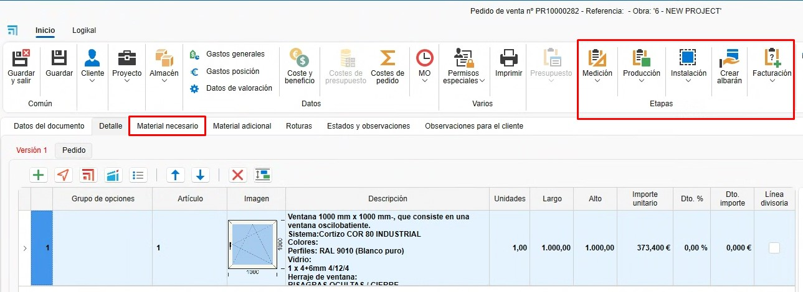
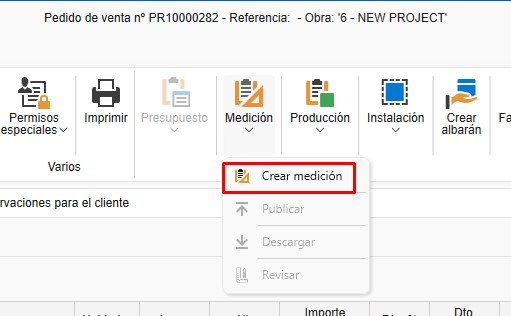
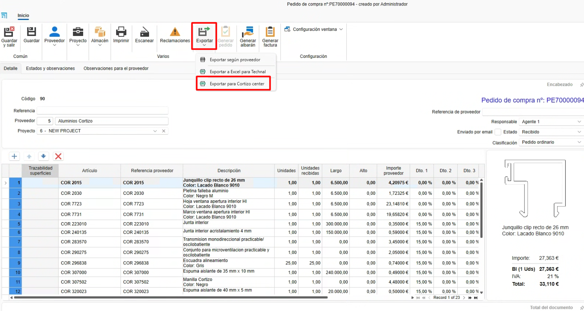
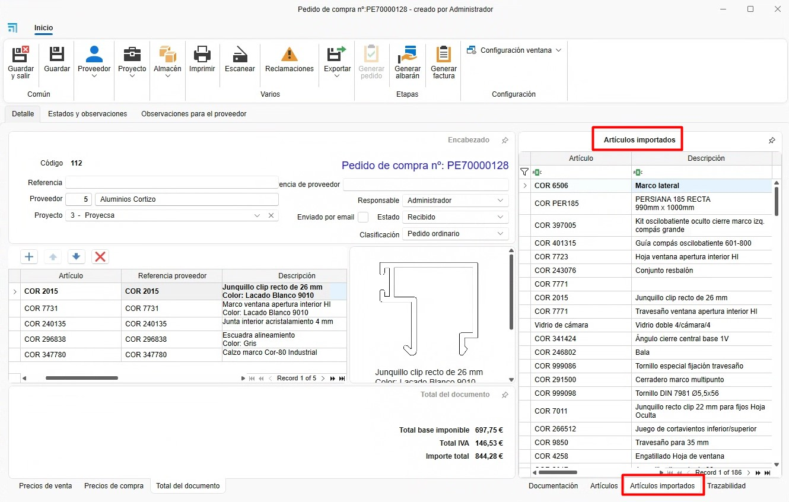

# 1. Ventas y Compras

---

## 1. Introducción
Este manual está diseñado para guiar a los usuarios en el uso del sistema de ventas y compras de ENBLAU. Basado en la formación proporcionada, cubre los procesos clave, desde la creación de proyectos hasta la gestión de pedidos, compras y producción.

---

## 2. Proceso
Una vez dentro, verás dos secciones principales:

### 2.1. Ventas
- **Documentos de venta**: Gestión y listado de presupuestos, pedidos, albaranes y facturas. Creación de proyectos y clientes.
  
  

### 2.2. Compras
- **Documentos de compra**: Gestión y listado de pedidos de compra y recepción de materiales. Creación de proveedores.

  

> **Nota:** Para crear documentos de venta y compra, es importante tener creados **proyectos, clientes y proveedores**. Para más información, sigue este enlace: [4. Proyecto, cliente y proveedores](6.PR_Proyecto_cliente.md).

---

## 3. Ventas
En el apartado de Ventas, encontrarás Proyectos, Documentos de venta y Clientes.

### 3.1. Documentos de venta
- Al entrar en **Documentos de venta**, se abrirá un listado de todos los documentos relacionados con ventas.

  

#### 3.1.1. Tipos de documentos
- Para crear un nuevo documento, haz clic en **Nuevo** desde la cinta superior.

  

- Se abrirá una ventana **Nuevo documento de venta**.

  

- Desde aquí, podrás crear diferentes tipos de documentos de venta, como Presupuesto, Pedido, Albarán o Factura.

  

- Al seleccionar el tipo de documento, algunos campos se rellenarán automáticamente (Comercial, Responsable, Numeración, etc.). Estos campos son editables.

  

- Otros campos, como Proyecto y Cliente, pueden configurarse para rellenarse automáticamente según el proyecto.

  

- En la cinta superior, puedes cambiar el cliente o añadir un nuevo cliente o proyecto.

  

### 3.2. Presupuesto
- Al crear un nuevo presupuesto, se abrirá una ventana con el número del presupuesto de venta.

  

#### 3.2.1. Datos del documento
- En este apartado, se pueden ver y modificar algunos campos del presupuesto.

  

#### 3.2.2. Detalle
- Aquí se añaden las posiciones para la versión del presupuesto.

  

- Puedes añadir una nueva posición vacía o desde Logikal (asegúrate de estar conectado a fábrica).

  

- Al añadir una posición desde Logikal, se abrirá la ventana de configuración de Logikal **Tipo de línea**.

  

- Una vez configurado, la posición se añadirá en ENBLAU.

  

#### 3.2.3. Logikal
- Desde este apartado, puedes crear un proyecto o vincular un proyecto ya creado en Logikal.

  

- Al vincular el proyecto, se abrirá una ventana con los proyectos disponibles en Logikal.

  

- Puedes crear diferentes versiones del presupuesto. Haz clic derecho sobre la pestaña de *Versión 1* o desde la cinta superior en el desplegable de *Presupuesto*.

  
  

- Se abrirá una ventana de **Nueva versión de presupuesto**, donde puedes indicar si quieres copiar las líneas de la versión activa o crear una versión en blanco.

  

- Para editar una posición en Logikal, pulsa **Ctrl + doble clic** sobre la posición que desees editar.

> **Nota:** El nombre de las pestañas de versiones es editable. Para cambiarlo, haz clic derecho sobre la pestaña de la versión y selecciona *Cambiar el nombre de la versión*.

### 3.3. Pedido
#### 3.3.1. Crear pedido
- Una vez creada la versión del presupuesto, el siguiente paso es aceptarlo y crear el pedido de cliente.

  
  

#### 3.3.2. Editar posición
- Desde el pedido, puedes editar o añadir posiciones, listar materiales, crear mediciones, producciones, etc.

  

#### 3.3.3. Albarán
- Desde la fase de Pedido, puedes crear un albarán e indicar las unidades a albaranar.

  

> **Nota:** Los datos del documento de pedido también se pueden modificar, al igual que en otros documentos de venta.

### 3.4. Medición
#### 3.4.1. Crear medición
- Desde el pedido, puedes crear una medición.

  

#### 3.4.2. Seleccionar posiciones
- Al crear una medición, se abre una ventana **Nueva fase de medición**, donde puedes seleccionar las posiciones para la fase de medición.

  

#### 3.4.3. Fase de medición
- Se crea una fase de medición donde puedes editar las mediciones sin afectar el pedido.

  

#### 3.4.4. Albarán
- Desde la fase de Medición, puedes crear un albarán e indicar las unidades a albaranar, de la misma forma que en el pedido.

> **Nota:** Los datos del documento de medición también se pueden modificar, al igual que en otros documentos de venta.

### 3.5. Producción
#### 3.5.1. Crear producción
- La fase de producción se puede crear desde el pedido o la medición.

  

#### 3.5.2. Seleccionar posiciones
- Al crear una producción, se abre una ventana **Nueva fase de producción**, donde puedes seleccionar las posiciones para la fase de producción.

  

- Al aceptar, aparecerá una ventana preguntando si deseas enviar a producción.

  

#### 3.5.3. Fase de producción
- Se crea una fase de producción donde puedes editar la posicion antes de mandar a producción sin afectar el pedido.

  

#### 3.5.4. Albarán
- Desde la fase de Producción, puedes crear un albarán e indicar las unidades a albaranar, de la misma forma que en el pedido.

> **Nota:** Los datos del documento de producción también se pueden modificar, al igual que en otros documentos de venta.

---

## 4. Compras

### 4.1. Pedidos de compra
#### 4.1.1. Desde un presupuesto
- Acepta un presupuesto para generar un pedido de cliente.

#### 4.1.2. Material necesario
- Accede a la pestaña "Material Necesario" para listar los materiales requeridos.

  

- Al listar materiales, verás en las columnas de Artículos y Unidades a comprar en color verde y rojo. Verde indica que hay suficiente material en stock para ese proyecto, y rojo indica que no hay suficiente.

  

- Puedes elegir si deseas comprar los materiales marcando o desmarcando la casilla en la columna *Comprar*.

  

#### 4.1.3. Generar pedido de compra
- Selecciona los materiales y genera el pedido de compra en **Pedir material**. Se abrirá una ventana **Nuevo documento de compra**, donde puedes cambiar algunos campos por defecto y elegir el proveedor.

  

- Asigna un proveedor y envía el pedido.

  

#### 4.1.4. Pedido de compra
- Una vez creado el pedido de compra, puedes revisarlo y modificarlo según sea necesario (proveedor, proyecto, cantidad de materiales, etc.).

  

#### 4.1.5. Exportar a Cortizo center
- Una vez creado el pedido de compra, puedes exportar en formato Excel el pedido para que se pueda subir a Cortizo center.

  

#### 4.1.6. Reclamaciones

Una vez generado un **pedido de compra**, tienes la opción de gestionar **Reclamaciones** directamente desde el sistema.

- Puedes añadir una reclamación asociada al pedido desde su propia ficha:

  

- También es posible **enviar la reclamación automáticamente por correo electrónico**, agilizando la comunicación con el proveedor:

  

- El sistema guarda un **histórico automático** de las reclamaciones realizadas.  
  Además, puedes añadir registros manuales para documentar el **seguimiento** de la reclamación.

  

**Nota:** El seguimiento adecuado de las reclamaciones permite mejorar la trazabilidad de incidencias con proveedores y facilita la gestión de calidad en compras.

#### 4.1.7. Documentos de compra
- Desde el apartado de Compras, puedes acceder al listado de compras y a Proveedores.

  
  
  

#### 4.1.8. Artículos y Artículos importados

- En el pedido de compras, en la pestaña **Detalle** en la cinta lateral derecha, verás que hay una sección ubicada en la parte inferior llamada **Artículos** y **Artículos importados**. Esos artículos se puede añadir al pedido de compra arrastrando el material al listado.

  - **Artículos**: Son materiales propios creados desde en **MATERIAL**.

  

  - **Artículos importados**: Son los materiales importados cada de los proyectos de **Logikal**. Esos materiales se almacenan y se actualizan cada vez que se lista material desde material necesario. Son los mismos materiales que están también en Almacén **Materiales importados**.

  

### 4.2. Recepción de material
#### 4.2.1. Albarán de recibido
- Genera un albarán al recibir el material.

  

#### 4.2.2. Unidades recibidas
- Indica las unidades recibidas en la columna *Unidades a albaranar*.

  

---

## 5. Material adicional y roturas

### 5.1. Material adicional
- Los materiales adicionales se pueden añadir al pedido, medición o producción. Se pueden añadir materiales propios creados desde enMATERIALS o artículos importados desde Logikal. Para más información sobre cómo crear materiales propios, sigue este enlace: [2. Creación de materiales propios en enMATERIALS](/Utilidades/2.UT_Crear_Materiales_enMATERIAL).

  

#### 5.1.1. Añadir material
- Arrastra material adicional desde el árbol de Artículos (materiales propios dado de alta desde enMATERIAL).

  

- También se puede arrastrar desde **Artículos importados** de Logikal.

  

- Añade líneas de texto.

  

- Una vez se ha añadido los materiales adicionales tienes la opción de generar un pedido de compra al proveedor.

  

- Puedes generar un albarán de envío para material adicional.

  

#### 5.1.2. Costes
- El material adicional se contabiliza como coste del proyecto, pero no está presupuestado al cliente.

### 5.2. Roturas
#### 5.2.1. Añadir a roturas
- Desde la sección "Material Necesario", haz clic derecho sobre el material y selecciona **Añadir a roturas**.

  

- El material se añadirá en el apartado de **Roturas**. En la columna *Concepto*, puedes indicar el motivo de la rotura, seleccionando de una lista predefinida en la configuración de [7.5. Conceptos de roturas](/Configuraciones/1.%20CO_Configuracion_Inicial_ENBLAU/#75-conceptos-de-roturas).

  

- Así como en Material adicional se puede añadir Artículos (material propio) y Artículos adicionales. Además de generar pedido de compra y albarán. 

  

- Asegurar que en el apartado [8.3. Clasificaciones](/Configuraciones/1.%20CO_Configuracion_Inicial_ENBLAU/#83-clasificaciones) está correctamente configuradas la clasificación para roturas.

> **Nota:** El proceso de añadir y pedir material adicional o roturas, también se puede hacer desde el apartado de proyectos.

---

## 6. Trazabilidad

### 6.1. Árbol de trazabilidad
- Muestra la trazabilidad completa de un documento, desde el presupuesto hasta la producción. Por ejemplo, desde un presupuesto (ej. 483) hasta su envío a producción.

  

### 6.2. Visualización
- Haz clic en cualquier documento para ver su trazabilidad en el panel derecho.

  

---

> **Gestion de filtros** Usar filtros y filtros personalizados para optimizar la búsqueda en los listados. Para más información, sigue este enlace: [4. Gestión de filtros](/Utilidades/4.UT_Gestion_Filtros/)

---

## 7. Preguntas frecuentes

### 7.1. ¿Cómo gestionar incidencias postventa?
- **Opción 1**: Crea un nuevo presupuesto.
- **Opción 2**: Genera un pedido de cliente a importe cero y envíalo a producción.

### 7.2. ¿Cómo añadir material adicional?
- Arrastra el material adicional desde el árbol y genera un albarán de envío.

### 7.3. ¿Cómo recibir material parcialmente?
- Al generar un albarán, indica las unidades recibidas. Puedes crear múltiples albaranes para un mismo pedido.

---

Este manual está diseñado para ayudarte a navegar y utilizar el sistema de ventas y compras de ENBLAU de manera eficiente. Para más detalles, consulta el video de formación o contacta con el soporte técnico.