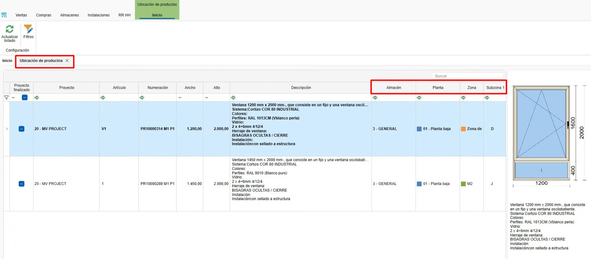

# 3. Sistema de control de stock ENBLAU

---

## 1. Propósito

El presente manual está diseñado para usuarios nuevos en el sistema de control de stock utilizado por los Clientes y Endades. El objetivo principal es proporcionar una guía detallada para la gestión eficiente de proyectos, desde la creación de pedidos hasta la optimización del proceso de producción en ENBLAU. Este documento abarca los pasos necesarios para realizar las operaciones clave del sistema y está estructurado de forma secuencial para facilitar su comprensión.

---

## 2. Gestión de pedidos de compra

### 2.1. Pedidos de compra

- Desde el menú principal **Compras**, navegue a la sección "Pedidos de Compra".
- Especifique los materiales requeridos y su cantidad.
- En caso de cambios en las referencias, añádalas manualmente si están configuradas en la base de datos.
- En el pedido de venta (en la sección de **Venta**) selecciona el documento e ir a la pestaña **Material necesario** para sacar el listado de los materiales del pedido.
  - Puedes indicar si quieres o no comprar, por si ya tienes en almacén. Te mostrará para cada material la información: unidades en stock, unidades reservadas, unidades pendientes.

  

- Confirma en **Pedir material** y envía el pedido al proveedor correspondiente.

- En el apartado de **Almacenes** tienes una opcion **Pendiente de recibir** donde te muestra un listado donde se puede visualizar los materiales pendente de recibir para cada proyecto y pedido de compra.

  

- Sobre la línea del artículo con el botón derecho puedes abrir el pedido de compra para ese material:

  

> **Nota:** Para información más detalladas sobre pedido de compras, sigue este enlace: [Pedidos de Compras](1.PR_Ventas_Compras.md#4-compras)

 > ⚠️ **¡Importante!** Para hacer el pedido de materiales en el documento de venta, en algunos casos se requieren permisos especiales para realizar compras. Este permiso también es necesario para fabricar o instalar.

### 2.2. Asignar materiales a proyecto

- Desde Material necesario en el proceso de listar y pedir materiales, tienes la opción, según la necesidad, de asignar artículos de otro proyecto al proyecto en el que estás. Desde el apartado de ubicaciones Botón derecho sobre la línea - **Asignar**:

  

  - Indicar el proyecto de destino a asignar (por defecto es en el que estás) y la cantidad (por defecto la que necesitas para el proyecto):
  
  

  - Al asignar el artículo al proyecto en el que estás, automáticamente cambiará la unidad de stock al proyecto de destino, sumando la cantidad asignada, y al proyecto de origen se le restará. El artículo se pondrá en color verde.   

> ⚠️ **¡Importante!** Asegúrate de que se puedan utilizar materiales del proyecto desde el que se desea hacer el traspaso de los artículos.

### 2.3. Materiales reservados

- Desde un documento de **Ventas**, **Compras** y en **Proyectos**, se pueden reservar materiales para el proyecto, indicando en **Materiales reservados** desde el desplegable de **Almacén**.

  

- Abrirá una ventana de Material reservado y desde el apartado **Material de proyecto** puedes arrastrar los materiales de los pedidos al proveedor:

  

- Luego en el apartado de Almacenes se pueden ver todos los materiales reservados de un proyecto:

  

  

> **Nota:** El uso de material reservado es algo visual, eso no impedirá que se usen los materiales aunque estén reservados. Se recomienda el uso de [Asignar materiales a proyecto](#22-asignar-materiales-a-proyecto) si quieres tener un mejor control de stock.

- En **Compras** hay una opción más en el desplegable de almacén llamada **Reposición de stock**, donde se mostrará un listado de bajo mínimo y bajo habitual.

  

  

---

## 3. Gestión de almacenes y movimientos

### 3.1. Almacenes Layout

- En el menú principal de **Almacenes** - **Stock**, puedes añadir o editar los almacenes.

  

- Configura el layout del almacén desde la página inicial: **ENBLAU** – **Configuración** – **Almacén** – **Layout**:

  

  - Crea zonas, estanterías y posiciones en el sistema para una organización clara. Se mostrará como vista de árbol.
  - Relaciona cada posición con su correspondiente área de almacenamiento. Ejemplo:
    - **Añadir Planta**: Añade una planta y puedes indicar el almacén.
    - **Añadir Zona/SubZona**: Se añade una zona o subzona debajo de la ubicación seleccionada.

    

### 3.2. Stock

- En el apartado de **Almacenes - Stock** tienes el listado con las opciones **Resumen, Resumen con ubicacion y Detallado**:

  

  

  - **Resumen:** En ese listado podras ver de una manera resumida un material agrupado por proyecto asignado. Se mostrará los totales de unidades, Unidades pendientes y unidades reservadas.

    <!--  -->

  - **Resumen con ubicación:** En ese listado podrás ver de una manera resumida un material agrupado por proyecto asignado y su ubicación.

    <!--  -->

  - **Detallado:** En ese listado podrás ver de una manera más detallada donde muestra un material con su proyecto de compra, proyecto asignado, ubicación en almacén y separado por documento de albarán de compra. Además, permite descontar, traspasar y asignar artículos.  

    <!--  -->

### 3.3. Movimientos en almacén 

- Realiza movimientos de materiales entre zonas y proyectos:
  - En **Almacenes** - **Stock** – **Detallado**, haz clic derecho sobre el material que quieras traspasar, descontar o asignar.

  

  - Selecciona el material desde el proyecto.
  - **Descontar**: Indica el proyecto, número del pedido, responsable y cantidad (barras y piezas) o longitud (juntas).

    

  - **Traspaso**: Indica la ubicación de origen, destino, cantidad (barras y piezas) o longitud (juntas).

    

  - **Asignar**: Indica el proyecto de destino, responsable, cantidad (barras y piezas) o longitud (juntas). Esa funcion es la misma del apartado de Material necesario -[Asignar materiales a proyecto](#22-asignar-materiales-a-proyecto).

     

- Los movimientos de entrada, salida, traspaso y asignación de cada material se reflejarán en el **Albarán**. Se puede ver las entradas y salidas en **Almacén – Movimientos**.

    

    

- Desde Movimientos de almacén hay una función que es **Devolver**. Clic con el botón derecho sobre el movimiento de salida que deseas hacer y aparecerá la opción de devolver:

    

    Abrira una ventana **Movimiento de devolución** donde indicas las unidades y la ubicación que quieres devolver del material, por defecto es la ubicación de donde has dado salida a ese material:

      

- La opción **Abrir** desde el listado detallado, abre el albarán (columna numeración) de la línea y artículo seleccionado:

    

    
### 3.4. Informes de almacenes (inventario)

- En el apartado de **Almacenes** - **Stock** se puede imprimir diferentes tipos de informes:

  - **Resumen:** Hay dos informes **Inventario** e **Inventario por fecha**.

    

    **Inventario** muestra un informe de inventario, según los filtros aplicado en el listado de almacén. Incluye las columnas Artículo, Proyecto Unidades, Unidades pendientes y Unidades reservadas.

      

    **Inventario por fecha** muestra un informe de inventario en la fecha escogida. Incluye las columnas Artículo, Descripción, Unidades e Importe.

      

  - **Resumen con ubicación:** Hay un informe **Inventario detallado**.

    **Inventario detallado** muestra un informe de inventario, seguún los filtros aplicado en el listado de almacén detallado. Incluye Ubicación almacén, Artículo, Descripción y Unidades. inventario_detallado_resumen

      

  - **Detallado:** Hay un informe **Inventario detallado**.
  
    **Inventario detallado** muestra un informe de inventario, según los filtros aplicado en el listado de almacén detallado. Incluye Proyecto, Número del albarán de compra, Ubicación almacén, Artículo, Descripción y Unidades agrupadas por referencia y longitud. 

      

  - En el apartado de **Almacenes** - **Movimientos de almacén** se puede imprimir diferentes tipos de informes:

    

    **Movimientos** muestra un listado de los movimientos visualizados en el listado de movimientos. Incluye Fecha del movimiento, Responsable, Proyecto asignado, Ubicación almacén, Artículo, Descripción, Unidades y Tipo de movimiento.

      

    **Movimientos I** muestra un listado de los movimientos visualizados en el listado de movimientos. Incluye las columnas Tipo de movimiento, Fecha del movimiento, Responsable, Documento, Unidades, Importe, Artículo y Descripción.

      

## 4. Stock necesario
- Una vez se haya creado una producción y mandado a taller desde el mismo se puede ver y descontar los materiales de forma manual.

  

- Se abre una ventana de Stock necesario donde indica si el material hay y almacenes y a que monitor (puesto) se descontara ese material. Para descontar el material hay que marcar la casilla en la columna **Stock a descontar** del material.

  

> ⚠️ **Importante!** Si no hay el material en stock, no se descontará.

> **Nota:** Para tener un controle más detallado de stock se recomienda usar la app móvil enSITE para hacer ese tipo de descuento de material. Para más información sobre la app [2.1. Recepción en enSITE](4.PR_Manual_Stock_enCONTROL.md#21-recepcion-en-ensite)
  
---

## 5. Materiales importados

En el apartado **Almacenes → Material importado** se encuentra el listado de todos los materiales importados desde **Logikal**.

---

### 5.1. Configuración de materiales

Desde esta sección puedes definir, para cada artículo, una serie de valores por defecto que afectan a la gestión de compras y producción:

- **Comprar**:  
  Si esta casilla está marcada, indica que el material se propondrá por defecto como “a comprar” cuando se liste desde el apartado **Material necesario**.

- **Montado en destino**:  
  Si está marcada, el material será montado en destino durante el proceso en el puesto **Picking** dentro de **enCONTROL**.

- **Control de stock**:  
  Al activarse, el material será tenido en cuenta para su descuento automático durante el proceso de producción.

- **Stock mínimo**, **stock máximo** y **stock habitual**:  
  Puedes definir los valores de referencia para la gestión de existencias, lo cual es útil para alertas, reposiciones automáticas o planificación.

> **Nota:** La correcta configuración de estos campos mejora significativamente el control de inventario, la planificación de compras y la trazabilidad de materiales durante la producción.

---

## 6. Producto terminado

El **producto terminado** es aquel que ha sido completamente fabricado y ha pasado por el puesto correspondiente de **Producto terminado** en **enCONTROL**.

En el apartado **Almacenes → Producto terminado** se encuentran dos listados principales:

- **Ubicación de productos**
- **Movimientos de producto**

  

---

## 6.1. Ubicación de productos

- En el listado de **Ubicación de productos** se muestra la información y la localización actual del producto terminado, tal como se haya definido desde el puesto de **Producto terminado** en **enCONTROL**.

  

- Desde esta vista, haciendo clic con el botón derecho sobre una línea, puedes realizar las siguientes acciones:

  - Mover el producto a otra ubicación.
  - Dar salida al producto.
  - Abrir el documento de producción relacionado con ese producto.

  

---

## 6.2. Movimientos de producto

- En el apartado **Movimientos de producto** se registran todas las operaciones realizadas con los productos terminados, incluyendo:

  - Entrada.
  - Salida.
  - Traspaso.

  

- Haciendo clic con el botón derecho sobre una línea cuyo **tipo de movimiento** sea una **salida**, se habilita la opción **Devolver**.

  

- Al seleccionar esta opción, se abrirá la ventana **Devolución producto terminado**, donde se debe:

  1. Indicar la nueva **ubicación** del producto.
  2. Aceptar la operación.

  

Una vez completado el proceso, el sistema registrará un nuevo movimiento del tipo **Entrada** en el historial del producto.

> **Nota:** Esta funcionalidad es útil para gestionar devoluciones internas, productos rechazados o reasignaciones logísticas dentro del almacén.

---

> **Nota:** La correcta gestión del producto terminado garantiza un mejor control del inventario, facilita la trazabilidad y agiliza la preparación de expediciones o entregas.

---

## 6. Control de stock y reportes

- Monitorea el stock necesario desde la sección "Producción".
- Identifica materiales reservados y pendientes en tiempo real.
- Genera reportes de inventarios para evaluar el uso de materiales y planificar futuras compras.

---

## 7. Resolución de problemas comunes

- **Error al importar referencias**: Verifica que las referencias estén configuradas en la base de datos.
- **Materiales sobrantes o faltantes**: Asegúrate de registrar correctamente las ubicaciones y cantidades al recibir materiales.
- **Problemas con el layout del almacén**: Revisa la configuración de zonas y ajusta según sea necesario.

---

## 8. Conclusión

Este manual ofrece una guía paso a paso para los procesos principales en el sistema de control de stock. Siguiendo estas instrucciones, los usuarios podrán gestionar eficientemente los inventarios, mejorar la producción y optimizar la relación con proveedores. Para soporte adicional, contacte al administrador del sistema.
