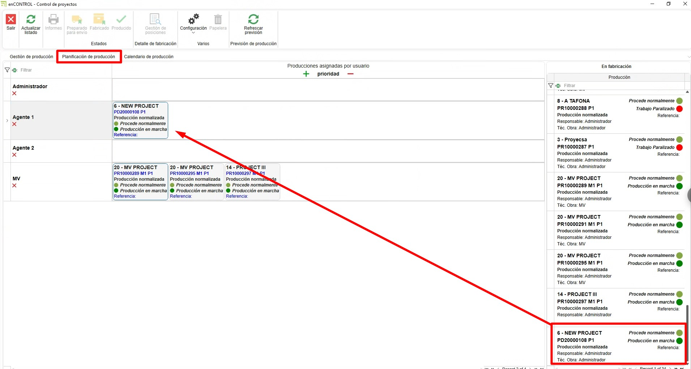
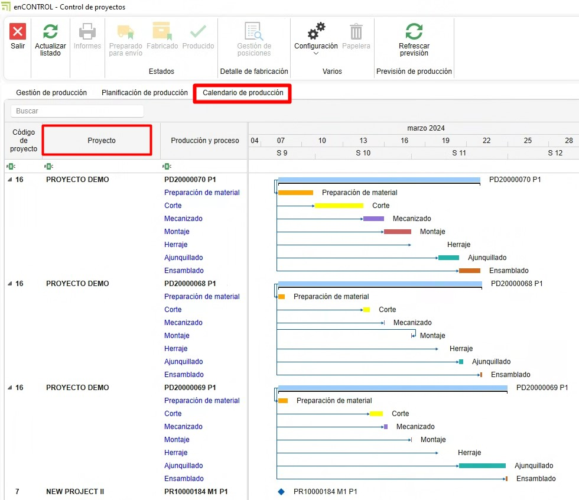

# 4. Sistema de control de stock enCONTROL (EN PROCESO...)

---

## 1. Propósito

El presente manual está diseñado para usuarios nuevos en el sistema de control de stock utilizado por los Clientes y Endades. El objetivo principal es proporcionar una guía detallada para la gestión eficiente de proyectos, desde la creación de pedidos hasta la optimización del proceso de producción en enCONTROL y enSITE. Este documento abarca los pasos necesarios para realizar las operaciones clave del sistema y está estructurado de forma secuencial para facilitar su comprensión.

---

## 2. Recepción de materiales
### 2.1. Recepción en enSITE

- Una vez se haya creado el pedido de compra, desde ENBLAU en **Almacenes**, acceda a la opción **"Pendientes de Recibir"** en el apartado de Almacenes. Se abrirá una pestaña con todos los materiales pendientes de recibir para cada proyecto.

> **Nota:** Para información mas detalladas sobre pedido de compras, sigue este enlace: [### 2.1. Pedidos de compra](3.PR_Manual_Stock_ENBLAU.md#21-pedidos-de-compra)

- **Modo de recibir**: Abra **enSite** desde el taller a través de wifi con la persona encargada de recibir el pedido.
- En **Recepción de pedidos**, localice el pedido correspondiente (ordenado por fecha).

- Registre la recepción en **Nuevo Albarán** creando un albarán desde la sección **Almacén**.

- En ENBLAU, la pestaña **Pendiente de recibir** de **Almacenes** se sincroniza y ya no verás los materiales para ese pedido.
- En **Pedido de Compras**, puedes comprobar la trazabilidad.
- En **enSite**, indique las cantidades recibidas y la ubicación donde se almacenarán (Almacén, Planta, Zona, Subzona…). Luego podrás ver la ubicación de cada material.

- Desde la app **enSITE**, también se puede buscar por artículos y ver todas las ubicaciones donde está ese artículo. Para luego mover o descontar los artículos.

     
    

> **En caso de materiales dañados u otras incidencias**, puedes adjuntar documentos o capturar fotografías y adjuntarlas al albarán. Luego se podrá revisar desde ENBLAU.

### 2.2. Recepción en ENBLAU

- Desde ENBLAU una vez creado el pedido de compra se puede sacar un albarán de recepción de materiales del pedido.

- Desde el albarán podrás indicar la recepción de cada material indicando la cantidad. Por defecto estarán todos marcados con la cantidad del pedido.

- Luego hay que indicar la ubicación del albarán en la pestaña de almacenes del albarán.

---

## 6. Producción y enCONTROL

### 6.1. Producción

- Crea proyectos de producción basados en los pedidos de cliente.
  - Crear producción.

    

  - El siguiente paso es **Enviar a producción**.

    
    

  - En producción, se puede ver en **stock necesario** los materiales descontados. Se puede descontar manualmente.

    
    

### 6.2. enCONTROL

- Abre **enCONTROL**. Aparecen los proyectos de producción. Si eres usuario administrador, verás todos los proyectos, si no, solo verás los asignados.
- Abre el **monitor de control**. Puedes abrirlo haciendo doble clic en cualquiera de los filtros (en la cabecera) o haciendo doble clic en el proyecto y seleccionando el puesto de **Control**.

    

- Cuando se envía a producción (Taller), se coloca en cola de producción en la pestaña de **Gestión de Producción**. El responsable de producción decide la prioridad.

    

- Para añadir, solo tienes que arrastrarlo y se abrirá una ventana de **Tarea** para proponer una fecha.

    

- En la pestaña Planificación de producción defines a quien se asigna, arrastrando los proyectos a cada responsable por hacer. Hay que seleccionar el responsable y arrastrar el proyecto (se puede seleccionar más de uno responsable con ctrl + botón derecho). También se puede cambiar la prioridad de izquierda a derecha y de arriba a abajo:

  

- En la pestaña Calendario de producción con base en los tiempos de Logikal (en el ejemplo) fechas de entrada y salida de producción.

  

- Optimice los procesos según las áreas de producción (corte, mecanizado, ensamblado, etc.). En la pantalla de proyecto con doble clic sobre el proyecto deseado, te abrirá una ventana Seleccione un puesto. (Los puestos se definen como el cliente decida y se verá según el usuario) ejemplos:

  

- Preparación de Material
    - Todo preparado – Marca los materiales con un check en verde indicando que está preparado.
	- Nada Preparado – Marca los materiales con una X en rojo indicando que no está preparado.
	- Ubicación Material – Según lo tengas configurado enCONTROL, se podría indicar donde ubicar los materiales. Para que se descuente ese material solo de esa ubicación. 
	- Finalizar - sería la fecha real.
	- Documentación - añadir una ruta genérica para añadir lo que quiera. Catálogo, manuales, etc.
	- Comentarios - Se puede añadir comentario y escoger una severidad en el desplegable. El último comentario bueno es el que desbloquea.

      

> Todas las pantallas de Puesto son muy similares. Solo que algunas puede que se descuente materiales y otras es a nivel de información. 

- Corte
    - En corte se indica la longitud de la barra y el desperdicio de retales. Se abre una ventana de retales y puede cambiar la longitud según sé necesario.
	- Luego en ENBLAU Movimientos de almacén se reflejará una salida de la barra total ej. 6500 y luego una entrada de la del mismo material de ej. 5500 según había indicado en el puesto de corte.
- Mecanizado
	- No se descuenta materiales, simplemente es informativo por tiempo. Contrasta tiempo real.
- Montaje
    - Se descuenta materiales (accesorios) por cuadro.
- Ajunquillado
    - Se descuenta materiales (Juntas) por cuadro.
- Ensamblado
    - Información del cuadro, pero no se descuenta materiales.
- Herraje
    - Se descuenta materiales (herraje) por hoja.
- Comprobación final
    - No se descuenta materiales.
- Pizarra
    - Muestra la evolución de cada proyecto y su estado.
- Control
    - Abre el monitor Control de proyectos

- Asigne prioridades y recursos para asegurar la fluidez en la producción.

> **Configuración enCONTROL** - Configurar enCONTROL previamente. Para más información, sigue este enlace: [2. Configuración Inicial de enCONTROL](/docs/Configuraciones/2.%20CO_Configuracion_Inicial_enCONTROL.md):
   
---

> **Gestion de Filtros** Usar filtros y filtros personalizados para optimizar la búsqueda en los listados. Para más información, sigue este enlace: [4. Gestión de Filtros](/docs/Utilidades/4.UT_Gestion_Filtros.md)

---

## 7. Control de stock y reportes

- Monitorea el stock necesario desde la sección "Producción".
- Identifica materiales reservados y pendientes en tiempo real.
- Genera reportes de inventarios para evaluar el uso de materiales y planificar futuras compras.

---

## 8. Resolución de problemas comunes

- **Error al importar referencias**: Verifica que las referencias estén configuradas en la base de datos.
- **Materiales sobrantes o faltantes**: Asegúrate de registrar correctamente las ubicaciones y cantidades al recibir materiales.
- **Problemas con el layout del almacén**: Revisa la configuración de zonas y ajusta según sea necesario.

---

## 9. Conclusión

Este manual ofrece una guía paso a paso para los procesos principales en el sistema de control de stock. Siguiendo estas instrucciones, los usuarios podrán gestionar eficientemente los inventarios, mejorar la producción y optimizar la relación con proveedores. Para soporte adicional, contacte al administrador del sistema.
