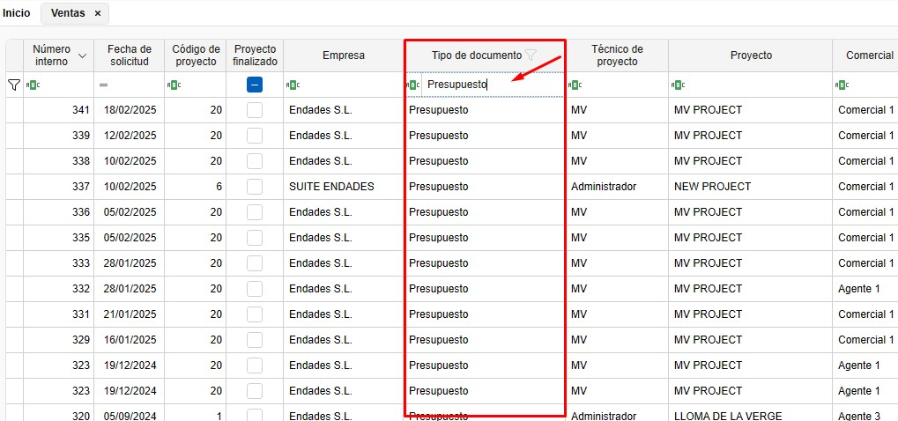
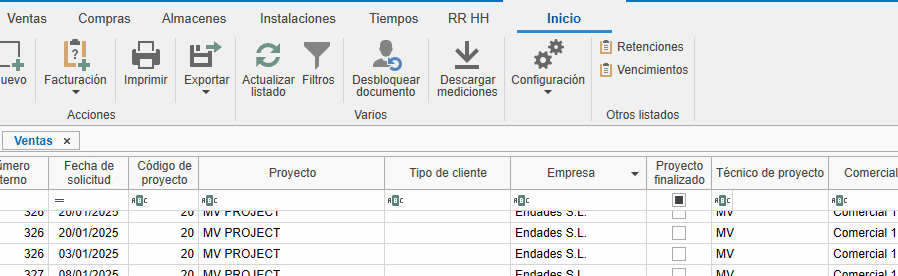

# 4. Gestión de filtros

<!-- ## Índice
1. [Introducción](#1-introducción)
2. [Gestión de Filtros en Listados](#2-gestión-de-filtros-en-listados)
   - [2.1. Acceder a los Filtros](#21-acceder-a-los-filtros)
   - [2.2. Guardar Filtros Personalizados](#22-guardar-filtros-personalizados) -->

---

## 1. Introducción
Este manual está diseñado para orientar a los usuarios en el uso de filtros y filtros personalizados. Su función principal es optimizar la velocidad de búsqueda y mejorar la organización de la vista en todos los listados de los aplicativos.

## 2. Gestión de filtros en listados

Los filtros permiten personalizar la visualización de los documentos en los listados. Sigue estos pasos:

### 2.1. Acceder a los filtros
- En la cabecera de los listados, utiliza los filtros para definir qué columnas y datos deseas ver.

  

- Por ejemplo, puedes filtrar por "Presupuestos" que muestre solo las columnas necesarias (empresa, proyecto, fecha de solicitud, estado del documento, técnico del proyecto, tipo de documento, etc.).

  

- En el campo de buscar bajo de la cabecera hay un icono **ABC** donde se puede selecionar las condiciones que quieres que se cumpla para buscar un valor.

   

- Para filtrar por lo valores de filtro, desde la cabecera clicar sobre el embudo y desde ahi se puede seleccionar los valores que quieras filtrar.

  

- Usa `Ctrl + F` para buscar en el listado.

  

### 2.2. Guardar filtros personalizados
- Organiza las columnas según tus necesidades. Puedes eliminar, añadir y cambiar la posición de las columnas haciendo clic derecho sobre cualquier cabecera.

  

- Otra opción para cambiar la posición o eliminar columnas es arrastrarlas.

  

- Desde "Filtros", accede a "Gestión de filtros" y añade un nuevo filtro.

  

- Guarda el filtro con un nombre específico (ej. "Presupuesto 2").

  

### 2.3. Guardar vista
- Desde cualquier documento o desde un proyecto se puede organizar las columnas o los filtros y luego guardar la vista desde Configuración ventana - **Guardar vista**:

  

  Cada vez que vuelvas a entrar se vera la vista que se habia guardado

> **Nota:** Cada usuario puede tener sus propios filtros y vistas guardados.

