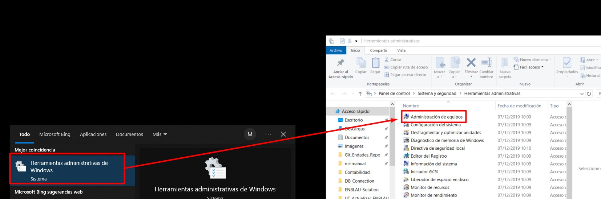
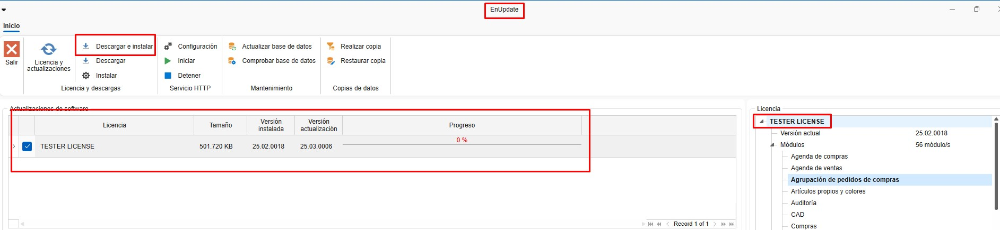
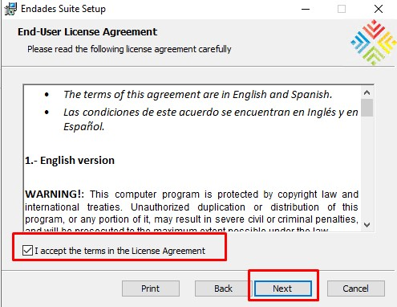
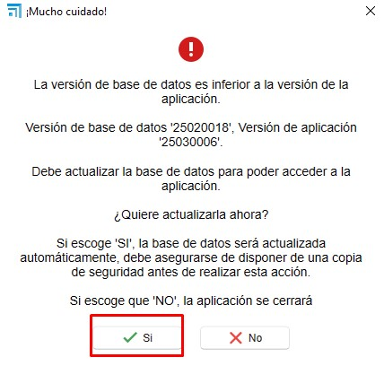
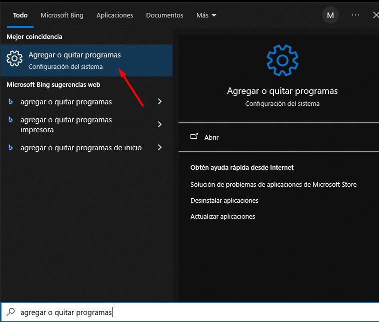
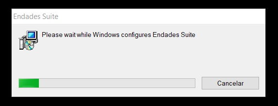

# 5. Actualización ENBLAU

---

## 1. Introducción

Este manual está diseñado para orientar a los usuarios en el proceso de actualización de ENBLAU a la última versión disponible.

---

## 2. Pasos para la actualización

> ⚠️ **¡Importante!** Antes de comenzar, asegúrate de que **ningún usuario esté conectado a ENBLAU**. Desde **Herramientas administrativas - Administración de equipos - Carpetas compartidas - Archivos abiertos** podrás averiguar si hay alguien conectado a la app. 

   
   
   

> Si ENBLAU está instalado en un servidor, la actualización debe realizarse **desde ese servidor** y **nunca** desde un equipo conectado por unidad de red.

### 2.1. ENBLAU

1. Accede a ENBLAU (desde el servidor, si aplica).
2. En la parte inferior de la pantalla de inicio, haz clic en **"Nueva versión disponible"** (aparecerá en rojo junto con el número de la última versión disponible).

   

3. Se abrirá una ventana llamada **"Nueva versión"**, donde podrás ver las novedades antes de instalar. Haz clic en el botón **"Abrir enUPDATE"** para continuar.

   

### 2.2. enUPDATE

1. Al abrir *enUPDATE* desde ENBLAU, se mostrará la ventana correspondiente. Ese proceso se puede hacer directamente desde enUPDATE sin la necesidad de abrir primero ENBLAU.
2. En la parte superior de la cinta, haz clic en **"Descargar e instalar"**. Esto descargará automáticamente la última versión de ENBLAU (podrás ver el progreso en la barra).

   

3. Al finalizar la descarga, aparecerá un mensaje confirmando que fue exitosa y solicitando permiso para proceder con la instalación.

   

### 2.3. Instalación

> ⚠️ **¡Importante!** Asegúrate de que ENBLAU esté **completamente cerrado** antes de comenzar la instalación.

1. Al confirmar la instalación, se abrirá la ventana del **Endades Suite Setup**. Sigue los pasos a continuación:

     

   - Acepta los términos de la licencia marcando la casilla correspondiente y continúa.

     

   - Verifica que la ruta de instalación de ENBLAU sea la correcta.

       

   - Haz clic en **"Instalar"** para comenzar.

      

   - Finaliza la instalación.

     

### 2.4. Actualización de la base de datos

1. Una vez finalizada la instalación, abre ENBLAU desde el equipo donde realizaste la actualización.
2. Al iniciar, el sistema solicitará actualizar la base de datos. Haz clic en **"Sí"** para continuar.

   

---

¡Listo! Ya puedes trabajar con la **última versión actualizada de ENBLAU**.

---

## 3. Desinstalar e instalar ENBLAU

En caso de que la actualización de ENBLAU no se haya completado correctamente —por ejemplo, si había usuarios conectados o se produjo algún otro error— será necesario desinstalar el programa por completo y realizar una nueva instalación.

### 3.1. Desinstalar Endades Suite

1. En el equipo donde está instalado ENBLAU, abre el menú de inicio de Windows y busca **"Agregar o quitar programas"** (el nombre puede variar según la versión del sistema operativo).

   

2. Se abrirá la ventana de configuración. En el apartado **Aplicaciones y características**, busca **Endades Suite**.

3. Haz clic sobre la aplicación y selecciona **Desinstalar**. El procedimiento es el habitual para cualquier aplicación instalada en Windows.

   

   

### 3.2. Instalar ENBLAU

1. Una vez desinstalada la aplicación, accede a la carpeta de instalación de ENBLAU. Por ejemplo:  
   **`C:\ENBLAU`**

2. Dentro de esa carpeta, abre el directorio **Downloads**.

   

3. Ahí encontrarás varias versiones del instalador. Puedes ordenar los archivos por nombre o por fecha para localizar la **última versión disponible**.

   

4. Abre la carpeta correspondiente a la última versión y ejecuta el archivo **`Installer.msi`** haciendo doble clic.

   

5. Se abrirá la ventana del instalador **Endades Suite Setup**. Sigue los mismos pasos detallados en la sección [2.3. Instalación](#23-instalacion).

---

📌 **Nota**: Si después de reinstalar ENBLAU el sistema solicita actualizar la base de datos, sigue el procedimiento indicado en [2.4. Actualización de la base de datos](#24-actualizacion-de-la-base-de-datos).
