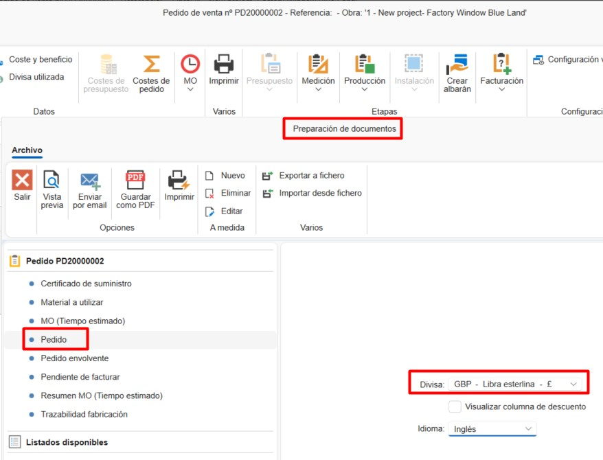
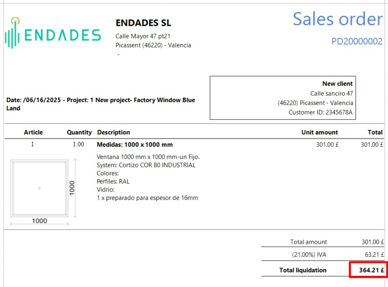

# 7. Divisas

---

## 1. Introducción

Este manual explica paso a paso cómo utilizar divisas en ENBLAU y cómo reflejarlas correctamente en los informes, respetando la paridad de cada moneda.

---

## 2. Definición de divisas

Desde el apartado **Divisa**, puedes definir la paridad entre monedas.  
Por ejemplo:

- **Divisa de aplicación: EUR**
- **Paridad definida:** 1 € = 0.86 £ (**GBP**)

Esto permite trabajar con múltiples monedas en los documentos de ventas.

  

---

## 3. Aplicación en los informes

Para utilizar una divisa en documentos de venta (como un pedido):

1. Selecciona la **divisa deseada** (ej. GBP – Libra esterlina).
2. Opcionalmente, elige también el **idioma** del documento.
3. Imprime el informe.

El sistema aplicará automáticamente la conversión de valores según la paridad definida en ese momento.

  

---

## 4. Divisa utilizada

La opción **Divisa utilizada** permite conservar un histórico de las paridades aplicadas en cada documento.

Esto resulta útil para:

- Mantener la paridad original sin necesidad de modificarla manualmente.
- Asegurar coherencia en documentos históricos, incluso si la tasa de cambio ha cambiado posteriormente.

### ¿Cómo usarla?

1. Abre un documento de venta (ej. un pedido).
2. Ve al apartado: **Datos → Divisa utilizada**.
3. Se abrirá la ventana **Divisas del documento**.
4. Marca la casilla en la columna **Utilizada** para aplicar la paridad correspondiente a la fecha seleccionada.

---

> **Nota:** Esta funcionalidad es especialmente útil para documentos con fechas antiguas o para operaciones que requieren conservar la tasa de cambio original.
