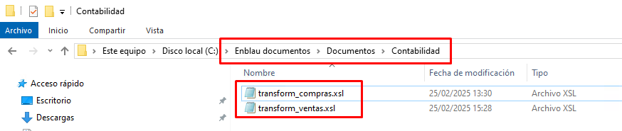

# 8. Requerimiento para importación programa de contabilidad

## 1. Objetivo

Establecer los requerimientos técnicos necesarios para que ENBLAU pueda generar archivos compatibles con el programa de contabilidad, utilizando transformación de datos mediante **XSLT** y exportación a formatos específicos, con las codificaciones aceptadas.

---

## 2. Requerimientos generales

### 2.1. Formato de Entrada

- El sistema externo deberá generar archivos en formato **XML** como base para la transformación.
- El archivo XML debe cumplir con la estructura establecida en el esquema XSD (si aplica).
- Se debe proporcionar un protocolo claro de mapeo de campos.

### 2.2. Transformación

- La transformación del XML a formato de importación será realizada mediante un archivo **XSLT** proporcionado por el proveedor o desarrollado internamente.
- El archivo XSLT debe cumplir con la especificación 1.0 o 2.0 según compatibilidad con el motor XSLT del sistema.

### 2.3. Formato de exportación

- El resultado de la transformación debe generarse en uno de los siguientes formatos, según lo definido para cada tipo de operación contable:

   | Tipo de Archivo | Descripción                         |
   |-----------------|-------------------------------------|
   | `.dat`          | Formato de texto plano estructurado |
   | `.txt`          | Texto delimitado (ej. tabulador, coma) |
   | `.xml`          | Estructura XML compatible            |
   | `.xlsx`         | Hoja de cálculo (Excel)             |

### 2.4. Codificación de texto

- La codificación de los archivos debe ser una de las siguientes, según el tipo de archivo:

   | Codificación | Recomendado para |
   |--------------|------------------|
   | ANSI         | `.txt`, `.dat` antiguos |
   | UTF-8        | `.xml`, `.txt` modernos |
   | UTF-16       | `.xml` con caracteres especiales |
   | UNICODE      | General para archivos multilenguaje |

---

## 3. Protocolo de integración

### 3.1. Enlace de la plantilla XSLT

El proveedor del sistema contable deberá proporcionar el archivo XSLT base y la documentación con el protocolo con el formato del fichero para realizar la transformación. 

### 3.2. Especificación de Mapeo de Campos

   Debe entregarse un documento que detalle:

   - Nombre del campo en el sistema origen
   - Posiciones
   - Longitud (caracteres)
   - Tipo de dato (numérico, texto, fecha)
   - Formato requerido (ej: `dd/MM/yyyy`, `#,##0.00`, etc.)

**Ejemplo de tabla de mapeo:**

A continuación se detalla la estructura esperada para el archivo de importación según el **Tipo de registro = 0**, correspondiente a **Alta de Apuntes sin IVA**.

    | Posiciones | Longitud (caracteres)  | Descripción del Campo     | Comentarios                                                               |
    |------------|------------------------|--------------------------|----------------------------------------------------------------------------|
    | 1          | 1                      | Tipo de Formato          | Constante `5`                                                              |
    | 2 a 6      | 5                      | Código de empresa        | Valores entre `00001` y `99999`                                            |
    | 7 a 14     | 8                      | Fecha del apunte         | Formato `aaaammdd` (Ejemplo: 1 de febrero de 2000 → `20000201`)            |
    | 15         | 1                      | Tipo de Registro         | Constante `0`                                                              |
    | 16 a 27    | 12                     | Cuenta                   | Nivel 6 a 12. Si no existe la cuenta, se dará de alta automáticamente.     |

> **Observaciones**:

- Este formato debe generarse como un archivo de texto plano (`.txt` o `.dat`) con codificación **ANSI**.
- Los campos deben ocupar exactamente las posiciones indicadas. No debe haber delimitadores.
- Todos los registros deben cumplir con la estructura de longitud fija para ser válidos.

---

## 4. Transformación desde XML con XSLT

La estructura anterior puede generarse a partir de un archivo XML de entrada, transformado con una plantilla XSLT. Se recomienda que el archivo XML tenga los siguientes nodos mínimos:

### 4.1. Ejemplo de Archivo Generado

A continuación se muestra un ejemplo de línea generada para el archivo `.dat` con formato de ancho fijo según los campos definidos:

1. **Valores de ejemplo:**

    - Tipo de Formato: `5`
    - Código de Empresa: `00001`
    - Fecha del Apunte: `20250728` (28 de julio de 2025)
    - Tipo de Registro: `0`
    - Cuenta: `430000000001`

2. **Resultado en el archivo `.dat`:**

500001202507280430000000001

- **Detalle por secciones:**

    | Posiciones | Contenido      | Descripción           |
    |------------|----------------|------------------------|
    | 1          | `5`            | Tipo de Formato       |
    | 2 a 6      | `00001`        | Código de empresa     |
    | 7 a 14     | `20250728`     | Fecha del apunte      |
    | 15         | `0`            | Tipo de Registro      |
    | 16 a 27    | `430000000001` | Cuenta                |

> ⚠️ **¡Importante!**   
- No se deben incluir separadores, espacios adicionales, ni saltos de línea entre campos.  
- Cada línea representa un registro. Si hay múltiples apuntes, deben ir en líneas separadas, una por registro.

- **Ejemplo con varios registros:**

    500001202507280430000000001

    500002202507280410000000010

    500003202507280460000000050

---

## 5. Validaciones previas

- El archivo XML debe pasar validación estructural (bien formado y, si aplica, válido contra XSD).
- La salida del XSLT debe revisarse para asegurar compatibilidad con el formato de importación contable.

---

## 6. Proceso de importación y exportación desde ENBLAU

1.	Descarga los dos archivos .xls (ventas y compras) proporcionado por Endades, guárdalos en la siguiente ruta: **Enblau Documentos\Documentos\Contabilidad**. (Recomendamos esta ubicación porque es una carpeta compartida). Si la carpeta Contabilidad dentro de Documentos no existe, créala.

    

2.	Abre ENBLAU y dirígete a:
    - Ventas → Documento de venta → Exportar → **Contabilidad**.

        

3.	Se abrirá una ventana de Contabilidad.
    - Haz clic en Añadir una línea.
    - Se abrirá el explorador de archivos para seleccionar la ruta donde se encuentra el archivo ejemplo: **transform_ventas.xls**.

        

4.	Se generará automáticamente una línea con el nombre Contabilidad 1 (puedes editarlo, por ejemplo, Contabilidad Ventas).
5.	Seleccionar los parámetros:
    - Extensión: .dat, .xlsx, .txt o .xml. 
    - Codificación: ANSI, UNICODE, UTF-8 o UTF-16.
6.	Se mostrará la ruta donde se exportará el archivo en el formato de la extensión escogida.

    

7.	Luego Exportar el fichero:

    

    -  En la ruta de exportación (en este caso, la misma que la del fichero de exportación), verás que se ha generado un archivo con la información de la factura de venta.
    - Si tienes algún filtro aplicado en el listado de documentos de ventas, solo aparecerán los datos que cumplan con ese filtro.
    - El archivo exportado tendrá el formato según la extensión seleccionada y el fichero .xsl que aplica la transformación del archivo (en la ruta fichero de explotación). Ejemplo:

        
    
    - Una vez hayas exportado el fichero en el formato correcto desde ENBLAU, el siguiente paso es importarlo en el programa de contabilidad que estéis utilizando.

---

**Observaciones**

- Cualquier cambio en el formato fuente XML o en la estructura del archivo XSLT debe ser documentado y validado antes de ser implementado en producción.
- Es recomendable mantener un control de versiones tanto de los XSLT como de los esquemas XML.

---

