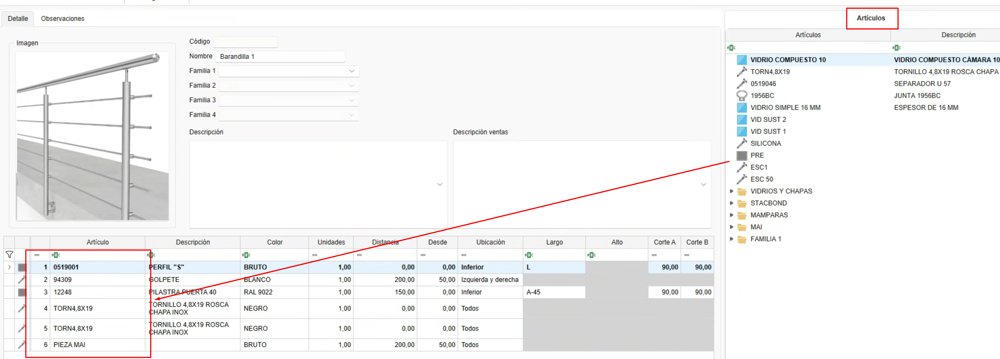

# 7. Divisas

---

## 1. Introducción

Este manual explica paso a paso cómo utilizar la funcionalidad de Escandallos. Los escandallos se define desde ENBLAU agrupando materiales propios creados desde enMATERIALS. Además se puede agrupar esos materiales y generar las unidades necesarias según algunas condiciones como las dimensiones, la ubicación de los tramos, distancia y fórmulas.

---

## 2. Escandallos

- Acceder a los escandallos desde Almacenes-**Escandallos**.

    

---

### 2.1. Creación de Escandallos

- Para crear un escandallo seguir esos pasos.

    1. Desde el listado de escandallo, seleccione el botón Nuevo para la creación de un nuevo escandallo

        

    2. Te abrirá una ventana donde hay que definir los siguientes campos:

        - **Nombre**: En ese campo se define el nombre del escandallo que has creado.
        - **Familia**: Ese es un campo opcional donde se indica las carpetas y sub carpetas que quieres añadir los escandallos. Ese campo luego se reflejara en el árbol de escandallos desde el apartado de documentos de ventas. 
        - **Descripción**: Una descripción del escandallo.
        - **Descripción ventas**: Indicar aquí si la descripion para ventas es distinta que la descripcion del escandallo.
        - **Imagen**: Se puede añadir un imagen o captura para el escandallo.

            

---

### 2.2. Agrupar materiales

- Una vez creado el escandallo los siguientes pasos para la agrupacion y generacion de materiales son la seguinte:

    1. Desde el arbol de articulos a la derecha arrastrar los materiales que hay que generar para ese escandallo.

        

    2. Luego definir los las seguintes condiciones según necesario:

        - **Unidades**: Indicar las unidades que es necesario generar del material.
        - **Distancia**: Indicas a cada cuanto del trama es necesario generar el material. ej: 1 tornillo a cada 100mm del tramo.
        - **Desde**: Indicas junto a Distancia apartir de cuanto empieza a contar. 
        - **Ubicación**: Despliega un listado para indicar la ubicacion del tramo donde es necesario genera el material. ej: Superior, inferior, derecha, izquierda..
        - **Largo**: En el largo puedes indicar una longitud fija o usar una fórmula. Ej: L-50 --> Calcula la longitud de la barra menos 50mm. 
        - **Alto**: En el alto puedes indicar una altura fija o usar una fórmula. Ej: A-50 --> Calcula la altura de la superficie menos 50mm.
        - **Corte A**: Puedes indicar el corte dl lado de la barra **A** a cuanto va . ej: Corte a 90 o 45.
        - **Corte B**: Puedes indicar el corte dl lado de la barra **B** a cuanto va . ej: Corte a 90 o 45.

            
        
> **Nota:** Los campos se activan dependiendo del tipo de cálculo del material, pieza, barra, junta o superficie.

---

## 3. Como usar escandallos

