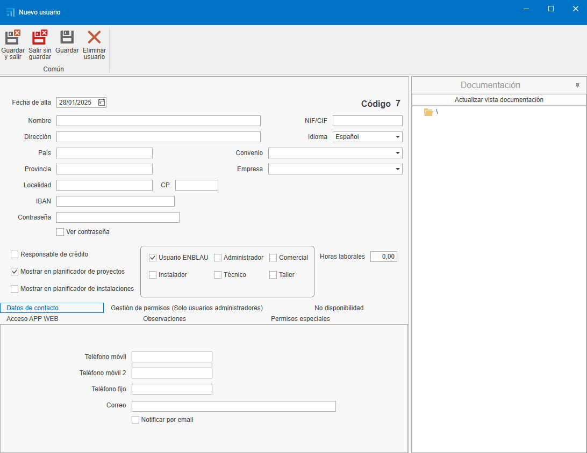
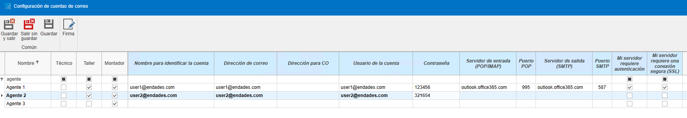
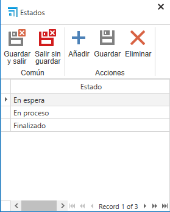
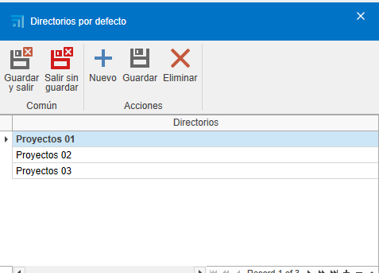
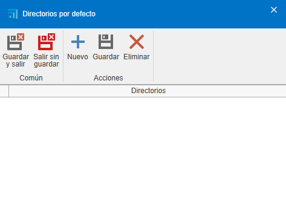

# Initial Configuration of [ENBLAU](https://endades.com/en/software-eng/software-enblau/) 

---

## 1. Purpose

This manual is designed to guide new users through the initial setup of ENBLAU. This setup includes everything necessary for the client to carry out sales, purchases, and invoice issuance.

---

## 2. General Setup

  

### 2.1. Connection Setup with Logikal

- To connect with the factory and Logikal projects, it is necessary to indicate the installation path and the Logikal DLL (network drive where Logikal points).

- From **General**, go to **Logikal - Connection and Projects**.

  

- To connect to the factory in Logikal, go to the bottom of the main window of **ENBLAU**, right-click on **Factory connection** and select **Connect**.

  

---

### 2.2. General

- **Storage path**: Indicate the path where ENBLAU and Logikal documents will be stored (network drive). Example:

  

  > **Note:** It is recommended to use a network drive. If one does not exist, create it.

- **Company information**: Fill in the required fields with company information such as name, VAT number, address, logos, etc.

  

---

### 2.3. Sales Texts

- Add texts for sales documents, such as observations, conditions, etc.

  

  Example order report:

    

---

## 3. User Management

- To register new users, go to **Users**.

  

- In **New**, you can create new users.

  

- A window will open to configure user information (name, address, email, phone, etc.), user type (Technician, Sales, Workshop, etc. – more than one type can be assigned), and permissions. Permissions can only be assigned by administrator-type users.

  

- Once registered, the user can be edited at any time.

---

## 4. Email Account Setup

- To configure the user’s email account, go to **User Email:** 

  

  

- To configure each user’s email accounts, go to **Email Accounts:** 

  

  

- From each section, you can configure the email, username, signature, and IMAP/SMTP incoming and outgoing server. The server and port setup must be properly defined according to your provider. This way, emails can be sent and received from reports or notifications depending on your setup.

### 4.1. General Email Setup

- From **General** - **Emails** you can define default copies, subject, and email sending mode.

  

    

### 4.2. Possible Microsoft Authentication Errors

- When trying to send an email, you may encounter this type of error.

  

  **LOG**  
    Error: 535: 5.7.139 Authentication unsuccessful, SmtpClientAuthentication is disabled for the Tenant. Visit [Authenticated SMTP submission in Exchange Online](https://learn.microsoft.com/en-us/exchange/clients-and-mobile-in-exchange-online/authenticated-client-smtp-submission) for more information.

  The error is related to email account authentication. This can occur due to a Microsoft 365 security protocol change.

  - **Solution:** Contact the responsible person with permissions from the Microsoft 365 Admin Center. Follow the steps in the link above from Microsoft Exchange Online to configure the Outlook account so that emails can be synced from another app.

    

    Ensure that all checkboxes are ticked in the **Manage email apps** section for users in Microsoft 365.

    

> **Note:** For Microsoft Exchange emails, it is recommended that in **Email sending mode** under General, the option **Sending mode 2** is selected.

  

---

## 5. Company Management

- If you have multiple companies, you can create them in **Companies**, under **Add**. Then, fill in the information in **General** and **Sales Texts** as required for each company.

  

  

  > ⚠️ **Important!** If no other company is indicated, projects will default to the company previously added in the basic setup under **General**. If you are going to invoice using **facturae**, the company information must be included in the **Companies** section.

---

## 6. Project Setup

- From **Sales**, select **Projects**, then go to **Setup**.

  

  

- From the setup, you will access a dropdown list for configuration. For an initial setup, it is necessary to configure **Statuses** and **Default Directories**.

  

### 6.1. Statuses

- By selecting **Statuses**, a window will open to define the project (job) statuses.

  

### 6.2. Default Directories

- By selecting **Default Directories**, a window will open to define the necessary directories in the project (job) folder.

  

>**Note:** Default directories are folders that can be configured to be automatically generated with each project.

---

## 7. Sales Setup

- From **Sales**, select **Sales Documents**, then go to **Setup**.

  

  

- From the setup, you will access a dropdown list for configuration. For an initial setup, it is necessary to configure **Numbering**, **Payment Methods**, **Banks**, **Payment Modes**, **Breakage Concepts**, **Classifications**, **Taxable Persons (VAT)**, and **Default Directories**.

  

### 7.1. Numbering

- By selecting **Numbering**, a window will open to define document numbering types for sales documents, assigning sequential numbers.

  

  - Example: Document type "Quote", prefix (Alpha) and number (next number) - **PR1000272**.

  

### 7.2. Payment Methods

- By selecting **Payment Methods**, a window will open to define payment methods necessary to generate due dates in invoices.

  

  - Example: Indicate the number of installments and the percentage the client must pay at each due date.

  

### 7.3. Banks

- By selecting **Banks**, a window will open to enter bank information. The name and a code.

  

### 7.4. Payment Modes

- By selecting **Payment Modes**, a window will open to define the different ways a due payment can be collected.

  

### 7.5. Breakage Concepts

- By selecting **Breakage Concepts**, a window will open where you can add the different concepts to be used when recording a breakage (e.g., "manufacturing defect", "breakage during transport", etc.)

  

### 7.6. Classifications

- By selecting **Classifications**, a window will open to define quote classifications.

  

  The classification serves the purpose of grouping and filtering documents in the Sales Documents list.

### 7.7. Taxable Persons (VAT)

- By selecting **Taxable Persons (VAT)**, a window will open to define taxable person types.

  

### 7.8. Default Directories

- By selecting **Default Directories**, a window will open to define the necessary directories in the documentation folder.

  

> **Note:** Default directories are folders that can be configured to be automatically generated with each documentation.

---

## 8. Purchase Setup

- From **Purchases**, select **Purchase Documents**, then go to **Setup**.

  

  

- From the setup, you will access a dropdown list for configuration. For an initial setup, it is necessary to configure **Numbering**, **Payment Methods**, **Classifications**, and **Default Directories**.

  

### 8.1. Numbering

- By selecting **Numbering**, a window will open to define document numbering types for purchase documents, assigning sequential numbers.

  

  - Example: Document type "Order", prefix (Alpha) and number (next number) - **PE70000082**.

  

### 8.2. Payment Methods

- By selecting **Payment Methods**, a window will open to define payment methods necessary to generate due dates in invoices. You will see it is the same window configured from the Sales Documents setup.

  

### 8.3. Classifications

- By selecting **Classifications**, a window will open to define purchase classifications. Here you can define classification types:  
  • Breakages  
  • Additional materials  
  • Standard order (by default, when an order does not correspond to the above)

    
    
This setup is important so that data is reflected correctly when performing a project cost study.

### 8.4. Default Directories

- By selecting **Default Directories**, a window will open to define the necessary directories in the documentation folder.

  

> **Note:** Default directories are folders that can be configured to be automatically generated with each documentation.

---

## 9. Notification Management

ENBLAU allows setting up automatic notifications associated with different system processes. These notifications can improve traceability and internal communication.

---

### 9.1. When Are Notifications Generated?

Notifications can be triggered by events such as:

- Payment of the first invoice.
- Sending a production to the production queue.
- Other processes defined by the workflow.

---

### 9.2. Notification Setup

These notifications are fully configurable from the Notifications and Processes section:

- They can be directed to a specific **role** (e.g., Sales, Technician, Production) or to a **specific person**.
- They can be automatically associated with users linked to **specific projects**.

  
  

---

### 9.3. Where Are Notifications Received?

Notifications can be received through different channels:

- **ENBLAU home window**  
- **enSITE mobile app**  
- **Email**, if the corresponding option is enabled

> ⚠️ In some cases, it may not be convenient for them to arrive via email, so you can choose to display them only inside ENBLAU or enSITE.

---

### 9.4. Email Sending

For notifications to reach the user’s email, the corresponding checkbox must be marked in their profile:

---

> **Note:**  
> Notifications are generated based on processes executed by users within the system.

## 10. Conclusion

By following this manual, you will be able to complete the initial setup of ENBLAU for creating purchase and sales documents.
