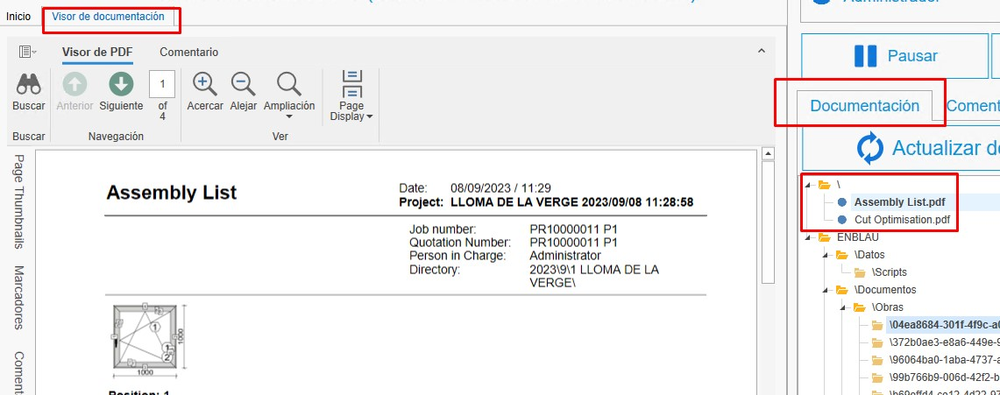

# Initial Configuration of enCONTROL

---

## 1. Purpose

This manual is designed to guide new users through the initial configuration of enCONTROL. This setup includes everything needed to start production.

---

## 2. Configuration in enCONTROL

Access the enCONTROL configuration (F10) as an administrator user. This process may take some time depending on the number of workstations that need to be connected to the network.

### 2.1. Various

- **Show bar column in machining**

  

  - If the value is **Yes**, the bar column will be shown on the monitor.

    

  - If the value is **No**, only the column of pending machining will be displayed on the monitor.

    

>**Note:** By default, this value is set to Yes.

  
- **Cut full bar in cutting monitor**

  

  - If the value is **Yes**, when cutting the bar in the monitor, all the positions of the indicated bar will be automatically cut without needing to cut each position individually. 

  - If the value is **No**, when cutting the bar in the monitor, it will be done position by position.

>**Note:** By default, this value is set to Yes.

- The mode in which profiles, fittings, and accessories are deducted from stock as production progresses is defined here.

  

  - **Do not deduct**: Nothing is deducted.
  - **Deduct from project**: Deducts only from the project, regardless of the zone.
  - **Deduct from zone, otherwise from project**: Deducts from the indicated zone and the project.
  - **Deduct from zone**: Deducts only from the indicated zone, regardless of the project.
  - **Deduct from project, otherwise from any zone**: Deducts from the project and any zone.

- In **Generic documentation path**, you can indicate documentation such as system information, among others, that can be viewed from enCONTROL and the workstations.

  

  Example on a workstation:

  

---

### 2.2. Workstations

- In "**Workstations**", define the devices associated with each workstation connected to the network.

  

---

## 3. Production Configuration in ENBLAU

### 3.1. Production Layout Configuration

The **production layout configuration** allows you to define the organizational structure of the plant within the **enCONTROL** module, including plants, production lines, and workstations.

- Access the menu: **Configuration → Production → Layout Configuration**.

   

- From the **Production Layout** interface, you can add:

  - **Plant**
  - **Production line**
  - **Workstations**

   

- When selecting a production line, the section **Line Schedule** will appear on the right-hand side. Here, you can configure:
 
  - Operational days of the week.
  - Start and end times for each shift.

   

- When adding a new workstation, the following fields must be defined:

  - **Type**: Indicates the type of workstation to add (e.g., Cutting, Assembly, Machining, etc.).
  - **Order**: Defines the sequential order of the workstations within the line.

    

- In the **User** field, you can assign the person responsible for the workstation. This user will be in charge of operating or supervising that workstation within the production flow.

  

> **Recommendation:** Always keep this configuration updated to ensure accurate production control aligned with the plant’s operational reality.

---

### 3.2. Production Classifications

Production classifications are used for informational purposes when creating a production order so that they are reflected in the workstation lines within enCONTROL.

- Access the section Sales - Configuration - **Classifications**.

  

- From "Classifications", create the necessary classifications and indicate the line and enCONTROL workstations.

  

- When creating a production order from a sales order, you will see a classifications dropdown where you can specify the classification for that production.

  

---

### 3.3. Logikal Production Reports

- Reports that are required and automatically generated are saved as Logikal documentation in production. These documents will appear in the documentation path on enCONTROL workstations.

- In the budget (production), go to the Logikal section - **Reports for Production**. From there, mark the reports you want to be saved in production as documentation in the **For documentation** column.

  

> **Note:** For documentation purposes, do not modify anything in the **Export** and **Management** columns.

---

### 3.4. Additional Information

Additional information is an informative field for when production enters the workshop queue in enCONTROL, so that the workshop supervisor can review it.

- Access the section Sales - Configuration - **Additional Production Information**.

  

- From "Additional Production Information", create the necessary additional information items.

  

- When creating a production order from a sales order, you will see a dropdown for additional information where you can specify how that information should appear in the production queue.

  

  

---

## 4. Conclusion

By following this manual, you will be able to perform the initial configuration of enCONTROL for use in production creation.
