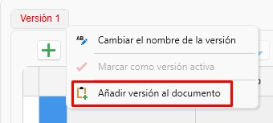
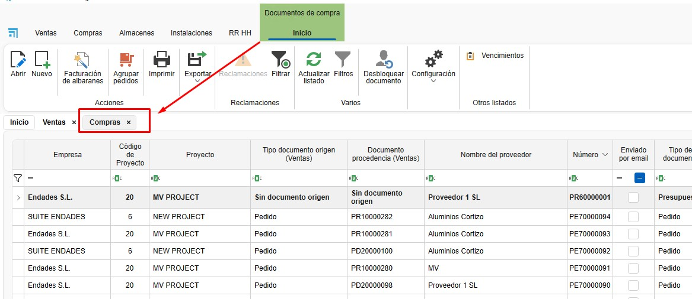
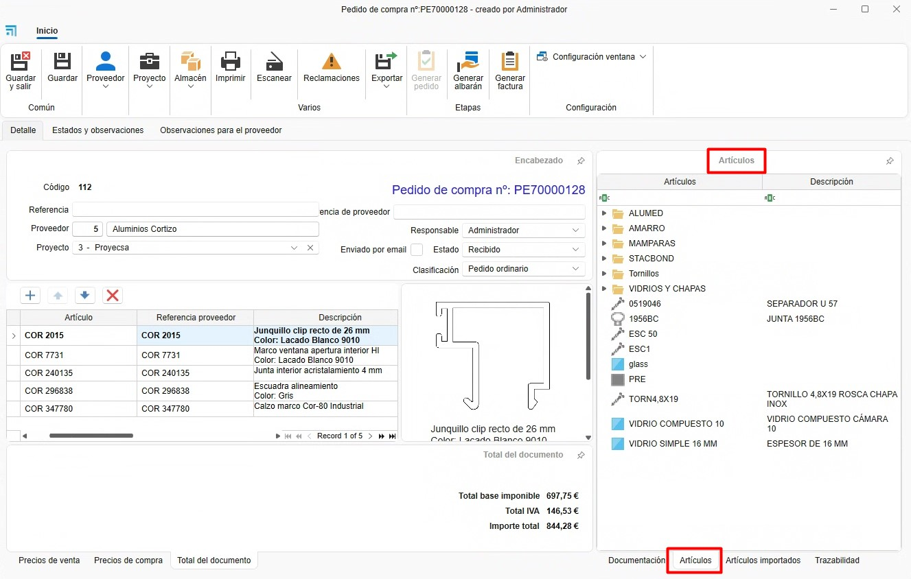

# Sales and Purchases

---

## 1. Introduction
This guide is designed to help users work with ENBLAU's sales and purchasing system. Based on the training provided, it covers the key processes from creating projects through managing orders, purchases, and production.

---

## 2. Process Overview
Once you are in the module, you'll see two main sections:

### 2.1 Sales
- **Sales documents**: Management and listing of quotes, orders, delivery notes, and invoices. Creation of projects and customers.
  
  

### 2.2 Purchasing
- **Purchase documents**: Management and listing of purchase orders and material receipts. Creation of suppliers.

  

> **Note:** To create sales and purchase documents, you must have **projects, customers, and suppliers** set up. For more information see: [4. Project, customer and suppliers](6.PR_Proyecto_cliente.md).

---

## 3. Sales
In the Sales area you will find Projects, Sales Documents, and Customers.

### 3.1 Sales Documents
- When you open **Sales Documents**, a list of all sales-related documents will appear.

  

#### 3.1.1 Document types
- To create a new document, click **New** on the top ribbon.

  

- A **New sales document** window will open.

  

- From here you can create different types of sales documents such as Quote, Order, Delivery Note, or Invoice.

  

- When you select the document type some fields may be auto-filled (Salesperson, Responsible, Numbering, etc.). These fields are editable.

  

- Other fields like Project and Customer can be configured to auto-fill based on the project.

  

- On the top ribbon you can change the customer or add a new customer or project.

  

### 3.2 Quote
- When creating a new quote, a window will open showing the sales quote number.

  

#### 3.2.1 Document data
- In this section you can view and modify certain fields of the quote.

  

#### 3.2.2 Details
- Add line items for the quote version here.

  

- You can add an empty line item or add one from Logikal (make sure you're connected to the factory).

  

- If you add a line from Logikal, the Logikal **Line type** configuration window will open.

  

> ⚠️ **Important**: To add a line from Logikal, ensure you are connected to the factory.

  

- Once configured, the line will be added in ENBLAU.

  

#### 3.2.3 Logikal
- From here you can create a project or link an existing Logikal project.

  

- When linking a project, a window will open showing the available projects in Logikal.

  

- You can create different versions of the quote. Right-click the *Version 1* tab or use the Quote dropdown on the top ribbon.

  
  

- A **New quote version** window will open where you can choose to copy the lines from the active version or start a blank version.

  

- To edit a Logikal line, press **Ctrl + double-click** on the line you want to edit.

> **Note:** Version tab names are editable — right-click the tab and choose *Rename version* to change it.

> ⚠️ **Important**: To create or link a project from Logikal, make sure you are connected to the factory.

  

### 3.3 Order
#### 3.3.1 Create order
- Once a quote version is created and accepted, the next step is to convert it to a customer order.

  
  

#### 3.3.2 Edit line
- From the order you can edit or add lines, list materials, create measurements, productions, etc.

  

#### 3.3.3 Delivery note
- From the Order stage you can create a delivery note and indicate the units to be delivered.

  

> **Note:** Order document fields can be modified, just like other sales documents.

### 3.4 Measurement
#### 3.4.1 Create measurement
- You can create a measurement from the order.

  

#### 3.4.2 Select lines
- When creating a measurement, the **New measurement phase** window opens where you can select lines for the measurement phase.

  

#### 3.4.3 Measurement phase
- A measurement phase is created where you can edit measurements without affecting the order.

  

#### 3.4.4 Delivery note
- From the Measurement phase you can create a delivery note and indicate the units to be delivered, same as from the order.

> **Note:** Measurement document fields can also be modified.

### 3.5 Production
#### 3.5.1 Create production
- The production phase can be created from the order or from a measurement.

  

#### 3.5.2 Select lines
- When creating a production, the **New production phase** window opens where you can select lines for production.

  

- When you accept, a prompt will ask if you want to send the job to production.

  

#### 3.5.3 Production phase
- A production phase is created where you can edit the line before sending it to production without affecting the order.

  

#### 3.5.4 Delivery note
- From the Production phase you can create a delivery note and indicate the units to be delivered, the same way as from the order.

> **Note:** Production document fields can be modified as with other sales documents.

---

## 4. Purchasing

### 4.1 Purchase orders
#### 4.1.1 From a quote
- Accept a quote to generate a customer order.

#### 4.1.2 Required materials
- Go to the "Material Needed" tab to list required materials.

  

- When listing materials you will see the Items and Units to purchase columns highlighted in green and red. Green indicates there is enough stock for that project; red indicates there is not enough.

  

- You can choose whether to purchase items by checking or unchecking the *Buy* checkbox.

  

> ⚠️ **Important**: To list materials from a Logikal project, make sure you are connected to the factory.

  

#### 4.1.3 Generate purchase order
- Select materials and generate the purchase order using **Request material**. A **New purchase document** window opens where you can change some default fields and select the supplier.

  

- Assign a supplier and send the order.

  

#### 4.1.4 Purchase order
- Once the purchase order is created you can review and modify it as needed (supplier, project, quantities, etc.).

  

#### 4.1.5 Export to Cortizo Center
- After creating the purchase order you can export it to Excel format so it can be uploaded to Cortizo Center.

  

#### 4.1.6 Claims

Once a **purchase order** has been generated, you have the option to manage **Claims** directly from the system.

- You can add a claim associated with the order from its card:

  

- It is also possible to **send the claim automatically by email**, speeding up communication with the supplier:

  

- The system stores an **automatic history** of claims. You can also add manual entries to document the **follow-up** of the claim.

  

**Note:** Properly tracking claims improves traceability of incidents with suppliers and helps purchasing quality management.

#### 4.1.7 Purchase documents
- From the Purchasing area you can access the purchase list and Suppliers.

  
  
  

#### 4.1.8 Items and Imported Items

- In the purchase order under the **Detail** tab on the right-hand ribbon, you'll find sections at the bottom called **Items** and **Imported Items**. Items can be added to the purchase order by dragging the material into the list.

  - **Items**: Materials created locally in the **MATERIAL** module.

  

  - **Imported Items**: Materials imported from Logikal projects. These materials are stored and updated each time materials are listed from Material Needed. They are the same materials also found in Warehouse **Imported Materials**.

  

### 4.2 Material reception
#### 4.2.1 Goods received note
- Generate a goods received note when receiving materials.

  

#### 4.2.2 Units received
- Indicate the units received in the *Units to deliver* column.

  

---

## 5. Additional material and breakages

### 5.1 Additional material
- Additional materials can be added to an order, measurement, or production. You can add locally created materials from enMATERIALS or imported items from Logikal. For more information on creating local materials, see: [2. Creating own materials in enMATERIALS](/Utilidades/2.UT_Crear_Materiales_enMATERIAL).

  

#### 5.1.1 Add material
- Drag additional material from the Items tree (materials created in enMATERIAL).

  

- You can also drag from **Imported Items** from Logikal.

  

- Add text lines as needed.

  

- After adding additional materials you can generate a purchase order to the supplier.

  

- You can generate a shipping delivery note for additional material.

  

#### 5.1.2 Costs
- Additional material is recorded as a project cost but is not budgeted to the customer.

### 5.2 Breakages
#### 5.2.1 Add to breakages
- From the "Material Needed" section, right-click the material and select **Add to breakages**.

  

- The material will be added to the **Breakages** section. In the *Concept* column you can indicate the reason for the breakage by selecting from a predefined list configured in [7.5. Breakage concepts](/Configuraciones/1.%20CO_Configuracion_Inicial_ENBLAU/#75-conceptos-de-roturas).

  

- As with Additional Material you can add Items (local materials) and Imported Items. You can also generate a purchase order and delivery note.

  

- Ensure that the classification for breakages is correctly configured in [8.3. Classifications](/Configuraciones/1.%20CO_Configuracion_Inicial_ENBLAU/#83-clasificaciones).

> **Note:** The process to add and request additional materials or breakages can also be done from the Projects area.

---

## 6. Traceability

### 6.1 Traceability tree
- Shows the full traceability of a document from the quote through to production. For example, from a quote (e.g., #483) to its production release.

  

### 6.2 View
- Click any document to view its traceability in the right-hand panel.

  

---

> **Filter management** Use filters and custom filters to optimize searches in lists. For more information, see: [4. Filter management](/Utilidades/4.UT_Gestion_Filtros/)

---

## 7. Frequently asked questions

### 7.1 How do I handle post-sale issues?
- **Option 1**: Create a new quote.
- **Option 2**: Create a customer order with a zero amount and send it to production.

### 7.2 How do I add additional material?
- Drag the additional material from the tree and generate a shipping delivery note.

### 7.3 How do I receive materials partially?
- When generating a delivery note, indicate the units received. You can create multiple delivery notes for the same order.

---

This guide is intended to help you navigate and use ENBLAU's sales and purchasing system efficiently. For more details, watch the training video or contact technical support.