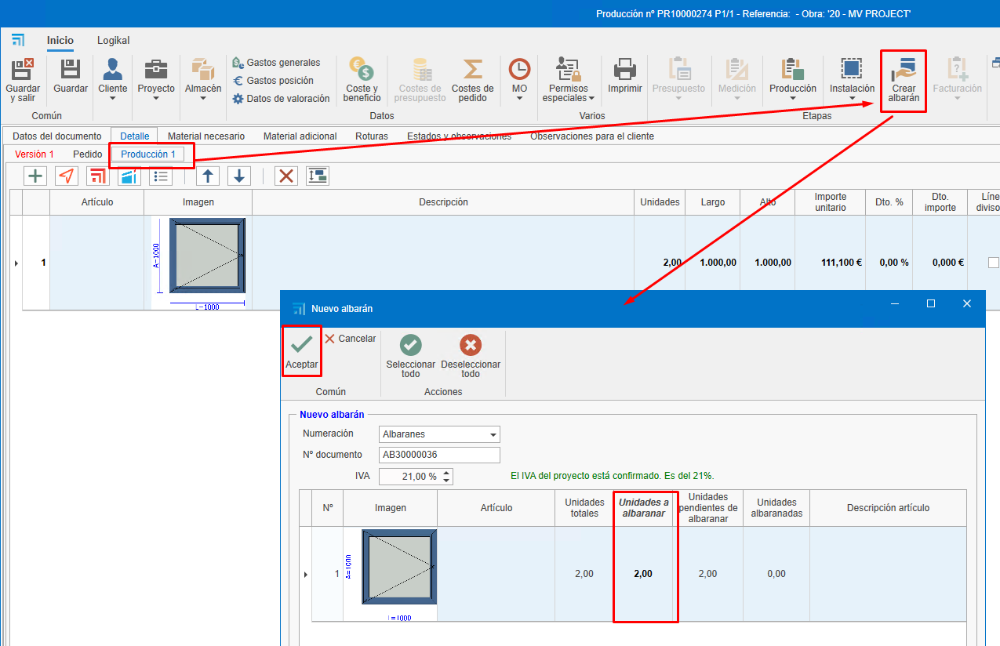
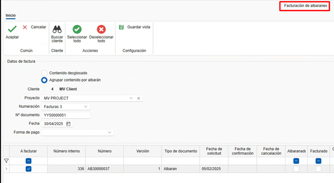
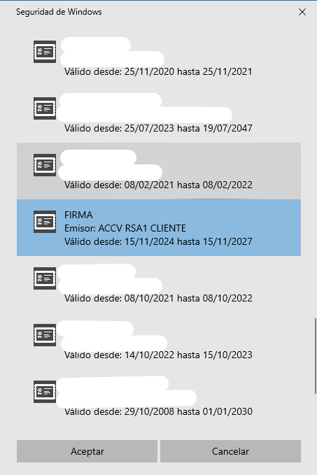

# Invoicing

---

## 1. Introduction
This guide explains how to create, edit, and manage invoices. You will learn how to use filters, create invoices from quotes, manage receipts, and perform necessary adjustments.

---

## 2. Creating invoices from quotes
To create invoices from quotes, follow these steps:

### 2.1 Create a quote

- Add line items with products or services (e.g., windows, sheets).
- Define quantities and prices.

    

### 2.2 Generate the invoice

- Go to the invoicing section.
- Select "Create invoice" from the quote.

    

- Choose the invoice type:

    - **Advance invoice**: Allows you to charge a partial amount now and invoice the remainder later.

        

    - **Unit-based invoice**: Invoices only the specified units you want to bill. The system will require you to continue invoicing in the same mode (this is the default selection).

        

    - **Enter amount to invoice**: Lets you charge a specific amount of the invoice total and continues invoicing in the same mode.

        

    - **Enter percentage to invoice**: Lets you charge a percentage of the total invoice and continues invoicing in the same mode.

    

    - __Invoice to origin__ is an invoice by certificate.

### 2.3 Send the invoice to the customer

- Once created, you can preview the invoice before sending or printing it.

    

    

    

- Send the invoice to the customer by email or print it.

    

> **Note:** An invoice can be generated from a quote, order, or delivery note. It's recommended to consistently generate invoices from the same source document (for example, from the order if that is what's agreed with the customer) for better management and traceability.

### 2.4 Status & notes

- When creating the invoice, the **Status & notes** tab shows fields such as Date, Due dates, Withholding, Special Regime (RE), and Prompt Payment Discount.

---

## 3. Managing receipts (payments)

To manage invoice receipts:

### 3.1 Mark invoices as paid

- From the invoice document itself you can mark the invoice as paid.

    

- Another option is to access the due list from "Sales documents."

    

- Filter invoices pending payment.

    

- Select invoices and mark them as paid. To select multiple invoices use **Ctrl + Click** or **Ctrl + A** to select all.

    

- Indicate the payment method (transfer, promissory note, etc.), payment date, and the date of deposit to the account. Fields highlighted in red are required. These fields can be preconfigured in the "Payment methods" section.

    

    > **Note:** Filters are available in this and other document lists as needed.

- In the sales documents list, the quote traceability will reflect the invoice status as "Paid."

    

### 3.2 Payment reports

- Accept the quote so that it generates an order (if you invoiced from the quote).

    

- Use the "Invoicing and receipts status" report to view invoice statuses (paid, pending, billing percentage, etc.). Filter by the quote you want to display.

    

    

- Use the invoice list report to see invoice details (date, customer, taxable base, VAT, invoice total, etc.). This report can be generated for a date range or by checking a box to apply only to filtered invoices.

    

    

    

---

## 4. Invoicing from orders

To invoice from orders, follow these steps:

### 4.1 Invoicing from an order

- You can invoice directly from "Order" following the same steps as for a quote.

- Another option is to create a production from an order and indicate how many units (e.g., windows) should be in that production phase.

    

    

    

- Once you confirm the produced units in a phase like "Production 1", go to the order and create an invoice indicating the quantity to bill.

    

> **Note:** It is recommended to invoice from the order since that typically reflects what was agreed with the customer.

- If you subtract the entire invoice amount (unit) and you previously issued and collected an advance invoice, when confirming the invoice you will be prompted to confirm whether to apply the advance.

    

- On confirmation, the advance will be deducted from the invoice.

    

- When generating the invoice to send to the customer, you'll see details of amounts charged and discounts applied.

    

---

## 5. Invoicing from delivery notes

If you work with delivery notes, follow these steps:

### 5.1 Create delivery notes from orders

- Generate delivery notes for completed productions.

    

> **Note:** Make sure prices and descriptions are correct.

### 5.2 Invoice from delivery notes

- Access the corresponding order.
- Select "Create invoice" from the delivery note and follow the same steps as before.

    

> **Note:** Verify that prices and units match what was agreed with the customer, as production changes (e.g., dimension changes) can affect pricing and result in a different invoice amount than the order.

---

## 6. Payment methods and modes

Configure payment methods and modes according to your needs:

### 6.1 Payment methods

- Define payment terms (e.g., 30 days, 60 days, 90 days). You can create multiple methods with different settings.

    

- Configure whether payment method, actual due date, deposit date, and bank are required. This configuration will be reflected in the due list when marking an invoice as paid and required fields appear in red.

    

- Set the number of due installments and payment percentages.

    

### 6.2 Payment modes

- Indicate how payment will be made (transfer, promissory note, cash).

    

- Configure whether to require payment date, bank, or deposit date.

    

---

## 7. Corrections and cancellations

If you need to correct or cancel an invoice:

### 7.1 Newly created invoices

- If the invoice has not been sent, delete it and recreate it with the same numbering. There are different ways to delete the invoice:

    - From the sales list, find the invoice, right-click the row and select "Delete."

        

    - From the invoice, open it and delete it from the "Invoice" tab by right-clicking and selecting "Delete."

        

    - From the invoice, click the ENBLAU logo at the top-left and choose "Delete."

        

### 7.2 Already sent invoices

- If the invoice has already been sent, issue a corrective invoice.

    

- Ensure it complies with tax authority requirements.

## 8. Invoice confirmation (Proforma)

- To generate a confirmation document (proforma) before issuing the invoice to the customer, go to: **Sales Documents → Invoicing → Order Invoicing**.

    

- A **New invoice** window will open where you can search for the customer to generate the proforma for:

    

- At the bottom you will see pending orders for that customer under the "Invoice type and header" tab. In the **Invoice** column double-click to select the orders you want to include.

    

- Choose the "Invoicing type" for how the document should be generated:

    

- In the "Invoice details" tab you can see all line items for each order and use the top ribbon Export detail option to export to PDF or XLS:

    

    - Example PDF view:
    
    

---

> **Filter management** Use filters and custom filters to optimize searches in lists. For more information see: [4. Filter management](/Utilidades/4.UT_Gestion_Filtros)

---

## 9. Prompt payment discount

The **prompt payment discount** is a reduction applied to the invoice total when a customer pays within a short pre-established period. Its purpose is to encourage early payment and help the supplier's cash flow.

### 9.1 Recommended application

It is recommended to **apply the discount from the order** in the **"Status & notes"** section so it correctly appears on the final invoice, whether generated from the **order** or the **delivery note**.

> ⚠️ **Important**: Applying the discount directly on the invoice can cause **mismatches in reports** such as "Invoicing and receipts status" because the invoiced amount may not match originally expected values.

### 9.2 Discount calculation

There is a configuration checkbox that determines how the discount is applied:

- If the checkbox is **enabled**, the discount applies **to the total including VAT**.
- If the checkbox is **disabled**, the discount applies **only to the taxable base**, and VAT is then calculated on the net amount.

    

---

## 10. Delivery note invoicing

### 10.1 Purchases

In the **Purchase Documents** area there is a specific option for **Delivery Note Invoicing**.
When selected:

- A window opens where you can **choose the supplier**.
- A **list of delivery notes** is displayed where you can:
  - **Filter** by project, dates, documents, etc.
  - **Select** the delivery notes to invoice by checking the box in the **Select** column.

    

### 10.2 Sales

In the **Sales Documents** module there is a similar option for delivery note invoicing.
When accessed:

- A window opens where you can **specify the project and/or customer**.
- The system will list the corresponding delivery notes.
- Double-click the **"To invoice"** checkbox to easily select the documents to include in the invoice.

    

    

---

## 11. Electronic invoicing (FACTURAE)

- To generate an electronic invoice from ENBLAU, both the Customer and the Company must have certain mandatory fields completed.

    **Company:** Fields required are Tax ID (CIF), Address, City, Postal Code, Province and Country.
    
    

    **Customers:** Required fields are Trade name, Tax ID (NIF/CIF), Country code and Person type (**J**: Legal entity, **F**: Individual).
    
    

- Then, from the **Sales Documents** area follow these steps:

    - **1.** Open the invoice you want to export as an electronic invoice.

    - **2.** On the invoice ribbon click **Invoicing** and select **Export for Facturae** from the dropdown.
    
    

    - **3.** Indicate the path where the electronic invoice will be saved in XML format.
    
    

    - **4.** When saving, a dialog will open to select a valid signing certificate. If needed, click More options, choose the certificate and click Accept.
    
    
    
    

    - After clicking Accept a message will confirm that the export completed successfully to the specified path.
    
    

    > ⚠️ **Important!** Once an electronic invoice has been exported it cannot be deleted or modified.

    - **5.** After exporting the XML electronic invoice, go to the [Invoice validator and viewer](https://face.gob.es/es/facturas/validar-visualizar-facturas) to upload and validate the file.
    
    

    - Enable the Facturae format and signature options to proceed with validation.
    
    

    - When printing a report of an electronic invoice from ENBLAU, a QR code appears at the top-right containing invoice details such as Tax ID, name, address, customer, invoice number, and other data.
    
    
    
    

---

## 12. Final considerations
- **Keep orders up to date**: All documents should be linked to an order to facilitate cost control and invoicing.

- **Accounting export**: At month end, export data for accounting from the sales or purchase listings.

- **Questions and support**: If you have questions, email the support team for a quick resolution.

---

This guide will help you manage invoicing efficiently and avoid common errors.