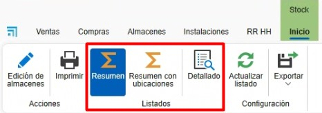
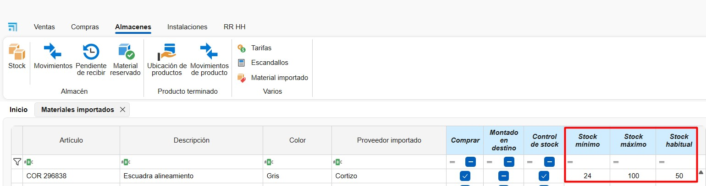
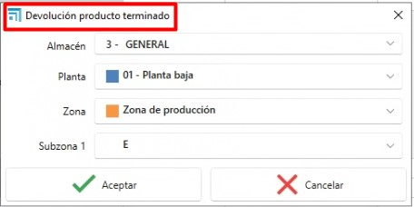

# ENBLAU Stock Control System

---

## 1. Purpose

This manual is intended for new users of the stock control system used by Endades and our Customers. Its main goal is to provide a step-by-step guide for managing projects efficiently — from creating orders to optimizing production workflows in ENBLAU. The document covers the key operations and is organized sequentially to make it easy to follow.

---

## 2. Purchase order management

### 2.1 Purchase orders

- From the main menu go to **Purchasing** and open the "Purchase Orders" section.
- Specify the materials and the required quantities.
- If references change, add them manually provided they are configured in the database.
- From a sales order (under **Sales**) select the document and open the **Material needed** tab to generate the material list for that order.

    - Lines shown in green indicate the material is available in stock for that project or for the project configured as **Stock**. Lines shown in red indicate material is not available for that project or in stock.

    - You can choose whether to purchase each item (for example, if you already have it in the warehouse). For each material the system shows: units in stock, reserved units, and outstanding units.

    

  > ⚠️ Important: To assign a project as the stock project, go to General → Configuration → **Purchasing and Warehouse**, and set the **Project for stock** dropdown to a previously created project used for stock management.

  

- Confirm with **Request material** and send the order to the corresponding supplier.

- In **Warehouses** there is an option called **Pending to receive** which shows a list of materials pending receipt by project and purchase order.

  

- Right-clicking a material line lets you open the purchase order for that item:

  

> ℹ️ Note: For more detailed information about purchase orders see: [Purchase Orders](1.PR_Ventas_Compras.md#4-compras)

> ⚠️ Important: Creating material requests from a sales document may require special permissions in some cases. This permission can also be required for manufacturing or installation operations.

### 2.2 Assigning materials to a project

- From the Material needed view you can reassign items from another project to the current project. Right-click the line in the locations section and choose **Assign**:

  

  - Select the destination project (defaults to the current project) and the quantity (defaults to the quantity required):
  
  

  - When an item is assigned to the destination project, the stock units are transferred: the destination project’s stock increases by the assigned quantity and the origin project’s stock decreases. The item will be shown in green.

> ⚠️ Important: Ensure materials are allowed to be used from the project you are transferring from.

### 2.3 Reserved materials

- You can reserve materials for a project from **Sales**, **Purchasing**, or **Projects** by selecting **Reserved materials** and choosing the warehouse from the dropdown.

  

- A Reserved Material window opens and from **Project materials** you can drag items from supplier orders:

  

- The Warehouses area shows all reserved materials for a project:

  

  

> ℹ️ Note: Reserving material is primarily visual and does not prevent usage of the items. For stricter control use [Assigning materials to a project](#22-assigning-materials-to-a-project).

### 2.4 Stock replenishment

 In **Purchasing** there is a **Stock replenishment** option in the warehouse dropdown that lists materials below minimum or below typical stock levels.

  
    
 - Materials marked in **red** are below the **minimum** or below the **typical** threshold.

    - **Units in stock** shows the quantity currently available.  
    - **Units to order** indicates how many units are needed to reach the configured maximum stock.  
    - Materials that meet the minimum or typical level **do not appear** in the replenishment list.

 - Materials marked in **green** are those without a defined maximum stock.

    - By default, one unit is considered for items configured as below minimum or below typical so they show up in the replenishment list.

 - Check the **To import** box for materials you want to include, then click **Import** to add them to a purchase order.

  

> ℹ️ Note: To learn how to define minimum, maximum and typical stock values for a material, see [Material configuration](#61-material-configuration).

---

## 3. Warehouse management and movements

### 3.1 Warehouse layout

- In the main menu go to **Warehouses → Stock** to add or edit warehouses.

  

- Configure the warehouse layout at ENBLAU → Configuration → **Warehouse** → **Layout**:

  

  - Create floors, zones, racks and positions to keep the warehouse organized. The layout is displayed as a tree view.
  - Associate each position with its storage area. Examples:
    - **Add Floor**: add a floor and indicate the warehouse.
    - **Add Zone/SubZone**: add a zone or subzone under the selected location.

    

### 3.2 Stock

- Under **Warehouses → Stock** you can view listings with **Summary**, **Summary with location** and **Detailed** views:

  

  

  - **Summary:** shows materials grouped by assigned project with totals for units, outstanding units and reserved units.

  - **Summary with location:** shows materials grouped by project and their storage location.

  - **Detailed:** provides a detailed view showing purchase project, assigned project, warehouse location and breakdown by purchase delivery note. This view also allows you to decrement, transfer and assign items.

### 3.3 Warehouse movements

- Perform material movements between zones and projects:
  - In **Warehouses → Stock → Detailed**, right-click the material you want to transfer, decrement or assign.

  

  - Select the material from the project.
  - **Decrement**: indicate the project, order number, responsible person and quantity (bars and pieces) or length (joints).

    

  - **Transfer**: indicate the origin and destination location and the quantity (bars and pieces) or length (joints).

    

  - **Assign**: indicate the destination project, responsible person and quantity (bars and pieces) or length (joints). This matches the function described in Material needed → [Assigning materials to a project](#22-assigning-materials-to-a-project).

     

- Entry, exit, transfer and assignment movements are recorded on the delivery note. You can view entries and exits under **Warehouse → Movements**.

    

    

- The Movements section includes a **Return** function. Right-click an exit movement and select **Return**:

    

    A **Return movement** window opens where you indicate the units and the location to return the material to (by default the original location):

      

- The **Open delivery note** option in the detailed list opens the delivery note (number column) for the selected line and item:

    

- The **Add offcut** option, available from the detailed list, applies exclusively to panel-type items and allows panel offcuts to be added to stock. To do so, the **Location** and the required **Length x Height** dimensions must be specified. This action will generate a stock entry movement for the panel.

     

    

### 3.4. Warehouse reports (inventory)

#### 3.4.1. Stock reports

In the **Warehouses → Stock** section, different types of reports can be printed:

- **Summary:** There are two reports: **Inventory** and **Inventory by date**.

  

  **Inventory**  
  Generates an inventory report based on the filters applied in the warehouse list.  
  Includes the following columns: Item, Project, Units, Pending units and Reserved units.

  

  **Inventory by date**  
  Generates an inventory report up to the selected date.  
  Includes the following columns: Item, Description, Units and Amount.

  

- **Summary with location:** Includes the **Detailed inventory (summary)** report.

  **Detailed inventory (summary)**  
  Generates an inventory report based on the filters applied in the detailed warehouse list.  
  Includes: Warehouse location, Item, Description and Units.

  

- **Detailed:** Includes the **Detailed inventory** report.

  **Detailed inventory**  
  Generates an inventory report based on the filters applied in the detailed warehouse list.  
  Includes: Project, Purchase delivery note number, Warehouse location, Item, Description and Units, grouped by reference and length.

  

#### 3.4.2. Warehouse movement reports

In the **Warehouses → Warehouse movements** section, the following reports can be printed:

- **Movements**  
  Displays a list of the movements shown in the main movement list.  
  Includes: Movement date, Responsible, Assigned project, Warehouse location, Item, Description, Units and Movement type.

  

- **Movements I**  
  Displays an alternative list of the same movements.  
  Includes: Movement type, Movement date, Responsible, Document, Units, Amount, Item and Description.

  

### 3.5. Complete Project (Destination Project)

When finishing a project, you have the option to specify a **Destination project** where the remaining materials will be assigned. For example, you can assign them to the project you have defined for stock management.

**Process when completing:**
- Specify the destination project for surplus materials
- The system automatically generates an **entry movement** to the assigned project
- Materials retain their original location in the warehouse
- Only the project assignment is modified, not the physical location

---

## 4. Inventories

- Under **Warehouses → Inventories** you can perform stock normalization taking into account real-time stock levels.

  

### 4.1 New inventory

  - To create a new inventory, open Inventories and click **New**.

    

### 4.2 Stock counting and reconciliation

  1. From an inventory, select the **Project** defined as **Stock**.  

  2. Click **Get stock** to load the list of materials for the Stock project:  
    
      

  3. In the **Counted units** column enter the actual counted quantity for the item at the warehouse location.  
      

  4. After entering counted units, item lines that changed will appear in red. Click **Update warehouse** to apply the reconciliation based on counted units.  
      

  5. After updating the warehouse, the lines will appear in green.

  - The **Stock units** and **Counted units** columns will reflect the updated values.  
  - The **Counted** column will display a checkbox.  
  - The **Counted date** column will show the reconciliation date.  

          

  - This process generates a reconciliation movement (entry or exit) in the warehouse:  

      

    > ℹ️ Note: The inventory list only shows **entries** and **exits**. Transfer movements cannot be performed from this listing.

  6. You can also add new items from the trees:

  - **Items (ENBLAU materials)**
  - **Imported items (Logikal materials)**

    To add an item:
    - Drag the item into the inventory list.
    - Specify **units**, **dimensions** (if applicable: bar, surface, joint), **stock location**, and **price**.  
        

    > ℹ️ Note: When adding a new item to the inventory you must always specify a **location**, otherwise it will not update stock.

  7. Use **Refresh stock units** to update the current units for each inventory line.  

     

---

### 4.3 Inventory reconciliation report

- You can **Print** the inventory listing which shows columns: Item, Description, Last check date, Units in stock, Counted units and Location.  

  

    

- This report helps with manual stock counting before updating the inventory listing. The **Counted units** column should contain the real quantity counted for each item.  

    

## 5. Required stock (Stock needed)

- After creating production and sending items to the workshop, you can view and decrement materials manually.

  

- A Stock needed window shows which warehouses contain the material and which workstation (monitor) will have the material decremented. To decrement material, check the box in the **Stock to decrement** column for the item.

  

> ⚠️ Important: If the material is not in stock it will not be decremented.

> ℹ️ Note: For more precise stock control we recommend using the mobile app enSITE to perform material decrements. For more information about the app see [2.1 Receiving in enSITE](4.PR_Manual_Stock_enCONTROL.md#21-recepcion-en-ensite)
  
---

## 6. Imported materials

The **Warehouses → Imported materials** section lists all materials imported from **Logikal**.

---

### 6.1 Material configuration

From this section you can define default settings for each item that affect purchasing and production:

- **Purchase**:  
  If this box is checked, the material will be proposed by default as “to purchase” when listed from the **Required material** section.

- **Assembled at destination**:  
  If this box is checked, the material will be assembled at the destination during the process at the **Picking** station within **enCONTROL**.

- **Stock control**:  
  If this box is checked, the material will be visible in the **Stock replenishment** list from the purchase order section.

- **Minimum stock**, **maximum stock**, and **typical stock**:
   Define reference values useful for alerts, replenishment and planning.

    

    In the [Stock replenishment](#24-stock-replenishment) section you can generate a list of items below minimum or below typical levels according to the configured values for each material.

> ℹ️ Note: Properly configuring these fields significantly improves inventory control, purchase planning and material traceability during production.

---

## 7. Finished product

The **finished product** is an item that has been fully manufactured and passed through the **Final inspection** workstation in **enCONTROL**.

Under **Warehouses → Finished product** there are two main listings:

- **Product locations**
- **Product movements**

  

---

### 7.1 Product locations

- The Product locations list shows the current information and location for each finished product as defined by the Final inspection step in **enCONTROL**.

  

- From this view, right-click a line to perform actions:

  - Move the product to another location.
  - Issue the product out of stock.
  - Open the production document associated with the product.

  

---

### 7.2 Product movements

- Product movements records include all operations performed on finished goods such as:

  - Entry
  - Exit
  - Transfer

  

- Right-clicking a line whose **movement type** is an **exit** enables the **Return** option.

  

- Selecting this option opens the **Return finished product** window where you must:

  1. Specify the new **location** for the product.
  2. Accept the operation.

  

After completion the system records a new **Entry** movement in the product history.

> ℹ️ Note: This feature is helpful for managing internal returns, rejected products or logistical reassignments in the warehouse.

---

> ℹ️ Note: Proper finished product management ensures better inventory control, traceability and faster order dispatch preparation.

---

## 8. Stock control and reporting

- Monitor stock needed from the Production area.
- Identify reserved and pending materials in real time.
- Generate inventory reports to assess material usage and plan future purchases.

---

## 9. Troubleshooting common issues

- Error importing references: verify references are configured in the database.
- Excess or missing materials: ensure locations and quantities are recorded correctly when receiving materials.
- Warehouse layout issues: review zone configuration and adjust as needed.

---

## 10. Conclusion

This manual provides a step-by-step guide for the main processes in the stock control system. By following these instructions users can manage inventories effectively, improve production and optimize supplier relationships. For additional support contact your system administrator.
