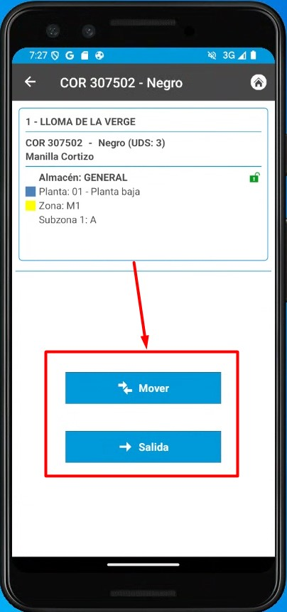
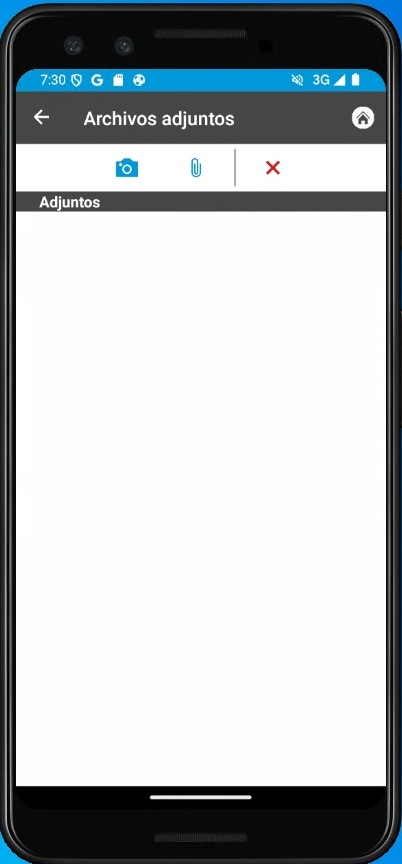
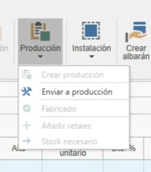
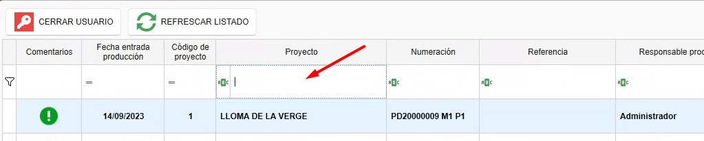
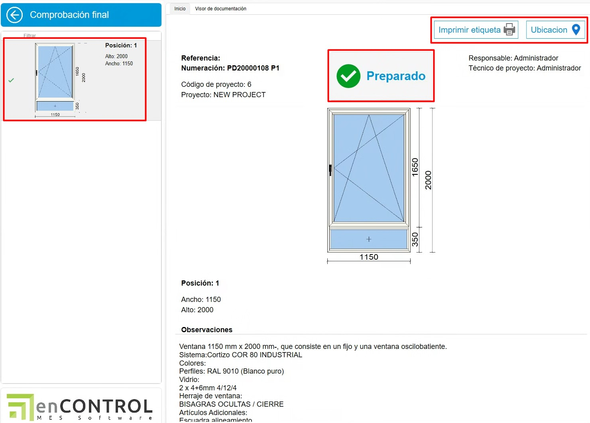
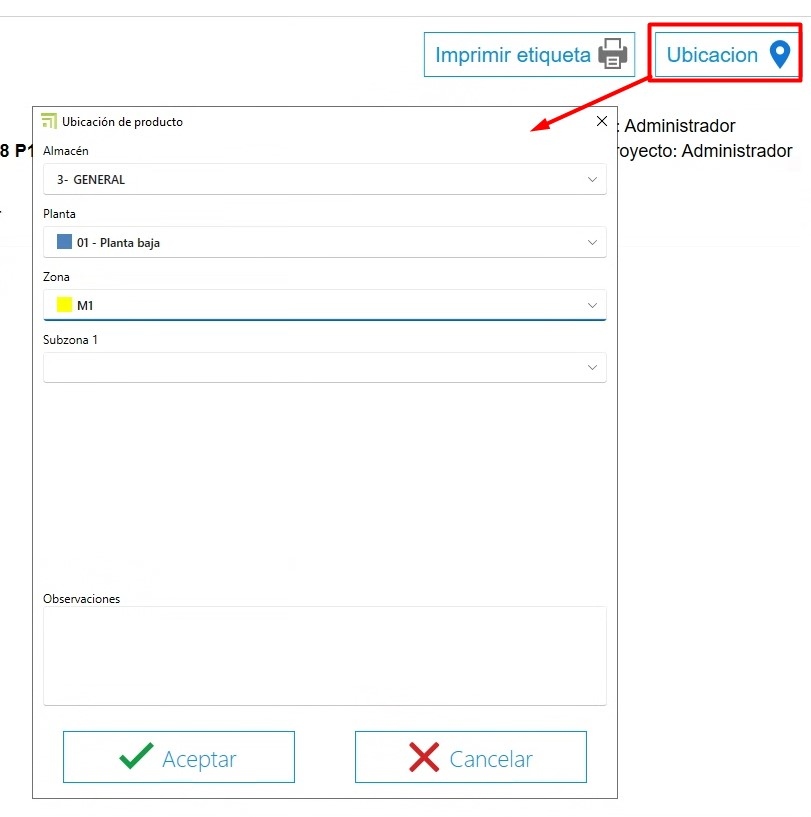

# enCONTROL Stock Control System

---

## 1. Purpose

This manual is intended for new users of the stock control system used by Endades and their Customers. Its main objective is to provide a step-by-step guide for efficiently managing projects — from creating purchase orders to optimizing production processes in enCONTROL and enSITE. The document covers the key operations and is organized sequentially for easy reference.

---

## 2. Receiving materials
### 2.1 Receiving with enSITE

- Once a purchase order has been created, in ENBLAU go to **Warehouses** and open **"Pending to Receive"**. A tab will open showing all materials pending receipt for each project.

> **Note:** For more details about purchase orders, see: [2.1. Purchase orders](3.PR_Manual_Stock_ENBLAU.md#21-pedidos-de-compra)

- Receiving mode: open **enSITE** from the workshop over Wi‑Fi with the person in charge of receiving the order.
- In **Order reception**, find the corresponding order (sorted by date).

- Register the receipt by creating a **New Delivery Note** from the **Warehouse** section.

- In ENBLAU the **Pending to receive** tab under **Warehouses** will synchronize and the materials for that order will no longer appear there.
- In **Purchase Order** you can check traceability.
- In **enSITE**, indicate the quantities received and the location where they will be stored (Warehouse, Floor, Zone, Subzone…). Afterwards you will be able to view each item’s location.

- From the **enSITE** app you can also search by item and see all locations where that item exists, then move or decrement items as needed.

    
    

> **If materials are damaged or there are other incidents**, you can attach documents or photos to the delivery note. These can then be reviewed from ENBLAU.

### 2.2 Receiving in ENBLAU

- In ENBLAU, once the purchase order is created you can generate a delivery note to record receipt of materials for that order.

- From the delivery note you can indicate the received quantity for each material. By default, the lines will be marked with the order quantity.

- Then set the delivery note location in the delivery note’s warehouse tab.

> **Note:** For more detailed information about receiving materials in ENBLAU, see: [4.2. Material reception](1.PR_Ventas_Compras.md#42-recepcion-de-material)

---

## 3. Production and enCONTROL

### 3.1 Production

- Create production projects in ENBLAU based on customer orders.
  - Create production.

    

  - The next step is **Send to production**.

    
    

  - In production you can view items under **Stock needed**, see which materials have been decremented and decrement items manually if required.

    
    

> **Note:** For more information about creating production phases in ENBLAU, see: [3.5. Production](1.PR_Ventas_Compras.md#35-produccion)

### 3.2 enCONTROL

- Open **enCONTROL**. Production projects will appear. Administrators see all projects; other users see only assigned projects.

- Open the **Control monitor**. You can open it by double‑clicking any filter (in the header) or by double‑clicking a project and selecting the **Control** workstation if it is configured on the workstation.

    

- When a project is sent to production (Workshop), it is placed in the production queue on the **Production Management** tab. The production manager decides priority.

    

- To remove an item from "Queued", drag it to the "In production" panel and a **Task** window will open to propose a date, set status, classification, etc.

    

    

- In the Planning tab you assign projects by dragging them to each responsible person. Select the responsible person and drag the project (you can select multiple responsibles with Ctrl + right‑click). You can also change priority left-to-right and top-to-bottom.

  

  To unassign a project, select the responsible person, select the project and press Ctrl + Delete.

- The Production Calendar displays a Gantt chart based on Logikal times (in the example) showing production start and end dates.

  

- Optimize processes according to production areas (cutting, machining, assembly, etc.). From the main project view, double‑clicking a project opens a Select Workstation window. Workstations are defined per client and visible per user.

  

- When entering any workstation the screen shows a **Start** button:

  

  Timing counts from start until pause or finish.

- Common fields across screens:
    - Comment — You can add a comment and select severity from a dropdown. The last valid comment is the one that unlocks.

      

      

    - Pause — Pausing work requires selecting a reason from the list. You can then resume by selecting the same workstation again.

      

    - Finish — Finish when the work at that station is complete. You can later resume by starting the same workstation again.

      

    - Documentation — From Documentation you can view production documents exported from Logikal in the document viewer. You can also add a generic path to include catalogs, manuals, etc.

      

#### 3.2.1. Workstations

- Double-clicking on the production item will open the workstation window configured for each team.

    

 **1. Material Preparation (Station 0)**

  - All Ready – Marks materials with a green check indicating they are prepared.
  - Nothing Ready – Marks materials with a red X indicating they are not prepared.
  - Material Location – As configured in CONTROL, it could indicate where to place the materials. This ensures that material is deducted only from that specific location.

      

**2. Cutting (Station 1)**

  - In cutting, the bar length and scrap waste are indicated. A scrap window opens where the length can be changed as needed.

    

    

    > ℹ️ **Note:** In ENBLAU, under Configuration - General - **Logikal**. You can specify the **Minimum scrap** to consider when cutting a bar at the **Cutting** station.

      

      

  - Then, in ENBLAU **Warehouse Movements**, an output for the full bar (e.g., 6500) and an input for the same material (e.g., 4100) will be reflected, as indicated at the cutting station.

    

    - Also in ENBLAU, you can view in the **Stock** section the list filtered by **Is scrap** to see all available scraps in stock.

      

  - In the **Cut** section of the cutting station in enCONTROL, on the right side of the monitor, the list of performed cuts is displayed, and labels for each bar can be printed.

    

**3. Machining (Station 2)**

  - Does not deduct materials; it is merely informative for time tracking. Compares against real time.

    

**4. Assembly (Station 3)**

  - Deducts materials (accessories) per frame position.

    

  - In the materials list, you have the option to indicate the items to be assembled at the destination. These materials will then be added to the list at the **Picking** station.

  

**5. Gasketing / Sealing (Station 4)**

  - Deducts materials (Gaskets, shims, foam, etc.) per frame.

  

  - In the materials list, you have the option to indicate the items to be assembled at the destination. These materials will then be added to the list at the **Picking** station.

    

**6. Joining / Fitting (Station 5)**

  - Frame information, but does not deduct materials.

  

**7. Hardware (Station 6)**

  - Deducts materials (hardware) per leaf/sheet.

    

  - In the materials list, you have the option to indicate the hardware to be assembled at the destination. These materials will then be added to the list at the **Picking** station.

    

**8. Welding (Station 7)**

  - Does not deduct materials; it is merely informative for time tracking. Compares against real time.

    

**9. Blinds (Station 8)**

  - Deducts materials (blinds) per frame.

    

**10. Transformation (Station 9)**

  - At this station, you can indicate a group of materials defined in a bill of materials (BOM) to transform into a product, e.g., Railing.

    

  - Deducts the list of materials defined in each bill of materials. In addition, if a material reference has been specified in the **Finished product** field of the bill of materials from ENBLAU, a stock entry will be generated with that item reference. For more information, see the following link: [2.1. Create a Bill of Materials](/Utilidades/9.UT_Escandallos/)

  - As in other stations, in the materials list you have the option to indicate the items to be assembled at the destination. These materials will then be added to the list at the **Picking** station. Additionally, you can then print the label and locate the product.

**11. Final Inspection (Station 10)**

  - Does not deduct materials. However, once the inspection is finalized, the product can be located in the Warehouse and a label for the finished product can be printed.

    

    

    

  - In ENBLAU, under Warehouses in the **Finished Product** section, there are two lists:

      **Product Location:** Shows where the finished product for each project and production is located. From this list, you can issue, move location, and open the production document by right-clicking on the position.

      

      **Product Movements:** Shows movements of the finished product such as entry, transfer, issue, and return. From this list, you can make a return by right-clicking on the issue position.

      

**12. Cleaning (Station 11)**

  - Does not deduct materials; it is merely informative for time tracking. Compares against real time.

    

**13. Picking (Station 12)**

  - This station shows the list of materials previously marked in other stations that will be assembled at the destination.

    

  - You can create packages and assign each material to them. Then print the label for the package.

    

    - Indicate the picking location for each material.

      

**14. Board / Dashboard (Station 13)**

  - Shows the evolution and status of each project.

    

**15. Control (Station 14)**

  - Opens the Project Control monitor. Where you can also see the status of each project in the factory.

    

> ℹ️ **Note**: Assign priorities and resources to ensure smooth production flow.

> **enCONTROL Configuration** - Configure enCONTROL beforehand. For more information, follow this link: [2. Initial Configuration of enCONTROL](/Configurations/2.%20CO_Initial_Configuration_enCONTROL/) :

> **Filter Management** - Use filters and custom filters to optimize search in lists. For more information, follow this link: [4. Filter Management](/Utilities/4.UT_Filter_Management/) :

---

## 4. Stock control and reporting

- Monitor stock needed from the Production section.
- Identify reserved and pending materials in real time.
- Generate inventory reports to assess material usage and plan future purchases.

---

## 5. Troubleshooting common issues

- **Error importing references:** Verify that references are configured in the database.
- **Excess or missing materials:** Ensure locations and quantities are recorded correctly when receiving materials.
- **Warehouse layout problems:** Review zone configuration and adjust as needed.

---

## 6. Conclusion

This manual provides a step‑by‑step guide for the main processes in the stock control system. By following these instructions, users can manage inventories effectively, improve production, and optimize supplier relationships. For additional support, contact your system administrator.
