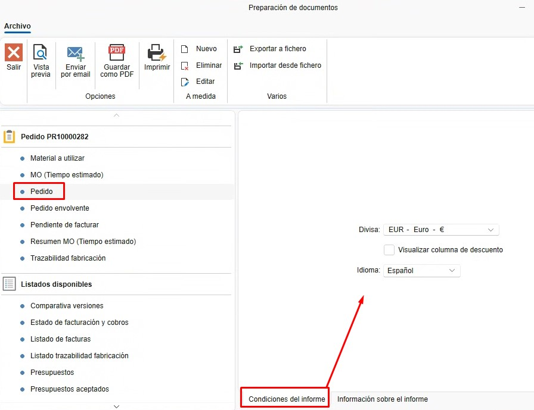
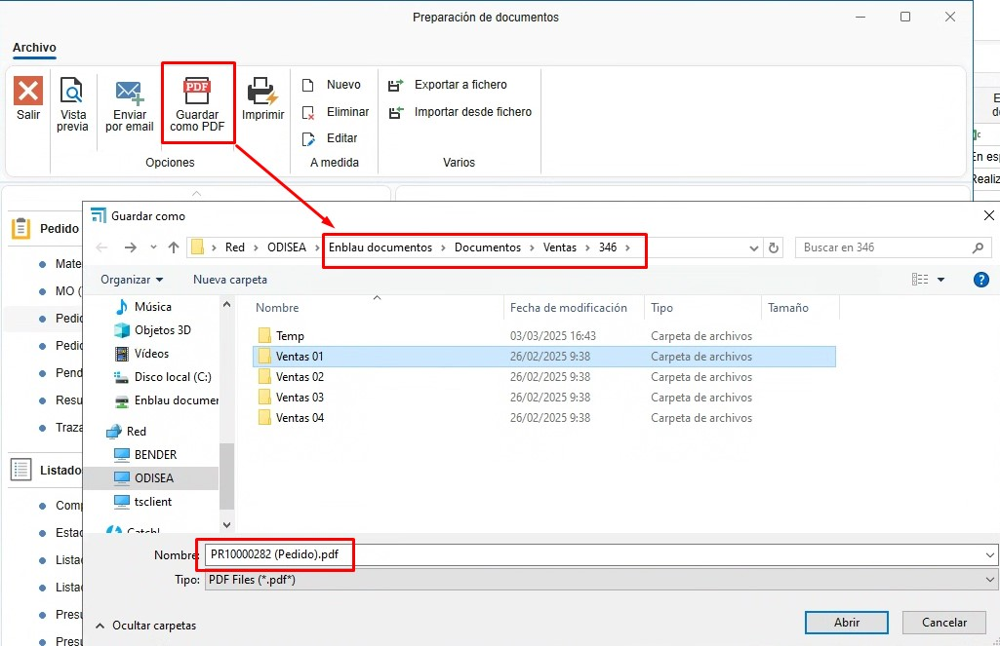

# Reports

---

## 1. Introduction
This guide explains how to generate documents and reports in ENBLAU so they can be printed or sent by email.

---

## 2. Report types
Different types of reports can be generated for each sales or purchase document as required.

### 2.1 Sales documents
- Quote
- Order
- Measurement
- Production
- Delivery note
- Invoice

### 2.2 Purchase documents
- Order
- Delivery note
- Invoice

---

## 3. Print / Save / Send reports
From any document list (for example, Sales Documents), select a document and click **Print**.

  

### 3.1 Document preparation
In the **Document preparation** window a list of related reports appears on the right side.

  

#### 3.1.1 Report conditions
- When you select a report type, the **Report conditions** tab shows the conditions that the document must meet to issue the report.

  

#### 3.1.2 Report information
- The **Report information** tab provides a short description of each report type.

  

#### 3.1.3 Preview
- Before printing or emailing a report you can preview it to verify the document.

  

#### 3.1.4 Save as PDF
- There is an option to save the report as a PDF. This opens the default export path associated with the sales or purchase document (the path can be changed during export).

  

#### 3.1.5 Print
- To print reports click **Print**, choose the printer configured on the server and print.

  

#### 3.1.6 Send by email
- To send the report by email select **Send by email**. A **New email** window opens with the user's email populated by default (this is configured in **Email accounts**). For more information see: [1. Initial Configuration of ENBLAU](/Configuraciones/1.%20CO_Configuracion_Inicial_ENBLAU).

  

- From the **New email** window you can attach additional documents, write the message body, add CC recipients, etc.

---