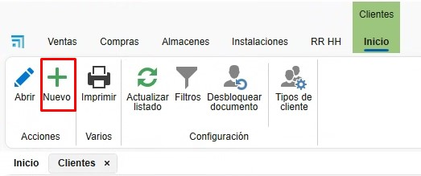
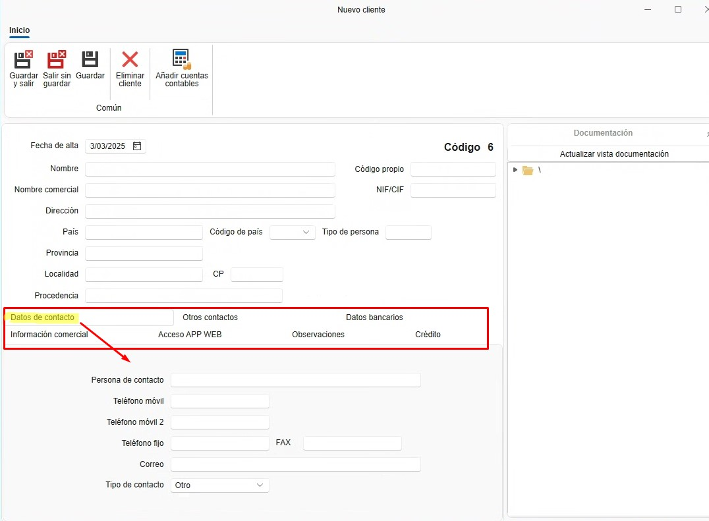
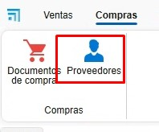

# Projects, Customers and Suppliers

---

## 1. Introduction
This guide explains how to create Projects, Customers and Suppliers in ENBLAU so they can be assigned correctly to sales and purchase documents.

---

## 2. Projects
A project is similar to a "job" or "site". Multiple sales and purchase documents can be associated with a single project.

### 2.1 Creating projects
- From the **Sales** area you can access **Projects**.

  

#### 2.1.1 New project
- Create a project using the **New** button.

  

- Assign a name and select the customer.

  

#### 2.1.2 Project details
- From the **General** tab you can set:
  - Company
  - Site engineer
  - Sales representative
  - Purchasing manager
  - Billing manager
  - Etc.

  

#### 2.1.3 VAT and withholding
- You can confirm VAT and withholding with the customer for the project to avoid invoice errors.

  

#### 2.1.4 Project documentation
- From **Project documentation** you can upload documents, manuals, etc. related to the project.

  

- Double‑clicking the root folder opens the path where the project ID is stored.

  

- Subfolders can be created directly on the path or configured in Projects → **Default directories**.

  

### 2.2 Related documents
#### 2.2.1 Sales and purchase documents
- All documents related to the project are grouped here.

  

#### 2.2.2 Task scheduling
- Manage tasks associated with the project. Tasks can be assigned per document.

  
  
  

---

## 3. Customers
A customer can be associated with one or more projects.

### 3.1 Creating a customer
- From the **Sales** area you can access **Customers**.

  

#### 3.1.1 New customer
- Create a customer using the **New** button.

  

#### 3.1.2 Customer details
- Enter a name and fill in required customer fields:
  - Name
  - Trade name
  - Address
  - Tax ID (NIF/CIF)
  - Etc.

  

#### 3.1.3 Other details
- Additional customer information can be filled in other tabs:
  - Contact details
  - Other contacts
  - Bank details
  - Commercial information
  - Etc.

  

#### 3.1.4 Documentation
- From **Documentation** you can upload files related to the customer.

  

- Double‑clicking the root folder opens the path where the customer code is stored.

  

---

## 4. Suppliers
A supplier can be associated with one or more projects.

### 4.1 Creating a supplier
- From the **Purchasing** area you can access **Suppliers**.

  

#### 4.1.1 New supplier
- Create a supplier using the **New** button.

  

#### 4.1.2 Supplier details
- Enter a name and fill in the required supplier fields:
  - Name
  - Trade name
  - Address
  - Tax ID (NIF/CIF)
  - Etc.

  

#### 4.1.3 Other details
- Additional supplier information can be filled in other tabs:
  - Contact details
  - Other contacts
  - Bank details
  - Commercial information
  - Etc.

  

#### 4.1.4 Documentation
- From **Documentation** you can upload files related to the supplier.

  

- Double‑clicking the root folder opens the path where the supplier code is stored.

  

---
