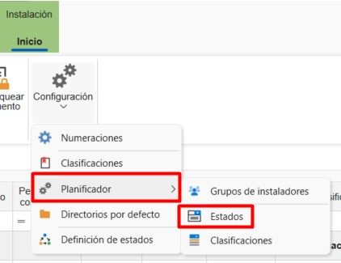
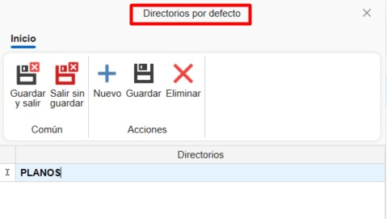
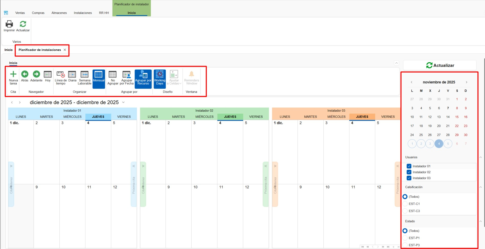

# Installations

## 1. Introduction
This manual is designed to guide users in creating and planning installations and assemblies from ENBLAU. This way, planned installations can be assigned to internal and external installers through the platform.

---

## 2. Installations
In the **Installations** module you can access:

- **[Installation](#21-installation)**
- **[External Installers](#22-external-installers)**
- **[Installation Planner](#23-installation-planner)**

### 2.1. Installation

#### 2.1.1. Configurations
From **Installation** you can access **Configurations** to define system parameters.

**1. Numbering Sequences**
Define numbering sequences for each type of document.

**2. Classifications**
Establish classifications to assign to installation documents.

**3. Planner**
Define **Classifications** and **Statuses** for planner tasks.

> **ℹ️ Note:** These classifications and statuses will be available when creating a new task in the **Installation Planner**.

**4. Default Directories**
Configure folders that will be automatically generated with each installation.

> **ℹ️ Note:** Default directories are folders that are automatically generated with each new installation.

**5. Status Definition**
Configure available statuses for each document type.

#### 2.1.2. Create an Installation Order

**1. New**
To create an installation, go to **Installation → New**. A window will open where you must complete the required fields:
- Document type
- Numbering
- Document number
- External installer
- Project

**2. Installation Order**

In the top ribbon of the document, some functions are available:
- Print → Print installation document reports.
- Prices → Edit predefined prices for the External Installer.
- New Forecast → Create an installation forecast to be reflected in the installation planner.

***Details Tab***
This tab shows all previously completed fields (editable). At the bottom, you can add positions by defining:
- Article name
- Description
- Units
- Price, etc.

***Status and Observations Tab***
This tab configures fields such as:
- Payment method
- Request and cancellation dates
- VAT, etc.

***Planning Tab***
Here you indicate start and end dates for planning and assign internal installers.

***Installation Observations Tab***
Space to add specific notes for the installation.

**3. Installation Delivery Note**

From an installation order, you can generate an installation delivery note. Specify the delivery method and then print it.

**4. External Installer Invoices**

- From the **Installation** section, go to **Delivery Note Invoicing**.

      

- From **Delivery Note Invoicing**, indicate the external installer to whom the invoice will be issued.

      

- A list of deliverable notes to be invoiced for the selected installer will appear. Indicate in the **To Invoice** column by clicking and checking the box for the deliverable notes to be invoiced. There are also options in the top ribbon buttons for *Select All* or *Deselect All*.

      

- Before generating the invoice, you can specify the mode **Group content by delivery note** (selected by default) or **Detailed content**. You can also indicate to which project the invoice should be issued.

      

- Once the invoice is generated, you can print it or edit it if necessary.

      

#### 2.1.4. Create Installation from a Sales Document
From a sales document (order, measurement, or production) you can:

- Create an installation forecast
- Create an installation directly

**1. Installation Forecast**

Allows you to indicate a forecast by configuring:

- External installer
- Estimated date
- Agreed amounts

**2. Create Installation**

When creating the installation from a sales document, you must indicate the units to be installed for each position. Subsequently, you can add external or internal installers to that installation.

#### 2.1.3. Print Installation Reports
Allows printing of available reports:

- Installation Report
- Time Reports
- Installation Order

Before printing, conditions and a brief description of the selected report are shown.

---

### 2.2. External Installers
To register new external installers:

1. Go to **Installation → External Installers → New**
2. Complete the required fields:

      - Name
      - Address
      - Tax ID (NIF)
      - Contact details
      - Prices, etc.

         

---

### 2.3. Installation Planner
From **Installations → Installation Planner** you can view and manage tasks in a calendar for each installer (internal or external).

From the options ribbon, you can organize the calendar view (day, week, month) and group tasks by resources or dates.

**1. Create Task**

To create a new task:

- Select **New Task**
- In the *New Installation Event* window, assign:

      - Installer
      - Installation number
      - Project

         

- In the *Task* window, detail:

      - Status and classifications
      - Start and end date/time
      - Short description
      - Notes

         

**2. Calendar**

Assigned tasks appear in the calendar. When hovering over a task, basic information is displayed:

- Project name
- Installation number
- Short description

Colors indicate the status and classification (previously defined in the configuration). You can also edit by double-clicking on the task.

