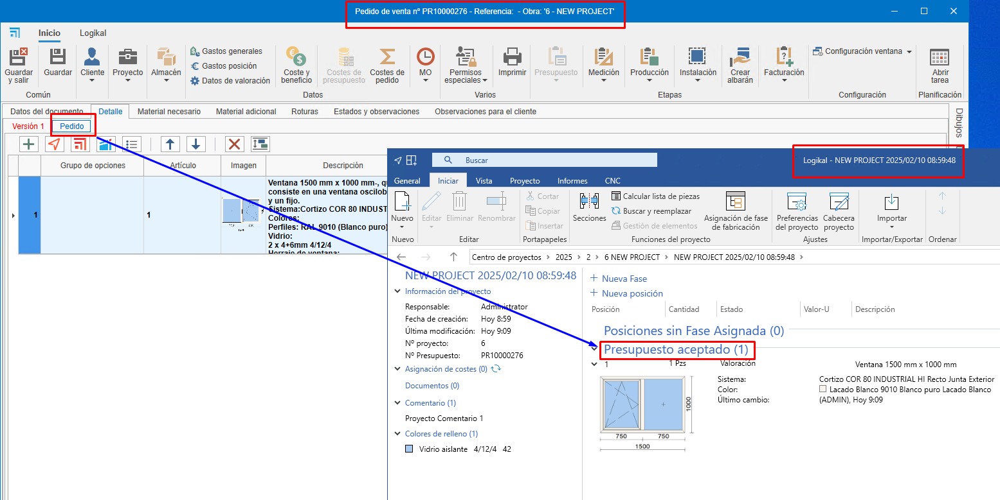

# Relationship between phases in ENBLAU and Logikal

---

## 1. Introduction
This document explains the relationship between the phases of a project in ENBLAU and how those phases appear and are managed in Logikal.

---

## 2. Phases — Examples
### Creating a quote from ENBLAU

1. **Version 1**  
    - When you create a quote in ENBLAU, that version will appear in Logikal under "Positions without Assigned Phase" within the same project.  
      

2. **Order**  
    - When the order is confirmed in ENBLAU, an order and a new phase will be created in Logikal called "Quote accepted".  
      

3. **Production 1**  
    - From the ENBLAU order, when you create a production, a new phase will be created in Logikal named "quote no. P1".  
      

4. **Measurement 1**  
    - From the ENBLAU order, when you create a measurement, a new phase will be created in Logikal named "quote no. M1".  
      

5. **Production 2**  
    - From the ENBLAU measurement, when you create a production (taking measurement changes into account), Logikal will create a new phase named "quote no. P2".  
      

---

> **Note:**  
> When you create a quote in ENBLAU and then add a Logikal item/position, it will be linked to a project in Logikal or, if none exists, a new project will be created.

  

  

  

---
