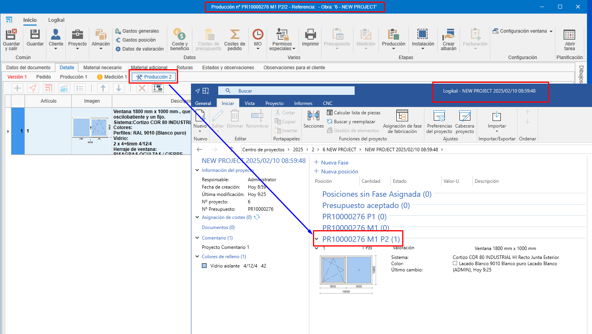

# Relationship between phases and project in ENBLAU and Logikal

---

## 1. Introduction
Explanation of the relationship between the phases of a project in ENBLAU and Logikal.

---
## 2. Working modes in Logikal

### 2.1. Phase mode (default mode)
The phase mode moves the items and quantities of each phase from the ENBLAU document to the project phases in Logikal.

- Create a quotation from ENBLAU:

  **1. Version 1**  
      - When creating a quotation in ENBLAU, this version will be reflected in Logikal in *"Positions (1)"* within the same project.  
        

  **2. Order**  
      - When confirming the order in ENBLAU, an order will be generated and then a phase in Logikal called *"Quotation accepted"*. The items will be moved from the previous phase to the next order phase.
        

  **3. Production 1**  
      - From the order in ENBLAU, when creating a production, a new phase will be generated in Logikal called *"quotation nº P1"*. The items and indicated quantities will be moved from the previous phase to the next production phase.
        

  **4. Measurement 1**  
      - From the order in ENBLAU, when creating a measurement, a new phase will be generated in Logikal called *"quotation nº M1"*. The items and indicated quantities will be moved from the previous phase to the next measurement phase.
        

  **5. Production 2**  
      - From the measurement in ENBLAU, when creating a production (considering the changes in the measurement), a new phase will be generated in Logikal named *"quotation nº M1 P2"*. The items and indicated quantities will be moved from the previous phase to the next production phase.
        

> ⚠️ **Important!** In this mode, items deleted from ENBLAU are permanently removed in Logikal.

---

### 2.2. Project mode
The project mode moves the items and quantities of each phase from the ENBLAU document, but a project (same quotation number) is created in Logikal for each ENBLAU phase.

- Create a quotation from ENBLAU:

  **1. Version 1**  
      - When creating a quotation in ENBLAU, this version will be reflected as a project in Logikal in the phase *"Positions (1)"*.  
        

  **2. Order**  
      - When confirming the order in ENBLAU, an order will be generated and then a new project in Logikal with the same *"quotation nº"*.
        

  **3. Measurement 1**  
      - From the order in ENBLAU, when creating a measurement, a new project will be generated in Logikal with the same number *"quotation nº M1"* with the items and quantities indicated from the previous phase to the next measurement phase in ENBLAU.
        

  **4. Production 1**  
      - From the measurement in ENBLAU, when creating a production (considering the changes in the measurement), a new project will be generated in Logikal with the same number *"quotation nº M1 P1"* with the items and quantities indicated from the previous phase to the next production phase in ENBLAU.
        

> ℹ️ **Note:** This mode may cause some slowness depending on the number of quantities and items in the document.

### 2.3. Phase mode duplicating items
The phase mode duplicating items copies the items and quantities of each phase from the ENBLAU document to the project phases in Logikal, always keeping a copy in each phase.

- Create a quotation from ENBLAU:

  **1. Version 1**  
      - When creating a quotation in ENBLAU, this version will be reflected in Logikal in *"Positions (1)"* within the same project.  
        

  **2. Order**  
      - When confirming the order in ENBLAU, an order will be generated and then a phase in Logikal named *"Quotation accepted"*. The items will be copied from the previous phase to the next order phase.
        

  **3. Measurement 1**  
      - From the order in ENBLAU, when creating a measurement, a new phase will be generated in Logikal named *"quotation nº M1"*. The items and indicated quantities will be copied from the previous phase to the next measurement phase.
        

  **4. Production 1**  
      - From the measurement in ENBLAU, when creating a production (considering the changes in the measurement), a new phase will be generated in Logikal named *"quotation nº M1 P2"*. The items and indicated quantities will be copied from the previous phase to the next production phase.
        

> ℹ️ **Note:** This mode may cause some slowness depending on the number of quantities and items in the document.

> ⚠️ **Important!** In this mode, items deleted in ENBLAU are permanently removed in Logikal.

## 3. Logikal project creation
When creating a quotation in ENBLAU and then adding a Logikal item, it will be linked to a project in Logikal or, if not available, a new one will be created.

  

  

  

---
