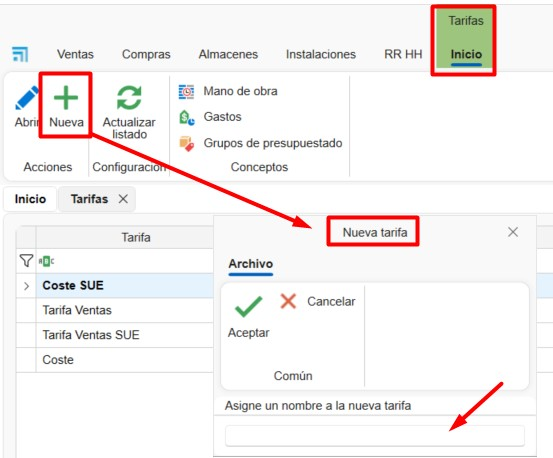
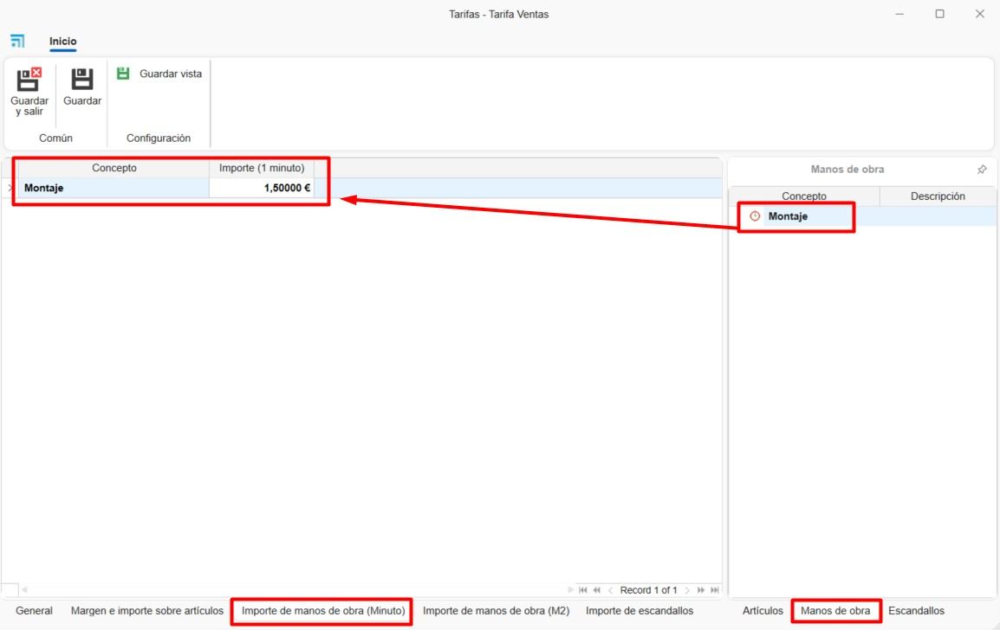
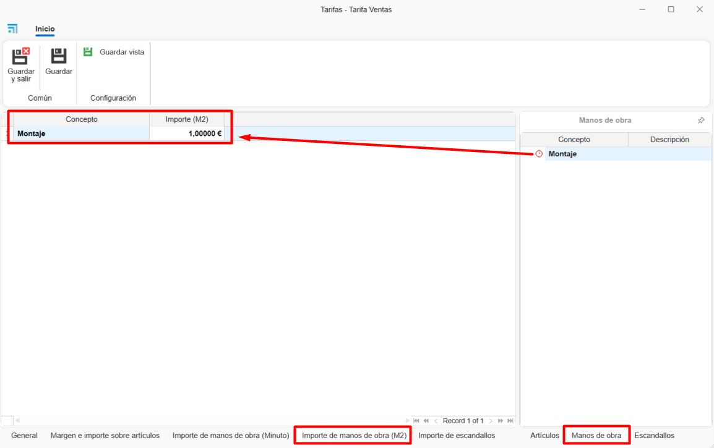
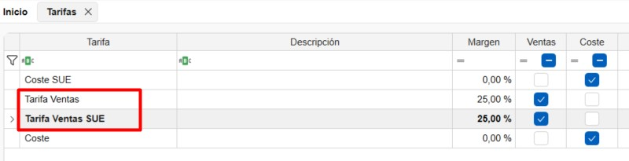
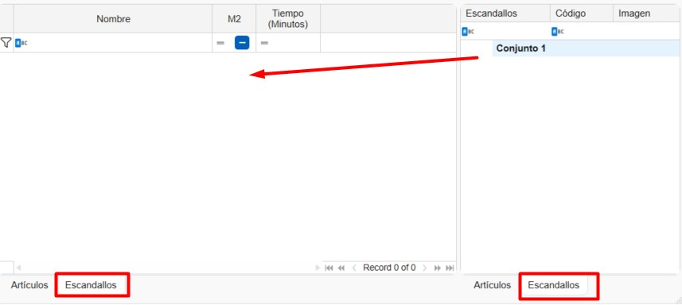

# Rates and Labor for Materials in ENBLAU

---

## 1. Introduction

This manual describes, step by step, how to use **Rates** and **Labor** to define cost and sales prices for materials in ENBLAU.

---

## 2. Create Rates

- From **Warehouses → Rates**, access the list of existing rates.

  

- Click the **New** button to create a new rate and enter its name.

  

### 2.1. General

- In the **General** tab, the following fields can be completed:

    **Description:** Allows adding a description for the rate.  

    **Margin:** Defines the margin applied to the rate.  

    **Ascending rate:** Indicates whether the rate is based on another existing rate.  

    **Notes:** Field for additional comments.

  

### 2.2. Margin and amount per items

- In the **Margin and amount per items** tab, margins and amounts can be defined by dragging the final material reference from the **Items** tab on the right side of the window.  
The amount will be calculated automatically based on the item calculation type: per unit, linear meter, or square meter (m²).

  

### 2.3. Labor amount (Minute)

- In the **Labor amount (Minute)** tab, the cost per minute can be defined by dragging the labor concept from the **Labor** tab on the right side of the window.

  

> ℹ️ **Note:** Labor must be created beforehand in section [3. Create Labor](#3-create-labor).

### 2.4. Labor amount (m²)

- In the **Labor amount (m²)** tab, the amount per square meter can be defined by dragging the labor concept from the **Labor** tab.

  

> ℹ️ **Note:** Labor must be created beforehand in the **Labor** section.

### 2.5. Bill of materials amount

- In the **Bill of materials amount** tab, a fixed amount can be assigned to a bill of materials (group of materials).

  

> ℹ️ **Note:** The material breakdown will continue to be calculated independently. The bill of materials amount does not necessarily have to match the total estimated sales amount of the materials.

### 2.6. Rate list

- When creating a rate, the system automatically generates another rate with the same name followed by **+ SUE**, intended for loose materials.

  

- The **Cost** rate is automatically generated and marked as the base cost rate for ENBLAU materials.  
This rate cannot be deleted.

  

---

## 3. Create Labor

- From **Warehouses → Rates → Labor**, access the labor list.

  

- A window will open allowing the creation and management of different labor concepts by completing the following fields:

  

  **1. Concept:** Labor name.  
  **2. Description:** Optional description of the labor.  
  **3. Type:** Labor type, selectable from the list of available workstations in enCONTROL.  
  **4. Is manufacturing:** Indicates whether the labor corresponds to manufacturing.  
  **5. Is assembly:** Indicates whether the labor corresponds to assembly.

  

  **6. Items:** Allows defining labor time (in minutes) for each item by dragging it from the **Items** tree on the right.  
  A unit range (**From / To**) can be defined for the material.

  

  **7. Bills of materials:** Allows defining labor time (in minutes) for each bill of materials by dragging it from the **Bills of materials** tree on the right.

  

---
