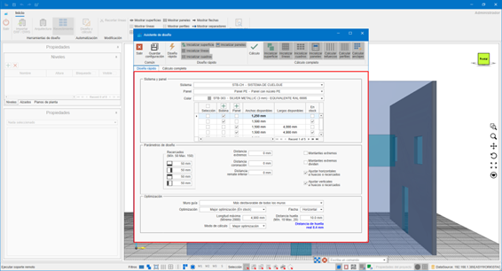
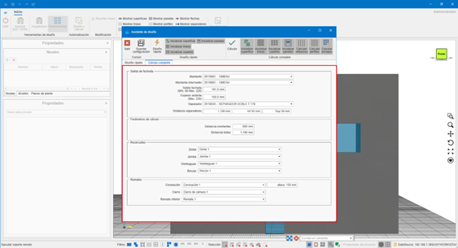
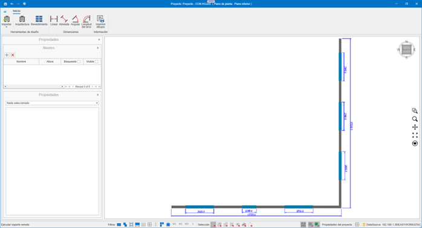
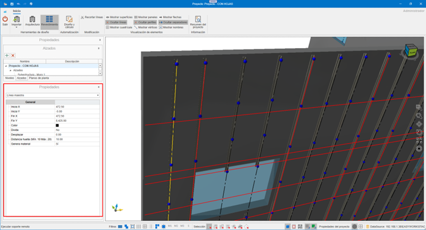

# enCLAD

---

## 1. Introduction

The purpose of this document is to provide basic knowledge on how **enCLAD** works, to streamline the management of processes in building cladding.

Before starting to work with enCLAD, it is necessary to have a database with the systems and materials defined in **enMATERIALS**.

---

## 2. Specific Nomenclatures of enCLAD

### 2.1. Master Line
Rails used for drawing building footprints or intermediate studs.

- **Cut lines**: red, continuous
- **Reinforcement lines**: black, discontinuous

  

### 2.2. Cladding Frame
Area located between lines.

- **Green**: areas to be clad
- **Red**: non-clad areas
- **Clad Property**: `Yes / No`

  Used for automatic panel calculation from the **Design and calculation** button.

  

### 2.3. Cladding Surface
Visible area of the cladding, independent of the structural wall.

Editable properties:

- **Coping**
- **Coping height**
- **Distance from wall**

  

### 2.4. Cladding Opening
This opening is independent of the original opening in the structural wall, and of the opening drawn on the cladding surface.

Includes automatic properties such as:

- **Architraves**
- **Jamb**
- **Lintel**
- **Windowsill**

  

### 2.5. `.enclad` File
enCLAD's own format for storage and exchange.

> **Important!**⚠️ Requires the same systems and materials database to open correctly.

---

## 3. Operation and Navigation

### 3.1. LogIn

Login screen with username and password.

  

### 3.2 Home

Main view after accessing the application.

  

---

## 4. Top Menu

Contains all actions on the project.

### 4.1. Menu Button

**Project:**

- **Open:** Opens a project stored in `.enclad` format.
- **Save:** Saves the currently open project in `.enclad` format.
- **Export:** Exports project information according to the selected format.

  

**Export formats:**

- **DWG**: Exports the current project view to DWG. AutoCAD format.
- **EMF**: Exports the current project view to EMF. Windows file image format.
- **PDF**: Exports the current project view to PDF. Adobe file format (Portable Document Format).
- **PDF 3D**: Exports the current project to 3D PDF. Adobe 3D file format.
- **STEP**: Exports the current project to STEP. Standard for the Exchange of Product Data, also known as ISO 10303.
- **STL**: Exports the current project to STL. Standard data transmission format par excellence in the rapid prototyping industry.
- **XML**: Exports the current project to XML. (Extensible Markup Language). Stores data so that it can be read by both computers and people. An .xml file is a text-based data format that is compatible with most text editors.
- **OBJ**: Exports the current project to OBJ. The OBJ extension is a 3D image file format.
- **IGES**: File format for Computer Aided Design (CAD) software.
- **WebGL**: Open web standard for rendering graphics in any compatible browser, without the need for additional plugins.

  

### 4.2. Export panels
Exports the deployed panels in DWG format, according to the values selected in the export window, ready to be sent for cutting.

  

  

  

- Layer configuration for DWG export.

  

- Export panels to DWG
- Export stiffeners to DWG
- Export panels to XML
- Export stiffeners to XML

  

### 4.3. Delete cladding
The **Delete cladding** dropdown offers different possibilities. Delete parts of a cladding, or the entire cladding.

Options:

- **Lines:** Gives us the possibility to delete the cladding lines from our design. Deleting cladding lines implies the deletion of materials that depend on this line, such as studs or anchors.
- **Frames:** Deleting cladding frames does not delete any material. These frames are only the defined areas that will be panelized during panel calculation. Once the panels are created, we will not need them and can delete them.
- **Openings:** Deletes openings from the cladding surface. If we already have the necessary panels, it is not necessary to have the cladding openings.
- **Panels:** Deletes panels from the project.
- **Complete cladding:** Deletes the cladding from the selected wall(s), or from all walls otherwise. Cladding surface and its openings, cladding lines, cladding frames, panels, studs, anchors, ...

  

### 4.4. Delete design

Deletes all project content.

---

## 5. Design Tools

Allow the construction of the building.

### 5.1. Import DXF / DWG

Imports:

- Levels
- Walls
- Openings
- Master lines

  

**DXF / DWG Requirements**
- Walls as closed 4-vertex polylines.
- Openings as closed polylines
- Inner text for wall name: `Name: "North Wall"`
- Levels defined by boxes with:
  - `N: "Level Name", "Height"`

  

  

---

## 6. Architecture

### 6.1. Design walls
Manual creation of walls on the selected level.

  

### 6.2. Design openings
Openings in structural walls or cladding surfaces.

  

### 6.3. Edit vertices
Editing of independent vertices of structural walls, openings and the cladding surface.

  

---

## 7. Cladding

### 7.1. Automation

#### 7.1.1. Design and calculation

Automation of building cladding calculation. Using the design and calculation wizard we can automatically obtain the necessary cladding for the walls we have selected at that moment, or for all walls in the building otherwise.

  

  - Lines imported from the CAD file will be drawn, and a cladding surface will be created if necessary.

  

  - Imported modulation.

  

##### 7.1.2. Quick design
Quick design allows us to obtain a calculation of the building's modulation, to obtain an initial approval from the architect / client involved.

  

Options:

- **Initialize surface:** Initializes a cladding surface, at the indicated distance according to the indicated facade offset. This offset will be to the visible face of the panel.
- **Initialize lines:** Initializes the horizontal and vertical footprints that will define our model. In quick design, only the footprints (cut lines) are calculated.
  Lines can be cut or reinforcement. Cut lines will define the model's footprints, reinforcement lines will define the intermediate studs. The lines will be calculated based on the openings and the dimensions of the chosen panels.
- **Initialize frames:** Frames will be calculated based on the cladding lines, and will be the spaces defined between them.
- **Initialize panels:** Panels will be calculated for each of the design frames, provided we have not set any of the frames as 'Do not clad'. It will take into account the openings or architraves that are inside them. As it is a quick design, this panel calculation will not consider wings or machining. It will only show us a front view of the calculated modulation.

> **Note:** Does not include wings or machining.

##### 7.1.3. Complete calculation
The complete calculation will provide us with both the modulation, and the actual calculation of panels and all the necessary substructure to carry out our project. The checks we find to manage differ from the quick design checks.

  

Includes:

- **Initialize panels:** They will be calculated in the same way as in the quick design, but by calculating them completely, it will provide us with the necessary wings and other information to send for cutting.
- **Calculate reinforcements:** Calculates the necessary reinforcements between footprints.
- **Calculate profiles:** Draws the necessary profiles.
- **Calculate anchors:** Draws the necessary anchors.

---

### 7.2. Quick Design Parameters

  

- **System**: Selection of the cladding system.
- **Panel**: Selection of the panel for cladding.
- **Color**: Panel color.
- **Dimension Selection**: Available panel dimensions.

  

- **Architraves**: Architraves to be applied on the cladding surface. They can be modified later by selecting the cladding surface.
- **End distance**: Distance of the footprint/reinforcement from the ends.
- **Coping distance**: Distance of the footprint from the facade coping.
- **Bottom distance**: Distance of the footprint from the bottom trim of the facade.
- **End studs**: Indicates whether to place the end stud or not.
- **End studs divide**: Indicates whether to convert the end stud into a footprint.
- **Adjust horizontals to openings or architraves**: Adjusts horizontal footprints to openings or architraves.
- **Adjust verticals to openings or architraves**: Adjusts vertical footprints to openings or architraves.
- **Guide wall**: Indicates the wall from which the horizontal footprints will be established. If none is chosen, each wall will be calculated separately.

  

- **Optimization**: Indicates how we will use the relevant panels or coils.
- **Arrow**: Indicates the direction of the panel arrow for optimization.
- **Maximum length**: Maximum length of the panel to be used.
- **Footprint distance**: Footprint width. Initially obtained from the chosen system, and the minimum and maximum parameters are indicated here.
- **Calculation mode**: Best optimization.

---

### 7.3. Complete Calculation Parameters

  

- **Stud**: Available studs according to the system. Interchangeable after calculation. Subsequently, it can be modified by selecting the cladding surface.
- **Intermediate stud**: Available intermediate studs according to the system. Subsequently, it can be modified by selecting the cladding surface.

  

- **Facade offset**: Cladding offset to the visible face of the panel. Subsequently, it can be modified by selecting the cladding surface.
- **Insulation thickness**: Thickness of the insulation to be used. Subsequently, it can be modified by selecting the cladding surface.
- **Spacer**: Available spacers according to the facade offset. Subsequently, it can be modified by selecting the cladding surface.

  

- **Spacer distance**: Calculation distance for necessary spacers. Subsequently, it can be modified by selecting the cladding surface.
- **Stud distance**: Indicates the maximum distance between studs. Subsequently, it can be modified by selecting the cladding surface.
- **Bracket distance**: Indicates the maximum distance between brackets in a hanging type panel. In the case of a riveted panel, we would see the maximum distance between rivets.
- **Lintel**: Lintels available in the system. Subsequently, it can be modified by selecting the cladding surface.

  

- **Jamb**: Jambs available in the system. Subsequently, it can be modified by selecting the cladding surface.
- **Windowsill**: Windowsills available in the system. Subsequently, it can be modified by selecting the cladding surface.
- **Corner**: Corners available in the system. Subsequently, it can be modified by selecting the cladding surface.
- **Coping and height**: Copings available in the system, and the distance it must exceed the structural wall. Subsequently, it can be modified by selecting the cladding surface.
- **Closure**: Closures available in the system. Subsequently, it can be modified by selecting the cladding surface.
- **Bottom trim**: Bottom trims available in the system. Subsequently, it can be modified by selecting the cladding surface.

---

## 8. Element Visualization

Allows showing or hiding:

- **Surfaces**
- **Lines**
- **Grid**
- **Panels**
- **Profiles**
- **Vertices**
- **Arrows**
- **Spacers**
- **Names**

---

## 9. Project Summary

Shows the list of necessary materials (breakdown) to carry out the project. This list can be copied and pasted into an Excel file.

  

---

## 10. Bottom Bar

  

1. **Remote support** (TeamViewer)
2. **Filters**: Filters the selection of entities, according to the applied filters.
3. **Selection modes**: Switch between the different selection modes.
4. **Views**: Block, wireframe, plan. Shows a block view of the 3D design.
5. **Snap to grid**: Snaps the pointer to the grid.
6. **Snap to object**: Snaps the pointer to the different design entities.
7. **Project properties**: Allows changing certain project configurations, and setting certain default values.

    

    

    

    

8. **Origin**: Shows or hides the origin point in the design.
9. **Grid**: Shows or hides the design grid.

---

## 11. Left Side Panel

  

### 11.1. Levels
Management and visibility of levels.

  

### 11.2. Elevations
Definition of elevations of our design. We can have two types, substructure or modulation. Depending on the type chosen, we will see different elements.

  

- **Modulation and drawings**

  

  

- **Substructure and drawings**

  

  

  

### 11.3. Floor Plans
Definition of project floors.

  

  

### 11.4. Properties
Properties panel of the selected element. Examples:

  

  

  

  

  

  

---

## 12. How to Use

### 12.1. Keyboard Shortcuts

- `CTRL + A` → Select all
- `CTRL + I` → Invert selection
- `CTRL + DEL` → Delete
- `CTRL + F` → Auto zoom
- `CTRL + + / -` → Zoom
- **Arrow keys** → Rotation
- `ESC` → Cancel

### 12.2. Touch Commands

- **Double tap** → Selection
- **Drag** → Rotation
- **Pinch** → Zoom
- **Two fingers** → Pan
- **Two-finger twist** → Rotation without flipping

---

## 13. Ventilated Facade Systems in enCLAD

There are 4 ventilated facade systems available in enCLAD:

### 13.1. Hanging System

The **hanging system** is a hidden mechanical anchoring system.

  

  

### 13.2. Male-Female System

The **male-female system** is an interlocking assembly system.

  

  

### 13.3. Bonded System

The **bonded system** is a structural adhesive system.

  

  

### 13.4. Riveted System

The **riveted system** is a visible mechanical fixing system.

  

  

---

## 14. Material Creation in enMATERIALS

Materials for each ventilated facade system will be created from the enMATERIALS module.

For more information, follow this link: [Creation of enCLAD systems and materials](/en/Utilities/2.UT_Crear_Materiales_enMATERIAL/#9-creation-of-enclad-systems-and-materials)