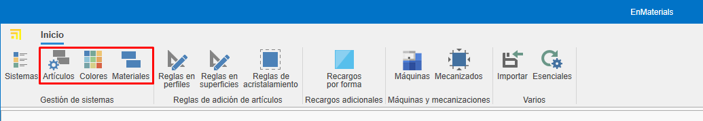
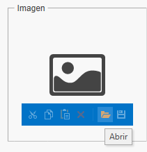
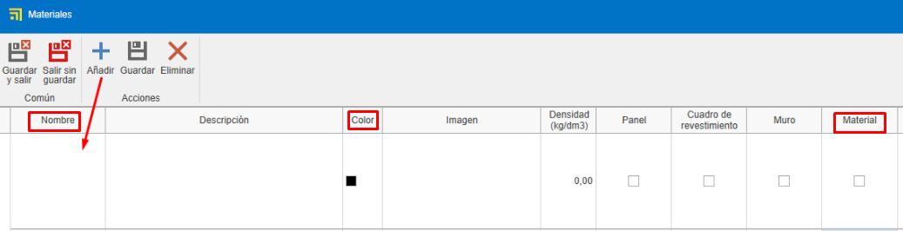
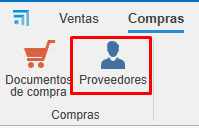
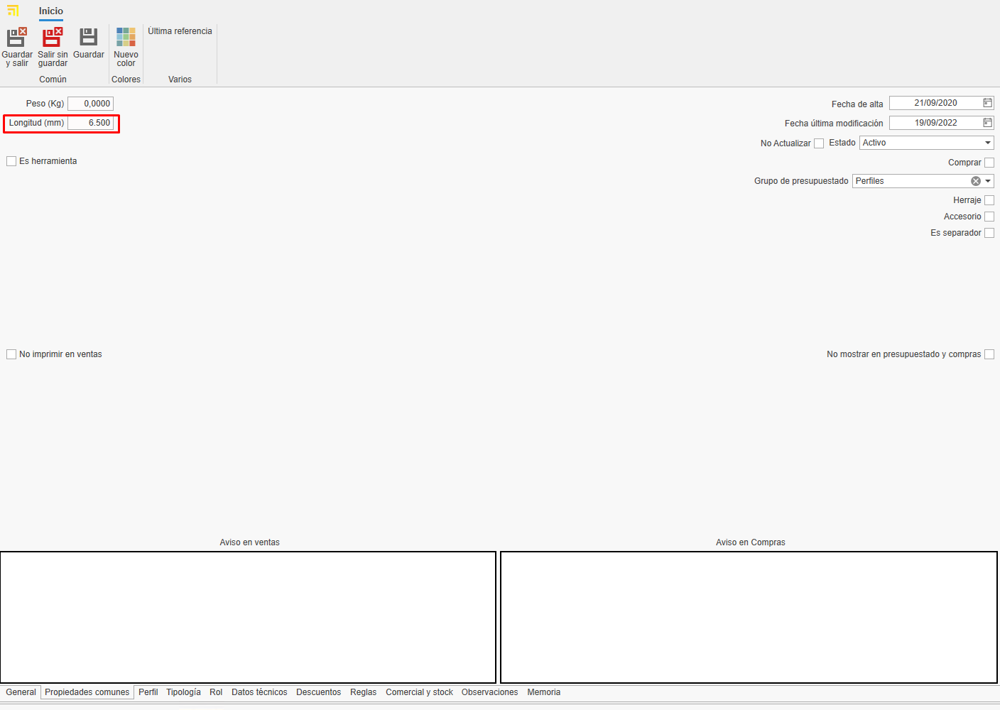
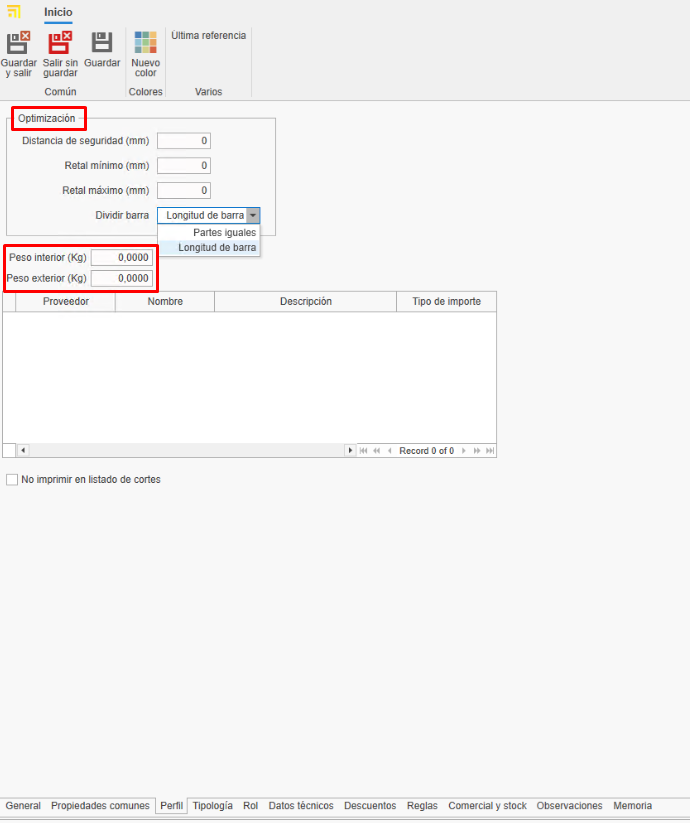
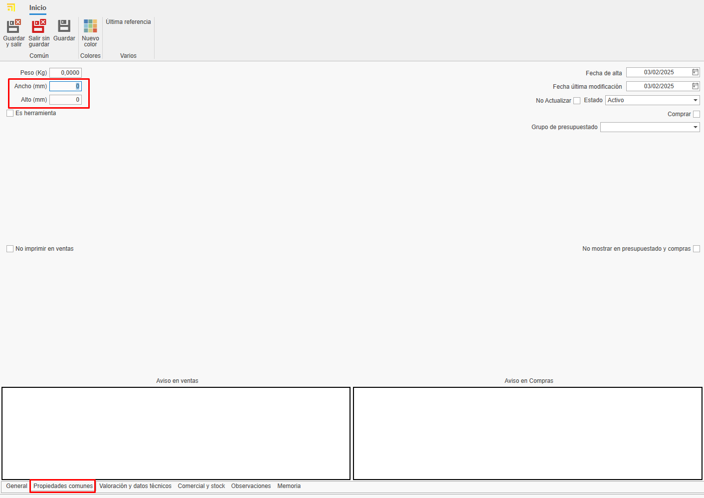

# Creating custom materials in enMATERIALS

---

## 1. Introduction

This guide explains how to create and manage custom materials in enMATERIALS. Follow the steps carefully to ensure materials are defined and organized correctly.

---

## 2. Material definition

Materials can be classified into different types according to their properties. The main types are described below:

### 2.1 Material types

- **Pieces**: Calculated per unit; the most common and easiest materials to define.
- **Bars**: Calculated per linear meter and require additional information such as length.
- **Surfaces**: Calculated per square meter and may include extra attributes.
- **Seals / Gaskets (Juntas)**: Calculated per linear meter and have special application specifications.

### 2.2 Items and colors

Materials are defined in the **Items** section; finishes are managed in **Colors** and raw materials in **Materials**.

---

## 3. Creating materials

To register a material, follow these steps:

### 3.1 Define an item

1. Go to the **Items** section.

   
   

2. In the **General** tab assign a reference, a calculation type and a material.

   

3. Organize items using classification fields such as "Family1", "Family2", etc.

   

4. Complete the purchase description (for suppliers) and the sales description (for customers).

   

5. Assign a base material by dragging it from the materials tree on the right pane.

   

6. Add images to the item. Optimize images to avoid database performance issues.

   

7. In the **Warehouse Information** section indicate for that article some fields such as:

   - **Main warehouse**: Defines the warehouse where the article will be located by default in the system.
   - **Location**: Specifies the exact physical location within the warehouse (shelf, aisle, level, etc.).
   - **Assembled at destination**: By checking this box, the article will be configured for assembly at destination by default. These materials will appear at the Picking station in enCONTROL.
   - **Stock control**: By activating this option, the article will be included in the stock replenishment section for inventory tracking.

      

> **Note:** The **General** section is common to all calculation types.

### 3.2 Creating colors

1. Go to the **Colors** section.

   
   

2. Assign a reference, name and a color or texture.

   

3. Assign a supplier from the **Supplier** tab by dragging the supplier from the right pane.

   

### 3.3 Creating a base material

1. Go to the **Materials** section.

   
   

2. Enter the name, color and check the **Material** box to mark it as a raw material.

   

> **Note:** To automatically generate RAL color swatches and base materials, select **Essentials** on the Home ribbon.

   

   
   

---

## 4. Supplier management

Before registering a material, verify whether the supplier already exists in ENBLAU under Purchases → Suppliers. If not, create the supplier following the defined standards.

   

---

## 5. Commercial and stock

After defining the material, complete its commercial and stock information.

### 5.1 Purchase data and suppliers

Assign suppliers, units and purchase prices per color of the material.

   

> **Note:** You can add a supplier reference if it differs from the one in the database.

### 5.2 Reference assignment

Each color/material will have a unique reference _(Item Reference + Color Reference)_. Drag one or more colors from the Colors tab on the right pane.

   

---

## 6. Material typology and additional data

### 6.1 Pieces

- Individual materials managed per unit (accessories, screws, etc.).
- Priced per unit.
- In the **Common Properties** tab you can add custom fields if needed.

   

### 6.2 Bars

- Materials defined by length and other technical attributes.
- Priced per linear meter.
- In the **Common Properties** tab indicate the bar length (mandatory).

   

- For profiles, add optional information such as safety distance and minimum/maximum remnant length.

   

> **Note:** Sections like Typology, Role, Technical Data, Discounts and Rules are not required for creating custom materials — they are relevant only to drawn materials.

### 6.3 Surfaces

- Materials defined per square meter (glass, sheets, etc.).
- Priced per m².
- In the **Common Properties** tab indicate the height and width of the surface.

 

- In the **Valuation and technical data** tab enter details depending on the surface type and requirements. For example: thickness, surface type, prices per m² (check **m² by supplier** if price varies by supplier), etc.

 

### 6.4 Seals / Gaskets (Juntas)

- Materials defined per linear meter.
- Priced per linear meter.
- In the **Common Properties** tab you can indicate the length if necessary.

   

---

## 7. Standards to follow

To ensure correct management follow these standards:

- Use uppercase for names and references.
- Verify suppliers and materials exist before registering them.
- Keep a consistent format for material and color references.
- Always save changes.

---

## 8. Creating ENBLAU purchase documents

To check whether an item is registered open ENBLAU and create a purchase document:

1. Create a purchase order and select the supplier.
2. In the purchase order find and add the material from the right pane. Drag and select the associated color.

   

3. Validate the price assigned to the supplier.

   

   - If the material has more than one supplier assigned you can select the desired supplier by double‑clicking it.

---

## 9. Conclusion

Following this guide you will be able to register and manage materials efficiently in the system, ensuring correct organization and optimization of purchasing and sales processes.

---
