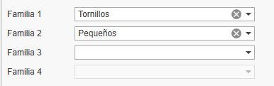
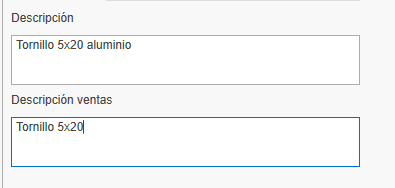
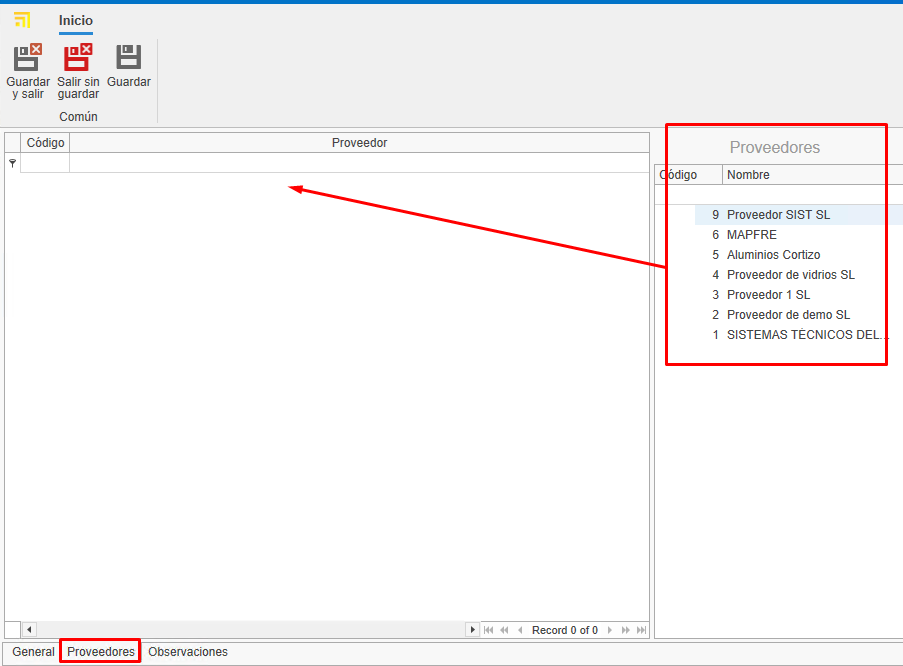
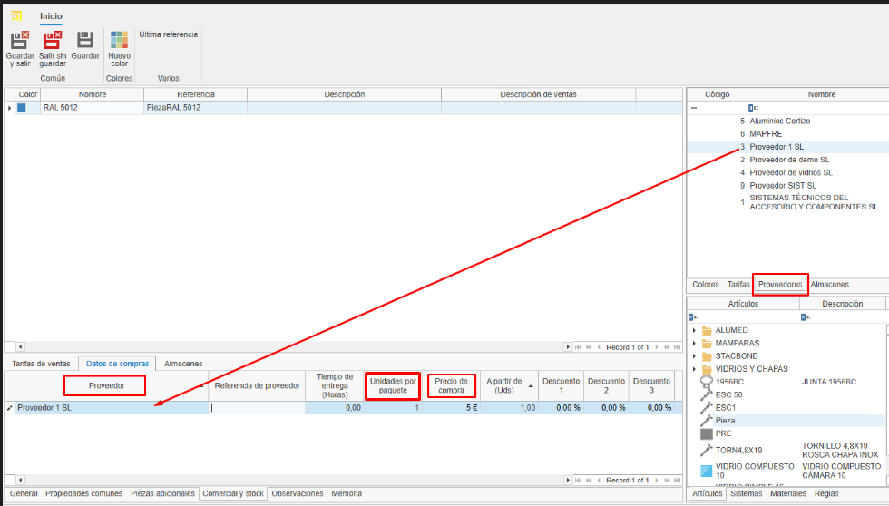
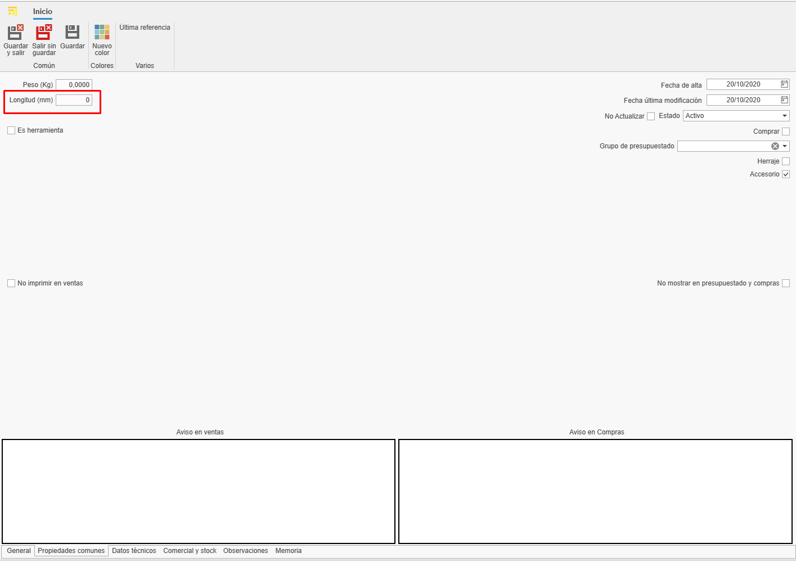
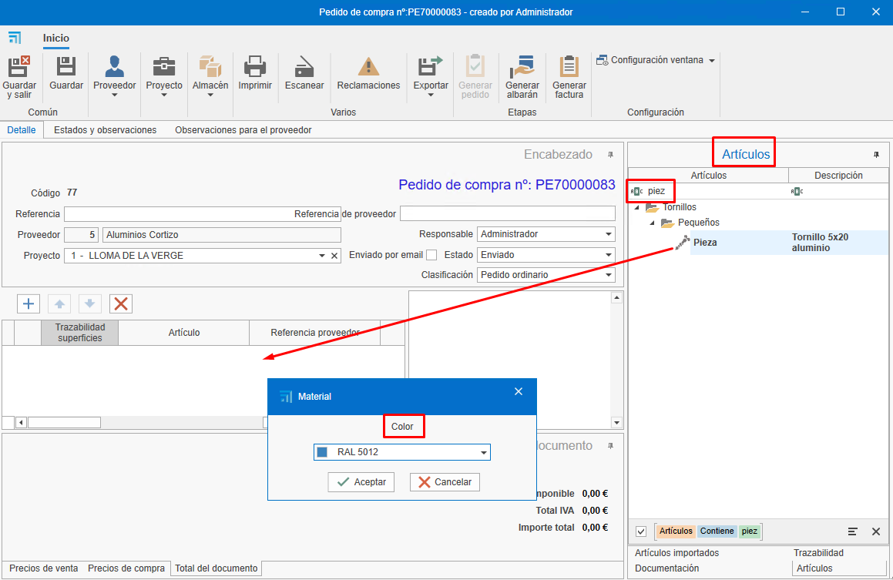

# Creating custom materials in enMATERIALS

---

## 1. Introduction

This guide explains how to create and manage custom materials in enMATERIALS. Follow the steps carefully to ensure materials are defined and organized correctly.

---

## 2. Material definition

Materials can be classified into different types according to their properties. The main types are described below:

### 2.1 Material types

- **Pieces**: Calculated per unit; the most common and easiest materials to define.
- **Bars**: Calculated per linear meter and require additional information such as length.
- **Surfaces**: Calculated per square meter and may include extra attributes.
- **Seals / Gaskets (Juntas)**: Calculated per linear meter and have special application specifications.

### 2.2 Items and colors

Materials are defined in the **Items** section; finishes are managed in **Colors** and raw materials in **Materials**.

---

## 3. Creating materials

To register a material, follow these steps:

### 3.1 Define an item

1. Go to the **Items** section.

   
   

2. In the **General** tab assign a reference, a calculation type and a material.

   

3. Organize items using classification fields such as "Family1", "Family2", etc.

   

4. Complete the purchase description (for suppliers) and the sales description (for customers).

   

5. Assign a base material by dragging it from the materials tree on the right pane.

   

6. Add images to the item. Optimize images to avoid database performance issues.

   

7. In the **Warehouse Information** section indicate for that article some fields such as:

   - **Main warehouse**: Defines the warehouse where the article will be located by default in the system.
   - **Location**: Specifies the exact physical location within the warehouse (shelf, aisle, level, etc.).
   - **Assembled at destination**: By checking this box, the article will be configured for assembly at destination by default. These materials will appear at the Picking station in enCONTROL.
   - **Stock control**: By activating this option, the article will be included in the stock replenishment section for inventory tracking.

      

> **Note:** The **General** section is common to all calculation types.

### 3.2 Creating colors

1. Go to the **Colors** section.

   
   

2. Assign a reference, name and a color or texture.

   

3. Assign a supplier from the **Supplier** tab by dragging the supplier from the right pane.

   

### 3.3 Creating a base material

1. Go to the **Materials** section.

   
   

2. Enter the name, color and check the **Material** box to mark it as a raw material.

   

> **Note:** To automatically generate RAL color swatches and base materials, select **Essentials** on the Home ribbon.

   

   
   

---

## 4. Supplier management

Before registering a material, verify whether the supplier already exists in ENBLAU under Purchases → Suppliers. If not, create the supplier following the defined standards.

   

---

## 5. Commercial and stock

After defining the material, complete its commercial and stock information.

### 5.1 Purchase data and suppliers

Assign suppliers, units and purchase prices per color of the material.

   

> **Note:** You can add a supplier reference if it differs from the one in the database.

### 5.2 Reference assignment

Each color/material will have a unique reference _(Item Reference + Color Reference)_. Drag one or more colors from the Colors tab on the right pane.

   

---

## 6. Material typology and additional data

### 6.1 Pieces

- Individual materials managed per unit (accessories, screws, etc.).
- Priced per unit.
- In the **Common Properties** tab you can add custom fields if needed.

   

### 6.2 Bars

- Materials defined by length and other technical attributes.
- Priced per linear meter.
- In the **Common Properties** tab indicate the bar length (mandatory).

   

- For profiles, add optional information such as safety distance and minimum/maximum remnant length.

   

> **Note:** Sections like Typology, Role, Technical Data, Discounts and Rules are not required for creating custom materials — they are relevant only to drawn materials.

### 6.3 Surfaces

- Materials defined per square meter (glass, sheets, etc.).
- Priced per m².
- In the **Common Properties** tab indicate the height and width of the surface.

 

- In the **Valuation and technical data** tab enter details depending on the surface type and requirements. For example: thickness, surface type, prices per m² (check **m² by supplier** if price varies by supplier), etc.

 

### 6.4 Seals / Gaskets (Juntas)

- Materials defined per linear meter.
- Priced per linear meter.
- In the **Common Properties** tab you can indicate the length if necessary.

   

---

## 7. Standards to follow

To ensure correct management follow these standards:

- Use uppercase for names and references.
- Verify suppliers and materials exist before registering them.
- Keep a consistent format for material and color references.
- Always save changes.

---

## 8. Creating ENBLAU purchase documents

To check whether an item is registered open ENBLAU and create a purchase document:

1. Create a purchase order and select the supplier.
2. In the purchase order find and add the material from the right pane. Drag and select the associated color.

   

3. Validate the price assigned to the supplier.

   

   - If the material has more than one supplier assigned you can select the desired supplier by double‑clicking it.

---

## 9. Creation of enCLAD systems and materials

Creation of systems and materials for **ventilated facades** in **enCLAD**.

---

### 9.1. Systems

From the start window, in the top bar, access **System**.

- To create a new system, select **New** in the top bar.

---

#### 9.1.2. Properties

From the **Properties** tab, located at the bottom, the following system fields are defined:

- **Name**
- **Description**
- **Supplier**
- **Family 1 and 2** (organization by levels)
- **Image**
- **Status**: Active, Temporarily disabled or Discontinued.
- **System typology**  
  In this case, check the **Ventilated facade** box.

From the **Related articles** tab, at the bottom, the list of materials linked to the system is displayed.

---

#### 9.1.3. Ventilated facade

From the **System type** tab, at the top, a window will be displayed where you can select the system type:

- Hanging system
- Male-female system
- Bonded system
- Riveted system

In the ***left side window***, the specific parameters of the system type are defined.

In the ***bottom window***, other common parameters among the different system types are defined, such as:

  - Standard end distance
  - Minimum footprint – Vertical
  - Maximum footprint – Vertical
  - Standard footprint – Vertical
  - Minimum footprint – Horizontal
  - Maximum footprint – Horizontal
  - Standard footprint – Horizontal
  - Minimum architrave
  - Maximum architrave
  - Standard architrave
  - Allow architrave (checkbox)

In the ***central window***, the design of the ventilated facade corresponding to the selected system type is displayed.

  If the system type is **Hanging system**, an additional window is enabled for defining the machining design:

  - **Hanging machining tab**  
    Allows importing the drawing in `.dwg/.dxf` format.
  - **Other machining tab**  
    Allows defining the machining using parameters.

In the ***right side window***, **System materials**, the corresponding articles are added to the system using dropdown fields:

  - Sliding rail
  - Formed rivet
  - Hanging support
  - Formed flat bar
  - Bracket reinforcement

> ℹ️ **Note:** Depending on the selected system type, different parameters will be enabled.

From the **Options** tab, at the bottom, a window will be displayed with the **corner** options available depending on the system type.

From the **Trims** tab, at the bottom, a window will be displayed where you can define:

**Trim options:** Define the trim options for the system in the option deployment.

   - Coping
   - Bottom trim
   - Cavity closure
   - Lintel window
   - Windowsill window
   - Jamb window
   
**Values:** Define the values for each selected option. 

**Folds:** Define the length and rotation of the folds for each selected value. 

From the **Stiffeners** tab (only available for hanging type systems), the list of stiffener type materials linked to the system is displayed.

---

#### 9.1.4. Clone systems

From **Systems**, in the top ribbon, the **Clone** option is available.

This functionality copies all the properties of the selected system in the list.

---

### 9.2. Definition of enCLAD articles

Define articles from the articles module:

Create a new article:

---

**1. General**  

Fill in the general information fields according to the selected calculation type:

   - **Bar**
   - **Piece**
   - **Joint**
   - **Surface**

   

   > ℹ️ **Note:** It is mandatory to indicate the ventilated facade system to which the material will be linked.

---

**2. Common properties**  

Fill in the common properties fields.  
Depending on the material's calculation type, different fields will appear.

   **Examples:**

   - **Bar**

   - **Spacer piece**

---

**3. Role**  

Check the profile role type (only for **bar** type articles) and define its value in the ventilated facade section.

   

---

**4. Technical data** 

Import the `.dwg/.dxf` file of the material and define the drawing dimensions, such as:

   - Interior dimensions
   - Exterior dimensions
   - Depth
   - Insertion point
   - Other parameters

> ℹ️ **Note:** The **Technical data** tab is only available for **bar** and **joint** calculation types.

---

**5. Rules**  

Assign a rule to the profile (only for bars), by dragging a previously defined rule from the bottom right side window, in the **Rules** tab.

**6. Commercial and stock (assign colors)**

Each color and material will have a unique reference _(Article Reference + Color Reference)_. Drag one or more colors from the color tab in the right window, from the **Commercial and stock** tab.

   

> ℹ️ **Note:** Information on how to create new colors go to [3.2. Creation of colors](#32-creation-of-colors).

---

### 9.3. Definition of rules

From the start section, access the list **Article addition rules** and select **Rules in profiles**.

Create a **New** rule in profiles.

---

**1. Properties**  

Fill in the rule properties fields:

   - Name
   - Description
   - Families (folder levels)

---

**2. Related articles**  

Relate the **bar** type articles by dragging them from the right side window in **Articles**.

---

**3. Restrictive systems**  

Indicate the systems to restrict for that rule, by dragging them from the right side window in **Systems**.

---

**4. Accessories**  

Indicate the option and/or the article to be generated, by dragging it from the right side window in **Accessories**.

> ℹ️ **Note:** A different configuration can be defined for each calculation type from the corresponding tab at the bottom of the window.

## 10. Conclusion

By following this manual, you will be able to register and manage materials efficiently in the system, ensuring proper organization and optimization of purchasing and sales processes.

---

---
