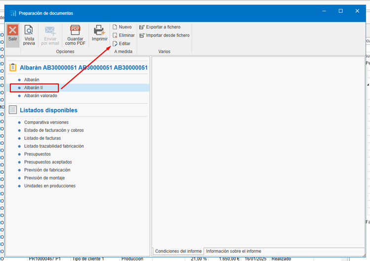
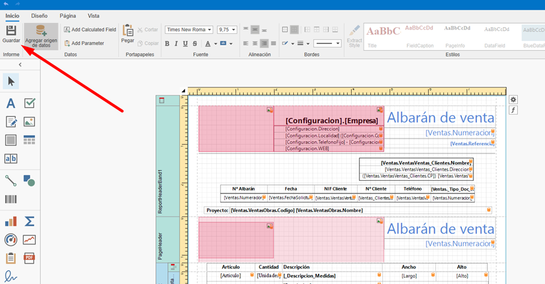

# Creating and editing custom reports

---

## 1. Introduction
This guide explains how to create and modify report templates by cloning and editing existing reports — without needing to build a template from scratch. The workflow is designed to be simple and avoid confusion, allowing users to adapt reports efficiently to their needs.

---

## 2. Creating a custom report
To create a report based on an existing one, follow these steps:

1. **Locate the base report**:  
    - Navigate to the report you want to use as the basis for your new custom report.    

2. **Create a copy of the report**:  
    - Choose the option to create a new report from the existing one. This creates an exact copy of the original report that you can modify without affecting the base report.

    

    
---

## 3. Editing the report
After creating a copy of the report, personalize it as follows:

1. **Open the newly created report**:  
    - Access the report you just copied.

2. **Open edit mode**:  
    - Select the edit option to start making changes.

    

3. **Make the required changes**:  
    - Modify fields, sections or data as needed. You can add, remove or adjust information according to your requirements. Use the available editing tools to update the template:

    

4. **Save the report**:  
   - Once changes are complete, save the document to finish editing.

        

---

## 4. Removing extra elements
If the report requires deeper modifications you can remove sections or unnecessary data before saving the final version. To do this:

1. **Identify unnecessary elements**:  
   - Review the report and determine which sections or data are not relevant to your purpose.

2. **Remove elements**:  
   - Use the delete option to remove elements you don't need.

    

    - For some reports (for example a Delivery Note) you may need to remove part of a script. Open the Script section:

     

    - If the unwanted lines are present in the script, delete them:

    

     

    - Return to the Designer section:

         

3. **Save your changes**:  
   - Make sure to save the report after performing deletions.

## 6. Using the new template
Once the new report is created, select it and go to **Preview**:

   

      

---

## 5. Final considerations
- **No need to configure a new template**:  
  This workflow lets you modify reports without creating a template from scratch.

- **Quick and simple process**:  
  Cloning and editing reports is an efficient way to customize documents.

- **Final review**:  
  Before saving the report, review it carefully to ensure it meets the required specifications.

---
