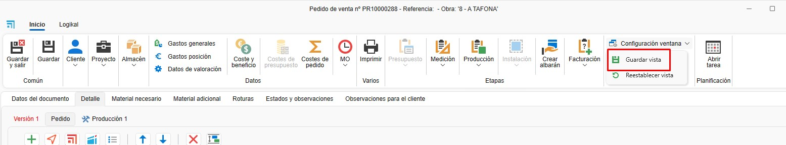

# Filter management

---

## 1. Introduction
This guide explains how to use filters and custom filters. Filters speed up searches and help organize list views across the applications.

## 2. Managing filters in lists

Filters let you customize how documents appear in lists. Follow these steps:

### 2.1 Accessing filters
- Use the header filters in any list to choose which columns and data you want to see.

  

- For example, you can create a filter for "Quotes" that shows only the columns you need (company, project, request date, document status, project engineer, document type, etc.).

  

- In the search field below the header there is an **ABC** icon where you can select the conditions to match when searching a value.

   

- To filter by specific values, click the funnel icon in the header and select the values you want to include.

  

- Use `Ctrl + F` to search within the list.

  

### 2.2 Save custom filters
- Arrange columns to suit your needs. Right‑click any header to add, remove or reposition columns.

  

- You can also drag columns to move or remove them.

  

- From **Filters**, open **Filter management** and add a new filter.

  

- Save the filter with a specific name (e.g. "Quote 2").

  

### 2.3 Save view
- From any document list or project view you can arrange columns and filters and then save the view via Configuration window → **Save view**:

  

  The next time you open the list the saved view will be applied.

> **Note:** Each user can have their own saved filters and views.

