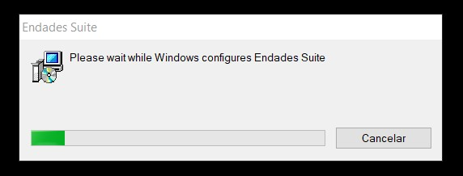

# ENBLAU Update

---

## 1. Introduction

This guide explains how to update ENBLAU to the latest available version.

---

## 2. Update steps

> ⚠️ **Important:** Before starting, ensure NO USERS are connected to ENBLAU. From Administrative Tools → Team Management → Shared Folders → Open Files you can check if anyone is currently using the app.

   
   
   

If ENBLAU is installed on a server, perform the update from that server — never from a workstation connected via a network drive.

### 2.1 ENBLAU

1. Open ENBLAU on the server (if applicable).
2. At the bottom of the home screen click **"New version available"** (it appears in red along with the latest version number).

   

3. A **New version** window will open where you can review release notes before installing. Click **Open inUPDATE** to continue.

   

### 2.2 enUPDATE

1. When you open *enUPDATE* from ENBLAU the updater window will appear. You can also run enUPDATE directly without opening ENBLAU first.
2. On the ribbon click **Download and install**. The latest ENBLAU version will be downloaded automatically (progress is shown on the progress bar).

   

3. When the download finishes a confirmation message will appear asking for permission to proceed with the installation.

   

### 2.3 Installation

> ⚠️ **Important:** Make sure ENBLAU is completely closed before starting the installation.

1. After confirming installation, the **Endades Suite Setup** window opens. Follow these steps:

     

   - Accept the license terms and continue.

     

   - Verify the ENBLAU installation path is correct.

       

   - Click **Install** to begin.

      

   - Complete the installation.

     

### 2.4 Database update

1. After installation, open ENBLAU on the machine where you performed the update.
2. On startup the system will prompt to update the database. Click **Yes** to proceed.

   

---

Done — you can now use the latest updated version of ENBLAU.

---

## 3. Uninstall and reinstall ENBLAU

If the update fails (for example because users were connected or another error occurred) you may need to uninstall ENBLAU completely and perform a fresh install.

### 3.1 Uninstall Endades Suite

1. On the machine where ENBLAU is installed open the Windows Start menu and search for **Add or remove programs** (name may vary by OS version).

   

2. In Settings → Apps & features locate **Endades Suite**.

3. Click the application and select **Uninstall**. Follow the normal Windows uninstall process.

   

   

### 3.2 Install ENBLAU

1. After uninstalling, open the ENBLAU installation folder (for example:
   **`C:\ENBLAU`**).

2. Open the **Downloads** directory inside that folder.

   

3. There you will find multiple installer versions. Sort by name or date to locate the latest available version.

   

4. Open the folder for the latest version and run **`Installer.msi`** by double‑clicking it.

   

5. The **Endades Suite Setup** installer will open. Follow the same steps described in [2.3 Installation](#23-installation).

---

📌 **Note:** If after reinstalling ENBLAU the system prompts to update the database, follow the steps in [2.4 Database update](#24-database-update).
