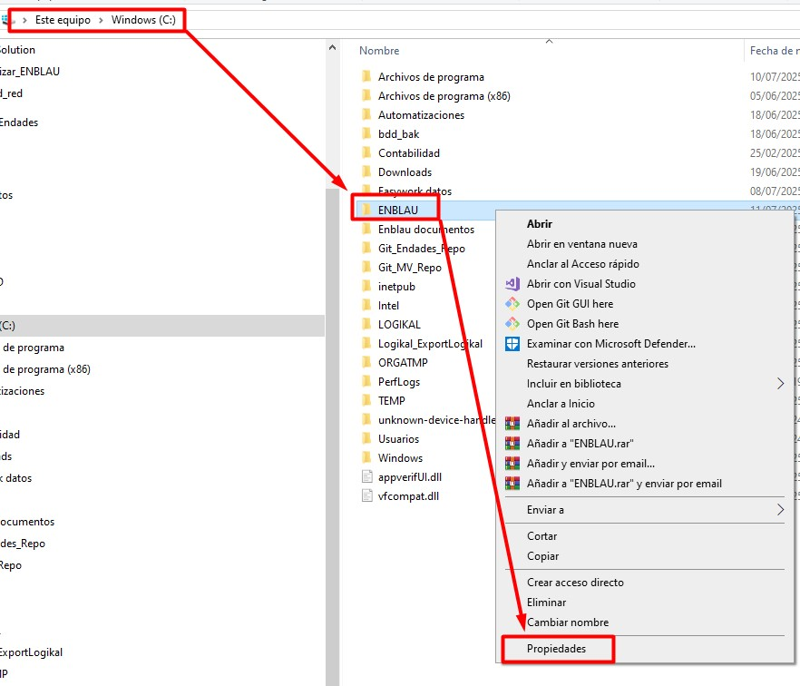
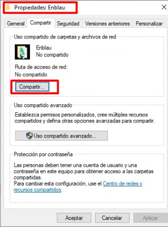
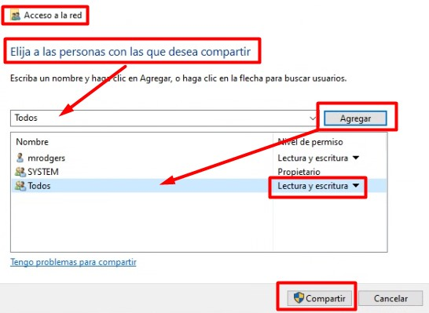
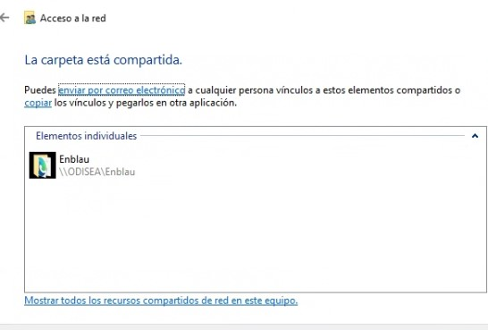
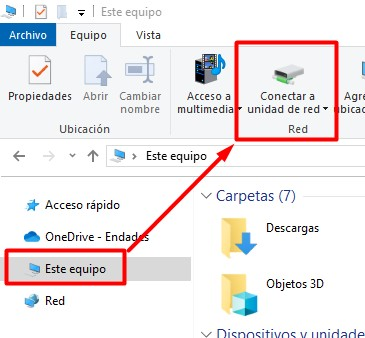
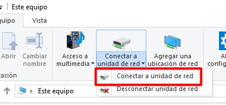
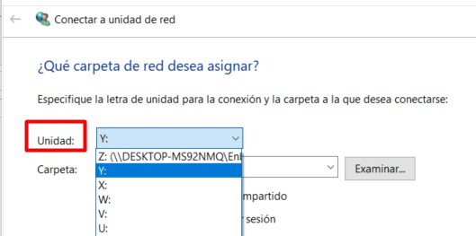
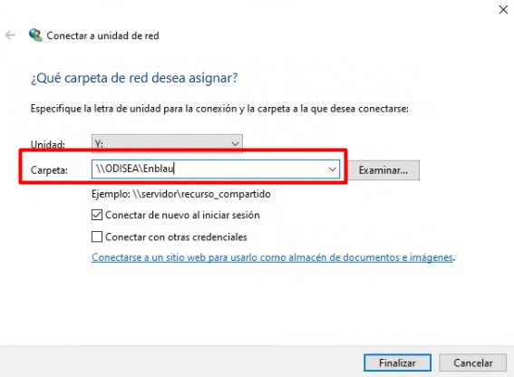
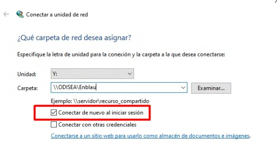
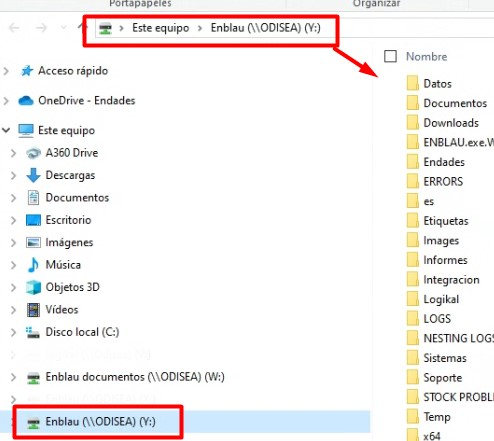

# Map a Network Drive

---

## 1. Introduction

This guide explains, step by step, how to map a shared network drive on a Windows PC using the shared folders **ENBLAU** and **Enblau Documentos**.

> **What is a network drive?**  
> A network drive is a folder shared on another computer or server within a local network that you can map so it appears as an additional drive on your PC (like drive C: or D:).

---

## 2. Share the folders from the server

1. On the server, share the **ENBLAU** and **Enblau Documentos** folders with all network users.

   

2. Go to the **Share** tab and click the **Share...** button.

   

3. In the **Network access** window, select **Everyone** from the user list (if it doesn't appear, type it manually) and click **Add**.  
   Make sure it has **Read/Write** permission, then click **Share**.

   

   

---

## 3. Prerequisites

Before starting, make sure you have the following:

- Be connected to the local or corporate network.
- Know the shared folder path (for example: `\\server\\folder`).
- Have the necessary access permissions.
- Have the username and password if the folder requires credentials.

---

## 4. Map the network drive

### 4.1. Open File Explorer

- Press `Windows + E` or click the folder icon on the taskbar.

### 4.2. Go to "This PC"

- In the left-hand panel, select **This PC**.

   

### 4.3. Map network drive

- At the top, click the **Computer** tab, then choose **Map network drive**.

   

### 4.4. Choose a drive letter

- Select an available drive letter (for example: `Y:`).

   

### 4.5. Enter the shared folder path

- In the **Folder** field, enter the UNC path (for example: `\\server\\folder`).

   

- Check **Reconnect at sign-in** if you want the connection to persist after restarting the PC.

   

### 4.6. Enter credentials (if requested)

- Provide the username and password that have access to the shared folder.

### 4.7. Finish

- Click **Finish**. If everything is correct, the network drive will open and appear like any other drive in File Explorer.

   

---

## 5. Verification

- Verify that the network drive is available in **This PC** under the letter you selected.

> **If it does not connect:**

> - Check that the path is typed correctly.

> - Ensure the credentials are valid.

> - Confirm that you have network connectivity.

---
