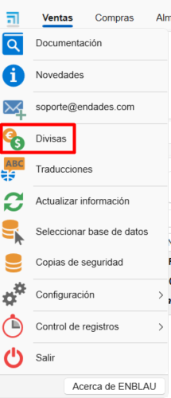

# Currencies

---

## 1. Introduction

This guide explains step by step how to use currencies in ENBLAU and how to correctly reflect them in reports, respecting the exchange rate set for each currency.

---

## 2. Defining currencies

From the **Currency** section you can define exchange rates between currencies.  
For example:

- **Base currency: EUR**
- **Defined rate:** 1 € = 0.86 £ (**GBP**)

This allows working with multiple currencies in sales documents.

  

---

## 3. Applying a currency in reports

To use a currency in sales documents (for example, an order):

1. Select the **desired currency** (e.g. GBP – British Pound).
2. Optionally, select the **document language** as well.
3. Print the report.

The system will automatically convert amounts according to the exchange rate defined at that time.

  

---

## 4. Used currency (historical rate)

The **Used currency** option lets you keep a historical record of the exchange rates applied to each document.

This is useful to:

- Preserve the original rate without having to change it manually.
- Ensure consistency in historical documents even if the exchange rate has changed later on.

### How to use it

1. Open a sales document (e.g. an order).
2. Go to: **Data → Used currency**.
3. The **Document currencies** window will open.
4. Check the box in the **Used** column to apply the rate that corresponds to the selected date.

---

> **Note:** This feature is especially useful for documents with older dates or for operations that require retaining the original exchange rate.
