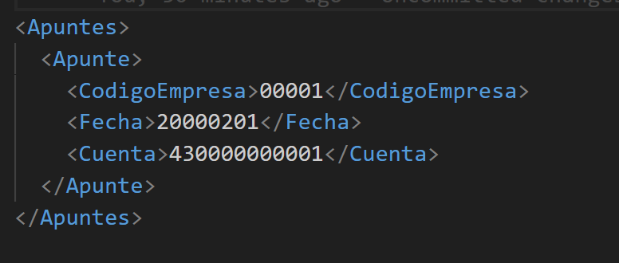

# Accounting import

## 1. Objective

Define the technical requirements so that ENBLAU can generate files compatible with the accounting software by transforming data using **XSLT** and exporting to specific formats with the accepted encodings.

---

## 2. General requirements

### 2.1. Input format

- The external system must generate files in **XML** format as the basis for transformation.
- The XML file must comply with the structure defined by the XSD schema (if applicable).
- A clear field-mapping protocol must be provided.

### 2.2. Transformation

- The XML-to-import-format transformation will be performed using an **XSLT** file provided by the vendor or developed internally.
- The XSLT file should conform to the 1.0 or 2.0 specification depending on compatibility with the system's XSLT engine.

### 2.3. Output formats

- The transformation result must be produced in one of the following formats, depending on the accounting operation type:

   | File type | Description |
   |-----------|-------------|
   | `.dat`    | Structured plain-text fixed-width format |
   | `.txt`    | Delimited text (e.g., tab, comma) |
   | `.xml`    | Compatible XML structure |
   | `.xlsx`   | Spreadsheet (Excel) |

### 2.4. Text encoding

- File encoding should be one of the following, depending on the file type:

   | Encoding | Recommended for |
   |----------|-----------------|
   | ANSI     | legacy `.txt`, `.dat` |
   | UTF-8    | modern `.xml`, `.txt` |
   | UTF-16   | `.xml` with special characters |
   | UNICODE  | general multi-language files |

---

## 3. Integration protocol

### 3.1. XSLT template

The accounting software vendor must provide the base XSLT file and documentation describing the file format and transformation protocol.

### 3.2. Field mapping specification

A document must be delivered that details:

- Source system field name
- Positions
- Length (characters)
- Data type (numeric, text, date)
- Required format (e.g., `dd/MM/yyyy`, `#,##0.00`, etc.)

Example mapping table:

The following shows the expected structure for the import file for **Record Type = 0**, corresponding to **Create Entries without VAT**.

    | Positions | Length (characters) | Field description        | Notes                                                                     |
    |-----------|---------------------|--------------------------|---------------------------------------------------------------------------|
    | 1         | 1                   | Format Type              | Constant `5`                                                              |
    | 2-6       | 5                   | Company code             | Values between `00001` and `99999`                                        |
    | 7-14      | 8                   | Entry date               | Format `yyyymmdd` (Example: 1 Feb 2000 → `20000201`)                      |
    | 15        | 1                   | Record Type              | Constant `0`                                                              |
    | 16-27     | 12                  | Account                  | Level 6 to 12. If the account does not exist it will be created automatically. |

Notes:

- This format must be generated as a plain-text file (`.txt` or `.dat`) with **ANSI** encoding.
- Fields must occupy exactly the indicated positions. There must be no delimiters.
- All records must conform to the fixed-length structure to be valid.

---

## 4. Transformation from XML using XSLT

The above structure can be generated from an input XML file transformed with an XSLT template. It is recommended that the XML file contains at least the following nodes:

### 4.1. Example of generated file

Below is an example line generated for the `.dat` fixed-width file according to the defined fields:

1. Example values:

    - Format Type: `5`
    - Company code: `00001`
    - Entry date: `20250728` (28 July 2025)
    - Record Type: `0`
    - Account: `430000000001`

2. Resulting `.dat` line:

500001202507280430000000001

Detail by sections:

    | Positions | Content         | Description           |
    |-----------|-----------------|------------------------|
    | 1         | `5`             | Format Type           |
    | 2-6       | `00001`         | Company code          |
    | 7-14      | `20250728`      | Entry date            |
    | 15        | `0`             | Record Type           |
    | 16-27     | `430000000001`  | Account               |

Important:

- Do not include separators, extra spaces, or line breaks between fields.
- Each line represents one record. If there are multiple entries, they must appear on separate lines, one record per line.

Example with multiple records:

    500001202507280430000000001

    500002202507280410000000010

    500003202507280460000000050

---

## 5. Pre-validations

- The XML file must pass structural validation (well-formed and, if applicable, valid against the XSD).
- The XSLT output should be reviewed to ensure compatibility with the accounting import format.

---

## 6. Import/export process from ENBLAU

1. Download the two `.xls` files (sales and purchases) provided by Endades and save them to: **Enblau Documentos\Documentos\Contabilidad**. (We recommend this location because it is a shared folder). If the `Contabilidad` folder inside `Documentos` does not exist, create it.

    

2. Open ENBLAU and go to:
    - Sales → Sales document → Export → **Accounting**.

        

3. An Accounting window will open.
    - Click Add a row.
    - A file explorer will open to select the path where the example file is located (for example: **transform_ventas.xls**).

        

4. A line named `Contabilidad 1` will be generated automatically (you can edit it, e.g., `Contabilidad Ventas`).
5. Select the parameters:
    - Extension: `.dat`, `.xlsx`, `.txt` or `.xml`.
    - Encoding: `ANSI`, `UNICODE`, `UTF-8` or `UTF-16`.
6. The path where the file will be exported in the chosen format will be displayed.

    

7. Then export the file:

    

    - In the export path (in this case, the same as the example file), you will see a file generated with the sales invoice information.
    - If you have any filter applied to the sales documents list, only the data that meets that filter will appear.
    - The exported file will have the format according to the selected extension and the `.xsl` file that applies the transformation (in the exploitation file path). Example:

        
    
    - Once you have exported the file in the correct format from ENBLAU, the next step is to import it into the accounting software you are using.

---

Observations

- Any change in the source XML format or in the structure of the XSLT file must be documented and validated before being implemented in production.
- It is recommended to keep version control for both XSLT files and XML schemas.

---

