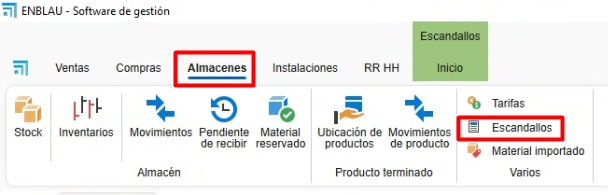
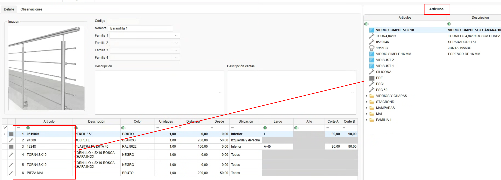
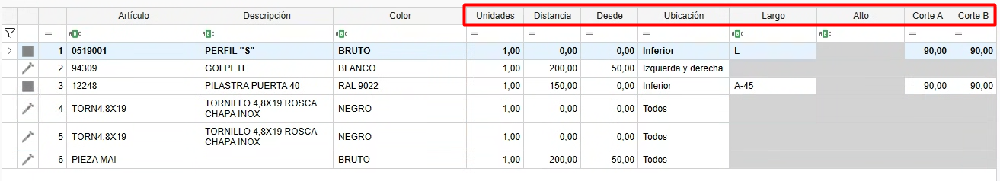
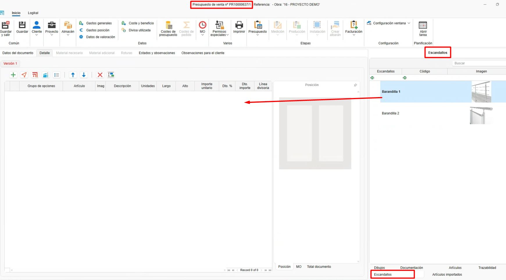
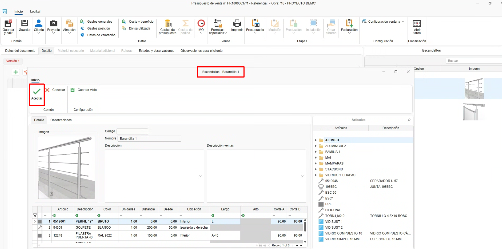
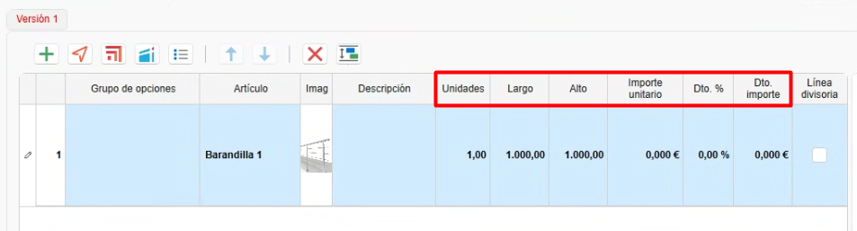

# Bill of Materials (Materials grouping)

---

## 1. Introduction

This guide explains step by step how to use the **Bill of Materials** functionality.  
BOMs are defined in **ENBLAU** by grouping your own materials created in **enMATERIALS**.  
You can group those materials and generate the required quantities based on various conditions such as dimensions, section location, distance, or using formulas.

---

## 2. Bills of Materials

- Access Bills of Materials from **Warehouses → Bills of Materials**.

  

---

### 2.1. Create a Bill of Materials

- To create a BOM, follow these steps:

  1. From the BOM list, click the **New** button to create a new BOM.

     

  2. A window will open where you should fill in the following fields:

     - **Name**: Enter the name of the BOM you are creating.  
     - **Family**: Optional field to specify folders and subfolders where the BOM should be stored. This will later appear in the BOM tree under **Sales documents**.  
     - **Description**: Short description of the BOM.  
     - **Sales description**: Use this if the sales description differs from the general BOM description.  
     - **Image**: Add an image or screenshot that represents the BOM.

       
  
  3. The **Finished product** section is for exclusive use by the **Transformation** workstation in enCONTROL. In this field, the reference of a *piece*-type material previously created in enMATERIALS must be specified.  
    Once the product has passed through the Transformation workstation, the materials defined in the bill of materials breakdown will be automatically deducted, and a stock entry will be generated with the material reference specified in this section.

     

---

### 2.2. Group materials

- Once the BOM is created, the following steps let you **group and generate the required materials**:

    1. From the item tree on the right, drag the materials to be generated for that BOM.

        

    2. Then define the following conditions as needed:

        - **Units**: Number of units to generate for the material.  
        - **Distance**: Specify the interval at which the material should be generated.  
          Example: *1 screw every 100 mm of section.*  
        - **From**: Together with Distance, defines the starting point for counting.  
        - **Location**: Dropdown to indicate the location of the section where the material should be generated.  
          Example: *Top, bottom, right, left.*  
        - **Length**: Specify a fixed length or use a formula.  
          Example: *L-50 → calculates the bar length minus 50 mm.*  
        - **Height**: Specify a fixed height or use a formula.  
          Example: *A-50 → calculates the surface height minus 50 mm.*  
        - **Cut A**: Define the cut type for side **A** of the bar.  
          Example: *Cut at 90° or 45°.*  
        - **Cut B**: Define the cut type for side **B** of the bar.  
          Example: *Cut at 90° or 45°.*

          
      
> **Note:** Fields are enabled depending on the material calculation type (piece, bar, joint or surface).

---

## 3. How to use BOMs

- From any sales document (**Quote**, **Order**, **Production**, etc.), go to the **Bills of Materials** section located on the right side of the document.  
  Then follow these steps:

    1. Drag a BOM into the document position.

        

    2. An editor window for the BOM will open, where you can edit values before accepting.

        

    3. After accepting, you can modify measurements, prices and discounts.  
      If materials have an associated sales price list, the price will be calculated automatically by breakdown.

        
    
    4. Go to **Required material** to list materials with quantities determined by the BOM conditions and create a purchase order for the supplier.

        
