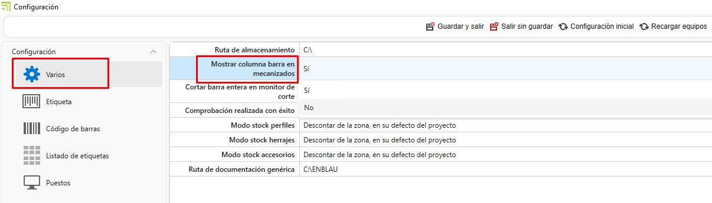
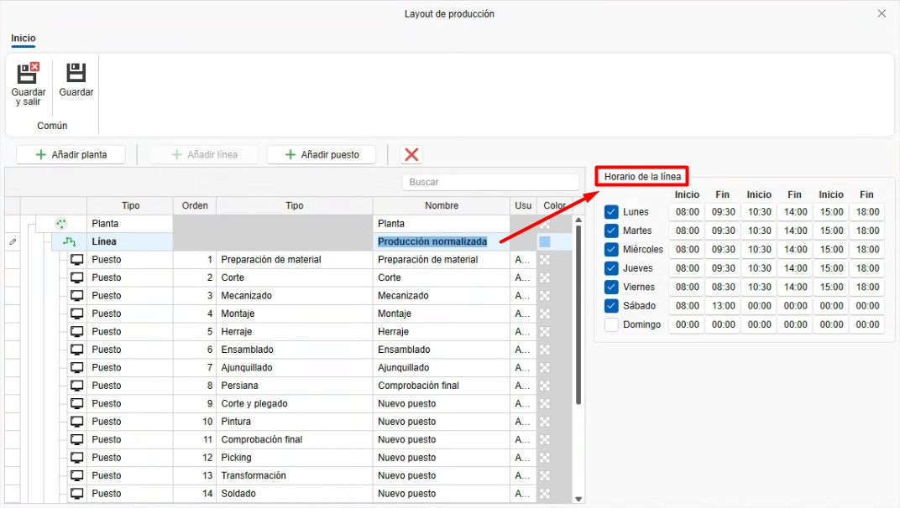
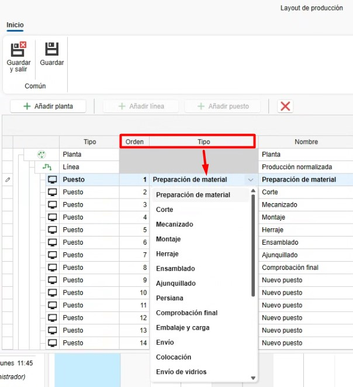
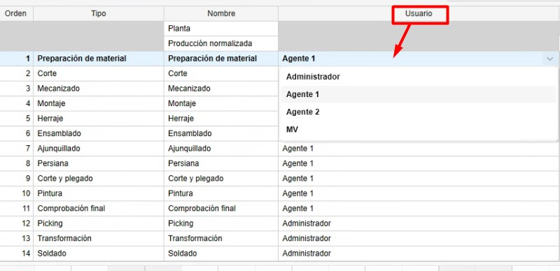
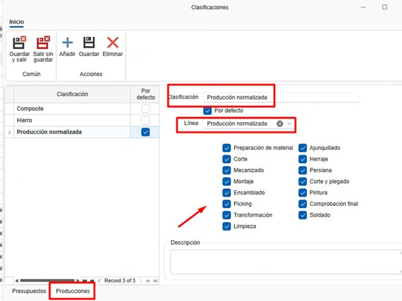

# Configuración inicial de [enCONTROL](https://endades.com/software/encontrol/)

---

## 1. Propósito

El presente manual está diseñado para guiar a los nuevos usuarios en la configuración inicial de enCONTROL. Esta configuración incluye todo lo necesario para poner en marcha la producción.

---

## 2. Configuración en enCONTROL

Acceder a la configuración de enCONTROL (F10) como usuario administrador. Este proceso puede tardar un poco debido a la cantidad de puestos que haya que conectar en red.

### 2.1. Varios

- **Mostrar columna barra en mecanizados**

  

  - Si el valor es **Sí** te mostrará la columna de barra en el monitor.

    

  - Si el valor es **No** solo mostrará la columna de pendientes de mecanizar en el monitor.

    

> ℹ️ **Nota:** Por defecto ese valor estará a Sí.

  
- **Cortar barra entera en monitor de corte**

  

  - Si el valor es **Sí**, al cortar la barra en el monitor se hará de manera automática el corte de las posiciones de la barra indicada, sin necesidad de cortar cada posición. 

  - Si el valor es **No**, al cortar la barra en el monitor se hará por cada hará posición.

> ℹ️ **Nota:** Por defecto ese valor estará a Sí.

- Se define el modo en que se descontará del stock los perfiles, herrajes y accesorios según avanza la producción.

  

  - **No descontar**: No se descuenta de ningún sitio.

  - **Descontar del proyecto**: Se descuenta solo del proyecto, independientemente de la zona.

  - **Descontar de la zona, en su defecto del proyecto**: Se descuenta de la zona indicada y del proyecto. La ubicación de la zona para los materiales a utilizar se define desde el puesto de **Preparación de materiales**. Para que el descuento se realice correctamente, el material debe estar en la zona indicada y asignado al proyecto.

  - **Descontar de la zona**: Solo se descuenta de la zona indicada, independientemente del proyecto.La ubicación de la zona para los materiales a utilizar se define desde el puesto de **Preparación de materiales**. Para que el descuento sea correcto, el material debe estar en la zona indicada.

  - **Descontar del proyecto, en su defecto de cualquier zona**: Se descuenta del proyecto y de cualquier zona.

- En **Ruta de documentación genérica** puedes indicar documentaciones como información del sistema, entre otros, que se pueda ver desde enCONTROL y los puestos.

  

  Ejemplo en un puesto:

  

---

### 2.2. Puestos

- En "**Puestos**" definirás los equipos asociados para cada puesto que esté conectado a la red.

  

---

## 3. Configuración de producción en ENBLAU

### 3.1. Configuración del layout de producción

La configuración del **layout de producción** permite definir la estructura organizativa de la planta dentro del módulo **enCONTROL**, incluyendo plantas, líneas de producción y puestos de trabajo.

- Accede al menú: **Configuración → Producción → Configuración Layout**.

   

- Desde la interfaz de **Layout de Producción**, puedes añadir:

  - **Planta**
  - **Línea de producción**
  - **Puestos de trabajo**

   

- Al seleccionar una línea de producción, se mostrará en el lateral derecho el apartado **Horario de la línea**. Aquí puedes configurar:
 
  - Días de la semana operativos.
  - Hora de inicio y fin de cada turno.

   

- Al añadir un nuevo puesto, se deben definir los siguientes campos:

  - **Tipo**: Indica el tipo de puesto que deseas añadir (por ejemplo: Corte, Montaje, Mecanizado, etc.).
  - **Orden**: Define el orden secuencial de los puestos dentro de la línea.

    

- En el campo **Usuario**, se puede asignar al responsable del puesto. Este usuario será el encargado de operar o supervisar dicho puesto dentro del flujo de producción.

  

> **Recomendación:** Mantén siempre actualizada esta configuración para garantizar un control de producción preciso y alineado con la realidad operativa de la planta.

---

### 3.2. Clasificaciones de producción

Las clasificaciones en producción se usan de manera informativa al crear una producción para que se refleje en las líneas del puesto en enCONTROL.

- Accede al apartado de Ventas - Configuración - **Clasificaciones**.

  

- Desde "Clasificaciones", crea las clasificaciones que sean necesarias e indica la línea y los puestos de enCONTROL.

  

- Al crear una producción desde un pedido de venta, verás que hay un desplegable de clasificaciones donde puedes indicar la clasificación para esa producción.

  

---

### 3.3. Informes de Producción Logikal

- Informes que se requieran y que se generan automáticamente, guardándose como documentación de Logikal en producción. Estos documentos se verán en la ruta de documentación en los puestos de enCONTROL.

- En el presupuesto (producción), accede al apartado de Logikal - **Informes para producción**. Desde allí, marca los informes que quieras que se guarden en producción como documentación en la columna **Para documentación**.

  

> ℹ️ **Nota:** Para el tema de la documentación, no cambies nada en las columnas **Exportación** y **Gestión**.

---

### 3.4. Información adicional

La información adicional es un campo informativo para cuando la producción pase a cola del taller en enCONTROL, de modo que el responsable de taller pueda consultarla.

- Accede al apartado de Ventas - Configuración - **Información adicional producción**.

  

- Desde "Información adicional producción", crea las informaciones adicionales que sean necesarias.

  

- Al crear una producción desde un pedido de venta, verás que hay un desplegable de información adicional donde puedes indicar cómo quieres que llegue esa información a la cola de producción.

  

  

---

## 4. Conclusión

Siguiendo este manual, podrás realizar una configuración inicial de enCONTROL para el uso en la creación de producción.