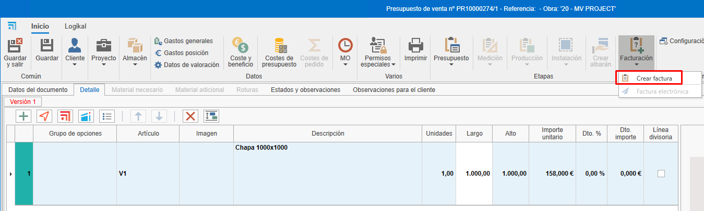
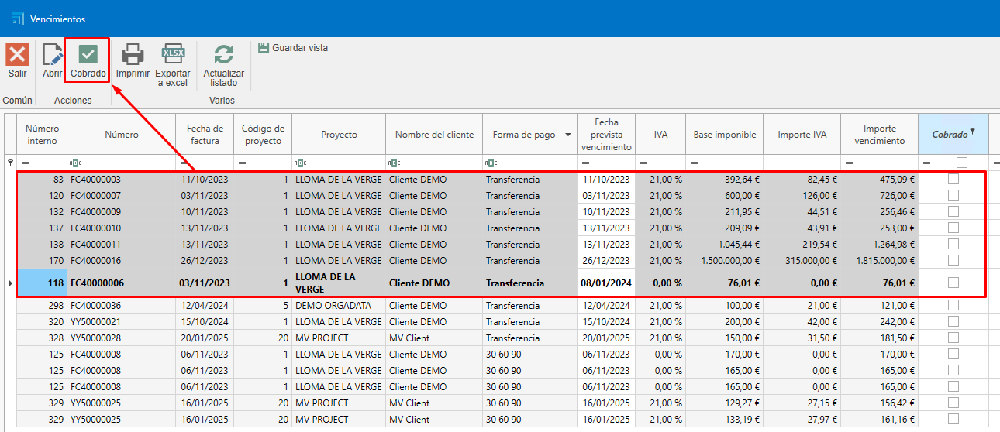
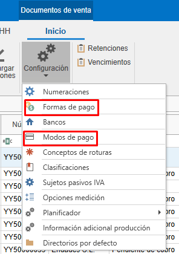
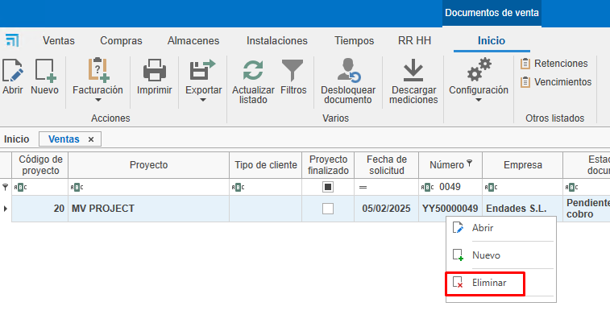
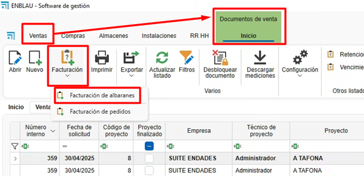

# Facturación

---

## 1. Introducción
Este manual explica el proceso de creación, edición y gestión de facturas. Aprenderás a utilizar filtros, crear facturas desde presupuestos, gestionar cobros y realizar ajustes necesarios.

---

## 2. Creación de facturas desde presupuestos
Para crear facturas a partir de presupuestos, sigue estos pasos:

### 2.1. Crear un presupuesto:

- Añade líneas con los productos o servicios (ej. ventanas, chapas).
- Define cantidades y precios.

    

### 2.2. Generar la factura:

- Accede al apartado de facturación.
- Selecciona "Crear factura" desde el presupuesto.

     

- Elige el tipo de factura:

    - **Factura de anticipo**: Permite cobrar un importe parcial y facturar el resto más adelante.

        

    - **Factura por unidades**: Factura solo las unidades indicadas que quieras facturar. Luego obliga a continuar facturando en el mismo modo (está marcada por defecto).

        

    - **Introducir importe a facturar**: Permite cobrar un importe específico del total de la factura. Luego obliga a continuar facturando en el mismo modo.

        

    - **Introducir porcentaje a facturar**: Permite cobrar un porcentaje específico del total de la factura. Luego obliga a continuar facturando en el mismo modo.

    

- __Factura a origen__ es factura por certificado.

### 2.3. Enviar la factura al cliente:

- Una vez creada, puedes ver la factura en vista previa antes de enviarla o imprimirla.

    

    

     

- Envía la factura al cliente por correo electrónico o imprímela.

    

> **Nota:** La factura se puede generar desde el presupuesto, pedido o albarán. Es recomendable generar las facturas siempre desde el mismo documento, es decir, si haces desde el pedido (el pedido normalmente es el que se acuerda con el cliente), seguir generando las facturas siempre desde ahí para una mejor gestión y trazabilidad.

### 2.4. Estados observaciones

- Al crear la factura en la pestaña **Estados observaciones** te mostrará campos como Fecha, Vencimientos, retención, RE, Descuento P.P.

---

## 3. Gestión de cobros

Para gestionar los cobros de las facturas:

### 3.1. Marcar facturas como cobradas:

- Desde el propio documento de la factura, se puede marcar que la factura está cobrada.

    

- Otra opción es acceder al listado de vencimientos desde "Documentos de ventas".

    

- Filtra las facturas pendientes de cobro.

    

- Selecciona las facturas y márcalas como cobradas. Para seleccionar más de una factura, usa la tecla **Ctrl + Click** o **Ctrl + A** para seleccionar todas las facturas.

    

- Indica el modo de pago (transferencia, pagaré, etc.), la fecha de cobro y la fecha de ingreso en cuenta. Los campos marcados en rojo son obligatorios. Estos campos se pueden configurar previamente en el apartado "Formas de pago".

    

    > **Nota:** En este apartado, como en otros listados de documentos, se pueden utilizar los filtros según sea necesario.

- En el listado de documentos de ventas, aparecerá en la trazabilidad del presupuesto el estado de la factura como "Cobrado".

    

### 3.2. Informes de cobros:  

- Acepta el presupuesto para que genere un pedido (en el caso de que hayas facturado desde el presupuesto).

    

- Utiliza el informe "Estado de facturación y cobros" para ver el estado de las facturas (cobradas, pendientes, porcentaje de facturación, etc.). Filtra por el presupuesto que quieras que se muestre.

    

    

- Utiliza el informe de listado de facturas para ver la información de la factura (fecha, cliente, base imponible, IVA, total de la factura, etc.). Este informe se puede listar desde un rango de fechas o marcando un check que indica que se aplique solo a las facturas que estén en el filtrado del listado.

    

    

    

---

## 4. Facturación desde pedidos

Para facturar desde pedidos, sigue estos pasos:

### 4.1. Facturación desde pedido

- Se puede facturar directamente desde "Pedido", siguiendo los mismos pasos que en el presupuesto. 

- Otra manera de facturar sería crear una producción desde un pedido e indicar la cantidad de ventanas que quieres que estén en esta fase de producción. 

    

    

    

- Una vez confirmes que se han fabricado las ventanas indicadas en la fase de "Producción 1", por ejemplo, puedes ir al pedido y crear una factura indicando la cantidad a facturar.

    

> **Nota:** Se recomienda siempre facturar desde el pedido, ya que es lo que se acuerda con el cliente para aceptar el presupuesto.

- En el caso de que descuentes el total de la factura (unidad) y hayas emitido y cobrado una factura de anticipo, al intentar confirmar la factura, te aparecerá un mensaje para confirmar o no que descuentes el anticipo.

    

- Al confirmar, se descontará el anticipo de la factura.

    

- Al generar la factura para enviar al cliente, verás en detalle lo que se ha cobrado y descontado.

    

---

## 5. Facturación desde albaranes

Si trabajas con albaranes, sigue estos pasos:

### 5.1. Crear albaranes desde pedidos:

- Genera albaranes para las producciones realizadas.

    

> **Nota:** Asegúrate de que los precios y descripciones sean correctos.

### 5.2. Facturar desde albaranes:

- Accede al pedido correspondiente.
- Selecciona "Crear factura" desde el albarán y sigue los mismos pasos anteriores.

    

> **Nota:** Verifica que los precios y las unidades coincidan con lo acordado con el cliente, ya que puede variar dependiendo si hay alguna modificación en la producción (ej. cambiar la medida de la ventana) y que puede afectar el precio y facturar con un precio distinto del pedido.

---

## 6. Formas y modos de pago

Configura las formas y modos de pago según tus necesidades:

### 6.1. Formas de pago:

- Define cómo se pagará (ej. 30 días, 60 días, 90 días). Se pueden crear tantas formas como se necesiten con diferentes configuraciones. 

    

- Configura si es necesario exigir el modo de pago, la fecha real de vencimiento, la fecha de ingreso y el banco. Esta configuración se reflejará en el apartado de listado de vencimientos cuando se marque la factura como cobrada y aparezcan los campos en rojo como obligatorios a rellenar. 

    

- Establece el número de vencimientos y los porcentajes de pago.

    

### 6.2. Modos de pago:

- Indica cómo se realizará el pago (transferencia, pagaré, contado).

    

- Configura si es necesario exigir la fecha de cobro, el banco o la fecha de ingreso en cuenta.

    

---

## 7. Rectificativas y anulaciones

Si necesitas corregir o anular una factura:

### 7.1. Facturas recién creadas: 

- Si la factura no ha sido enviada, elimínala y vuelve a crearla con la misma numeración. Hay diferentes modos de eliminar la factura:

    - Desde el listado de ventas, busca la factura, haz clic con el botón derecho sobre la línea y selecciona "Eliminar".

         

    - Desde la factura, abre la factura y elimínala desde la pestaña "Factura", haz clic con el botón derecho y selecciona "Eliminar".

        

    - Desde la factura, arriba a la izquierda, haz clic sobre el logo de ENBLAU y selecciona "Eliminar".

        

### 7.2. Facturas ya enviadas:

- En el caso de que la factura ya haya sido enviada, emite una factura rectificativa.

    

- Asegúrate de que cumpla con los requisitos de Hacienda.

## 8. Proforma

### 8.1. Crear numeración proforma

- Para crear una numeración de tipo proforma, desde **Documentos de venta - Configuración - Numeraciones**

    

    - Para el tipo de documento factura marcar la casilla de la columna **Factura proforma** para la numeración definida como proforma.

        

### 8.2. Crear proforma

- Para generar una Proforma antes de emitir la factura, desde un documento de venta ir a **Facturación - Crear factura**

    

- Abrirá una ventana **Nueva factura** desde ahí marcar el check proforma e indicar la numeración del tipo proforma.

    

- Se creará una factura de tipo proforma.

    

- Desde el documento proforma se puede imprimir y mandar por correo para su confirmación. 

    

- Una vez confirmado por parte del cliente convertir la **proforma en factura**. 

     

    - Se abrirá una ventana para seleccionar la numeración de la factura.

          

         

- Una vez confirmado por parte del cliente convertir la **proforma en factura**. 

    

### 8.3. Proforma agrupado

- Para generar una proforma agrupada, crear desde el listado de documentos de venta **Facturación - Facturación de albaranes/Facturación de pedidos**.

    

    

    

## 9. Confirmación de factura

- Para generar un documento de confirmación que no sea una proforma antes de emitir la factura al cliente, puedes hacerlo desde: **Documentos de Venta → Facturación → Facturación de Pedidos**.

    

- Abrirá una ventana **Nueva factura** desde ahí buscar el cliente que quieres generar el documento: 

    

- En la parte de abajo te aparecerá los pedidos pendientes de facturar de ese cliente en la pestaña “Tipo de factura y cabecera”. Luego en la columna **Facturar** con un doble click seleccionar los pedidos que deseas generar: 

    

- Elegir el "Tipo de facturación" de como se debe generar el documento:

    

- Abajo en la pestaña “Detalles de facturas” podrás ver todas las posiciones de cada pedido y desde la cinta de arriba Exportar detalle tienes la opción de exportar en .pdf o .xls: 

    

    - Como ejemplo verás en PDF: 
    
    

---
    
> **Gestión de filtros** Usar filtros y filtros personalizados para optimizar la búsqueda en los listados. Para más información, sigue este enlace: [4. Gestión de filtros](/Utilidades/4.UT_Gestion_Filtros)

---

## 10. Descuento pronto pago

El **descuento por pronto pago** es una reducción que se aplica al importe total de una factura cuando el cliente realiza el pago en un plazo corto previamente establecido. Su finalidad es incentivar el pago anticipado y facilitar el flujo de caja del proveedor.

### 10.1. Aplicación recomendada

Se recomienda **incluir el descuento desde el pedido**, en el apartado **"Estados y observaciones"**, para que se refleje correctamente en la factura final, ya sea esta generada a partir del **pedido** o del **albarán**.

> ⚠️ **Importante**: Aplicar el descuento directamente desde la factura puede generar **descuadres en informes** como *"Estado de factura y cobros"*, ya que el importe facturado no coincidirá con los valores previstos originalmente.

### 10.2. Cálculo del descuento

Existe un **check de configuración** que determina cómo se aplica el descuento:

- Si el check está **activado**, el descuento se aplica **sobre el total con IVA incluido**.
- Si el check está **desactivado**, el descuento se aplica **solo sobre la base imponible**, y luego se calcula el IVA sobre el importe neto.

    

---

## 11. Facturación de albaranes

### 11.1. Compras

Desde el apartado **Documentos de compra**, existe una opción específica para la **Facturación de albaranes**.  
Al seleccionarla:

- Se abre una ventana donde puedes **escoger el proveedor**.
- A continuación, se muestra un **listado de albaranes**, donde es posible:
  - **Filtrar** por proyecto, fechas, documentos, etc.
  - **Seleccionar** los albaranes que deseas facturar, marcando la casilla correspondiente en la columna **Seleccionar**.

    

### 11.2. Ventas

En el módulo de **Documentos de venta**, hay una opción similar para la facturación de albaranes.  
Al acceder:

- Se abre una ventana donde puedes **indicar el proyecto y/o el cliente**.
- El sistema mostrará el listado de albaranes correspondientes.
- Con un **doble clic** sobre la casilla de la columna **“A facturar”**, podrás seleccionar fácilmente los documentos que deseas incluir en la factura.

    

    

---

## 12. Facturación electrónica (FACTURAE)
Facturae es el formato estándar de factura electrónica utilizado en España, definido por el Ministerio de Asuntos Económicos y Transformación Digital. Está basado en XML y establece una estructura uniforme para el intercambio de facturas electrónicas, permitiendo su validación, firma electrónica y archivo seguro.

- Para generar una factura electrónica desde ENBLAU, es necesario que en **Empresas**, **Clientes** y **Formas de pago** tengan completados ciertos campos obligatorios.

    **Empresa:** Los campos son CIF, Dirección, localidad, CP, Provincia y País. Desde el apartado, Configuración - General - **Empresa**.
    
    
    
    

    > **Nota:** Si no hay empresa creada en el apartado **Empresa**, crearlo con la misma información que está en el apartado de Configuración - **General**.

    **Clientes:** Los campos son Nombre comercial, NIF/CIF, Código de país y Tipo de persona (**J**: Jurídica, **F**: Física). Desde el apartado, Ventas - **Clientes**.
    
    
    
    

    **Formas de pago:** El campo Código legal. Desde el apartado, Ventas - Documentos de venta - Configuración - **Formas de pago**.
    
    
    
    

    > **Nota:** El código legal de formas de pago es un código proporcionado por la gestoría o contabilidad de la empresa.  

- A continuación, desde el apartado de **Documentos de venta**, deben seguirse los siguientes pasos:

    - **1-** Abre la factura que deseas emitir como factura electrónica.

    - **2-** En la cinta superior de la factura, haz clic en el botón **Facturación** y selecciona la opción **Exportar para Facturae** del menú desplegable.
    
    

    - **3-** Indica la ruta donde se guardará la factura electrónica en formato XML.
    
    

    - **4-** Al guardar, se abrirá una ventana para que selecciones una firma certificada válida. Si es necesario, haz clic en Más opciones, selecciona el certificado correspondiente y haz clic en Aceptar.
    
    
    
    

    - Al hacer clic en Aceptar, se mostrará un mensaje indicando que la exportación se realizó correctamente en la ruta especificada.
    
    

    > ⚠️ **¡Importante!** Una vez que la factura electrónica haya sido exportada, no podrá ser eliminada ni modificada.

    - **5-** Una vez exportada la factura electrónica en formato XML, accede a la página del [Validador y visualizador de facturas](https://face.gob.es/es/facturas/validar-visualizar-facturas) para subir el archivo y validar su contenido.
    
    

    - Activa las opciones Formato Facturae y Firma de la factura para proceder con la validación.
    
    

- Al imprimir el informe de una factura electrónica desde ENBLAU, verás que en la parte superior derecha se muestra un código QR. Este QR contiene información relevante de la factura, como el NIF, nombre, dirección, cliente, número de factura, entre otros datos.
    
    
    
    

## 13. Verifactu

Verifactu es un sistema de control de facturación que regulará cómo las empresas y autónomos generan y gestionan sus facturas. Surge a raíz de la Ley Crea y Crece y del futuro Reglamento de Sistemas de Facturación, cuyo objetivo es evitar manipulaciones, falsificaciones y fraude tributario en la facturación.

- Para generar enviar la factura desde ENBLAU, es necesario que en **Empresa** tengan completados ciertos campos obligatorios.

    Los campos son Código de país, Usuario (Verifactu) y ApiKey (Verifactu). Desde el apartado, Configuración - General - **Empresa**.
    
    
    
    

    > **Nota**: Los datos de Usuario (Verifactu) y ApiKey (Verifactu) serán proporcionados por Endades.

- A continuación, desde el apartado de **Documentos de venta**, deben seguirse los siguientes pasos:

    - **1-** Abre la factura que deseas emitir como factura electrónica. Inidcar el tipo de **Régimen**. 

    - **2-** En la cinta superior de la factura, haz clic en el botón **Facturación** y selecciona la opción **Exportar para Verifactu** del menú desplegable.
    
    

---

## 14. Consideraciones finales
- **Mantén los pedidos actualizados**:  
  Todos los documentos deben estar vinculados a un pedido para facilitar el control de costes y facturación.

- **Exportación contable**:  
  Al finalizar el mes, exporta los datos para contabilidad desde el listado de ventas o compras.

- **Dudas y soporte**:  
  Si surge alguna duda, envía un correo al equipo de soporte para resolverla rápidamente.

---

Este manual te permitirá gestionar la facturación de manera eficiente y evitar errores comunes.