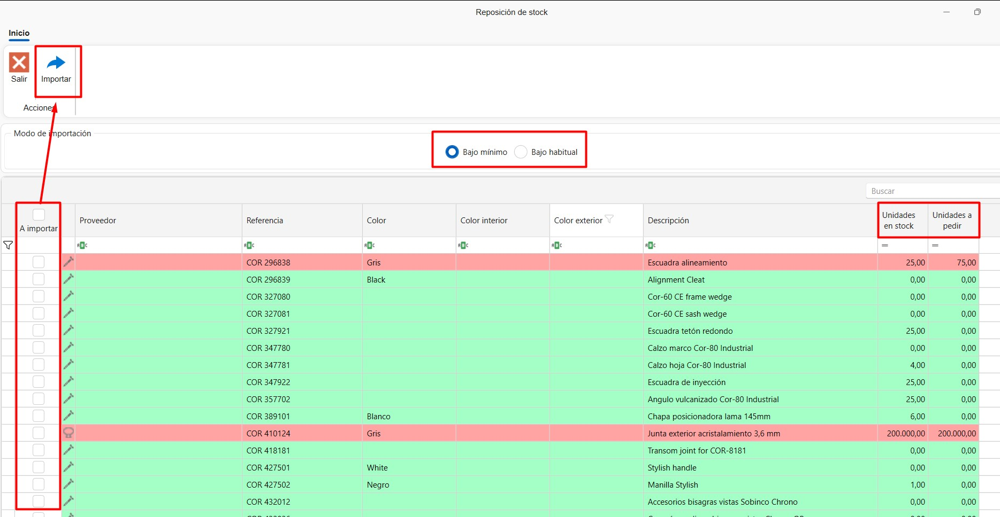
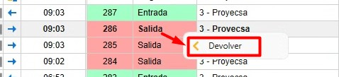
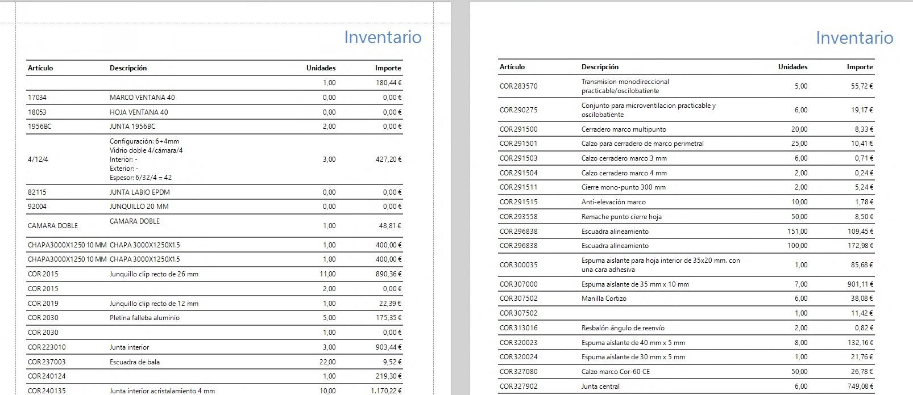
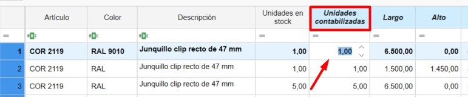
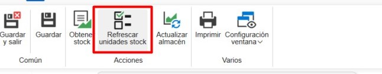

# Sistema de control de stock ENBLAU

---

## 1. Propósito

El presente manual está diseñado para usuarios nuevos en el sistema de control de stock utilizado por los Clientes y Endades. El objetivo principal es proporcionar una guía detallada para la gestión eficiente de proyectos, desde la creación de pedidos hasta la optimización del proceso de producción en ENBLAU. Este documento abarca los pasos necesarios para realizar las operaciones clave del sistema y está estructurado de forma secuencial para facilitar su comprensión.

---

## 2. Gestión de pedidos de compra

### 2.1. Pedidos de compra

- Desde el menú principal **Compras**, navegue a la sección "Pedidos de Compra".
- Especifique los materiales requeridos y su cantidad.
- En caso de cambios en las referencias, añádalas manualmente si están configuradas en la base de datos.
- En el pedido de venta (en la sección de **Venta**) selecciona el documento e ir a la pestaña **Material necesario** para sacar el listado de los materiales del pedido.

    - Las líneas de los artículos que se muestran en color verde indica que hay material en stock para ese proyecto o para el proyecto que este asignado como **Stock**. Las líneas que se muestran en color rojo indica que no hay materiales en ese proyecto o en stock.

    - Puedes indicar si quieres o no comprar, por si ya tienes en almacén. Te mostrará para cada material la información: unidades en stock, unidades reservadas, unidades pendientes.

    

  > ⚠️ **¡Importante!** Para asignar un proyecto de tipo stock ir al apartado, General - Configuración - **Compras y almacén**, indicar en el campo desplegable de **Proyecto para stock** un proyecto previamente creado para gestión de stock.

  

- Confirma en **Pedir material** y envía el pedido al proveedor correspondiente.

- En el apartado de **Almacenes** tienes una opción **Pendiente de recibir** donde te muestra un listado donde se puede visualizar los materiales pendientes de recibir para cada proyecto y pedido de compra.

  

- Sobre la línea del artículo con el botón derecho puedes abrir el pedido de compra para ese material:

  

> ℹ️ **Nota:** Para información más detallada sobre pedido de compras, sigue este enlace: [Pedidos de Compras](1.PR_Ventas_Compras.md#4-compras)

 > ⚠️ **¡Importante!** Para hacer el pedido de materiales en el documento de venta, en algunos casos se requieren permisos especiales para realizar compras. Este permiso también es necesario para fabricar o instalar.

### 2.2. Asignar materiales a proyecto

- Desde Material necesario en el proceso de listar y pedir materiales, tienes la opción, según la necesidad, de asignar artículos de otro proyecto al proyecto en el que estás. Desde el apartado de ubicaciones Botón derecho sobre la línea - **Asignar**:

  

  - Indicar el proyecto de destino a asignar (por defecto es en el que estás) y la cantidad (por defecto la que necesitas para el proyecto):
  
  

  - Al asignar el artículo al proyecto en el que estás, automáticamente cambiará la unidad de stock al proyecto de destino, sumando la cantidad asignada, y al proyecto de origen se le restará. El artículo se pondrá en color verde.   

> ⚠️ **¡Importante!** Asegúrate de que se puedan utilizar materiales del proyecto desde el que se desea hacer el traspaso de los artículos.

### 2.3. Materiales reservados

- Desde un documento de **Ventas**, **Compras** y en **Proyectos**, se pueden reservar materiales para el proyecto, indicando en **Materiales reservados** desde el desplegable de **Almacén**.

  

- Abrirá una ventana de Material reservado y desde el apartado **Material de proyecto** puedes arrastrar los materiales de los pedidos al proveedor:

  

- Luego en el apartado de Almacenes se pueden ver todos los materiales reservados de un proyecto:

  

  

> ℹ️ **Nota:** El uso de material reservado es algo visual, eso no impedirá que se usen los materiales aunque estén reservados. Se recomienda el uso de [Asignar materiales a proyecto](#22-asignar-materiales-a-proyecto) si quieres tener un mejor control de stock.

### 2.4. Reposición de stock

 En **Compras** hay una opción más en el desplegable de almacén llamada **Reposición de stock**, donde se mostrará un listado de los materiales que hay que pedir bajo mínimo y bajo habitual. 

  
    
- Los materiales **marcados en rojo** son aquellos que están por debajo del **mínimo** o del **habitual**. 

    - La columna **Unidades en stock** muestra la cantidad disponible del material.  
    - La columna **Unidades a pedir** indica lo que falta para alcanzar el **máximo en stock**.  
    - Si el material cumple con el mínimo o el habitual, **no aparecerá en el listado**.

- Los materiales **marcados en verde** son aquellos que no tienen un máximo definido en stock.  

    - Por defecto, se añade **una unidad** en bajo mínimo y bajo habitual para que se muestren en el listado de reposición de stock.

- Marcar la casilla **A importar** a los materiales que sea necesario pedir. Después seleccionar el botón **Importar** para añadir al pedido de compra.

  

> ℹ️ **Nota:** Para más información sobre como definir para cada material el stock mínimo, stock máximo y stock habitual ir al apartado [Configuración de materiales](#61-configuración-de-materiales).

---

## 3. Gestión de almacenes y movimientos

### 3.1. Almacenes Layout

- En el menú principal de **Almacenes** - **Stock**, puedes añadir o editar los almacenes.

  

- Configura el layout del almacén desde la página inicial: **ENBLAU** – **Configuración** – **Almacén** – **Layout**:

  

  - Crea zonas, estanterías y posiciones en el sistema para una organización clara. Se mostrará como vista de árbol.
  - Relaciona cada posición con su correspondiente área de almacenamiento. Ejemplo:
    - **Añadir Planta**: Añade una planta y puedes indicar el almacén.
    - **Añadir Zona/SubZona**: Se añade una zona o subzona debajo de la ubicación seleccionada.

    

### 3.2. Stock

- En el apartado de **Almacenes - Stock** tienes el listado con las opciones **Resumen, Resumen con ubicacion y Detallado**:

  

  

  - **Resumen:** En ese listado podras ver de una manera resumida un material agrupado por proyecto asignado. Se mostrará los totales de unidades, Unidades pendientes y unidades reservadas.

    <!--  -->

  - **Resumen con ubicación:** En ese listado podrás ver de una manera resumida un material agrupado por proyecto asignado y su ubicación.

    <!--  -->

  - **Detallado:** En ese listado podrás ver de una manera más detallada donde muestra un material con su proyecto de compra, proyecto asignado, ubicación en almacén y separado por documento de albarán de compra. Además, permite descontar, traspasar y asignar artículos.  

    <!--  -->

### 3.3. Movimientos en almacén 

- Realiza movimientos de materiales entre zonas y proyectos:
  - En **Almacenes** - **Stock** – **Detallado**, haz clic derecho sobre el material que quieras traspasar, descontar o asignar.

  

  - Selecciona el material desde el proyecto.
  - **Descontar**: Indica el proyecto, número del pedido, responsable y cantidad (barras y piezas) o longitud (juntas).

    

  - **Traspaso**: Indica la ubicación de origen, destino, cantidad (barras y piezas) o longitud (juntas).

    

  - **Asignar**: Indica el proyecto de destino, responsable, cantidad (barras y piezas) o longitud (juntas). Esa funcion es la misma del apartado de Material necesario -[Asignar materiales a proyecto](#22-asignar-materiales-a-proyecto).

     

- Los movimientos de entrada, salida, traspaso y asignación de cada material se reflejarán en el **Albarán**. Se puede ver las entradas y salidas en **Almacén – Movimientos**.

    

    

- Desde Movimientos de almacén hay una función que es **Devolver**. Clic con el botón derecho sobre el movimiento de salida que deseas hacer y aparecerá la opción de devolver:

    

    Abrirá una ventana **Movimiento de devolución** donde indicas las unidades y la ubicación que quieres devolver del material, por defecto es la ubicación de donde has dado salida a ese material:

      

- La opción **Abrir albarán de compras** desde el listado detallado, abre el albarán de compra (columna numeración) de la línea y artículo seleccionado:

    

- La opción **Añadir retal**, disponible desde el listado detallado, se aplica exclusivamente a artículos de tipo panel y permite añadir retales de paneles al stock. Para ello, se debe indicar la **Ubicación** y las dimensiones **Largo x Alto** del retal que se desea incorporar. Esta acción generará un movimiento de entrada del panel en stock.

     

    
    
### 3.4. Informes de almacenes (inventario)

#### 3.4.1. Informes de stock

En el apartado de **Almacenes → Stock** se pueden imprimir distintos tipos de informes:

- **Resumen:** Existen dos informes: **Inventario** e **Inventario por fecha**.

  

  **Inventario**  
  Genera un informe de inventario según los filtros aplicados en el listado de almacén.  
  Incluye las columnas: Artículo, Proyecto, Unidades, Unidades pendientes y Unidades reservadas.

  

  **Inventario por fecha**  
  Genera un informe de inventario hasta la fecha seleccionada.  
  Incluye las columnas: Artículo, Descripción, Unidades e Importe.

  

- **Resumen con ubicación:** Incluye el informe **Inventario detallado (resumen)**.

  **Inventario detallado (resumen)**  
  Genera un informe de inventario según los filtros aplicados en el listado de almacén detallado.  
  Incluye: Ubicación de almacén, Artículo, Descripción y Unidades.

  

- **Detallado:** Incluye el informe **Inventario detallado**.

  **Inventario detallado**  
  Genera un informe de inventario según los filtros aplicados en el listado de almacén detallado.  
  Incluye: Proyecto, Número de albarán de compra, Ubicación de almacén, Artículo, Descripción y Unidades, agrupadas por referencia y longitud.

  

#### 3.4.2. Informes de movimientos de almacén

En el apartado **Almacenes → Movimientos de almacén** se pueden imprimir los siguientes informes:

- **Movimientos**  
  Muestra un listado de los movimientos visibles en el listado principal.  
  Incluye: Fecha del movimiento, Responsable, Proyecto asignado, Ubicación de almacén, Artículo, Descripción, Unidades y Tipo de movimiento.

  

- **Movimientos I**  
  Muestra un listado alternativo de los mismos movimientos.  
  Incluye: Tipo de movimiento, Fecha del movimiento, Responsable, Documento, Unidades, Importe, Artículo y Descripción.

  

### 3.5. Finalizar proyecto (proyecto de destino)

Al finalizar un proyecto, tienes la opción de indicar un **Proyecto de destino** donde se asignarán los materiales sobrantes. Por ejemplo, puedes asignarlos al proyecto que tengas definido para la gestión de stock.

**Proceso al finalizar:**
- Se especifica el proyecto de destino para los materiales sobrantes
- El sistema genera automáticamente un **movimiento de entrada** al proyecto asignado
- Los materiales mantienen su ubicación original en el almacén
- Solo se modifica la asignación del proyecto, no la ubicación física

---

## 4. Inventarios

- En el apartado de **Almacenes** - **Inventarios** se puede hacer una normalización en el almacén teniendo en cuenta lo que hay en stock en tiempo real.

  

### 4.1. Nuevo inventario

  - Para crear un inventario acceder al apartado de Inventarios y seleccionar **Nuevo**.

    

### 4.2. Contabilización de Stock

  **1.** Desde un inventario, selecciona el **Proyecto** definido como **Stock**.  

  **2.** Haz clic en **Obtener stock** para cargar la lista de materiales del proyecto **Stock**:  
    
      

  **3.** En la columna **Unidades contabilizadas**, introduce las unidades reales en stock del artículo, según lo contabilizado en la ubicación del almacén.  
      

  **4.** Una vez indicadas las unidades en la columna **Unidades contabilizadas**, las líneas de los artículos se mostrarán en rojo, indicando un cambio de unidades.  
   Luego, haz clic en **Actualizar almacén** para registrar la regularización según las unidades contabilizadas.  
      

  **5.** Tras actualizar el almacén, las líneas se mostrarán en verde.  

  - En las columnas **Unidades Stock** y **Unidades contabilizadas** se reflejarán las unidades actualizadas.  
  - En la columna **Contabilizado** se marcará una casilla.  
  - En la columna **Fecha contabilizada** aparecerá la fecha de la regularización.  

          

  - Este proceso genera un movimiento de regularización (entrada o salida) en el almacén:  

      

    > ℹ️ **Nota**: En el listado del inventario solo se reflejan **entradas** y **salidas**.  
    > No es posible realizar movimientos de tipo **traspaso** desde este listado.  

  **6.** También puedes añadir nuevos artículos desde los árboles de:

  - **Artículos (materiales ENBLAU)**  
  - **Artículos importados (materiales de Logikal)**  

    Para ello:  
    - Arrastra el artículo al listado del inventario.  
    - Indica las **unidades**, **dimensiones** (si se trata de barra, superficie o junta), **ubicación en stock** y **precio**.  
        

    > ℹ️ **Nota**: Al añadir un artículo nuevo al inventario, siempre debes indicar una **ubicación**.  
    > De lo contrario, no se actualizará en el stock.  

  **7.** Con el botón **Refrescar unidades en stock**, se actualizan las unidades actuales de cada línea del inventario.  

     

---

### 4.3. Informe de regularización del inventario

- Es posible **Imprimir** el listado del inventario, donde se muestran las columnas:  
  **Artículo**, **Descripción**, **Fecha última comprobación**, **Unidades en stock**, **Unidades contabilizadas** y **Ubicación**.  

  

    

- Este informe tiene como objetivo facilitar la contabilización manual de stock en el almacén antes de proceder a la actualización en el listado del inventario.  
  En la columna **Unidades contabilizadas** se debe indicar la cantidad real de cada artículo en stock.  

    

## 5. Stock necesario

- Una vez se haya creado una producción y mandado a taller desde el mismo se puede ver y descontar los materiales de forma manual.

  

- Se abre una ventana de Stock necesario donde indica si el material hay y almacenes y a que monitor (puesto) se descontara ese material. Para descontar el material hay que marcar la casilla en la columna **Stock a descontar** del material.

  

> ⚠️ **Importante!** Si no hay el material en stock, no se descontará.

> ℹ️ **Nota:** Para tener un controle más detallado de stock se recomienda usar la app móvil enSITE para hacer ese tipo de descuento de material. Para más información sobre la app [2.1. Recepción en enSITE](4.PR_Manual_Stock_enCONTROL.md#21-recepcion-en-ensite)
  
---

## 6. Materiales importados

En el apartado **Almacenes → Material importado** se encuentra el listado de todos los materiales importados desde **Logikal**.

---

### 6.1. Configuración de materiales

Desde esta sección puedes definir, para cada artículo, una serie de valores por defecto que afectan a la gestión de compras y producción:

- **Comprar**:  
  Si esta casilla está marcada, indica que el material se propondrá por defecto como “a comprar” cuando se liste desde el apartado **Material necesario**.

- **Montado en destino**:  
  Si esta casilla está marcada, el material será montado en destino durante el proceso en el puesto **Picking** dentro de **enCONTROL**.

- **Control de stock**:  
  Si esta casilla está marcada, el material se hará visible en el listado de **Reposición de stock** desde el apartado de pedido de compra.

- **Stock mínimo**, **stock máximo** y **stock habitual**:  
  Puedes definir los valores de referencia para la gestión de existencias, lo cual es útil para alertas, reposiciones o planificación.

    

    En el apartado de [Reposición de stock](#24-reposicion-de-stock) en compras se puede sacar un listado de Bajo mínimo y Bajo habitual según como este definido el stock mínimo, máximo y habitual para cada material.

> ℹ️ **Nota:** La correcta configuración de estos campos mejora significativamente el control de inventario, la planificación de compras y la trazabilidad de materiales durante la producción. En el apartado 

---

## 7. Producto terminado

El **producto terminado** es aquel que ha sido completamente fabricado y ha pasado por el puesto correspondiente de **Comprobación final** en **enCONTROL**.

En el apartado **Almacenes → Producto terminado** se encuentran dos listados principales:

- **Ubicación de productos**
- **Movimientos de producto**

  

---

### 7.1. Ubicación de productos

- En el listado de **Ubicación de productos** se muestra la información y la localización actual del producto terminado, tal como se haya definido desde el puesto de **Comprobación final** en **enCONTROL**.

  

- Desde esta vista, haciendo clic con el botón derecho sobre una línea, puedes realizar las siguientes acciones:

  - Mover el producto a otra ubicación.
  - Dar salida al producto.
  - Abrir el documento de producción relacionado con ese producto.

  

---

### 7.2. Movimientos de producto

- En el apartado **Movimientos de producto** se registran todas las operaciones realizadas con los productos terminados, incluyendo:

  - Entrada.
  - Salida.
  - Traspaso.

  

- Haciendo clic con el botón derecho sobre una línea cuyo **tipo de movimiento** sea una **salida**, se habilita la opción **Devolver**.

  

- Al seleccionar esta opción, se abrirá la ventana **Devolución producto terminado**, donde se debe:

  1. Indicar la nueva **ubicación** del producto.
  2. Aceptar la operación.

  

Una vez completado el proceso, el sistema registrará un nuevo movimiento del tipo **Entrada** en el historial del producto.

> ℹ️ **Nota:** Esta funcionalidad es útil para gestionar devoluciones internas, productos rechazados o reasignaciones logísticas dentro del almacén.

---

> ℹ️ **Nota:** La correcta gestión del producto terminado garantiza un mejor control del inventario, facilita la trazabilidad y agiliza la preparación de expediciones o entregas.

---

## 8. Control de stock y reportes

- Monitorea el stock necesario desde la sección "Producción".
- Identifica materiales reservados y pendientes en tiempo real.
- Genera reportes de inventarios para evaluar el uso de materiales y planificar futuras compras.

---

## 9. Resolución de problemas comunes

- **Error al importar referencias**: Verifica que las referencias estén configuradas en la base de datos.
- **Materiales sobrantes o faltantes**: Asegúrate de registrar correctamente las ubicaciones y cantidades al recibir materiales.
- **Problemas con el layout del almacén**: Revisa la configuración de zonas y ajusta según sea necesario.

---

## 10. Conclusión

Este manual ofrece una guía paso a paso para los procesos principales en el sistema de control de stock. Siguiendo estas instrucciones, los usuarios podrán gestionar eficientemente los inventarios, mejorar la producción y optimizar la relación con proveedores. Para soporte adicional, contacte al administrador del sistema.
