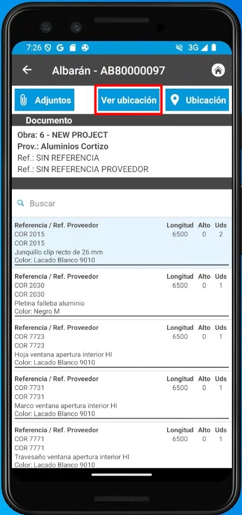
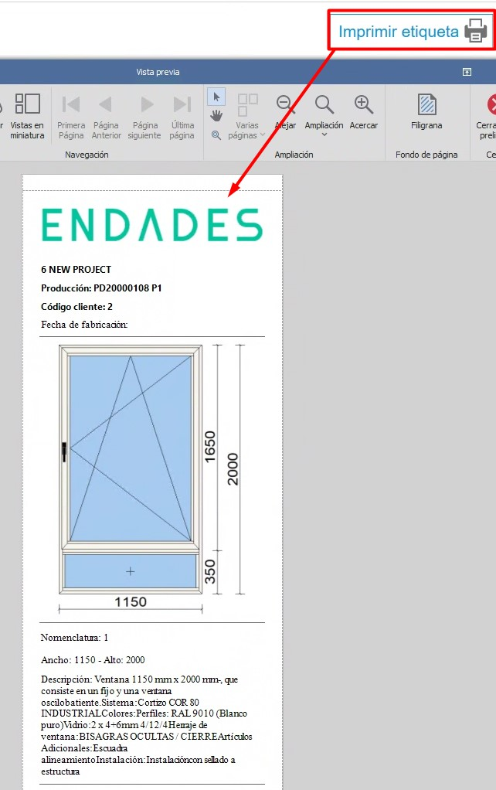
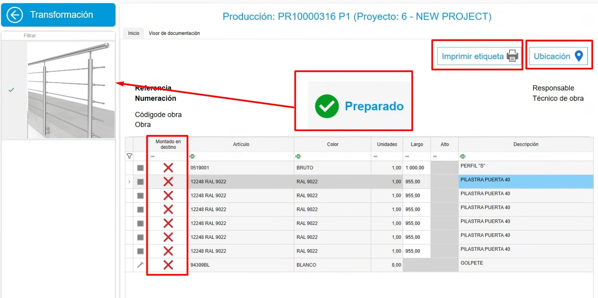
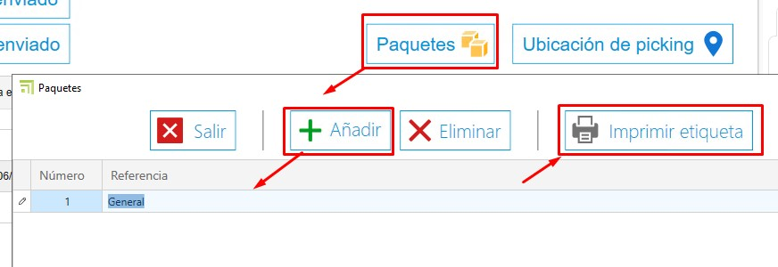

# Sistema de control de stock enCONTROL

---

## 1. Propósito

El presente manual está diseñado para usuarios nuevos en el sistema de control de stock utilizado por los Clientes y Endades. El objetivo principal es proporcionar una guía detallada para la gestión eficiente de proyectos, desde la creación de pedidos hasta la optimización del proceso de producción en enCONTROL y enSITE. Este documento abarca los pasos necesarios para realizar las operaciones clave del sistema y está estructurado de forma secuencial para facilitar su comprensión.

---

## 2. Recepción de materiales
### 2.1. Recepción en enSITE

- Una vez se haya creado el pedido de compra, desde ENBLAU en **Almacenes**, acceda a la opción **"Pendientes de Recibir"** en el apartado de Almacenes. Se abrirá una pestaña con todos los materiales pendientes de recibir para cada proyecto.

> ℹ️ **Nota:** Para información mas detalladas sobre pedido de compras, sigue este enlace: [2.1. Pedidos de compra](3.PR_Manual_Stock_ENBLAU.md#21-pedidos-de-compra)

- **Modo de recibir**: Abra **enSite** desde el taller a través de wifi con la persona encargada de recibir el pedido.
- En **Recepción de pedidos**, localice el pedido correspondiente (ordenado por fecha).

- Registre la recepción en **Nuevo Albarán** creando un albarán desde la sección **Almacén**.

- En ENBLAU, la pestaña **Pendiente de recibir** de **Almacenes** se sincroniza y ya no verás los materiales para ese pedido.
- En **Pedido de Compras**, puedes comprobar la trazabilidad.
- En **enSite**, indique las cantidades recibidas y la ubicación donde se almacenarán (Almacén, Planta, Zona, Subzona…). Luego podrás ver la ubicación de cada material.

- Desde la app **enSITE**, también se puede buscar por artículos y ver todas las ubicaciones donde está ese artículo. Para luego mover o descontar los artículos.

     
    

> **En caso de materiales dañados u otras incidencias**, puedes adjuntar documentos o capturar fotografías y adjuntarlas al albarán. Luego se podrá revisar desde ENBLAU.

### 2.2. Recepción en ENBLAU

- Desde ENBLAU una vez creado el pedido de compra se puede sacar un albarán de recepción de materiales del pedido.

- Desde el albarán podrás indicar la recepción de cada material indicando la cantidad. Por defecto estarán todos marcados con la cantidad del pedido.

- Luego hay que indicar la ubicación del albarán en la pestaña de almacenes del albarán.

> ℹ️ **Nota:** Para información más detalladas sobre recepcion de materiales en ENBLAU, sigue este enlace: [4.2. Recepción de material](1.PR_Ventas_Compras.md#42-recepcion-de-material)

---

## 3. Producción y enCONTROL

### 3.1. Producción

- Crea proyectos de producción basados en los pedidos de cliente en ENBLAU.
  - Crear producción.

    

  - El siguiente paso es **Enviar a producción**.

    
    

  - En producción, se puede ver en **stock necesario** los materiales descontados y se puede descontar manualmente.

    
    

> ℹ️ **Nota:** Para información más detallada sobre crear fase de producción en ENBLAU, sigue este enlace: [3.5. Producción](1.PR_Ventas_Compras.md#35-produccion)

### 3.2. enCONTROL

- Abre **enCONTROL**. Aparecen los proyectos de producción. Si eres usuario administrador, verás todos los proyectos, si no, solo verás los asignados.

- Abre el **monitor de control**. Puedes abrirlo haciendo doble clic en cualquiera de los filtros (en la cabecera) o haciendo doble clic en el proyecto y seleccionando el puesto de **Control** si lo tienes configurado en el equipo.

    

    

- Cuando se envía a producción (Taller), se coloca en cola de producción en la pestaña de **Gestión de Producción**. El responsable de producción decide la prioridad.

    

- Para sacar de "En cola", solo tienes que arrastrarlo al panel de "En fabricación" y se abrirá una ventana de **Tarea** para proponer una fecha, indicar el estado, clasificación, etc.

    

    

- En la pestaña Planificación de producción defines a quien se asigna, arrastrando los proyectos a cada responsable por hacer. Hay que seleccionar el responsable y arrastrar el proyecto (se puede seleccionar más de uno responsable con ctrl + botón derecho). También se puede cambiar la prioridad de izquierda a derecha y de arriba a abajo:

  

  Para quitar el proyecto asignado, hay que seleccionar el responsable seleccionar el proyecto y usar ctrl + suprimir.

- En la pestaña Calendario de producción se muestra un diagrama Gantt con base en los tiempos de Logikal (en el ejemplo) fechas de entrada y salida de producción.

  

- Optimice los procesos según las áreas de producción (corte, mecanizado, ensamblado, etc.). En la pantalla principal de proyecto con doble clic sobre el proyecto deseado, te abrirá una ventana Seleccione un puesto. (Los puestos se definen como el cliente decida y se verá según el usuario) ejemplos:

  

- Al entrar en cualquier puesto te abrirá la pantalla con el botón **Iniciar**:

  

  Al iniciar se cuenta el tiempo hasta que se pause o se finalice el trabajo.

- Todas las pantallas tienen algunos campos en común:
    - Comentario - Se puede añadir comentario y escoger una severidad en el desplegable. El último comentario bueno es el que desbloquea.

      

      

    - Pausar - Al pausar el trabajo te obliga indicar desde el listado el motivo de la pausa. Luego se puede reanudar indicando otra vez el mismo puesto.

      

    - Finalizar - Se finaliza cuando acabas el trabajo en ese puesto. Luego se puede reanudar inicando otra vez el mismo puesto.

      

    - Documentación - Desde el apartado de documentación se podrá ver los documentos de producción exportados desde Logikal en el visor de documentación. También se puede añadir una ruta genérica para añadir lo que quiera. Catálogo, manuales, etc.

      

#### 3.2.1 Puestos de trabajo

 **1. Preparación de Material**

  - Todo preparado – Marca los materiales con un check en verde indicando que está preparado.
  - Nada Preparado – Marca los materiales con una X en rojo indicando que no está preparado.
  - Ubicación Material – Según lo tengas configurado enCONTROL, se podría indicar donde ubicar los materiales. Para que se descuente ese material solo de esa ubicación. 

      

**2. Corte**

  - En corte se indica la longitud de la barra y el desperdicio de retales. Se abre una ventana de retales y puede cambiar la longitud según sé necesario.

    

    

    > ℹ️ **Nota:** Desde ENBLAU en el apartado Configuración - General - **Logikal**. Se puede indicar el **Retal mínimo** a tener en cuenta cuando se corta una barra en el puesto de **Corte**.

      

      

  - Luego desde ENBLAU **Movimientos** de almacén se reflejará una salida de la barra total ej. 6500 y luego una entrada de la del mismo material de ej. 4100 según había indicado en el puesto de corte. 

    

    - También en ENBLAU se puede ver en el apartado de **Stock** el listado filtrado por **Es retal** todos los retales que hay disponible en stock.

      

  - En el apartado **Cortados** del puesto de corte de enCONTROL en la parte derecha del monitor se muestra el listado de cortes realizados y se puede imprimir las etiquetas de cada barra.

    

**3. Mecanizado**

  - No se descuenta materiales, simplemente es informativo por tiempo. Contrasta tiempo real.

    

**4. Montaje**

  - Se descuenta materiales (accesorios) por cada posición de cuadro.

    

  - En el listado de materiales tienes la opción de indicar los artículos que se va a montar en destino. Esos materiales luego se añadirá en el listado del puesto de **Picking**.

  

**5. Ajunquillado**

  - Se descuenta materiales (Juntas, calzos, espuma, etc.) por cuadro.

  

  - En el listado de materiales tienes la opción de indicar los artículos que se va a montar en destino. Esos materiales luego se añadirá en el listado del puesto de **Picking**.

    

**6. Ensamblado**

  - Información del cuadro, pero no se descuenta materiales.

  

**7. Herraje**

  - Se descuenta materiales (herraje) por hoja.

    

  - En el listado de materiales tienes la opción de indicar los herrajes que se va a montar en destino. Esos materiales luego se añadirá en el listado del puesto de **Picking**.

    

**8. Soldado**

  - No se descuenta materiales, simplemente es informativo por tiempo. Contrasta tiempo real. 

    

**9. Comprobación final**

  - No se descuenta materiales. Pero, una vez finalice la comprobación se puede ubicar en Almacen y luego imprimir una etiqueta del producto acabado.

     

    

    

  - Desde ENBLAU en el apartado de Almacenes en el apartado de **Producto terminado** hay dos listados:

      **Ubicación de productos:** Muestra donde está ubicado el producto terminado de cada proyecto y producción. Desde ese listado se puede dar salida, mover de ubicación y abrir el documento de producción, seleccionando sobre la posición con el botón derecho.

      

      **Movimientos de productos:** Muestra los movimientos del producto terminado como entrada, traspaso, salida y devolución. Desde ese listado se puede hacer una devolución, seleccionando sobre la posición de salida con el botón derecho.

      

**10. Transformación**

  - Ese puesto puedes indicar un grupo de materiales o escandallo para transformar en un producto, ejemplo: Barandilla. 

    

  - Así como en otros puestos en el listado de materiales tienes la opción de indicar los artículos que se va a montar en destino. Esos materiales luego se añadirá en el listado del puesto de **Picking**. Además de luego poder imprimir la etiqueta y ubicar el producto.

**11. Limpieza**

  - No se descuenta materiales, simplemente es informativo por tiempo. Contrasta tiempo real.

    

**12. Picking**

  - El puesto muestra el listado de los materiales marcados previamente en otros puestos que se montará en destino.

    
  
  - Puedes crear los paquetes y asignar para cada material. Y luego imprimir la etiqueta para el paquete.

    

    - Indicar la ubicación de picking para cada material.

      

**13. Pizarra**

  - Muestra la evolución de cada proyecto y su estado.

    

**14. Control**

  - Abre el monitor Control de proyectos. Donde también se puede ver el estado de cada proyecto que está en fábrica.

    

> ℹ️ **Nota**: Asigne prioridades y recursos para asegurar la fluidez en la producción.

> **Configuración enCONTROL** - Configurar enCONTROL previamente. Para más información, sigue este enlace: [2. Configuración Inicial de enCONTROL](/Configuraciones/2.%20CO_Configuracion_Inicial_enCONTROL/) :

> **Gestión de filtros** - Usar filtros y filtros personalizados para optimizar la búsqueda en los listados. Para más información, sigue este enlace: [4. Gestión de filtros](/Utilidades/4.UT_Gestion_Filtros/)

---

## 4. Control de stock y reportes

- Monitorea el stock necesario desde la sección "Producción".
- Identifica materiales reservados y pendientes en tiempo real.
- Genera reportes de inventarios para evaluar el uso de materiales y planificar futuras compras.

---

## 5. Resolución de problemas comunes

- **Error al importar referencias**: Verifica que las referencias estén configuradas en la base de datos.
- **Materiales sobrantes o faltantes**: Asegúrate de registrar correctamente las ubicaciones y cantidades al recibir materiales.
- **Problemas con el layout del almacén**: Revisa la configuración de zonas y ajusta según sea necesario.

---

## 6. Conclusión

Este manual ofrece una guía paso a paso para los procesos principales en el sistema de control de stock. Siguiendo estas instrucciones, los usuarios podrán gestionar eficientemente los inventarios, mejorar la producción y optimizar la relación con proveedores. Para soporte adicional, contacte al administrador del sistema.
