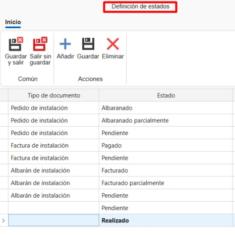
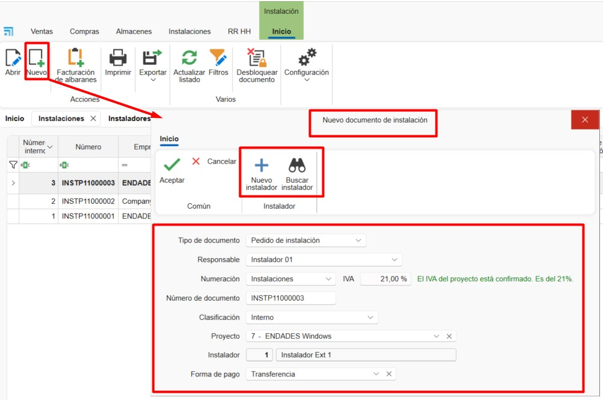
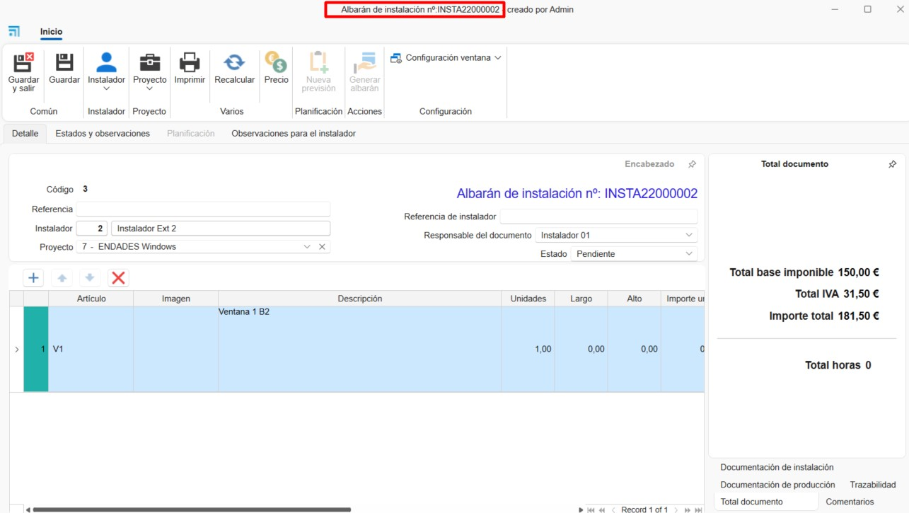
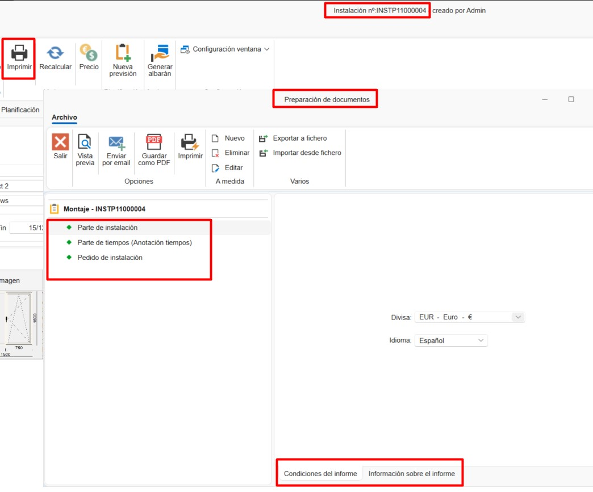

# Instalaciones

## 1. Introducción
Este manual está diseñado para guiar a los usuarios en la creación y planificación de instalaciones y montajes desde ENBLAU. De esta manera, se pueden asignar a los montadores internos y externos las instalaciones planificadas desde la plataforma.

---

## 2. Instalaciones
En el módulo de **Instalaciones** se puede acceder a:
- **Instalación**
- **Instaladores externos**
- **Planificador de instalación**

### 2.1. Instalación

#### 2.1.1. Configuraciones
Desde **Instalación** se accede a **Configuraciones** para definir los parámetros del sistema.

**1. Numeraciones**

Definir las secuencias de numeración para cada tipo de documento.

**2. Clasificaciones**

Establecer clasificaciones para asignar a los documentos de instalación.

**3. Planificador**

Definir **Clasificaciones** y **Estados** para las tareas del planificador.

> **Nota:** Estas clasificaciones y estados estarán disponibles al crear una nueva tarea en el **Planificador de instalación**.

**4. Directorios por defecto**
Configurar las carpetas que se generarán automáticamente con cada instalación.

> **ℹ️ Información:** Los directorios predeterminados son carpetas que se generan automáticamente con cada nueva instalación.

**5. Definición de estados**
Configurar los estados disponibles para cada tipo de documento.

#### 2.1.2. Crear un pedido de instalación

**1. Nuevo**
Para crear una instalación, ir a **Instalación → Nuevo**. Se abrirá una ventana donde completar los campos obligatorios:
- Tipo de documento
- Numeración
- Numeración de documento
- Instalador externo
- Proyecto

**2. Pedido de instalación**

En la cinta superior del documento hay algunas funciones disponibles:
- Imprimir --> Imprimir informes del documento de instalación.
- Precios --> Editar los precios predefinidos del Instalador externo.
- Nueva previsión --> Crear una previsión de la instalación para que se refleje el planificador de instalaciones. 

***Pestaña Detalle***

En esta pestaña se muestran todos los campos previamente completados (editables). En la parte inferior se pueden añadir posiciones definiendo:
- Nombre del artículo
- Descripción
- Unidades
- Precio, etc.

***Pestaña Estados y observaciones***

En esta pestaña se configuran campos como:
- Forma de pago
- Fechas de solicitud y cancelación
- IVA, etc.

***Pestaña Planificación***

Aquí se indican las fechas de inicio y fin para la planificación y se asignan instaladores internos.

***Pestaña Observaciones para instalación***

Espacio para añadir notas específicas para la instalación.

**3. Albarán de instalación** 

Desde un pedido de instalación se puede generar un albarán de instalación.

#### 2.1.4. Crear instalación desde un documento de venta
Desde un documento de venta (pedido, medición o producción) se puede:
- Crear una previsión de instalación
- Crear una instalación directamente

**1. Previsión de instalación**
Permite indicar una previsión configurando:
- Instalador externo
- Fecha estimada
- Importes pactados

**2. Crear Instalación**
Al crear la instalación desde un documento de ventas, se deben indicar las unidades a instalar de cada posición. Posteriormente, se pueden añadir instaladores externos o internos a esa instalación.

#### 2.1.3. Imprimir informes de instalación
Permite imprimir los informes disponibles:
- Parte de instalación
- Partes de tiempos
- Pedido de instalación

Antes de imprimir, se muestran las condiciones y una breve descripción del informe seleccionado.

---

### 2.2. Instaladores externos
Para registrar nuevos instaladores externos:
1. Ir a **Instalación → Instaladores externos → Nuevo**
2. Completar los campos requeridos:
   - Nombre
   - Dirección
   - NIF
   - Datos de contacto
   - Precios, etc.

---

### 2.3. Planificador de instalaciones
Desde **Instalaciones → Planificador de Instalaciones** se pueden visualizar y gestionar las tareas en un calendario para cada instalador (interno o externo).

Desde la cinta de opciones se puede organizar la vista del calendario (día, semana, mes) y agrupar tareas por recursos o fechas.

**1. Crear tarea**
Para crear una nueva tarea:
1. Seleccionar **Nueva tarea**
2. En la ventana *Nuevo evento de instalación*, asignar:
   - Instalador
   - Número de instalación
   - Proyecto

3. En la ventana de *Tarea* detallar:
   - Estados y clasificaciones
   - Fecha y hora de inicio/fin
   - Descripción corta
   - Notas

**2. Calendario**
Las tareas asignadas aparecen en el calendario. Al pasar el cursor sobre una tarea, se muestra información básica:
- Nombre del proyecto
- Número de instalación
- Descripción corta

Los colores indican el estado y la clasificación (definidos previamente en la configuración).

