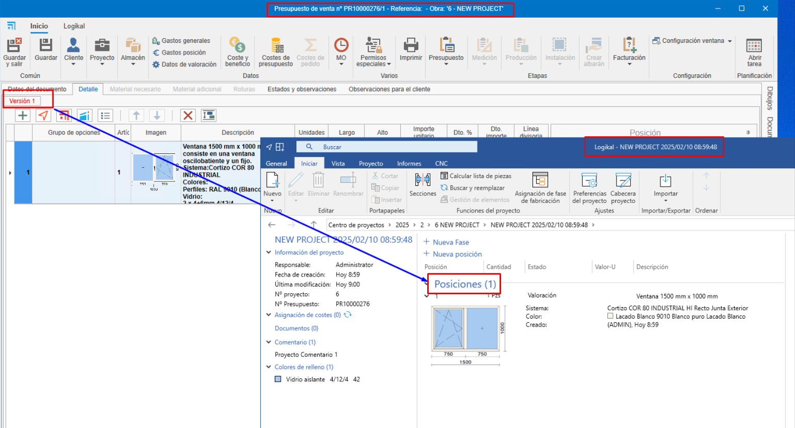

# Relación entre fases y proyecto en ENBLAU y Logikal

---

## 1. Introducción
Explicación de la relación entre las fases de un proyecto en ENBLAU y Logikal.

---
## 2. Modos de trabajo en Logikal

### 2.1. Modo por fases (modo por defecto)
El modo por fases mueve las posiciones y unidades de cada fase del documento de ENBLAU y en las fases del proyecto en Logikal.

- Crear un presupuesto desde ENBLAU:

  **1. Versión 1** 
      - Al crear un presupuesto en ENBLAU, esta versión se reflejará en Logikal en *"Posiciones (1)"* dentro del mismo proyecto.  
        

  **2. Pedido**  
      - Al confirmar el pedido en ENBLAU, se generará un pedido y luego una fase en Logikal denominada *"Presupuesto aceptado"*. Moviendo las posiciones de la fase anterior a la siguiente fase del pedido.
        

  **3. Producción 1**  
      - Desde el pedido en ENBLAU, al crear una producción, se generará una nueva fase en Logikal llamada *"nº presupuesto P1"*. Moviendo las posiciones y las unidades indicadas de la fase anterior a la siguiente fase de producción.
        

  **4. Medición 1**  
      - Desde el pedido en ENBLAU, al crear una medición, se generará una nueva fase en Logikal denominada *"nº presupuesto M1"*. Moviendo las posiciones y las unidades indicadas de la fase anterior a la siguiente fase de medición. 
        

  **5. Producción 2**  
      - Desde la medición en ENBLAU, al crear una producción (considerando los cambios en la medición), se generará una nueva fase en Logikal con el nombre *"nº presupuesto M1 P2"*. Moviendo las posiciones y las unidades indicadas de la fase anterior a la siguiente fase de producción.
        

> ⚠️ **¡Importante!** Para ese modo las posiciones borradas desde ENBLAU se eliminan de forma permanente en Logikal.

---

### 2.2. Modo por proyectos
El modo por proyecto mueve las posiciones y unidades de cada fase del documento de ENBLAU, pero en Logikal se crea un proyecto (mismo número del presupuesto) para cada fase de ENBLAU.

- Crear un presupuesto desde ENBLAU:

  **1. Versión 1** 
      - Al crear un presupuesto en ENBLAU, esta versión se reflejará como un proyecto en Logikal en la fase *"Posiciones (1)"*.  
        

  **2. Pedido**  
      - Al confirmar el pedido en ENBLAU, se generará un pedido y luego un nuevo proyecto en Logikal con el mismo *"nº presupuesto"*.
        

  **3. Medición 1**  
      - Desde el pedido en ENBLAU, al crear una medición, se generará un nuevo proyecto en Logikal con el mismo número del *"nº presupuesto M1"* con las posiciones y las unidades indicadas de la fase anterior a la siguiente fase de medición en ENBLAU. 
        

  **4. Producción 1**  
      - Desde la medición en ENBLAU, al crear una producción (considerando los cambios en la medición), se generará un nuevo proyecto en Logikal con el mismo número del *"nº presupuesto M1 P1"* con las posiciones y las unidades indicadas de la fase anterior a la siguiente fase de producción en ENBLAU.
        

> ℹ️ **Nota:** Ese modo puede causar una pequeña lentitud dependiendo de la cantidad de unidades y posiciones del documento.

### 2.3. Modo por fases duplicando posiciones
El modo por fases duplicando posiciones copia las posiciones y unidades de cada fase del documento de ENBLAU y en las fases del proyecto en Logikal, manteniendo siempre una copia en cada fase. 

- Crear un presupuesto desde ENBLAU:

  **1. Versión 1** 
      - Al crear un presupuesto en ENBLAU, esta versión se reflejará en Logikal en *"Posiciones (1)"* dentro del mismo proyecto.  
        

  **2. Pedido**  
      - Al confirmar el pedido en ENBLAU, se generará un pedido y luego una fase en Logikal denominada *"Presupuesto aceptado"*. Copiando las posiciones de la fase anterior a la siguiente fase del pedido.
        

  **3. Medición 1**  
      - Desde el pedido en ENBLAU, al crear una medición, se generará una nueva fase en Logikal denominada *"nº presupuesto M1"*. Copiando las posiciones y las unidades indicadas de la fase anterior a la siguiente fase de medición.
        

  **4. Producción 1**  
      - Desde la medición en ENBLAU, al crear una producción (considerando los cambios en la medición), se generará una nueva fase en Logikal con el nombre *"nº presupuesto M1 P2"*. Copiando las posiciones y las unidades indicadas de la fase anterior a la siguiente fase de producción.
        

> ℹ️ **Nota:** Ese modo puede causar una pequeña lentitud dependiendo de la cantidad de unidades y posiciones del documento.

> ⚠️ **¡Importante!** Para ese modo las posiciones borradas desde ENBLAU se eliminan de forma permanente en Logikal.

## 3. Creación proyecto Logikal
Al crear un presupuesto en ENBLAU y luego añadir una posición de Logikal, esta se vinculará a un proyecto en Logikal o, en su defecto, se creará uno nuevo.

  

  

  

---
