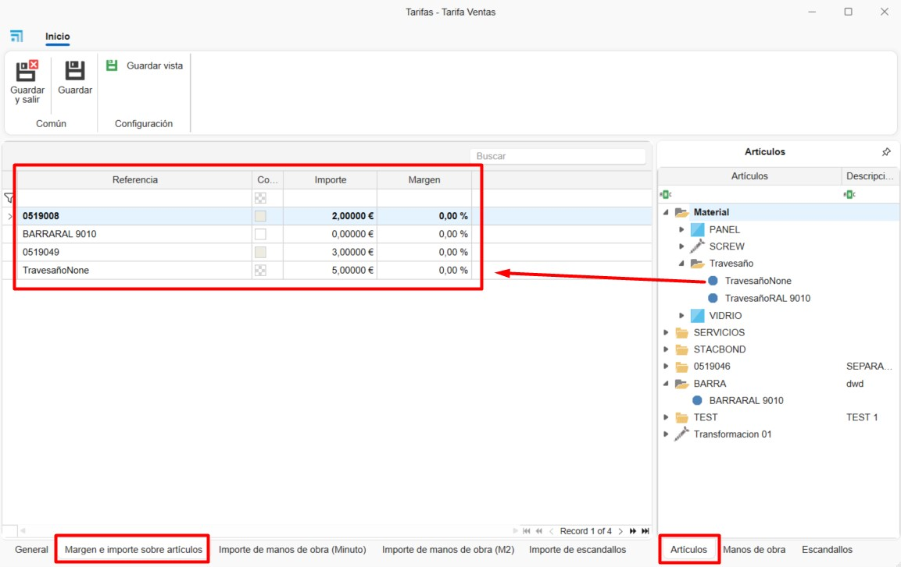
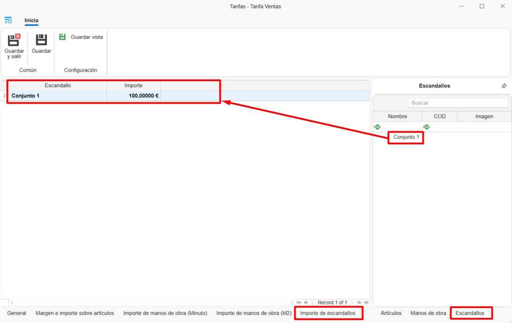

# Tarifas y Mano de obra de materiales propios en ENBLAU

---

## 1. Introducción

Este manual describe, paso a paso, el uso de las **Tarifas** y la **Mano de obra** para la definición de precios de coste y de venta de los materiales en ENBLAU.

---

## 2. Crear tarifas

- Desde el apartado **Almacenes → Tarifas** se accede al listado de tarifas existentes.

  

- Seleccionar el botón **Nueva** para crear una nueva tarifa e indicar el nombre correspondiente.

  

### 2.1. General

- En la pestaña **General** se pueden completar los siguientes campos:

    **Descripción:** Permite añadir una descripción de la tarifa.  

    **Margen:** Define el margen que se aplicará sobre la tarifa.  

    **Tarifa ascendente:** Indica si la tarifa se basa en otra tarifa existente.  

    **Observaciones:** Campo destinado a anotaciones adicionales.

  

### 2.2. Margen e importe sobre artículos

- En la pestaña **Margen e importe sobre artículos** se puede definir el margen y el importe de los artículos arrastrando la referencia final del material desde la pestaña **Artículos**, situada en la parte derecha de la ventana.  
El importe se calculará automáticamente según el tipo de cálculo del artículo: por unidad, metro lineal o metro cuadrado (m²).

  

### 2.3. Importe de mano de obra (Minuto)

- En la pestaña **Importe de mano de obra (Minuto)** se puede definir el coste por minuto arrastrando el concepto de mano de obra desde la pestaña **Mano de obra**, ubicada en la parte derecha de la ventana.

  

> ℹ️ **Nota:** La mano de obra debe estar creada previamente en el apartado [3. Crear Mano de obra](#3-crear-mano-de-obra).

### 2.4. Importe de mano de obra (m²)

- En la pestaña **Importe de mano de obra (m²)** se puede definir el importe por metro cuadrado arrastrando el concepto de mano de obra desde la pestaña **Mano de obra**.

  

> ℹ️ **Nota:** La mano de obra debe estar creada previamente en el apartado de **Mano de obra**.

### 2.5. Importe de escandallos

- En la pestaña **Importe de escandallos** se puede asignar un importe fijo a un escandallo (grupo de materiales).

  

> ℹ️ **Nota:** El desglose de materiales seguirá calculándose de forma independiente. El importe del escandallo no tiene por qué coincidir con la suma total estimada de los materiales para venta.

### 2.6. Listado de tarifas

- Al crear una tarifa, el sistema genera automáticamente otra tarifa con el mismo nombre seguido de **+ SUE**, destinada a materiales sueltos.

  

- La tarifa de **Coste** se genera automáticamente y es la tarifa marcada como base de coste para los materiales de ENBLAU.  
Esta tarifa no puede eliminarse.

  

---

## 3. Crear mano de obra

- Desde el apartado **Almacenes → Tarifas → Mano de obra** se accede al listado de manos de obra.

  

- Se abrirá una ventana desde la que se podrán crear y gestionar diferentes conceptos de mano de obra, completando los siguientes campos:

  

  **1. Concepto:** Nombre de la mano de obra.  
  **2. Descripción:** Descripción opcional del concepto.  
  **3. Tipo:** Tipo de mano de obra, seleccionable desde el listado de puestos disponibles en enCONTROL.  
  **4. Es fabricación:** Indica si la mano de obra corresponde a fabricación.  
  **5. Es montaje:** Indica si la mano de obra corresponde a montaje.

  

  **6. Artículos:** Permite definir el tiempo de mano de obra (en minutos) para cada artículo, arrastrándolo desde el árbol de **Artículos** situado a la derecha.  
  Se puede establecer un rango de unidades (**Desde / Hasta**) para el material.

  

  **7. Escandallos:** Permite definir el tiempo de mano de obra (en minutos) para cada escandallo, arrastrándolo desde el árbol de **Escandallos** situado a la derecha.

  

---
