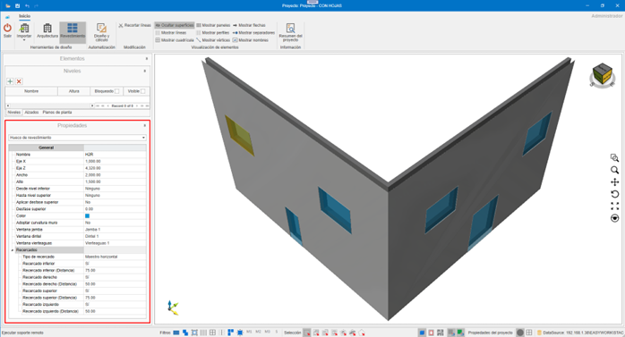
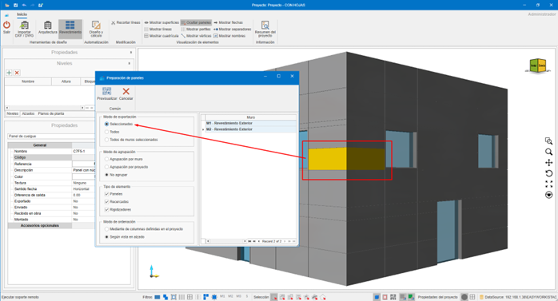
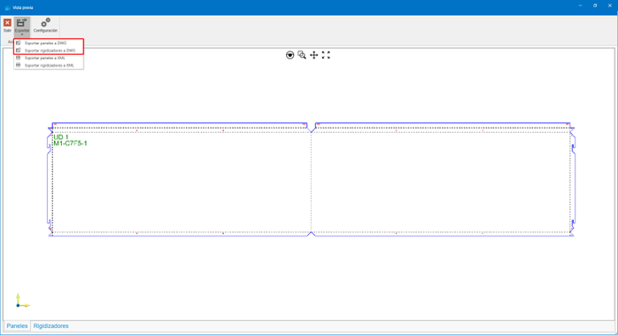
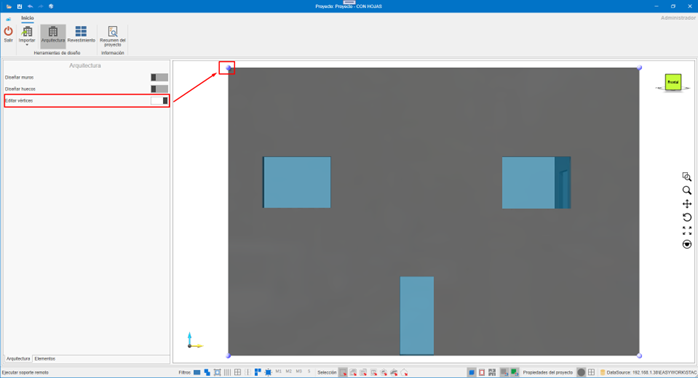
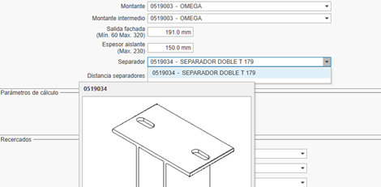
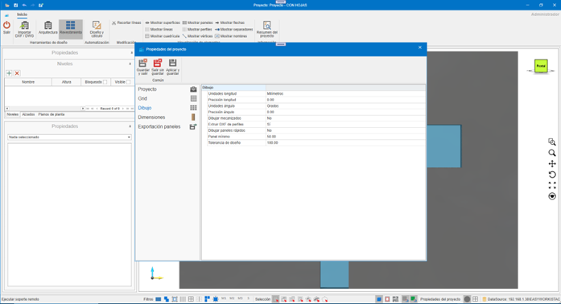
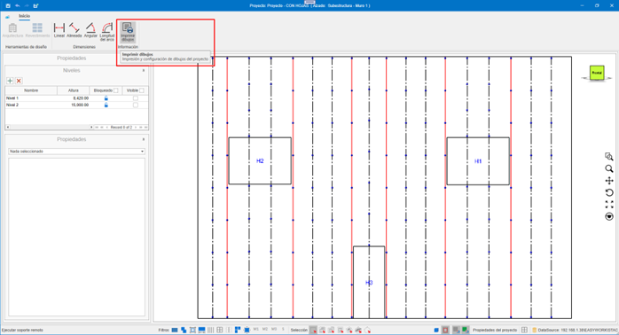
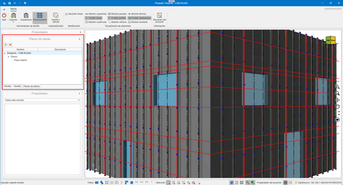

# enCLAD 

---

## 1. Introducción 

El propósito de este documento es otorgar conocimientos básicos sobre el funcionamiento de **enCLAD**, para agilizar la gestión de procesos en el revestimiento de un edificio.

Antes de comenzar a trabajar con enCLAD, es necesario disponer de una base de datos con los sistemas y materiales definidos en **enMATERIALS**.

---

## 2. Nomenclaturas específicas de enCLAD

### 2.1. Línea maestra
Railes utilizados para el dibujo de huellas del edificio o montantes intermedios.

- **Líneas de corte**: color rojo, continuas  
- **Líneas de refuerzo**: color negro, discontinuas

  

### 2.2. Cuadro de revestimiento
Área situada entre líneas.

- **Verde**: zonas a revestir  
- **Rojo**: zonas no revestidas  
- **Propiedad Revestir**: `Sí / No`

  Se utiliza para el cálculo automático de paneles desde el botón **Diseño y cálculo**.

  

### 2.3. Superficie de revestimiento
Zona visible del revestimiento, independiente del muro de obra.

Propiedades editables:
- **Remate de coronación**
- **Altura de coronación**
- **Separación respecto al muro**

  

### 2.4. Hueco de revestimiento
Este hueco es independiente del hueco del que parte en el muro de obra, y del hueco dibujado sobre la superficie de revestimiento.

Incluye propiedades automáticas como por ejemplo:
- **Recercados**
- **Jamba**
- **Dintel**
- **Vierteaguas**

  

### 2.5. Archivo `.enclad`
Formato propio de enCLAD para almacenamiento e intercambio.

> **¡Importante!**⚠️ Requiere la misma base de datos de sistemas y materiales para abrirse correctamente.

---

## 3. Funcionamiento y navegación

### 3.1. LogIn

Pantalla de inicio de sesión mediante usuario y contraseña.

  

### 3.2 Inicio

Vista principal tras acceder a la aplicación.

  

---

## 4. Menú superior

Contiene todas las acciones sobre el proyecto.

### 4.1. Botón de menú

**Proyecto**
- **Abrir:** Abre un proyecto almacenado en formato `.enclad`.
- **Guardar:** Permite guardar en formato `.enclad` el proyecto abierto en el momento.
- **Exportar:** Exporta según el formato seleccionado la información del proyecto.

  

**Formatos de exportación**
- **DWG**: Exporta a DWG la vista actual del proyecto. Formato AutoCAD.
- **EMF**: Exporta a EMF la vista actual del proyecto. Formato de imagen de archivo de windows.
- **PDF**: Exporta a PDF la vista actual del proyecto. Formato de ficheros de Adobe (Portable Document Format).
- **PDF 3D**: Exporta a PDF 3D el proyecto actual. Formato 3D de ficheros de Adobe.
- **STEP**: Exporta a STEP el proyecto actual. Standard for the Exchange of Product Data (Estándar para el intercambio de modelo de datos de producto), también conocido como ISO 10303.
- **STL**: Exporta a STL el proyecto actual. Formato de transmisión de datos estándar por excelencia de la industria de creación rápida de prototipos
- **XML**: Exporta a XML el proyecto actual. (Extensible Markup Language). Almacena los datos de forma que puedan ser leídos tanto por ordenadores como por personas. Un archivo . xml es un formato de datos basado en texto que es compatible con la mayoría de los editores de texto.
- **OBJ**: Exporta a OBJ el proyecto actual. La extensión OBJ es un formato de archivos de imágenes en 3D.
- **IGES**: Formato de archivo del software de Computer Aided Design (CAD).
- **WebGL**: Estándar de web abierta para representar gráficos en cualquier navegador compatible, sin necesidad de plugins adicionales.

  

### 4.2.Exportar paneles
Exporta los paneles desplegados en formato DWG, según los valores seleccionados en la ventana de exportación, listos para enviar a corte.

  

  

  

- Configuración de capas para exportación a DWG.

  

- Exportar paneles a DWG 
- Exportar rigidizadores a DWG
- Exportar paneles a XML 
- Exportar rigidizadores a XML

  

### 4.3. Eliminar revestimiento
El desplegable de **Eliminar revestimiento** nos ofrece distintas posibilidades. Eliminar partes de un revestimiento, o el revestimiento completo. 

Opciones:
- **Líneas:** Nos otorga la posibilidad de eliminar las líneas de revestimiento de nuestro diseño. Eliminar las líneas de revestimiento implica la eliminación de los materiales que dependen de esta línea, como por ejemplo montantes o anclajes.
- **Cuadros:** Al eliminar los cuadros de revestimiento no eliminamos ningún material. Estos cuadros únicamente son las áreas definidas que se panelarán durante el cálculo de paneles. Una vez creados los paneles no los necesitaremos y los podremos eliminar.
- **Huecos:** Elimina los huecos de la superficie de revestimiento. Si ya disponemos de los paneles necesarios no es necesario disponer de los huecos de revestimiento.
- **Paneles:** Elimina los paneles del proyecto.
- **Revestimiento completo:** Elimina el revestimiento del/los muro/s  seleccionado/s, o en su defecto de todos los muros. Superficie de revestimiento y sus huecos, líneas de revestimiento, cuadros de revestimiento, paneles, montantes, anclajes, …

  

### 4.4. Eliminar diseño

Elimina todo el contenido del proyecto.

---

## 5. Herramientas de diseño

Permiten la construcción del edificio.

### 5.1. Importar DXF / DWG

Importa:
- Niveles
- Muros
- Huecos
- Líneas maestras

  

**Requisitos del DXF / DWG**
- Muros como polilíneas cerradas de 4 vértices.
- Huecos como polilíneas cerradas
- Texto interior para nombre del muro: `Name: "M Norte"`
- Niveles definidos por recuadros con:
  - `N: "Nombre del nivel", "Altura"`

  

  

---

## 6. Arquitectura

### 6.1. Diseñar muros
Creación manual de muros en el nivel seleccionado.

  

### 6.2. Diseñar huecos
Huecos en muros de obra o superficies de revestimiento.

  

### 6.3. Editar vértices
Edición de vértices independientes de los muros de obra, huecos y de la superficie de revestimiento.

  

---

## 7. Revestimiento

### 7.1. Automatización

#### 7.1.1. Diseño y cálculo

Automatización del cálculo de revestimiento del edificio. Mediante el asistente de diseño y cálculo podemos obtener de un modo automatizado el revestimiento necesario para los muros que tengamos seleccionados en ese momento, o para todos los muros del edificio en su defecto.

  

  - Se dibujará las líneas importadas desde el archivo de CAD, y nos creará una superficie de revestimiento en caso de ser necesario.

  

  - Modulación importada.

  

##### 7.1.2. Diseño rápido
El diseño rápido nos permite obtener un cálculo de la modulación del edificio, para poder obtener una aprobación inicial por parte del arquitecto / cliente implicado.
  
  

Opciones:
- **Inicializar superficie:** Inicializa una superficie de revestimiento, a la distancia indicada según la salida de la fachada indicada. Esta salida será a cara vista del panel.
- **Inicializar líneas:** Inicializa las huellas horizontales y verticales que definirán nuestro modelo. En el diseño rápido únicamente se calculan las huellas (Líneas de corte).
Las líneas pueden ser de corte o de refuerzo. Las líneas de corte definirán las huellas del modelo, las de refuerzo definirán los montantes intermedios. Las líneas serán calculadas en función de los huecos y las dimensiones de los paneles escogidos.
- **Inicializar cuadros:** Los cuadros serán calculados en función de las líneas de revestimiento, y serán los espacios definidos entre estas.
- **Inicializar paneles:** Los paneles se calcularán por cada uno de los cuadros del diseño, siempre y cuando no hayamos establecido alguno de los cuadros como ‘No revestir’. Tendrá en cuenta los huecos o recercados que se encuentren en su interior. Al ser el diseño rápido, este cálculo de paneles no contemplará alas ni mecanizaciones. Únicamente nos mostrará una vista frontal de la modulación calculada.

> **Nota:** No contempla alas ni mecanizados.

##### 7.1.3. Cálculo completo
El cálculo completo nos va a otorgar tanto la modulación, como el cálculo real de paneles y toda la sub estructura necesaria para llevar a cabo nuestro proyecto. Los checks que encontramos para poder manejar difieren de los checks de diseño rápido.
  
  

Incluye:
- **Inicializar paneles:** Se calcularán del mismo modo que en el diseño rápido, pero al calcularlos de un modo completo, ya nos otorgará las alas necesarias y demás información para enviar a corte.
- **Calcular refuerzos:** Calcula los refuerzos necesarios entre huellas.
- **Calcular perfiles:** Dibuja los perfiles necesarios.
- **Calcular anclajes:** Dibuja los anclajes necesarios.

---

### 7.2. Parámetros de diseño rápido
  
  

- **Sistema**: Selección del sistema de revestimiento.
- **Panel**: Selección del panel con el que revestir.
- **Color**: Color del panel.
- **Selección Dimensiones**: Dimensiones disponibles del panel.
  
  

- **Recercados**: Recercados a aplicar en la superficie de revestimiento. Posteriormente se podrán modificar seleccionando la superficie de revestimiento.
- **Distancia extremos**: Distancia de la huella / refuerzo desde los extremos.
- **Distancia coronación**: Distancia de la huella desde la coronación de la fachada.
- **Distancia inferior**: Distancia de la huella desde el remate inferior de la fachada.
- **Montantes extremos**: Indica si se coloca el montante de los extremos o no.
- **Montantes extremos dividen**: Indica si convertimos en huella el montante de los extremos.
-	**Ajustar horizontales a huecos o recercados**: Ajusta las huellas horizontales a los huecos o recercados.
-	**Ajustar verticales a huecos o recercados**: Ajusta las huellas verticales a los huecos o recercados.
-	**Muro guía**: Indica el muro a partir del cual se van a establecer las huellas horizontales. Si escogemos ninguno, se calculará cada muro por separado.
  
  

- **Optimización**:Indica el modo en el que vamos a utilizar los paneles o bobinas pertinentes.
- **Flecha**: Indica la dirección de la flecha del panel para optimización.
- **Longitud máxima**: Longitud máxima del panel a utilizar.
-	**Distancia huella**: Ancho de la huella. Inicialmente se obtiene desde el sistema escogido, y en este se indican los parámetro de mínimo y máximo.
-	**Modo de cálculo**: Mejor optimización.

---

### 7.3. Parámetros de cálculo completo
  
  

- **Montante**: Montantes disponibles según sistema. Intercambiable posteriormente al cálculo. Posteriormente, se podrá modificar seleccionando la superficie de revestimiento.
-	**Montante intermedio**: Montantes intermedios disponibles según sistema. Posteriormente, se podrá modificar seleccionando la superficie de revestimiento.
  
  

-	**Salida de fachada**: Salida del revestimiento a cara vista del panel. Posteriormente, se podrá modificar seleccionando la superficie de revestimiento.
-	**Espesor aislante**: Espesor del aislante a utilizar. Posteriormente, se podrá modificar seleccionando la superficie de revestimiento.
-	**Separador**: Separadores disponibles según la salida de la fachada. Posteriormente, se podrá modificar seleccionando la superficie de revestimiento.
  
  

-	**Distancia separadores**: Distancia de cálculo de separadores necesarios. Posteriormente, se podrá modificar seleccionando la superficie de revestimiento.
-	**Distancia montantes**: Indica la distancia máxima entre montantes. Posteriormente, se podrá modificar seleccionando la superficie de revestimiento.
-	**Distancia botas**: Indica la distancia máxima entre botas en un panel de tipo cuelgue. En el caso de un panel remachado, visualizaríamos la distancia máxima entre remaches.
-	**Dintel**: Dinteles disponibles en el sistema. Posteriormente, se podrá modificar seleccionando la superficie de revestimiento.
  
  

-	**Jamba**: Jambas disponibles del sistema. Posteriormente, se podrá modificar seleccionando la superficie de revestimiento.
-	**Vierteaguas**: Vierteaguas disponibles del sistema. Posteriormente, se podrá modificar seleccionando la superficie de revestimiento.
-	**Rincón**: Rincones disponibles del sistema. Posteriormente, se podrá modificar seleccionando la superficie de revestimiento.
-	**Coronación y altura**: Coronaciones disponibles del sistema, y la distancia que debe sobrepasar el muro de obra. Posteriormente, se podrá modificar seleccionando la superficie de revestimiento.
-	**Cierre**: Cierres disponibles del sistema. Posteriormente, se podrá modificar seleccionando la superficie de revestimiento.
-	**Remate inferior**: Remates inferiores disponibles en el sistema. Posteriormente, se podrá modificar seleccionando la superficie de revestimiento.

---

## 8. Visualización de elementos

Permite mostrar u ocultar:
- Superficies
- Líneas
- Cuadrícula
- Paneles
- Perfiles
- Vértices
- Flechas
- Separadores
- Nombres

---

## 9. Resumen de proyecto

Muestra el listado de materiales necesarios (despiece) para llevar a cabo el proyecto. Este listado puede ser copiado y pegado sobre un archivo Excel.
  
  

---

## 10. Barra inferior
  
  

1. **Soporte remoto** (TeamViewer)
2. **Filtros**: Filtra la selección de entidades, según los filtros aplicados.
3. **Modos de selección**: Cambia entre los distintos modos de selección´.
4. **Vistas**: Bloque, alámbrica, planta. Muestra una vista en bloque del diseño 3D.
5. **Referencia a grid**: Referencia el puntero a la cuadrícula de la grid.
5. **Referencia a objeto**: Referencia el puntero a las distintas entidades del diseño.
6. **Propiedades del proyecto**: Permite cambiar ciertas configuraciones del proyecto, y establecer ciertos valores por defecto.
  
    
    
    
    
    
    
    

7. **Origen**: Muestra u oculta el punto de origen en el diseño.
8. **Grid**: Muestra u oculta la grid del diseño

---

## 11. Panel lateral izquierdo
    
  

### 11.1. Niveles
Gestión y visibilidad de niveles.
    
  

### 11.2. Alzados
Definición de alzados de nuestro diseño. Podemos tener de dos tipos, de subestructura o de modulación. Según el tipo escogido visualizaremos unos elementos u otros.
    
  

- **Modulación y dibujos**
    
  
    
  

- **Subestructura y dibujos**
    
  
    
  
    
  

### 11.3. Planos de planta
Definición de plantas del proyecto.
    
  
    
  

### 11.4. Propiedades
Panel de propiedades del elemento seleccionado. Ejemplos:
    
  
    
  
    
  
    
  
    
  
    
  

---

## 12. Modo de empleo

### 12.1. Atajos de teclado

- `CTRL + A` → Seleccionar todo  
- `CTRL + I` → Invertir selección  
- `CTRL + SUPR` → Eliminar  
- `CTRL + F` → Zoom automático  
- `CTRL + + / -` → Zoom  
- Flechas → Rotación  
- `ESC` → Cancelar  

### 12.2. Comandos táctiles

- Doble toque → Selección  
- Arrastrar → Rotación  
- Pellizco → Zoom  
- Dos dedos → Desplazamiento  
- Giro con dos dedos → Rotación sin volteo  

---

## 13. Creación de materiales enMATERIAL

Desde el módulo enMATERIAL se creará los materiales de cada sistema de paneles ventilados composite.

Para más información, sigue este enlace: [enMATERIAL](2.UT_Crear_Materiales_enMATERIAL.md)
