# Creación de materiales propios en enMATERIALS 

---

## 1. Introducción

Este manual tiene como objetivo guiar al usuario en el proceso de alta y gestión de materiales propios en enMATERIALS. Asegúrate de seguir las instrucciones detalladas para garantizar una correcta definición y organización de los materiales.

---

## 2. Definición de materiales

Los materiales pueden clasificarse en diferentes tipos según sus propiedades y características. A continuación, se describen los principales tipos:

### 2.1. Tipos de materiales

- **Piezas**: Se calculan por unidad y son los materiales más comunes y sencillos de definir.
- **Barras**: Se calculan por metro lineal y requieren información adicional, como longitud.
- **Superficies**: Se calculan por metro cuadrado y pueden incluir características adicionales.
- **Juntas**: Se calculan por metro lineal y tienen especificaciones especiales para su aplicación.

### 2.2. Artículos y colores

Los materiales se definen dentro de la sección "Artículos", mientras que los acabados se gestionan en "Colores" y la materia prima en "Materiales".

---

## 3. Creación de materiales

Para dar de alta un material, sigue estos pasos:

### 3.1. Definir un artículo

1. Accede a la sección de "Artículos".

   
   

2. Desde la pestaña **General** Asigna una referencia, un tipo de cálculo y un material.

   

3. Organiza los artículos por niveles utilizando los campos "Familia1", "Familia2", etc.

   

4. Completa la descripción de compra (para proveedores) y la de venta (para clientes).

   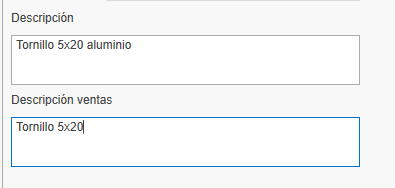

5. Asigna un material base arrastrando un material desde el árbol de materiales en la cinta derecha.

   

6. Añade imágenes al material. Asegúrate de optimizar las imágenes para evitar lentitud en la base de datos.

   

7. En el apartado de **Información de almacén** índico para ese artículo algunos campos como:

   - **Almacén principal**: Define el almacén donde se ubicará el artículo por defecto en el sistema.
   - **Ubicación**: Especifica la localización física exacta dentro del almacén (estantería, pasillo, nivel, etc.).
   - **Montado en destino**: Al marcar esta casilla, el artículo se configurará para montaje en destino por defecto. Estos materiales aparecerán en el puesto de Picking de enCONTROL.
   - **Control de stock**: Al activar esta opción, el artículo se incluirá en el apartado de reposición de stock para seguimiento de inventario.

      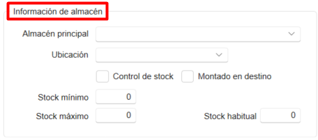

> ℹ️ **Nota:** El apartado "General" del artículo es igual para todos los tipos de cálculo.

### 3.2. Creación de colores

1. Accede a la sección de "Colores".

   
   

2. Asigna una referencia, nombre y un color o textura.

   

3. Asigna un proveedor desde la pestaña "Proveedor" arrastrando el proveedor desde la ventana derecha.

   

### 3.3. Creación de un material Base

1. Accede a la sección de "Materiales".

   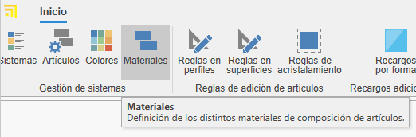
   

2. Indica el nombre, color y marca el check "Material" para que aparezca como materia prima.

   

> ℹ️ **Nota:** Para generar automáticamente la carta RAL de colores y material base, selecciona el botón **Esenciales** en la barra de "Inicio".

   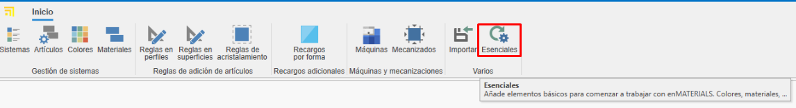

   
   

---

## 4. Gestión de proveedores

Antes de dar de alta un material, verifica si el proveedor ya está registrado en ENBLAU en la sección "Compras > Proveedores". Si no está registrado, créalo siguiendo los estándares definidos.

   

---

## 5. Comercial y stock

Una vez definido el material, completa su información en las secciones de comercial y stock.

### 5.1. Datos de compra y proveedores

Asigna proveedores, unidades y precios de compra según cada color del material.

   

> ℹ️ **Nota:** Puedes añadir una referencia de proveedor si es distinta de la registrada en la base de datos.

### 5.2. Asignación de referencias

Cada color y material tendrá una referencia única _(Referencia Artículo + Referencia Color)_. Arrastra uno o más colores desde la pestaña de colores en la ventana derecha.

   

---

## 6. Tipología de materiales y datos adicionales

### 6.1. Piezas

- Materiales individuales gestionados por unidad (accesorios, tornillos, etc.).
- Se valoran por unidad.
- En la pestaña "Propiedades Comunes", puedes añadir campos adicionales si es necesario.

   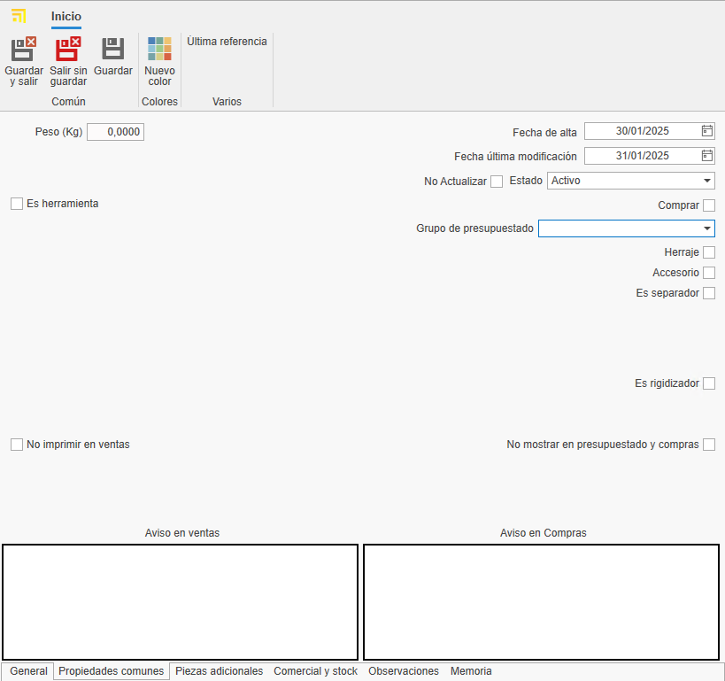

### 6.2. Barras

- Materiales definidos por longitud y otros atributos técnicos.
- Se valoran por metro lineal.
- En la pestaña "Propiedades Comunes", indica la longitud de la barra (obligatorio).

   

- Para perfiles, añade información adicional como distancia de seguridad y retal mínimo/máximo. Ese tipo de información son opcionales.

   

> ℹ️ **Nota:** Los apartados como Tipología, Rol, Datos Técnicos, Descuentos y Reglas no son necesarios para creación de materiales propios, ya que son información relevante únicamente para los materiales dibujados.

### 6.3. Superficies

- Materiales definidos por metro cuadrado (vidrios, chapas, etc.).
- Se valora por M2.
- En la pestaña "Propiedades Comunes", indica el alto y ancho de la superficie.

 

- En la pestaña "Valoración y datos técnicos", indica algunos datos dependiendo del tipo de la superficie y su necesidad. Por ejemplo: Espesor, tipo de superficie, precios por M2 (marcar el check "M2 por proveedor" si el precio se calcula por proveedor), etc. 

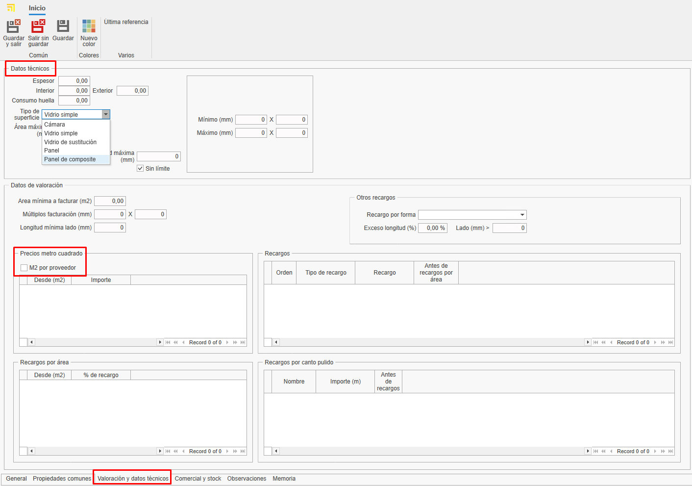 

### 6.4. Juntas

- Materiales definidos por metro lineal.
- Se valora por metro lineal.
- En la pestaña "Propiedades Comunes", se puede indicar la longitud si lo ves necesario.

   

---

## 7. Estándares a seguir

Para garantizar una correcta gestión, sigue estos estándares:

- Usa mayúsculas en nombres y referencias.
- Verifica la existencia de proveedores y materiales antes de darlos de alta.
- Mantén un formato uniforme en referencias de materiales y colores.
- Guardar siempre los cambio.

---

## 8. Creación de documentos de compra ENBLAU

Para comprobar si el artículo está dado de alta abrir ENBLAU y crear un documento de compra:

1. Crea un pedido de compra y selecciona el proveedor.
2. En el pedido de compra busca y agrega el material desde la ventana derecha. Arrastra y selecciona el color asociado.

   

3. Válida el precio asignado al proveedor.

   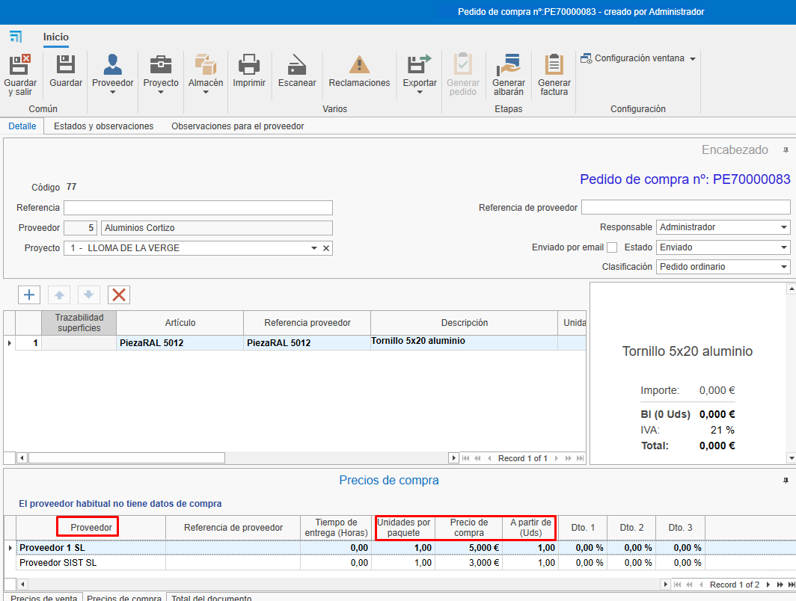

   - Si el material tiene más de un proveedor asignado, puedes seleccionar el proveedor deseado con un doble clic sobre el proveedor.

---

## 9. Creación de sistemas y materiales enCLAD

Creación de sistemas y materiales para **Fachadas ventiladas** en **enCLAD**.

### 9.1. Sistemas

Desde de la ventana de inicio en la barra superior ir a **Sistema**.

   

- Para crear un nuevo sistema, ir a la barra superior **Nuevo**.

   

#### 9.1.2. Propiedades

Desde la pestaña **Propiedades** en la parte inferior se define algunos campos del sistema:

   - Nombre
   - Descripción
   - Proveedor
   - Familia 1 y 2 (organiza por niveles)
   - Imagen
   - Estado: Activo, Deshabilitado temporalmente o descatalogado.
   - Definir la tipología del sistema. En ese caso marcar la casilla **Fachada ventilada**.

      

Desde la pestaña **Artículos relacionados** en la parte inferior se muestra el listado de materiales relacionado con el sistema.

   

#### 9.1.3. Fachada ventilada

Desde la pestaña **Tipo de sistema** en la parte inferior se mostrará una ventana donde puede elegir el tipo de sistema:

   - Sistema se cuelgue
   - Sistema macho-hembra
   - Sistema pegado
   - Sistema remachado

- En la ventana lateral izquierda se define los parámetros del tipo de sistema.

- En la ventana inferior se define otros parámetros comunes entre los tipos de sistemas, como:

   - Distancia extremo habitual.
   - Huella mínimo - Vertical
   - Huella máximo - Vertical
   - Huella - Vertical
   - Huella mínimo - Horizontal
   - Huella máximo - Horizontal
   - Huella - Horizontal
   - Recercado mínimo
   - Recercado máximo
   - Recercado habitual
   - Permitir recercado (casilla)

- En la ventana central se muestra el diseño de la fachada ventilada del tipo del sistema elegido. Si el tipo de sistema es **Sistema de cuelgue**, al lado se muestra una ventana para la definición del diseño del mecanizado.

   - Pestaña **Mecanizado cuelgue** se puede importar el dibujo en formato dwg/dxf.
   - Pestaña **Otros mecanizados** se puede definir con algunos parámetros el dibujo del mecanizado.

- En la ventana lateral derecha **Materiales del sistema** se añade los artículos para el sistema en cada campo desplegable:

   - Coliso
   - Remache conformado
   - Soporte cuelgue
   - Pletina conformado
   - Refuerzo bota

   

> ℹ️ **Nota:** Dependiendo del tipo de sistema se definirá unos parámetros u otros.

Desde la pestaña **Opciones** en la parte inferior se mostrará una ventana de las opciones relacionada con el tipo de sistema.

   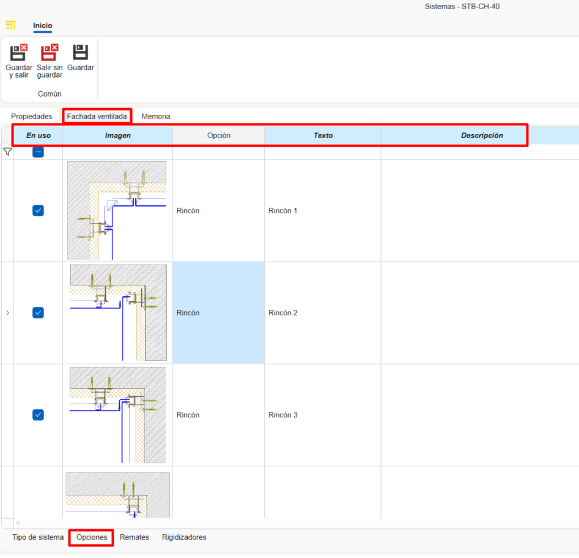

Desde la pestaña **Remates** en la parte inferior se mostrará una ventana donde definir las **Opciones de remate** sus **Valores** y los **Pliegues** para añadir la longitud y rotación.

   

Desde la pestaña **Rigidizadores** (solo para el sistema de tipo cuelgue) se muestra el listado de materiales de tipo rigidizador relacionado con el sistema.

   

#### 9.1.4. Clonar sistemas

Desde **Sistemas** en la cinta superior hay la opción de **Clonar**. Esa funcionalidad copia todas las propiedades del sistema seleccionado en la lista.

   

   

---

### 9.2. Definición artículos enCLAD

Definir artículos desde:

   

   

1. **General** rellenar los campos de información general dependiendo del tipo de cálculo seleccionado, **barra**, **pieza**, **junta** o **superficie**.

   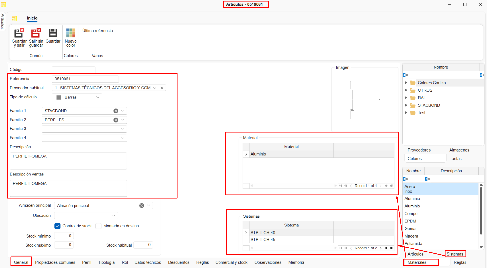

> **Nota:** Es importante indicar el sistema de la fachada ventilada que estará vincula ese material.

2. **Propiedades comunes** rellenar los campos de las propiedades comunes. De pendiendo del tipo de calculo de material aparecera unos campos u otros. Ejemplo:

   - **Barra**

      

   - **Pieza** (Separador)

      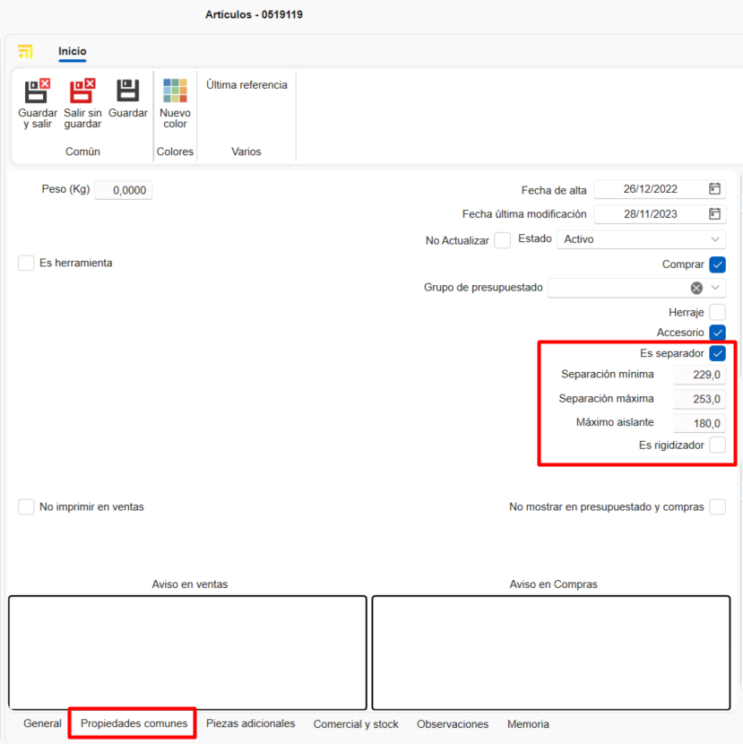

3. **Rol** marcar el tipo de rol del perfil (solo para barras) y su valor en la casilla del apartado e fachada ventilada.

      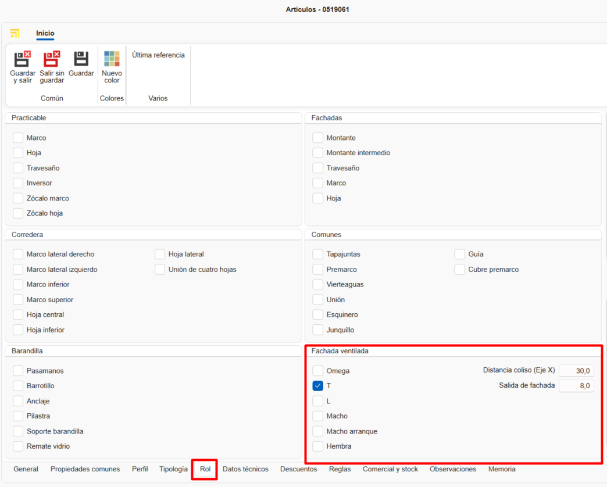

4. **Datos técnicos** importar dwg/dxf del material y definir las dimensiones del dibujo, como:

   - Dimensiones interiores
   - Dimensiones exteriores
   - Profundidad
   - Punto de inserción
   - Varios

   

> **Nota:** Datos técnicos solo está disponible para los tipos de cálculo **barra** y **junta**.

5. **Reglas** asignar una regla al perfil (solo para barras) arrastrando una regla ya definida desde la ventana lateral derecha inferior de la pestaña **Reglas** previamente definida.

   

### 9.3. Definición de reglas

Desde el apartado de inicio ir al listado **Regalas de adición de artículos** y seleccionar **Reglas en perfiles**.

   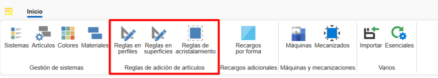

1. Crear **Nueva** regla en perfiles.

## 10. Conclusión

Siguiendo este manual, podrás dar de alta y gestionar materiales de manera eficiente en el sistema, asegurando una correcta organización y optimización de los procesos de compra y venta.

---
