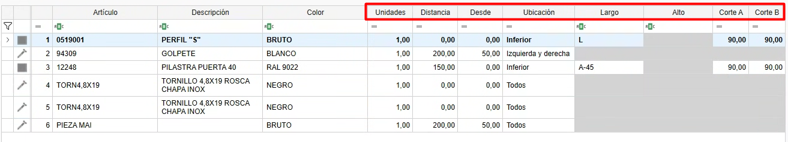

# Escandallos (Agrupación de materiales)

---

## 1. Introducción

Este manual explica paso a paso cómo utilizar la funcionalidad de **Escandallos**.  
Los escandallos se definen desde **ENBLAU**, agrupando materiales propios creados desde **enMATERIALS**.  
Además, se pueden agrupar esos materiales y generar las unidades necesarias según diversas condiciones, como las dimensiones, la ubicación de los tramos, la distancia o mediante fórmulas.

---

## 2. Escandallos

- Acceder a los escandallos desde **Almacenes → Escandallos**.

  

---

### 2.1. Creación de Escandallos

- Para crear un escandallo, sigue estos pasos:

  1. Desde el listado de escandallos, selecciona el botón **Nuevo** para crear un nuevo escandallo.

     

  2. Se abrirá una ventana donde debes definir los siguientes campos:

     - **Nombre**: Define el nombre del escandallo que estás creando.  
     - **Familia**: Campo opcional donde se indican las carpetas y subcarpetas en las que se desea añadir el escandallo. Este campo se reflejará posteriormente en el árbol de escandallos dentro del apartado de **Documentos de ventas**.  
     - **Descripción**: Breve descripción del escandallo.  
     - **Descripción ventas**: Indica si la descripción para ventas es distinta de la descripción general del escandallo.  
     - **Imagen**: Permite añadir una imagen o captura representativa del escandallo.

       

  3. El apartado de **Producto terminado** es de uso exclusivo del puesto de **Transformación** en enCONTROL. En este campo se debe indicar en el desplegable la referencia de un material de tipo *pieza* y su color creado previamente en enMATERIALS. Una vez el producto haya pasado por el puesto de Transformación, se descontarán automáticamente los materiales definidos en el despiece del escandallo y se generará una entrada en stock con la referencia de material indicada en dicho apartado.

      

---

### 2.2. Agrupar materiales

- Una vez creado el escandallo, los pasos siguientes permiten **agrupar y generar los materiales** correspondientes:

    1. Desde el árbol de artículos, ubicado a la derecha, arrastra los materiales que se deben generar para ese escandallo.

        

    2. Luego define las siguientes condiciones según sea necesario:

        - **Unidades**: Indica las unidades que se deben generar del material.  
        - **Distancia**: Especifica cada cuánto tramo se debe generar el material.  
          Ejemplo: *1 tornillo cada 100 mm de tramo.*  
        - **Desde**: Define, junto con la distancia, a partir de qué punto se comienza a contar.  
        - **Ubicación**: Despliega un listado para indicar la ubicación del tramo donde se debe generar el material.  
          Ejemplo: *Superior, inferior, derecha, izquierda.*  
        - **Largo**: Permite indicar una longitud fija o usar una fórmula.  
          Ejemplo: *L-50 → calcula la longitud de la barra menos 50 mm.*  
        - **Alto**: Permite indicar una altura fija o usar una fórmula.  
          Ejemplo: *A-50 → calcula la altura de la superficie menos 50 mm.*  
        - **Corte A**: Define el tipo de corte del lado **A** de la barra.  
          Ejemplo: *Corte a 90° o 45°.*  
        - **Corte B**: Define el tipo de corte del lado **B** de la barra.  
          Ejemplo: *Corte a 90° o 45°.*

          
      
> ℹ️ **Nota:** Los campos se activan dependiendo del tipo de cálculo del material (pieza, barra, junta o superficie).

---

## 3. Cómo usar escandallos

- Desde cualquier documento de ventas (**Presupuesto**, **Pedido**, **Producción**, etc.), accede al apartado **Escandallos**, ubicado en la parte derecha del documento.  
  A continuación, sigue los pasos:

    1. Arrastra un escandallo a la posición del documento.

        

    2. Se abrirá una ventana del editor de escandallos, donde podrás editar los valores antes de aceptar.

        

    3. Una vez aceptado, podrás modificar las medidas, precios y descuentos.  
      Si los materiales tienen asociada una tarifa de venta, el precio se calculará automáticamente por despiece.

        
    
    4. Accede a **Material necesario** para listar los materiales con las unidades definidas según las condiciones del escandallo y realizar el pedido de compra al proveedor.

        
