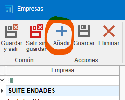
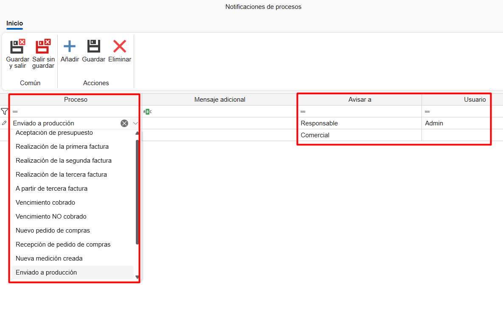
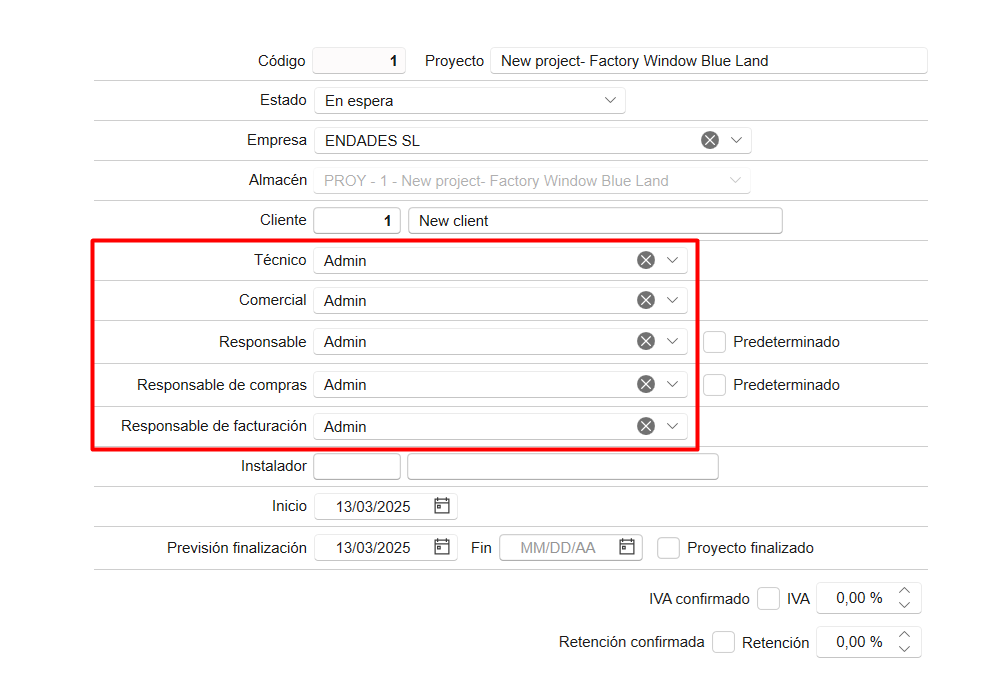

# Configurazione iniziale di ENBLAU

---

## 1. Scopo

Il presente manuale è stato progettato per guidare i nuovi utenti nella configurazione iniziale di ENBLAU.  
Questa configurazione include tutto il necessario affinché il cliente possa effettuare vendite, acquisti e l’emissione di fatture.

---

## 2. Configurazione generale

  

### 2.1. Configurazione della connessione con Logikal

- Per connettersi con la fabbrica e i progetti di Logikal, è necessario indicare il percorso di installazione e la DLL di Logikal (unità di rete su cui punta Logikal).

- Da **Generale**, vai su **Logikal - Connessione e Progetti**.

  

- Per connettersi alla fabbrica in Logikal, vai nella parte inferiore della finestra principale di **ENBLAU**, fai clic con il tasto destro su **Connessione fabbrica** e seleziona **Connetti**.

  

---

### 2.2. Generale

- **Percorso di archiviazione**: Indicare il percorso dove verranno salvati i documenti di ENBLAU e Logikal (unità di rete). Esempio:

  

  > **Nota:** Si consiglia di utilizzare un’unità di rete. Se non esiste, crearla.

- **Informazioni sull’azienda**: Compilare i campi necessari con le informazioni aziendali, come nome, codice fiscale, indirizzo, loghi, ecc.

  

---

### 2.3. Testi nelle vendite

- Aggiungere testi per i documenti di vendita, come osservazioni, condizioni, ecc.

  

  Esempio di rapporto d’ordine:

  

---

## 3. Gestione utenti

- Per registrare nuovi utenti, accedere a **Utenti**.

  

- In **Nuovo**, è possibile creare nuovi utenti.

  

- Si aprirà una finestra per configurare le informazioni dell’utente (nome, indirizzo, email, telefono, ecc.), il tipo di utente (Tecnico, Commerciale, Officina, ecc. — è possibile assegnare più di un tipo) e i permessi.  
  I permessi possono essere assegnati solo dagli utenti di tipo amministratore.

  

- Una volta creato, l’utente potrà essere modificato in qualsiasi momento.

---

## 4. Configurazione degli account email

- Per configurare l’account email dell’utente, accedi a **Email utente:** 

  

  

- Per configurare gli account email di ciascun utente, accedi a **Account email:** 

  

  

- Da ciascuna sezione è possibile configurare l’indirizzo email, il nome utente, la firma e i server di posta in entrata/uscita IMAP e SMTP.  
  La configurazione dei server e delle porte deve essere corretta in base al provider utilizzato, per consentire l’invio e la ricezione delle email da report o notifiche.

### 4.1. Configurazione generale delle email

- Dalla sezione **Generale → Email** è possibile definire i destinatari in copia, l’oggetto e la modalità di invio delle email.

  

  

### 4.2. Possibili errori di autenticazione Microsoft

- Durante l’invio di un’email, può apparire un errore come questo:

  

  **LOG**  
  Error: 535: 5.7.139 Authentication unsuccessful, SmtpClientAuthentication is disabled for the Tenant.  
  Visitare [Invio SMTP autenticato in Exchange Online](https://learn.microsoft.com/es-es/exchange/clients-and-mobile-in-exchange-online/authenticated-client-smtp-submission) per maggiori informazioni.

  L’errore è dovuto a un problema di autenticazione dell’account email, probabilmente causato da un aggiornamento dei protocolli di sicurezza di Microsoft 365.

  - **Soluzione:** Contattare l’amministratore di Microsoft 365.  
    Dalla console di amministrazione, seguire i passaggi riportati nel link sopra per configurare correttamente l’account Outlook in modo che possa sincronizzare le email da un’altra applicazione.

    

    Assicurarsi che tutte le caselle siano selezionate nella sezione **Gestione applicazioni di posta** per l’utente in Microsoft 365.

    

> **Nota:** Per gli account **Microsoft Exchange**, si consiglia di selezionare **Modalità di invio 2** nel campo **Modalità di invio email** della sezione Generale.

  

---

## 5. Gestione aziende

- Se disponi di più aziende, puoi crearle nella sezione **Aziende**, cliccando su **Aggiungi**.  
  Poi compila le informazioni in **Generale** e **Testi nelle vendite** secondo le necessità di ciascuna azienda.

  

  

  > ⚠️ **Importante!** Se non viene indicata un’altra azienda, i progetti utilizzeranno di default l’azienda definita nella configurazione di base in **Generale**.  
  > Se devi emettere fatture con **facturae**, è necessario che le informazioni aziendali siano inserite nella sezione **Aziende**.

---

## 6. Configurazione progetti

- Dalla sezione **Vendite → Progetti**, accedi a **Configurazione**.

  

  

- Nella configurazione troverai un menu a tendina con diverse opzioni.  
  Per una configurazione iniziale, è necessario impostare **Stati** e **Cartelle predefinite**.

  

### 6.1. Stati

- Selezionando **Stati**, si aprirà una finestra per definire gli stati dei progetti (commesse).

  

### 6.2. Cartelle predefinite

- Selezionando **Cartelle predefinite**, si aprirà una finestra per definire le cartelle necessarie nella directory del progetto.

  

> **Nota:** Le cartelle predefinite possono essere configurate per essere create automaticamente per ogni progetto.

---

## 7. Configurazione vendite

- Dalla sezione **Vendite → Documenti di vendita**, accedi a **Configurazione**.

  

  

- Nella configurazione troverai un menu a tendina con varie opzioni.  
  Per una configurazione iniziale, è necessario impostare **Numerazioni**, **Forme di pagamento**, **Banche**, **Modalità di pagamento**, **Concetti di rottura**, **Classificazioni**, **Soggetti passivi (IVA)** e **Cartelle predefinite**.

  

### 7.1. Numerazioni

- Selezionando **Numerazioni**, si aprirà una finestra per definire i tipi di numerazioni per i documenti di vendita, assegnando numeri progressivi ai documenti.

  

  - Esempio: Tipo di documento "Preventivo", prefisso (Alpha) e numero (numero successivo) - **PR1000272**.

  

### 7.2. Modalità di pagamento

- Selezionando **Modalità di Pagamento**, si aprirà una finestra per definire le modalità di pagamento necessarie per generare le scadenze nelle fatture.

  

  - Esempio: Indicare in quante rate e la percentuale che il cliente deve pagare a ogni scadenza.

  

### 7.3. Banche

- Selezionando **Banche**, si aprirà una finestra per inserire le informazioni della banca. Il nome e un codice.

  

### 7.4. Metodi di pagamento

- Selezionando **Metodi di Pagamento**, si aprirà una finestra per definire i diversi metodi con cui può essere effettuato il pagamento di una scadenza.

  

### 7.5. Concetti di rottura

- Selezionando **Concetti di Rottura**, si aprirà una finestra dove potrai aggiungere i diversi concetti da utilizzare al momento della registrazione di una rottura (ad esempio: “difetto di fabbricazione”, “rottura durante il trasporto”, ecc.)

  

### 7.6. Classificazioni

- Selezionando **Classificazioni**, si aprirà una finestra per definire le classificazioni dei preventivi.

  

  La classificazione ha lo scopo di raggruppare e filtrare i documenti nell'elenco dei Documenti di vendita.

### 7.7. Soggetti passivi (IVA)

- Selezionando **Soggetti Passivi (IVA)**, si aprirà una finestra per definire i tipi di soggetti passivi.

  

### 7.8. Directory predefinite

- Selezionando **Directory Predefinite**, si aprirà una finestra per definire le directory necessarie nella cartella di documentazione.

  

> **Nota:** Le directory predefinite sono cartelle che possono essere configurate per generarsi automaticamente con ogni documentazione.

---

## 8. Configurazione degli acquisti

- Dal menu **Acquisti**, selezionare **Documenti di Acquisto** e accedere a **Configurazione**.

  

  

- Dalla configurazione, accederai a un menu a tendina con un elenco per configurare. Per una configurazione iniziale, è necessario configurare **Numerazioni**, **Modalità di Pagamento**, **Classificazioni** e **Directory Predefinite**.

  

### 8.1. Numerazioni

- Selezionando **Numerazioni**, si aprirà una finestra per definire i tipi di numerazioni per i documenti di acquisto, assegnando numeri progressivi ai documenti.

  

  - Esempio: Tipo di documento "Ordine", prefisso (Alpha) e numero (numero successivo) - **PE70000082**.

  

### 8.2. Modalità di pagamento

- Selezionando **Modalità di Pagamento**, si aprirà una finestra per definire le modalità di pagamento necessarie per generare le scadenze nelle fatture. Vedrai che è la stessa finestra configurata dalla sezione Documenti di vendita.

  

### 8.3. Classificazioni

- Selezionando **Classificazioni**, si aprirà una finestra per definire le classificazioni degli acquisti. Qui puoi definire i tipi di classificazione:
  •	Rotture
  •	Materiali aggiuntivi
  •	Ordine ordinario (predefinito, quando un ordine non rientra nelle categorie precedenti)

    
    
Questa configurazione è importante affinché i dati siano correttamente riflessi nello studio dei costi del progetto.

### 8.4. Directory predefinite

- Selezionando **Directory Predefinite**, si aprirà una finestra per definire le directory necessarie nella cartella di documentazione.

  

> **Nota:** Le directory predefinite sono cartelle che possono essere configurate per generarsi automaticamente con ogni documentazione.

---

## 9. Gestione delle notifiche

ENBLAU permette di configurare notifiche automatiche associate a diversi processi del sistema. Queste notifiche possono migliorare la tracciabilità e la comunicazione interna.

---

### 9.1. Quando vengono generate le notifiche?

Le notifiche possono attivarsi in eventi come:

- Pagamento della prima fattura.
- Invio di una produzione alla coda di produzione.
- Altri processi definiti dal flusso di lavoro.

---

### 9.2. Configurazione delle notifiche

Queste notifiche sono completamente configurabili dalla sezione Notifiche e processi:

- Possono essere indirizzate a un **ruolo** specifico (es. Commerciale, Tecnico, Produzione) o a una **persona concreta**.
- Possono essere associate automaticamente agli utenti collegati a **progetti specifici**.

  
  

---

### 9.3. Dove si ricevono le notifiche?

Le notifiche possono essere ricevute attraverso diversi canali:

- **Finestra iniziale di ENBLAU**  
- **App mobile enSITE**  
- **Email**, se l'opzione corrispondente è attivata

> ⚠️ In alcuni casi, potrebbe non essere opportuno riceverle via email, quindi si può optare per visualizzarle solo all'interno di ENBLAU o su enSITE.

---

### 9.4. Invio via email

Per far sì che le notifiche arrivino alla casella di posta dell'utente, deve essere selezionata la casella corrispondente nel suo profilo:

---

> **Nota:**  
> Le notifiche vengono generate in base ai processi eseguiti dagli utenti all'interno del sistema.

## 10. Conclusione

Seguendo questo manuale, potrai effettuare una configurazione iniziale di ENBLAU per l’utilizzo nella creazione di documenti di acquisto e vendita.
