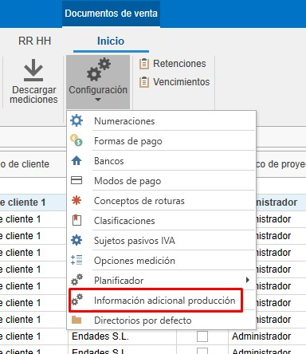

# Configurazione iniziale di enCONTROL

---

## 1. Scopo

Il presente manuale è progettato per guidare i nuovi utenti nella configurazione iniziale di enCONTROL. Questa configurazione include tutto il necessario per avviare la produzione.

---

## 2. Configurazione in enCONTROL

Accedi alla configurazione di enCONTROL (F10) come utente amministratore. Questo processo può richiedere un po’ di tempo a seconda del numero di postazioni da collegare in rete.

### 2.1. Vari

- **Mostrare la colonna barra nelle lavorazioni**

  

  - Se il valore è **Sì**, verrà mostrata la colonna barra nel monitor.

    

  - Se il valore è **No**, verrà mostrata solo la colonna delle lavorazioni in sospeso nel monitor.

    

>**Nota:** Per impostazione predefinita, questo valore è impostato su Sì.

  
- **Tagliare barra intera nel monitor di taglio**

  

  - Se il valore è **Sì**, quando si taglia la barra nel monitor verranno tagliate automaticamente tutte le posizioni della barra indicata, senza doverle tagliare una per una. 

  - Se il valore è **No**, il taglio verrà eseguito per ogni singola posizione.

>**Nota:** Per impostazione predefinita, questo valore è impostato su Sì.

- Si definisce la modalità con cui verranno scaricati dallo stock i profili, i ferramenta e gli accessori man mano che avanza la produzione.

  

  - **Non scaricare**: Non viene scaricato nulla.
  - **Scaricare dal progetto**: Scarica solo dal progetto, indipendentemente dalla zona.
  - **Scaricare dalla zona, in mancanza dal progetto**: Scarica dalla zona indicata e dal progetto.
  - **Scaricare dalla zona**: Scarica solo dalla zona indicata, indipendentemente dal progetto.
  - **Scaricare dal progetto, in mancanza da qualsiasi zona**: Scarica dal progetto e da qualsiasi zona.

- In **Percorso documentazione generica** puoi indicare documentazioni come informazioni di sistema, tra le altre, che possono essere visualizzate da enCONTROL e dalle postazioni.

  

  Esempio su una postazione:

  

---

### 2.2. Postazioni

- In "**Postazioni**" definirai i dispositivi associati a ciascuna postazione collegata alla rete.

  

---

## 3. Configurazione della produzione in ENBLAU

### 3.1. Configurazione del layout di produzione

La **configurazione del layout di produzione** consente di definire la struttura organizzativa dello stabilimento all’interno del modulo **enCONTROL**, includendo stabilimenti, linee di produzione e postazioni di lavoro.

- Accedi al menu: **Configurazione → Produzione → Configurazione Layout**.

   

- Dall’interfaccia **Layout Produzione**, puoi aggiungere:

  - **Stabilimento**
  - **Linea di produzione**
  - **Postazioni di lavoro**

   

- Selezionando una linea di produzione, verrà mostrata sulla destra la sezione **Orario della linea**. Qui puoi configurare:
 
  - Giorni operativi della settimana.
  - Orario di inizio e fine di ogni turno.

   

- Quando aggiungi una nuova postazione, è necessario definire i seguenti campi:

  - **Tipo**: Indica il tipo di postazione da aggiungere (es. Taglio, Montaggio, Lavorazione, ecc.).
  - **Ordine**: Definisce l’ordine sequenziale delle postazioni all’interno della linea.

    

- Nel campo **Utente**, è possibile assegnare il responsabile della postazione. Questo utente sarà incaricato di operare o supervisionare tale postazione all’interno del flusso produttivo.

  

> **Raccomandazione:** Mantieni sempre aggiornata questa configurazione per garantire un controllo della produzione preciso e allineato con la realtà operativa dello stabilimento.

---

### 3.2. Classificazioni di produzione

Le classificazioni di produzione vengono utilizzate a scopo informativo durante la creazione di una produzione, affinché siano visibili nelle linee delle postazioni in enCONTROL.

- Accedi alla sezione Vendite - Configurazione - **Classificazioni**.

  

- Da "Classificazioni", crea le classificazioni necessarie e indica la linea e le postazioni di enCONTROL.

  

- Quando crei una produzione da un ordine di vendita, vedrai un menu a discesa dove potrai selezionare la classificazione per quella produzione.

  

---

### 3.3. Rapporti di Produzione Logikal

- I rapporti richiesti vengono generati automaticamente e salvati come documentazione Logikal nella produzione. Questi documenti saranno visibili nel percorso di documentazione delle postazioni di enCONTROL.

- Nel preventivo (produzione), vai alla sezione Logikal - **Rapporti per la produzione**. Da lì, seleziona i rapporti da salvare nella produzione come documentazione nella colonna **Per documentazione**.

  

> **Nota:** Per quanto riguarda la documentazione, non modificare le colonne **Esportazione** e **Gestione**.

---

### 3.4. Informazioni aggiuntive

Le informazioni aggiuntive sono un campo informativo per quando la produzione passa in coda in officina in enCONTROL, così che il responsabile possa consultarle.

- Accedi alla sezione Vendite - Configurazione - **Informazioni aggiuntive produzione**.

  

- Da "Informazioni aggiuntive produzione", crea le informazioni aggiuntive necessarie.

  

- Quando crei una produzione da un ordine di vendita, vedrai un menu a discesa dove potrai specificare come queste informazioni devono essere mostrate nella coda di produzione.

  

  

---

## 4. Conclusione

Seguendo questo manuale, potrai eseguire la configurazione iniziale di enCONTROL per l’utilizzo nella creazione della produzione.
