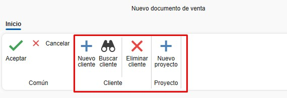
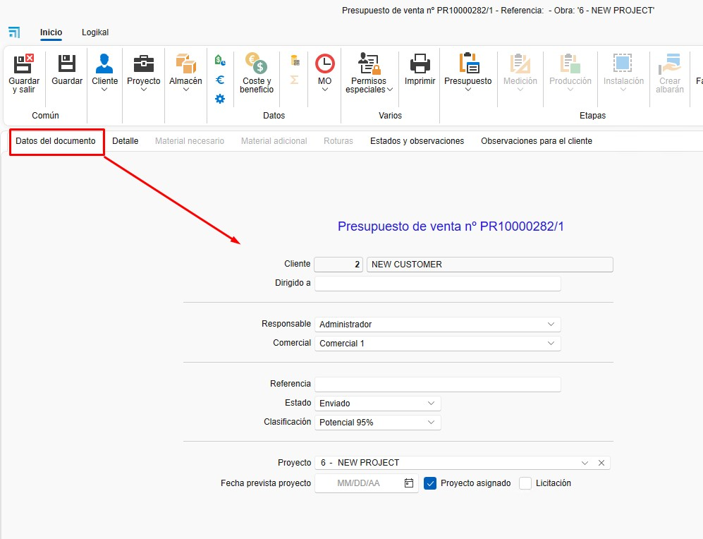
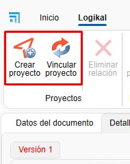
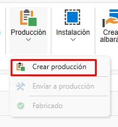
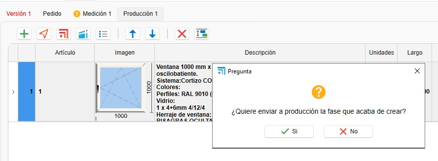
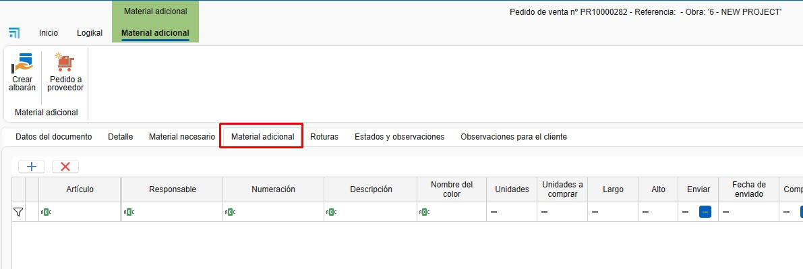

# Vendite e Acquisti

---

## 1. Introduzione
Questo manuale è pensato per guidare gli utenti nell'uso del sistema vendite e acquisti di ENBLAU. Basato sulla formazione fornita, copre i processi chiave, dalla creazione di progetti alla gestione di ordini, acquisti e produzione.

---

## 2. Processo
Una volta entrati nell'area, vedrai due sezioni principali:

### 2.1. Vendite
- **Documenti di vendita**: gestione e elenco di preventivi, ordini, bolle e fatture. Creazione di progetti e clienti.
  
  

### 2.2. Acquisti
- **Documenti di acquisto**: gestione e elenco degli ordini di acquisto e della ricezione dei materiali. Creazione di fornitori.

  

> **Nota:** Per creare documenti di vendita e acquisto è importante avere creato **progetti, clienti e fornitori**. Per maggiori informazioni, segui questo link: [4. Proyecto, cliente y proveedores](6.PR_Proyecto_cliente.md).

---

## 3. Vendite
Nella sezione Vendite troverai Progetti, Documenti di vendita e Clienti.

### 3.1. Documenti di vendita
- Accedendo a **Documenti di vendita** si aprirà l'elenco di tutti i documenti relativi alle vendite.

  

#### 3.1.1. Tipi di documenti
- Per creare un nuovo documento, clicca su **Nuovo** nella barra superiore.

  

- Si aprirà la finestra **Nuovo documento di vendita**.

  

- Da qui puoi creare diversi tipi di documenti di vendita, come Preventivo, Ordine, Bolla o Fattura.

  

- Selezionando il tipo di documento, alcuni campi saranno compilati automaticamente (Commerciale, Responsabile, Numerazione, ecc.). Questi campi sono modificabili.

  

- Altri campi, come Progetto e Cliente, possono essere configurati per essere compilati automaticamente in base al progetto.

  

- Dalla barra superiore puoi cambiare il cliente o aggiungere un nuovo cliente o progetto.

  

### 3.2. Preventivo
- Creando un nuovo preventivo si aprirà una finestra con il numero del preventivo di vendita.

  

#### 3.2.1. Dati del documento
- In questa sezione è possibile visualizzare e modificare alcuni campi del preventivo.

  

#### 3.2.2. Dettaglio
- Qui si aggiungono le righe per la versione del preventivo.

  

- Puoi aggiungere una nuova riga vuota o importarla da Logikal (assicurati di essere connesso alla fabbrica).

  

- Aggiungendo una riga da Logikal si aprirà la finestra di configurazione di Logikal **Tipo di linea**.

  

> ⚠️ **Importante**: per aggiungere una riga da Logikal, assicurati di essere connesso alla fabbrica.

  

- Una volta configurata, la riga verrà aggiunta in ENBLAU.

  

#### 3.2.3. Logikal
- Da questa sezione puoi creare un progetto o collegare un progetto già creato in Logikal.

  

- Collegando il progetto si aprirà una finestra con i progetti disponibili in Logikal.

  

- Puoi creare diverse versioni del preventivo. Clicca con il tasto destro sulla scheda *Versione 1* o usa il menu a tendina *Preventivo* nella barra superiore.

  
  

- Si aprirà la finestra **Nuova versione del preventivo**, dove puoi indicare se vuoi copiare le righe dalla versione attiva o creare una versione vuota.

  

- Per modificare una riga in Logikal, premi **Ctrl + doppio clic** sulla riga che desideri modificare.

> **Nota:** il nome delle schede delle versioni è modificabile. Per cambiarlo, clicca con il tasto destro sulla scheda della versione e seleziona *Cambia nome versione*.

> ⚠️ **Importante**: per creare o collegare un progetto da Logikal, assicurati di essere connesso alla fabbrica.

  

### 3.3. Ordine
#### 3.3.1. Creare un ordine
- Dopo aver creato la versione del preventivo, il passo successivo è accettarlo e creare l'ordine cliente.

  
  

#### 3.3.2. Modificare righe
- Dall'ordine puoi modificare o aggiungere righe, elencare materiali, creare misurazioni, avviare produzioni, ecc.

  

#### 3.3.3. Bolla
- Dalla fase di Ordine puoi creare una bolla e indicare le unità da bollare.

  

> **Nota:** i dati del documento d'ordine possono essere modificati come in altri documenti di vendita.

### 3.4. Misurazione
#### 3.4.1. Creare una misurazione
- Dall'ordine puoi creare una misurazione.

  

#### 3.4.2. Selezionare righe
- Creando una misurazione si apre la finestra **Nuova fase di misurazione**, dove puoi selezionare le righe per la fase di misurazione.

  

#### 3.4.3. Fase di misurazione
- Viene creata una fase di misurazione in cui puoi modificare le misurazioni senza influire sull'ordine.

  

#### 3.4.4. Bolla
- Dalla fase di Misurazione puoi creare una bolla e indicare le unità da bollare, allo stesso modo dell'ordine.

> **Nota:** i dati del documento di misurazione possono essere modificati come in altri documenti di vendita.

### 3.5. Produzione
#### 3.5.1. Creare produzione
- La fase di produzione può essere creata dall'ordine o dalla misurazione.

  

#### 3.5.2. Selezionare righe
- Creando una produzione si apre la finestra **Nuova fase di produzione**, dove puoi selezionare le righe per la fase di produzione.

  

- Accettando comparirà una finestra che chiede se desideri inviare in produzione.

  

#### 3.5.3. Fase di produzione
- Viene creata una fase di produzione in cui puoi modificare la riga prima di inviare in produzione senza influire sull'ordine.

  

#### 3.5.4. Bolla
- Dalla fase di Produzione puoi creare una bolla e indicare le unità da bollare, come nell'ordine.

> **Nota:** i dati del documento di produzione possono essere modificati come in altri documenti di vendita.

---

## 4. Acquisti

### 4.1. Ordini di acquisto
#### 4.1.1. Da un preventivo
- Accetta un preventivo per generare un ordine cliente.

#### 4.1.2. Materiale necessario
- Vai alla scheda "Materiale necessario" per elencare i materiali richiesti.

  

- Nell'elenco materiali vedrai nelle colonne Articoli e Unità da acquistare i colori verde e rosso. Il verde indica che c'è materiale sufficiente a magazzino per quel progetto, il rosso indica carenza.

  

- Puoi scegliere se acquistare i materiali selezionando o deselezionando la casella nella colonna *Comprar*.

  

> ⚠️ **Importante**: per elencare i materiali da un progetto Logikal, assicurati di essere connesso alla fabbrica.

  

#### 4.1.3. Generare ordine di acquisto
- Seleziona i materiali e genera l'ordine di acquisto in **Pedir material**. Si aprirà la finestra **Nuovo documento di acquisto**, dove puoi modificare alcuni campi predefiniti e scegliere il fornitore.

  

- Assegna un fornitore e invia l'ordine.

  

#### 4.1.4. Ordine di acquisto
- Una volta creato l'ordine di acquisto puoi revisionarlo e modificarlo secondo necessità (fornitore, progetto, quantità materiali, ecc.).

  

#### 4.1.5. Esportare a Cortizo center
- Dopo aver creato l'ordine di acquisto, puoi esportarlo in formato Excel per caricarlo su Cortizo center.

  

#### 4.1.6. Reclami

Una volta generato un **ordine di acquisto**, hai la possibilità di gestire **Reclami** direttamente dal sistema.

- Puoi aggiungere un reclamo associato all'ordine dalla sua scheda:

  

- È anche possibile **inviare automaticamente il reclamo via e-mail**, velocizzando la comunicazione con il fornitore:

  

- Il sistema conserva uno **storico automatico** dei reclami effettuati. Inoltre, puoi aggiungere registrazioni manuali per documentare il **follow-up** del reclamo.

  

**Nota:** un adeguato follow-up dei reclami migliora la tracciabilità delle anomalie con i fornitori e facilita la gestione qualità negli acquisti.

#### 4.1.7. Documenti di acquisto
- Dalla sezione Acquisti puoi accedere all'elenco degli acquisti e ai Fornitori.

  
  
  

#### 4.1.8. Articoli e Articoli importati

- Nell'ordine di acquisto, nella scheda **Detalle** nella barra laterale destra, troverai una sezione in fondo chiamata **Artículos** e **Artículos importados**. Questi articoli possono essere aggiunti all'ordine trascinando il materiale nell'elenco.

  - **Artículos**: materiali propri creati da **MATERIAL**.

  

  - **Artículos importados**: materiali importati dai progetti di **Logikal**. Questi materiali vengono memorizzati e aggiornati ogni volta che si elencano materiali da "Material necesario". Sono gli stessi materiali presenti anche in Magazzino **Materiales importados**.

  

### 4.2. Ricezione materiali
#### 4.2.1. Bolla di ricevimento
- Genera una bolla quando ricevi il materiale.

  

#### 4.2.2. Unità ricevute
- Indica le unità ricevute nella colonna *Unidades a albaranar*.

  

---

## 5. Materiale aggiuntivo e scarti

### 5.1. Materiale aggiuntivo
- I materiali aggiuntivi possono essere aggiunti all'ordine, alla misurazione o alla produzione. Possono essere materiali propri creati in enMATERIALS o articoli importati da Logikal. Per ulteriori informazioni su come creare materiali propri, segui questo link: [2. Creación de materiales propios en enMATERIAL](/Utilidades/2.UT_Crear_Materiales_enMATERIAL).

  

#### 5.1.1. Aggiungere materiale
- Trascina materiale aggiuntivo dall'albero Articoli (materiali propri creati da enMATERIAL).

  

- Puoi anche trascinare da **Artículos importados** di Logikal.

  

- Aggiungi righe di testo.

  

- Una volta aggiunti i materiali aggiuntivi, hai l'opzione di generare un ordine di acquisto al fornitore.

  

- Puoi generare una bolla di spedizione per il materiale aggiuntivo.

  

#### 5.1.2. Costi
- Il materiale aggiuntivo è contabilizzato come costo del progetto, ma non viene imputato nel preventivo al cliente.

### 5.2. Scarti
#### 5.2.1. Aggiungere agli scarti
- Dalla sezione "Materiale necessario", fai clic con il tasto destro sul materiale e seleziona **Añadir a roturas**.

  

- Il materiale sarà aggiunto nella sezione **Roturas**. Nella colonna *Concepto* puoi indicare il motivo dello scarto, selezionando da un elenco predefinito nella configurazione di [7.5. Conceptos de roturas](/Configuraciones/1.%20CO_Configuracion_Inicial_ENBLAU/#75-conceptos-de-roturas).

  

- Come per il materiale aggiuntivo, è possibile aggiungere Articoli (materiale proprio) e Articoli aggiuntivi. Inoltre si possono generare ordine di acquisto e bolla.

  

- Assicurati che nella sezione [8.3. Clasificaciones](/Configuraciones/1.%20CO_Configuracion_Inicial_ENBLAU/#83-clasificaciones) la classificazione per gli scarti sia configurata correttamente.

> **Nota:** il processo di aggiunta e richiesta di materiale aggiuntivo o scarti può essere eseguito anche dalla sezione progetti.

---

## 6. Tracciabilità

### 6.1. Albero di tracciabilità
- Mostra la tracciabilità completa di un documento, dal preventivo alla produzione. Ad esempio, dal preventivo (es. 483) fino all'invio in produzione.

  

### 6.2. Visualizzazione
- Clicca su un documento per visualizzarne la tracciabilità nel pannello di destra.

  

---

> **Gestione filtri** Usa i filtri e i filtri personalizzati per ottimizzare la ricerca negli elenchi. Per maggiori informazioni, segui questo link: [4. Gestión de filtros](/Utilidades/4.UT_Gestion_Filtros/)

---

## 7. Domande frequenti

### 7.1. Come gestire le segnalazioni post-vendita?
- **Opzione 1**: crea un nuovo preventivo.
- **Opzione 2**: genera un ordine cliente a importo zero e invialo in produzione.

### 7.2. Come aggiungere materiale aggiuntivo?
- Trascina il materiale aggiuntivo dall'albero e genera una bolla di spedizione.

### 7.3. Come ricevere materiale parzialmente?
- Generando una bolla, indica le unità ricevute. Puoi creare più bolle per lo stesso ordine.

---

Questo manuale è pensato per aiutarti a navigare e utilizzare il sistema vendite e acquisti di ENBLAU in modo efficiente. Per ulteriori dettagli, consulta il video di formazione o contatta il supporto tecnico.